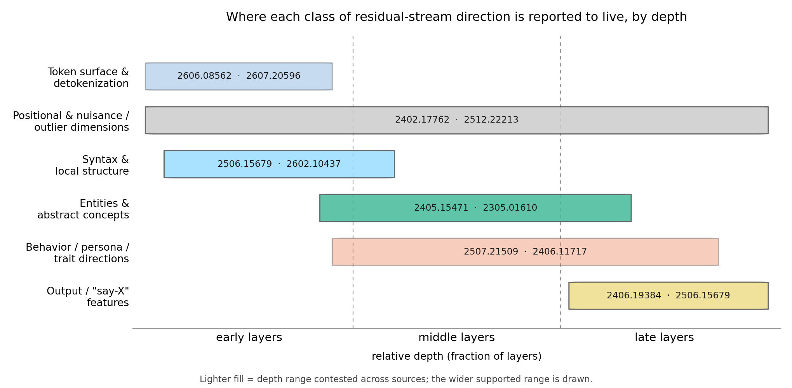

# A taxonomy of residual-stream directions: high-level behavior vs low-level token structure

**Date compiled:** 2026-07-28
**Search stack actually used:** arXiv MCP (`get_abstract`, `search_papers`, `citation_graph`) + `WebSearch` / `WebFetch`. **Documented deviation:** `parallel-cli` was named in the review prompt but is not installed on this machine, so every search ran through the arXiv MCP and the built-in web tools instead; no repo files were written by the search agents and no git commands were run.
**Prompt / specification:** [`residual-stream-direction-taxonomy-deep-research-prompt.md`](residual-stream-direction-taxonomy-deep-research-prompt.md)
**Sweep design:** six independent research agents, one per research question — RQ1 abstraction-across-depth, RQ2 behavior-level directions, RQ3 SAE/neuron feature taxonomies + skeptic literature, RQ4 residual-stream anatomy + nuisance axes, RQ5 direct high-vs-low-level comparisons + gap verdicts, RQ6 grey literature + methods toolbox — each with its own arXiv-MCP and web-call budget, its own verification ledger, and its own could-not-verify list; this document is the synthesis of their six notes files and adds no literature claims of its own.
**Unique sources:** **250** — 222 distinct arXiv works (223 identifiers; 2306.07656 and 2401.12143 are the same work under two identifiers, counted once) and 28 distinct grey-literature URLs, presented as 247 numbered bibliography entries (a few entries bundle a method cluster or an arXiv-plus-blog pair for one work). Every arXiv identifier was resolved through the arXiv MCP by at least one sweep and every grey-literature URL was fetched live, except where Appendix A records otherwise; identifiers that no sweep could verify appear only in Appendix A and are cited nowhere.

**Evidence classes** are carried on load-bearing claims throughout, using the prompt's ordering: **causal** (steering / ablation / patching / controlled architecture or optimizer swap) > **predictive** (probing / regression / held-out prediction) > **descriptive** (geometry / clustering / spectra / correlation), with **theoretical** marked separately.

---

## Executive summary

Fifteen load-bearing claims, each one sentence, with citations and a confidence tag.

1. **Depth is functionally stratified rather than homogeneous**, with token-surface content concentrated early, the most transferable and abstract content at mid-depth, and output-token-oriented content late — a picture that holds across layer-deletion robustness (2406.19384, causal), downstream-transfer quality (2412.09563 / 2502.02013, predictive), intrinsic-dimension phase geometry (2405.15471, descriptive + predictive), brain-encoding models (2409.05771 / 2602.04081, predictive), and a mechanistic account of why middle layers behave specially (2510.06477, theoretical + causal). *(established)*

2. **Token-level content is early and geometrically distinctive**: in RoPE-based models detokenization completes within roughly the first 1–5 layers (2606.08562, causal patching + predictive probe), and single-token SAE features concentrate at layers 0–4 while clustering 4.7× tighter in decoder space than other features, with zero-ablation producing Benjamini-Hochberg-significant logit reductions in 178 of 208 full-layer conditions (2607.20596, causal + descriptive). *(single-paper each, very recent)*

3. **Output-token-promoting "say-X" features are a distinct late-layer class** that act directly on the logits, so a late-layer behavior direction should be expected to contain output-promoting components rather than purely abstract trait content (*On the Biology of a Large Language Model*, 2025-03 [blog], causal via attribution-graph interventions; *Circuit Tracing*, 2025-03 [blog]; 2506.15679, causal + descriptive). *(established for the models measured)*

4. **Contrastive difference-of-means extracts causally effective behavior directions**, and on the one large head-to-head benchmark it is the *best concept-detection* family while SAEs are not competitive and plain prompting beats every representation-based steering method (2406.11717, causal; 2310.06824, causal + predictive; 2501.17148, causal + predictive). *(established)*

5. **Geometric multiplicity and functional unidimensionality can coexist**: across 11 categories of refusal and non-compliance the categories occupy geometrically distinct directions yet linear steering along any of them produces nearly identical refusal-to-over-refusal trade-offs, changing *how* rather than *whether* the model refuses — so a rank estimate alone does not settle whether a behavior is "one direction" (2602.02132, causal + descriptive, against 2406.11717 vs 2502.17420 / 2502.09674). *(contested)*

6. **Persona and trait directions are treated as one direction per trait and their rank has never been measured**, while the traits themselves are empirically coupled — steering one Big-Five trait changes others even after linear overlap is explicitly removed, and hard orthonormalisation enforces geometric independence without eliminating cross-trait behavioural effects (2602.15847, causal; 2607.01802, causal on Qwen2.5-7B-Instruct; 2601.10809, causal). *(single-paper each, converging)*

7. **Geometric separability does not predict steerability**, and steering directions may not be identifiable at all: across 50 behaviors vector-separation metrics failed to predict steering success (2511.18284, predictive negative result), and under white-box single-layer access large equivalence classes of behaviorally indistinguishable interventions exist (2602.06801, causal + theoretical). *(contested; both single-paper, and both threaten geometry-based prediction directly)*

8. **SAE dictionaries are neither atomic nor complete, and there is no canonical unit of analysis**: meta-SAEs decompose latents into interpretable constituents, stitching shows smaller dictionaries are incomplete, cross-seed feature overlap is about 30%, and automated interpretability metrics do not distinguish trained from randomly initialized transformers (2502.04878, 2501.16615, 2501.17727, descriptive; meta-SAE 2024-08 [blog]). *(established, and asserted largely by SAE proponents themselves)*

9. **Feature absorption is caused by the sparsity objective whenever features form a hierarchy and is not fixable by tuning dictionary size or sparsity**, so a trait feature's absence from the contexts where it should fire is not evidence that the concept is absent (2409.14507, descriptive + predictive, with six-plus independent follow-ups including 2503.17547, 2509.22033, 2606.22994). *(established)*

10. **Naive SAE encoding of a steering vector is invalid** — steering vectors lie outside the SAE's input distribution and carry meaningful negative projections that a non-negative SAE cannot represent — so the valid instruments are gradient pursuit or SAE-based effect measurement (2411.08790, descriptive/methodological; 2411.02193, causal; neverix et al. 2024-10 [blog], causal). *(single-paper, and a methods precondition rather than a caveat)*

11. **A handful of residual-stream channels carry extreme, largely input-invariant magnitudes that are simultaneously functionally load-bearing and dominant over naive cosine and PCA geometry**, and the basis privilege itself traces to the optimizer rather than to semantics (2402.17762, causal; 2109.04404, descriptive + causal; 2310.17715, predictive + causal; *Privileged Bases* 2023-03 [blog], causal elimination; 2410.17174, causal; Adam-vs-SGD swap 2024-09 [blog], causal). *(established)*

12. **Residual-stream norms grow roughly exponentially with depth — about 1.045× per layer in GPT2-XL — so no cross-layer norm, cosine, or steering-magnitude comparison is valid without per-layer normalization** (residual-norm-growth post 2023-05 [blog], descriptive; 2606.16112, causal architectural corroboration). *(established)*

13. **High-frequency "dense" latents are functional and taxonomizable** — position tracking, context binding, entropy regulation, letter-specific output signals, part-of-speech, principal-component reconstruction — and in a 30M-feature cross-layer transcoder all six interpretable densest features are low-level surface or positional structure, making heavy loading on high-frequency latents prima facie evidence of surface contamination (2506.15679, causal + descriptive; *Interpretable Dense Features* 2025-04 [blog], descriptive quantitative). *(established, with a dictionary-dependent geometry — see Disagreements)*

14. **The operations the planned experiment needs exist, but the class-contrastive comparison does not**: a difference-in-means direction has been cosine-projected onto every SAE decoder direction on Qwen2.5-7B-Instruct with top cosines of only 0.134 down to 0.079 (Arditi & Chen 2025-05 [blog], descriptive + causal) and refusal and sycophancy steering vectors have been reconstructed from 2–4 and 3 SAE features respectively on Phi-3 Mini (neverix et al. 2024-10 [blog], causal), yet no source profiles behavior-level directions *against* token-level directions on shared axes of layer, frequency, norm and rank in one model. *(established as an absence; see the RQ5 failed-search log)*

15. **Whether fine-tuning moves behavior-level subspaces preferentially is unmeasured, and any cross-model or cross-checkpoint direction claim in an RMSNorm model is gauge-conditional**: LoRA's intruder dimensions are established causally but purely spectrally with no feature-class attribution (2410.21228, causal), an abstract search for `"intruder dimensions"` conjoined with safety, behavior, refusal or alignment returned zero on-topic hits, and permutation-only alignment leaves Qwen sentiment steering at 17.2% of its effect and reverses the sign of refusal steering (2606.31963, descriptive + causal). *(established as an absence; the gauge result is single-paper)*

---

## Taxonomy of residual-stream direction and feature classes

Rows are the categories the literature actually uses. "Typical layer range" is as reported by the cited work, in relative depth; absolute layer indices do not transfer across models and the first stage boundary is known to move with the positional-encoding scheme (2606.08562).

| Direction / feature class | Defining evidence | Typical layer range | Typical geometry | Discovery method | Canonical citations |
|---|---|---|---|---|---|
| **Token-identity / single-token features** | Features firing on exactly one vocabulary item; zero-ablation gives significant logit reductions in 178 of 208 full-layer conditions; cluster 4.7× tighter in decoder space | Layer 0 (GPT2-Small), layers 0–4 (Gemma) | 1-D, tightly clustered | SAE dictionaries, zero-ablation | 2607.20596; 2605.04072 |
| **Token-in-context / surface-form** | Hundreds of distinct features for a single token ("the"), split by context (physics vs mathematics) | Early | 1-D each, many per token | SAE on a one-layer transformer | *Towards Monosemanticity* 2023-10 [blog] |
| **Detokenization / multi-token-word assembly** | Attention relays a token-specific signal from non-final subwords, MLP composes it with the local embedding; early-layer "erasure" of prior-token information | 1–5 layers (RoPE), 5–10 (learned-absolute) | Mechanism, not a single direction | Activation patching; cross-layer differencing | 2606.08562; 2406.20086; 2501.15754 |
| **Syntax / part-of-speech** | Part-of-speech named as a dense-latent class; syntactic SAE features early, semantic later | Early | 1-D dense latents | SAE statistics; per-token feature steering | 2506.15679; 2602.10437 |
| **Entity / knowledge-awareness ("do I know this entity?")** | Steering makes the model refuse about known entities or hallucinate about unknown ones; base-model directions causally affect the *chat* model's refusal | Mid | 1-D (a graded familiarity direction at a single layer) | SAE discovery; familiarity probes | 2411.14257; 2607.13568 |
| **Abstract concept (multilingual / multimodal)** | Features respond to concrete instances and abstract discussion of the same concept, across languages and to images | Middle layers | 1-D per concept, in superposition | SAE at production scale | 2605.29358 / *Scaling Monosemanticity* 2024-05 [blog] |
| **Categorical / hierarchical concept structure** | Categorical concepts as polytopes; hierarchy maps onto orthogonality between a parent and the contrasts among its children; 900+ WordNet concepts | Not layer-specific as reported | Simplex / polytope; orthogonal subspaces | Theory + probing | 2406.01506; 2311.03658 |
| **Irreducibly multi-dimensional / circular** | Circular day-of-week and month-of-year features; interventions show the circles are the computational unit for modular arithmetic | Mid | 2-D circular manifold | SAE auto-discovery + irreducibility test | 2405.14860; 2510.01025 |
| **Relation / function / task vectors** | A small set of attention heads transports a compact task representation triggering the task zero-shot; ICL compresses a demonstration set into one task vector | Strong causal effects in middle layers | Compact single vector, partially composable | Causal mediation | 2310.15213; 2310.15916 |
| **Behavioral / trait / persona directions** | Judge-filtered diff-of-means over on-policy rollouts under contrastive system prompts; monitors deployment drift, predicts fine-tuning shifts, supports steering and data flagging | All layers swept; steering regime picks one layer (project-recorded: about layer 20 on Qwen2.5-7B) | Treated as 1-D per trait; rank unmeasured; traits coupled | Contrastive diff-of-means | 2507.21509; 2506.19823 |
| **Assistant / default-persona axis** | The leading component of persona space; steering toward it reinforces helpful-harmless behavior, away from it increases identification as other entities; present in pretrained models; deviations predict drift | Not reported per layer | 1-D leading component of a persona space | Diff-of-activations over character archetypes | 2601.10387; *Biology of an LLM* 2025-03 [blog] |
| **Refusal / non-compliance** | Erasing one direction stops refusal and adding it induces refusal across 13 chat models up to 72B; competing accounts find multiple independent directions and cones | Best layer chosen by validation sweep; last prompt-token position | Contested: 1-D vs multi-dimensional cone; 90–99% sparsifiable | Diff-of-means; gradient-based extraction; RFM-AGOP | 2406.11717; 2502.17420; 2602.02132 |
| **Harmfulness judgment (distinct from refusal)** | Steering harmfulness changes the model's judgment without inducing refusal; jailbreaks suppress refusal while leaving the harmfulness belief intact | Prompt-side and response positions | Separate 1-D direction | Diff-of-means + steering | 2507.11878; 2607.00572 |
| **Output-promoting / "say-X" features** | Promote specific output tokens largely regardless of broader context, read off top-promoted tokens; formalized as the `say(X)` image of a content feature | Late | 1-D, acting on the logits | Attribution graphs; circuit tracing | *Circuit Tracing* 2025-03 [blog]; *Circuits Updates July 2025* [blog] |
| **Confidence / entropy regulation** | Entropy neurons write to the unembedding null space, modulating residual norm and final-LayerNorm scale with minimal direct logit effect | Late | 1-D, null-space-aligned | Causal intervention; weight analysis | 2406.16254; 2401.12181 |
| **Attention-output families** | Long-range context, short-range context, and induction feature families; at least 90% of GPT-2-Small heads estimated polysemantic | Across depth | 1-D families per head-output space | Attention-output SAEs | 2406.17759 |
| **Dense / high-frequency latents** | Ablating their subspace suppresses re-emergence of dense features in retrained SAEs, so density is intrinsic to the residual space; six named classes | Structural (early) → semantic (mid) → output-oriented (late) | Antipodal pairs in SAEs; not antipodal in a CLT | SAE frequency statistics + subspace ablation | 2506.15679; *Interpretable Dense Features* 2025-04 [blog] |
| **Massive activations / outlier dimensions (nuisance)** | A few activations up to about 10^5× larger, largely input-invariant, acting as indispensable bias terms and concentrating attention; 1–3 rogue dimensions dominate cosine and Euclidean similarity | All layers; a "Massive Emergence Layer" turns them on | Basis-aligned coordinates, optimizer-induced | Activation statistics; kurtosis; ablation | 2402.17762; 2109.04404; 2605.08504 |
| **Positional subspace (and rotary offset features)** | Positional vectors separable by a mean-based decomposition; rotary offset features show large activations "often interpreted as outliers" | All layers | Low-dimensional; entangled with outlier channels | Mean-based decomposition; spectral bounds | 2405.18009; 2503.01832 |
| **Token-frequency axis** | Last-layer outlier dimensions implement a frequent-token prediction heuristic, blockable by counterbalancing weight mass; outlier magnitude correlates with pretraining token frequency | Last layer (decoders); throughout (encoders) | Co-located with outlier channels | Weight attribution; training dynamics | 2503.21718; 2205.11380 |
| **Dense low-rank "computational scaffold"** | Rank-24 bottleneck cuts dense SAE latent count up to 84%; removing the scaffold raises next-token cross-entropy 7.5× versus 2.8× for geometrically near-identical top-24 PCA directions | Measured at Gemma-2-2B layer 12 | Top principal components + outlier dimensions | Matched-geometry ablation contrast | 2606.14040 |
| **Error nodes / dark matter (explicitly uninterpretable)** | About half the SAE error vector and over 90% of its norm are linearly predictable from the input activation; attribution graphs capture about 61% of end-to-end paths | All layers | Residual, partly linear-in-input | Reconstruction-error decomposition; error nodes in graphs | 2410.14670; *Circuit Tracing* 2025-03 [blog] |

> Relative depth (fraction of layers) on the horizontal axis, split into early, middle and late zones; each band spans the depth range the cited literature supports for that class, with one or two canonical arXiv identifiers inside. Lighter fill marks a class whose reported depth range is contested across sources, in which case the wider supported range is drawn.

---

## RQ1 — Abstraction across depth

**The three-stage narrative and its provenance.** The claim that early layers lift raw tokens into semantic content, middle layers carry abstract features, and late layers map abstract concepts back to raw tokens originates in Anthropic's *Softmax Linear Units* work (2022-06 [blog]), which states it verbatim — "early features often deal with mapping raw tokens to semantic meaning … more abstract features in middle layers, and features involved in mapping abstract concepts back to raw tokens in late layers" — but reports no per-layer neuron-category counts, describes the investigation as simple, and does not itself use the words "detokenization" or "retokenization". It is therefore the origin of the hypothesis, not quantitative evidence for it. The load-bearing quantitative versions came later: layer deletion and swapping leaves 72–95% of top-1 accuracy with degradation concentrated at early and final layers, motivating four stages — detokenization, feature engineering, prediction ensembling, residual sharpening (2406.19384, causal); a competing three-stage Mix–Compress–Refine account is derived from massive-activation formation with a proof that massive activations necessarily compress representations, confirmed from 410M to 120B parameters with targeted ablations (2510.06477, theoretical + causal); and a two-phase abstraction account is argued from intrinsic-dimension and brain-encoding evidence (2409.05771). No paper gives model-independent stage boundaries, and the first boundary demonstrably moves with the positional-encoding scheme — RoPE models detokenize over 1–5 layers versus 5–10 for learned-absolute encodings (2606.08562).

At feature level in a production model, the same ordering holds: features at the beginning and end of the model are highly language-specific while middle-layer features are more language-agnostic, low-level features (specific words and phrases) activate earlier and high-level features (sentiments, plans, reasoning steps) emerge deeper, and "say-X" output features cluster late where they act on the logits (*Biology of an LLM* 2025-03 [blog], causal via attribution graphs). The multilingual version of the same story is a three-phase trajectory in which intermediate embeddings start far from output-token embeddings, become decodable to a semantically correct next token in the middle layers, then move into an input-language-specific region (2402.10588, descriptive).

**Lenses are the weakest instrument in this area.** The founding logit-lens observation is that intermediate states project to sensible token distributions "smoothly refined into the final prediction" — but the same post reports a *discontinuous jump* in which the input representation vanishes after the first block and early layers already resemble output space (nostalgebraist 2020-08 [blog]), which conflicts head-on with 2402.10588's phase-1 finding and with detokenization generally. The tuned lens, a per-layer trained affine probe, is more predictive, more reliable and less biased, with causal experiments indicating it uses features similar to the model's own (2303.08112, causal + predictive), and is the required cross-check for any lens-based depth claim. The sharpest recent result dissociates the two axes entirely: mean-difference function vectors steer successfully at layers where the logit lens decodes nothing, with the converse nearly empty at 3 of 72 cases, a diagonal tuned lens closing only 1 of 14 steerable-not-decodable cases and a nonlinear probe with a Hewitt-Liang control closing 5 of 10; even above 0.90 steering accuracy the unembedding projection of the function vector is an incoherent token distribution (2604.02608, causal + descriptive). Because the persona-vector recipe produces the same object class as a function vector, the operational conclusion is that logit-lens decodability must never be treated as a measure of abstraction level. A further caution on vocabulary projection: the tail end of the (un)embedding singular spectrum carries the signals responsible for attention sinking, so part of what a direction projects onto is sink machinery rather than semantics (2402.09221).

**Concept-depth probing and intrinsic dimension.** More complex concepts become linearly decodable only at greater depth, across Gemma, LLaMA and Qwen (2404.07066, predictive) — though the abstraction ordering is imposed by the authors' own task taxonomy and is therefore partly definitional. Across 58 psycholinguistic features and 10 models, lexical properties peak earlier and experiential or affective dimensions later, final layers are rarely optimal, and — critically — apparent localization of meaning is strongly method-dependent, with contextualized and isolated embeddings giving different layer-wise profiles (2601.03798, predictive). Intermediate layers routinely beat final layers for downstream tasks across 32 embedding tasks, transformers and state-space models (2412.09563 / 2502.02013, predictive). The intrinsic-dimension line gives the best available operational definition of where abstraction lives: a distinct high-dimensional phase marks the first full linguistic abstraction, is the first to transfer to downstream tasks and the first to predict other models' representations, with earlier onset predicting better language-modelling performance (2405.15471, descriptive + predictive); layer-wise intrinsic dimension predicts fMRI and ECoG encoding performance, and fine-tuning to predict the brain causally raises both dimension and semantic content, which argues the peak indexes abstraction rather than next-token machinery (2409.05771 / 2602.04081); and intrinsic-dimension contrasts track graded linguistic complexity with different contrasts peaking at different depths (2601.03779). The expansion-then-contraction shape replicates across 28 open-weight models and several estimators (2511.20315, 2503.22547, 2302.00294). Against all of this, common intrinsic-dimension estimators demonstrably do not track the true underlying dimension of a representation (2604.20276, theoretical + empirical), so these profiles survive as relative same-estimator contrasts and not as dimensionality measurements.

**Cross-layer persistence is genuinely unsettled.** The crosscoder framing rests on features persisting across adjacent layers rather than being recomputed, producing duplicate features and cross-layer superposition (crosscoders 2024-10 [blog]). A single SAE trained over every layer instead finds latents often active at only one layer for a given token, with the variance of the layer distribution about two orders of magnitude larger when aggregating over tokens than within one, robust to a tuned-lens basis correction (2409.04185, descriptive). Standard crosscoders' latents are effectively driven by only one or two layers on average despite evenly spread decoder norms — and the failure is abstraction-stratified: functionally coherent latents act as concept detectors while the layer-localized latents crosscoders predominantly learn "collapse onto surface-level patterns such as digit detectors" (2605.09438, predictive + descriptive). Meanwhile SAE feature matching and cosine flow graphs do find genuine multi-layer persistence, with features passing through unchanged, forming quasi-boolean combinations, or specializing later (2410.07656, 2410.08869, 2502.03032). A plausible but unestablished reconciliation is that persistence is real at the concept level and weak at the surface level, and increases with model size. Removing linearly predictable cross-layer structure — fitting an affine inter-layer map and training later SAEs on the unexplained residual — reduces decoder redundancy and recovers more cross-entropy under multi-layer replacement despite reconstructing less raw variance (2605.27819, causal + predictive), which implies a large fraction of cross-layer variance is linearly predictable.

**Nuisance structure in the depth profile.** Residual-stream norm grows roughly exponentially, about 1.045× per layer in GPT2-XL across layers 5–41, with smaller models super-exponential and BOS/padding positions irregular (norm-growth post 2023-05 [blog]). A handful of massive activations reach up to about 100,000× the others, stay largely constant regardless of input, act as indispensable bias terms and concentrate attention (2402.17762, causal). Attention sinks and mid-depth compression valleys are the same phenomenon, both traceable to massive-activation formation (2510.06477), which means the middle layers where trait directions are usually extracted are also the layers where representational compression is maximal and driven by a nuisance axis. Finally, entropy neurons modulate residual norm and final-LayerNorm scale almost without touching the logits, and token-frequency neurons shift the output distribution toward or away from the unigram distribution proportionally to log token frequency (2406.16254, causal) — so a late-layer norm change need not be behavioral, and an explicit token-frequency axis exists to project trait directions against.

### Settled / Contested / Missing — RQ1

**Settled.** Depth is functionally stratified, with mid-depth hosting the most transferable and abstract content — the convergence across layer-deletion, transfer, geometry, brain-encoding and mechanistic explanation is what makes this settled (2406.19384, 2412.09563, 2502.02013, 2405.15471, 2302.00294, 2409.05771, 2602.04081, 2510.06477). Token-identity and surface-form content is concentrated in the earliest layers (2305.01610, 2406.20086, 2606.08562, 2501.15754, 2607.20596, 2605.04072, *Biology* [blog]). Output-token-oriented content is concentrated late (*Biology* [blog], 2406.19384, 2510.06477, 2406.16254). The residual norm grows roughly exponentially with depth and a handful of massive activations dominate raw geometry; both are mandatory nuisance corrections (norm-growth [blog], 2402.17762). The bare logit lens is brittle and should be replaced or cross-checked with a tuned lens (2303.08112). Intrinsic-dimension profiles are non-monotonic with expansion and contraction phases, replicated across dozens of models and several estimators (2302.00294, 2405.15471, 2511.20315, 2503.22547).

**Contested.** *When representations become output-token-like* — a discontinuous early jump with the input representation vanishing after block 1 (nostalgebraist 2020 [blog]) versus intermediate embeddings starting far from output-token embeddings and only entering an output-language-specific region at the end (2402.10588); both descriptive, both using vocabulary projection, unadjudicated. *Whether features persist across layers or are layer-local* — the crosscoder framing (2024-10 [blog]) and multi-layer persistence findings (2410.07656, 2410.08869, 2502.03032) against single-layer localization (2409.04185) and effectively 1–2-layer crosscoder latents (2605.09438). *Whether intrinsic dimension is a real dimensionality measurement* — 2604.20276 against the large literature interpreting these profiles semantically. *Whether steering and decoding measure the same directions* — 2604.02608 says no, on a large design (12 tasks, 6 models, 4,032 directed pairs) but as a single very recent single-author paper. *Where stage boundaries fall and how many stages there are* — four (2406.19384) versus three (2510.06477) versus two phases (2409.05771), with the first boundary moving with positional encoding (2606.08562). *How much of a reported layer profile is an extraction artifact* — method dependence is documented (2601.03798, 2607.20596) with no accepted correction.

**Missing.** No paper profiles behavior or persona-level directions against token-level features on the same depth axis in the same model; 2605.09438 is the nearest miss on the concept-versus-surface side and 2607.20596 on the token-level side. No depth profile of behavior directions in Qwen-2.5-7B, and the model-family asymmetry 2604.02608 reports is untested on Qwen. The steerable-versus-decodable dissociation has not been tested for persona or trait directions, only for in-context-learning function vectors. No norm-growth-corrected cross-layer comparison of direction magnitudes exists, so a claim that a trait direction is larger at one layer than another has no precedent to cite. Nothing connects the mid-depth compression valley to behavior-direction extraction quality. Cross-layer feature-tracking methods have never been applied to a diff-of-means behavior direction.

---

## RQ2 — Behavior-level directions and subspaces

**The single-direction template and its fate.** Refusal in safety-tuned chat models is mediated by a one-dimensional subspace: erasing one difference-of-means direction stops refusal of harmful instructions and adding it induces refusal on harmless ones, across 13 open chat models up to 72B (2406.11717, causal). The direction is taken at the last prompt-token position with the best layer chosen by a validation sweep, from the difference of mean activations on harmful versus harmless instructions; the companion post records that 512 examples were used but 32 suffice (AF 2024-04 [blog]). This is the field's benchmark for what a well-validated behavior direction looks like, and it is the bar a persona-direction causal claim should aim at.

Its *completeness* is contested from several directions at once. Gradient-based extraction finds multiple independent refusal directions and multi-dimensional concept cones, and shows orthogonality does not imply independence under intervention (2502.17420, causal). A dominant refusal direction coexists with multiple smaller but individually interpretable directions — hypothetical narrative, role-playing — that promote or suppress it (2502.09674, causal + descriptive). Iteratively ablating learned refusal directions forces the model to re-encode safety along fresh causally independent pathways, so the number of directions is partly a training artifact rather than a fixed property (2602.16977, causal). The monolithic direction can be factorized into topic-aligned near-orthogonal vectors, cutting cross-topic leakage by up to 90% while keeping attack success at or above 87% on Gemma-2-2B, Llama-3-8B and Qwen-7B (2509.12221, causal). Multi-dimensional refusal subspaces can be extracted cheaply by a Recursive Feature Machine with probe-informed initialization on Qwen-2.5 and Qwen-3 (2607.02396, causal, self-described preliminary). And steering vectors sparsify by 90–99% while retaining most performance, with different extraction methods agreeing on a subset of important dimensions and steering acting mainly through the attention OV circuit — freezing all attention scores costs only 8.75% (2604.08524, causal).

The reconciliation that carries the most weight for a persona program is that geometric multiplicity and functional unidimensionality coexist: across 11 categories of refusal and non-compliance the categories occupy geometrically distinct directions, yet steering along any refusal-related direction produces nearly identical refusal-to-over-refusal trade-offs, so the directions differ in *how* the model refuses, not *whether* (2602.02132, causal + descriptive). Two further decompositions matter. Harmfulness and refusal are separate directions — steering harmfulness changes the model's judgment while steering refusal changes the action, some jailbreaks suppress refusal while leaving the harmfulness belief intact, and adversarial fine-tuning barely moves the harmfulness representation (2507.11878, replicated and extended by 2607.00572). And refusal types are not homogeneous: harmful-refusal directions are task-agnostic and captured by a single global vector while over-refusal directions are task-dependent, live inside benign task clusters, and span a higher-dimensional subspace, separable from early layers (2603.27518). Scope limits are also documented: in large reasoning models refusal is jointly encoded in activations and in the chain of thought, with activation steering reversing refusal in only 39% of cases when the chain of thought is held fixed, 70% when it is removed, and 94% when the model regenerates it under steering (2605.26772, causal). Cross-lingually, an English-extracted refusal vector bypasses refusal in 13 other languages (2505.17306), while low-resource jailbreaks succeed by routing harmful content through a geometrically misaligned subspace that under-projects onto the refusal directions, leaving the mechanism intact but untriggered (2607.10112).

**Persona and trait directions.** The project's standing recipe extracts trait-level directions by judge-filtered diff-of-means over on-policy rollouts under contrastive system prompts; the resulting directions monitor deployment-time personality fluctuation, correlate with personality shifts induced by fine-tuning, support post-hoc and preventative steering, and flag problematic training data at dataset and individual-sample level (2507.21509, causal + predictive). The SAE-side sibling finds misaligned-persona features by model diffing before and after emergent-misalignment fine-tuning, with a toxic persona feature most strongly controlling the behavior and predicting whether a model will exhibit it (2506.19823, causal + predictive). Emergent misalignment is neither SAE-specific nor extraction-method-specific: a misalignment direction from one fine-tune ablates misaligned behavior in fine-tunes with higher-rank LoRAs and different datasets, and in a 9-adapter rank-1 organism on Qwen2.5-14B-Instruct six adapters contribute to general misalignment and two specialize to the fine-tuning domain (2506.11618, causal), with cheap reusable organisms and an isolated mechanistic phase transition matching a behavioural one (2506.11613). The protective side is a different object from the driving side: boosting the top assistant-persona latent drives misalignment and incoherence scores each below 1%, while negatively steering the most-decreased latents induces little misalignment (OpenAI 2025-12 [blog], causal). At the theoretical level, post-training has been framed as *selecting* an Assistant persona from a pre-training repertoire rather than installing new goals (Anthropic 2026-02 [blog]), and the default assistant identity has been measured as the leading component of persona space — an "Assistant Axis" present in pretrained models, whose deviations predict persona drift and whose clamping stabilizes behavior against drift and persona jailbreaks (2601.10387, causal + predictive).

Three results warn that traits are not independently controllable. Big-Five steering directions show substantial geometric dependence: steering one trait consistently changes others even when linear overlap is explicitly removed, and hard orthonormalisation enforces geometric independence without eliminating cross-trait behavioural effects while reducing steering strength (2602.15847, causal). All common multi-vector composition methods lose trait expression as vectors are added, with a coherence-expressibility trade-off requiring per-setting tuning, and effectiveness degrades when vectors transfer from style examples to downstream writing tasks — measured on Qwen2.5-7B-Instruct and Llama3.1-8B-Instruct (2607.01802, causal). And style features are deeply entangled rather than orthogonal: prompting for conciseness significantly reduces perceived expertise, and both prompt-based and activation-steering mitigations partially restore suppressed traits while degrading the primary intended style (2601.10809, causal, judge-based). Site matters too: sycophancy signals are most linearly separable in attention activations with steering most effective in a sparse subset of middle-layer attention heads, and the discovered direction has limited overlap with prior "truthful" directions (2601.16644); persona and style formation is governed by as few as three attention heads, and intervening only there mitigates the coherency degradation that residual-stream steering causes, which the authors attribute to the residual stream indiscriminately aggregating features and amplifying off-target noise (2603.13249). A weight-space counterpart exists: training-free masking guided by per-persona activation signatures isolates persona subnetworks that beat prompting and retrieval baselines (2602.07164).

**Reliability, identifiability and the skeptic line.** In-distribution steerability is highly variable across inputs with spurious biases contributing substantially, and out of distribution several concepts are brittle to reasonable prompt changes (2407.12404, the canonical reliability audit). On the one large steering-plus-detection benchmark, prompting outperforms all representation-based steering methods and difference-in-means is the best concept detector, with SAEs not competitive on either (2501.17148). Steering vectors are argued to be fundamentally non-identifiable under white-box single-layer access, with large equivalence classes of behaviorally indistinguishable interventions and orthogonal perturbations achieving near-equivalent efficacy (2602.06801, causal + theoretical) — which means a geometry-based predictor must specify which representative of the class it uses and show stability across it. Across 50 behaviors, trait expression follows an inverted-U in steering coefficient and vector-separation metrics do not predict steering success (2511.18284, predictive negative result). Activation steering is far less effective on instruction-tuned models than on their base counterparts (2606.12234), which makes a base-versus-Instruct difference in steerability a known confound rather than a finding. Side effects are real but mitigable — training to minimize divergence between steered and unsteered models on benign inputs before steering prevents 44% of jailbreaks while roughly preserving helpfulness (2406.15518) — and a raw contrastive refusal vector is polysemantic, entangled with capability circuits and linguistic style, with residualization against protected-capability and stylistic concept atoms cutting first-token divergence from 2.088 to 0.044 at the same 0% refusal rate on Qwen3-VL-4B (2601.08489, single-author preprint, unreplicated).

**Fine-tuning, subspaces and one measurement landmine.** Safety subspaces are argued not to be linearly distinct: across weight and activation space and five Llama and Qwen models, subspaces that amplify safe behaviors also amplify useful ones and differently-safety-implicated prompts activate overlapping representations, so subspace-based defenses face fundamental limits (2505.14185, predictive + descriptive) — the standing skeptical prior against the hypothesis that fine-tuning moves a separable behavior subspace. The counterweight claims a low-rank safety subspace that is stable under fine-tuning and isolated from general capabilities, restorable by linear arithmetic, with a per-layer safety-critical-rank metric (2602.00038). The landmine with the highest practical value in this area is that comparing aligned-versus-base activations naively conflates the alignment shift with chat-template formatting: template control alone removes a 2.0–3.9× inflation of measured effective rank across Llama-3.1-8B, Gemma-2-9B and Qwen-2.5-7B, a difference-in-differences contrast recovers the refusal direction with cosine alignment rising from 0.18–0.39 to 0.50–0.86, and projection-ablation confirms singular-value order is not causal order (2605.24583, causal + methodological, single-paper 2026-05). Post-training also reshapes alignment non-uniformly across 15 alignment aspects in 6 domains, with representation-level shifts tracking behavioural drift (2607.22676).

**Adjacent families, for calibration.** Task and function abstractions are carried by compact vectors with strong causal effects in middle layers, partially composable, and output-space information alone does not reconstruct them (2310.15213, 2310.15916). Truth has emergent linear structure and difference-in-means probes generalize as well as other methods while identifying directions more causally implicated in outputs (2310.06824); truthfulness is steerable through a limited number of attention heads with an explicit truthfulness-helpfulness trade-off (2306.03341); a single transferable direction in an observer model detects contextual hallucinations and causally steers generator hallucination rates (2507.23221). World-model content is linearly represented and controllable once the right feature basis is chosen — apparent nonlinearity was a basis artifact (2309.00941) — and space and time are linearly represented at multiple scales (2310.02207). The single-direction template has been applied well beyond refusal, to the reasoning-versus-memorization balance (2503.23084) and to stylistic attributes (2603.03324), which is itself a publication-bias risk: single-direction results are more publishable than messy subspaces.

### Settled / Contested / Missing — RQ2

**Settled.** Contrastive diff-of-means extracts causally effective behavior directions across many behaviors, models and families, with ablation-plus-addition as the field-standard causal test (2406.11717, 2507.21509, 2310.06824, 2310.01405). Diff-of-means is the strongest *detection* family — better than SAEs on concept detection (2501.17148) and more causally implicated than other probing directions (2310.06824). Steering is not a solved control method: prompting beats it on the one large head-to-head benchmark, per-input steerability is highly variable, and out-of-distribution brittleness is real (2501.17148, 2407.12404). Behavior directions are frequently localized to sparse attention components rather than diffusely spread (2601.16644, 2603.13249, 2604.08524, 2310.15213, 2306.03341). Emergent misalignment has a convergent low-rank representation transferring across datasets, LoRA ranks, sizes and families (2506.19823, 2506.11618, OpenAI 2025-12 [blog]). Steering has side effects on fluency, coherence and capability that are mechanistically attributable to entanglement rather than incidental (2601.10809, 2606.12234, 2406.15518, 2601.08489, 2603.13249).

**Contested.** *Is refusal one direction?* — see the reconciliation above; the geometry-versus-function dissociation is the single most transferable idea in this area and nobody has tested it for persona traits. *Are behavior subspaces separable from general-purpose learning?* — 2505.14185 against 2602.00038. *Are steering directions identifiable at all?* — 2602.06801 against the field's implicit uniqueness assumption. *Does geometric separation predict behavioral steerability?* — 2511.18284 says no; the predictive-geometry program assumes some version of yes, and the two are compatible only if the right geometric statistic has simply not been found, which must be argued rather than assumed. *Trait independence* — persona-vector practice treats traits as separately steerable while 2602.15847, 2607.01802 and 2601.10809 show coupling surviving explicit orthogonalisation.

**Missing.** No rank measurement for persona or trait subspaces: refusal has cone, rank and subspace estimates and over-refusal has a dimensionality contrast, but no paper measures the rank of a persona-vector-extracted trait subspace or applies refusal-style multi-direction extraction to traits — and 2607.02396's method runs on Qwen-2.5 and would port directly. No cross-behavior layer atlas under one protocol, so "which layers host behavior directions" cannot currently be answered comparably. The geometry-versus-function dissociation (2602.02132) is untested for traits, which matters because if trait directions behave like refusal categories then a geometry-based predictor would predict *how* a trait manifests rather than *how much*. Persona vectors and persona SAE features are never reconciled. No direct behavior-level-versus-token-level brittleness comparison exists. Fine-tuning by abstraction level is only half-covered — 2505.14185, 2607.22676, 2605.24583 and 2602.07164 all touch fine-tuning and subspaces, but none stratifies the movement by abstraction level. And no paper characterizes how trait geometry differs between a base model and its instruction-tuned sibling, despite 2606.12234's steerability gap and 2605.24583's template confound.

---

## RQ3 — SAE and neuron feature taxonomies

**Content axis.** The canonical low-level category is the *token-in-context* feature: the same surface token receives many distinct features indexed by context, with "hundreds of different features for 'the'" and separate physics and mathematics variants (*Towards Monosemanticity* 2023-10 [blog], descriptive). At production scale features become multilingual, multimodal and abstract, responding to both concrete instances and abstract discussion of the same concept, and include safety-relevant families — deception, power-seeking, sycophancy, bias, code backdoors — that causally influence outputs when manipulated; the same work concedes its feature suite is incomplete and that rigorous faithfulness evaluation is absent (2605.29358 / *Scaling Monosemanticity* 2024-05 [blog]). The neuron-era ancestor of the project's own question is the contextual-versus-token split, which already reports a layer-dependent answer: early layers represent many features in superposition via sparse combinations of neurons while middle layers have seemingly dedicated neurons for higher-level contextual features (2305.01610, predictive). Two categories are especially load-bearing here. Self-knowledge directions — "do I know this entity?" — were discovered with SAEs and are causally relevant, with base-model directions affecting the chat model's refusal, suggesting chat fine-tuning repurposed an existing mechanism (2411.14257, causal; supported by 2607.13568). And the default assistant identity is a direction rather than a diffuse property: the leading component of persona space across several models is an Assistant Axis, present in pretrained models, whose deviations predict persona drift (2601.10387, causal + predictive) — the most directly comparable published object to the project's trait vectors, extracted by the same method family.

**Functional-role axis.** Circuit tracing distinguishes input-side features, which activate on prompt tokens or semantically-related token categories in early layers, from output-side "say-X" features, which promote specific output tokens largely regardless of broader context and are common in late layers; named families include capital/concept, say-X, antonym/synonym operation, "can't answer", known-entity, harmful-request and planning features, alongside explicitly uninterpretable *error nodes* included to quantify how incomplete the explanation is (*Biology* / *Circuit Tracing* 2025-03 [blog], causal). The most granular published schema separates low-level input features from abstract contextual features from functional features that perform operations, and notes polysemantic features especially in early layers (*Circuit Tracing* 2025-03 [blog]). The same output-side notion has since been given general formal status: attention-head operations recast as feature-set transformations map a feature `X` to variants `prev(X)` and `say(X)` (*Circuits Updates July 2025* [blog]), so a candidate direction may be the `say(·)` image of a content feature rather than a content feature itself. Two method results bear on this axis directly: transcoders, trained to reconstruct a component's output from its input, yield significantly more interpretable features than SAEs on the same model and data (2501.18823, predictive), meaning the choice of reconstruction target changes which taxonomy is recovered; and activation-side importance dissociates from causal importance — only latents with high output-side gradient influence steer effectively (2505.08080, causal). Attention-output SAEs recover their own families of long-range context, short-range context and induction features (2406.17759).

**Geometry axis.** Feature splitting gives an adjustable granularity dial rather than a unique feature set (*Towards Monosemanticity* [blog]). Its failure mode, *feature absorption*, is the single most important caveat for projecting a trait vector into an SAE basis: seemingly monosemantic features fail to fire where they should because the general feature's instances are absorbed into child features, creating representation holes; the cause is optimizing sparsity whenever the underlying features form a hierarchy, and varying SAE size or sparsity is insufficient to fix it (2409.14507, descriptive + predictive, with follow-ups 2503.17547, 2509.22033, 2510.08855, 2604.06495, 2605.07922, 2602.11881, and a hierarchy-quality audit 2606.22994 that identifies a continuous or soft absorption form surviving in current hierarchical SAEs). SAE latents are also not atomic — meta-SAEs trained on a decoder matrix decompose an "Einstein" latent into science and scientists (0.31), prominent figures (0.30), cosmic terms (0.25), German names and locations (0.21), electricity and energy (0.20), and words starting with capital E (0.19), establishing that monosemanticity does not imply atomicity (meta-SAE 2024-08 [blog]; 2502.04878). The strong negative version combines two techniques: stitching shows smaller dictionaries are *incomplete* and meta-SAEs show larger latents are *not atomic*, so SAEs do not find canonical units of analysis (2502.04878) — a conclusion authored largely by SAE proponents. Matryoshka SAEs address the splitting-absorption tension architecturally with nested dictionaries (2503.17547, predictive), and independently underperform on legacy proxy metrics while substantially outperforming on feature disentanglement, with the advantage growing with scale (2503.09532). Some features are irreducibly multi-dimensional, with circular day-of-week and month-of-year features whose circles are causally the computational unit for modular arithmetic (2405.14860, causal). Dictionary geometry has three-scale structure — atomic "crystals" whose quality improves greatly once global distractor directions such as word length are projected out, intermediate spatial "lobes" for math and code features, and a galaxy-scale anisotropic point cloud with an eigenvalue power law steepest in middle layers (2410.19750, descriptive); the word-length-distractor projection is the concrete methodological precedent for cleaning nuisance axes before comparing a trait vector to dictionary geometry. Categorical concepts are polytopes and hierarchical relations appear as orthogonality (2406.01506). And the SAE basis is not an equally good coordinate system at every layer: per-layer curvature and intrinsic dimension predict per-layer width exponents, with the regression transferring across models (2605.09887, predictive).

**Statistics axis.** Dense high-frequency latents are features rather than bugs, and they come with a taxonomy — position tracking, context binding, entropy regulation, letter-specific output signals, part-of-speech and principal-component reconstruction — with ablation of their subspace suppressing the emergence of new dense features in retrained SAEs, implying density is intrinsic to the residual space; across layers they shift structural to semantic to output-oriented (2506.15679, causal + descriptive). Anthropic's independent look at a 30M-feature cross-layer transcoder gives the frequency-axis anchor: the ten densest features fire on 26.3% down to 2.48% of tokens, six of ten are interpretable, and every one of those six is low-level token, surface or positional structure (*Interpretable Dense Features* 2025-04 [blog]) — so heavy loading of a persona direction on high-frequency latents is prima facie surface contamination. About half the SAE error vector and over 90% of its norm are linearly predictable from the input activation, with the nonlinear remainder qualitatively different (2410.14670). Dead latents are largely solved by k-sparse architectures at scale (2406.04093). Seed instability is severe: SAEs differing only in initialization learn different feature sets, with only about 30% of features shared across seeds in a 131K-latent SAE on a Llama 3 8B feedforward layer, and TopK more seed-dependent than ReLU with an L1 penalty (2501.16615) — since given a theoretical account and a near-identifiable variant (2605.31245). Universality is real at the level of the *space* rather than the *basis*: rotation-invariant representational-similarity measures give high similarity of SAE feature spaces across models (2410.06981), with most features similar between transformers and Mambas (2410.06672). And features are dataset-dependent, with external-corpus training introducing out-of-distribution data and hallucinated "fake features" while training on the model's own data improves cross-seed stability (2506.17673) — which implies a web-trained dictionary may simply not contain the persona features a chat-distribution corpus would surface.

**Pipeline axis.** Automated interpretation at scale is feasible, SAE latents are much more interpretable than neurons even against top-k-sparsified neurons, and one of five new scoring techniques — *intervention scoring*, which evaluates the interpretability of a feature's intervention effects — explains features that other methods do not recall; the same work finds SAEs trained on nearby residual-stream layers are highly similar (2410.13928, predictive). The field has a standardized benchmark whose headline finding is that gains on unsupervised proxy metrics do not reliably translate into practical performance (2503.09532). Two independent checks agree that the field's largest public feature database does not operate a feature taxonomy: its documentation specifies free-text explanations, a 0–100 explanation score by GPT-3.5-Turbo or GPT-4 on top activations, per-feature dashboards with top positive and negative logits and correlated neurons, and an identifier schema — but no category fields, feature-type tags, or dense/dead flags (Neuronpedia docs [blog], verified live twice by separate agents). Categorization in the literature is therefore per-paper and ad hoc, with nothing canonical to inherit.

**Skeptic line.** SAEs are not competitive for steering or concept detection against simple baselines, where difference-in-means performs best for detection (2501.17148) — a result that reframes the planned experiment, since the project's own extraction method *is* the winning detection family and an SAE dictionary is therefore a comparison basis rather than ground truth. Automated interpretability metrics do not distinguish trained from randomly initialized transformers across Pythia sizes and multiple randomization schemes, which makes randomized baselines mandatory (2501.17727). SAEs may be topic models rather than steering-direction finders: deriving the SAE objective as a MAP estimator under a continuous topic model implies features are thematic components (2511.16309, theoretical + predictive), supplying a mechanism for the steering result. Auto-interp explanation quality is fragile to the elicitation prompt (2310.06200); crowdsourced evaluation is noisy, costly and top-activation-biased, so evaluating only top-activating inputs is unreliable (2506.07985); faithfulness and cross-dataset stability are separate properties, now with generalization bounds and a bootstrap procedure (2512.18092); and the earliest clean form of the "privileged basis is the wrong basis" argument predates SAEs, with activation principal components beating top neurons on both completeness and human-rated interpretability (2011.03043). The field's own agenda document treats feature taxonomy as open rather than settled (2501.16496).

**Two bridges to the behavior level.** SAE feature geometry predicts emergent misalignment with a causal intervention: fine-tuning that amplifies a target feature also strengthens nearby harmful features in proportion to similarity, features tied to misalignment-inducing data are geometrically closer to harmful-behavior features than features from non-inducing data across five model families and several advice domains, and filtering the training samples closest to toxic features reduces misalignment by 34.5% (2605.00842, causal) — the closest published work to the thesis that pre-fine-tuning geometry predicts fine-tuning-induced leakage, and absent from the review prompt's seed bibliography. Separately, transcoder adapters diff a model against its fine-tune interpretably, recovering 50–90% of a reasoning fine-tune's accuracy gains while only about 8% of adapter features have activating examples directly related to reasoning behaviors and hesitation-token production traces to about 2.4% of 5.6k adapter features (2602.20904, causal) — a directly reusable method for asking which feature class a fine-tune moves.

### Settled / Contested / Missing — RQ3

**Settled.** SAE latents are more interpretable than neurons at every scale tested (*Towards Monosemanticity* 2023-10 [blog], 2309.08600, 2410.13928). Token-in-context and surface features are a large, well-attested low-level category. Feature splitting is real and dictionary-size-dependent. Feature absorption is real, caused by the sparsity objective under hierarchy, and not fixable by tuning size or sparsity. SAE latents are neither atomic nor complete and there is no canonical unit. Some features are irreducibly multi-dimensional, with causal evidence. Dense high-frequency latents are functional, intrinsic to the residual space and taxonomizable. Substantial SAE error is linearly predictable from the input activation. Cross-seed feature overlap is low. Automated interpretability scores do not distinguish trained from random transformers, so randomized baselines are mandatory. SAEs are not competitive with prompting for steering or with difference-in-means for detection on the one head-to-head benchmark. Proxy metrics and practical metrics diverge.

**Contested.** *Do SAEs recover the model's features or a useful basis?* — the proponents' framing against the canonical-units negative, seed instability, dataset dependence, the random-transformer control and the topic-model reduction; the pragmatic-decomposition position is currently better supported, and is the position 2501.16615's own authors take. *Feature universality across models* — high similarity of feature *spaces* under rotation-invariant measures against low overlap of feature *sets* even within one model across seeds; compatible but routinely conflated, so any universality claim must say which object it concerns. *Are SAE features steerable directions at all?* — the empirical and theoretical negatives against demonstrated causal steering successes; a plausible reconciliation is that some features steer reliably while the dictionary as a whole is not a steering basis. *Whether hierarchy-aware architectures solve absorption or relocate it* — 2606.22994 finds a continuous form surviving. *Dense latents: feature or artifact* — 2506.15679 argues feature with an ablation, against an older framing treating them as training noise, and against Anthropic finding 4 of 10 densest still opaque.

**Missing.** No paper projects a mean-difference behavior or trait vector onto an SAE dictionary of the same model and reports the decomposition; the pieces all exist but the composition is absent. No joint population-level statistical profile crossing layer, frequency, norm and rank with a behavior-versus-token class label. No test of whether fine-tuning preferentially moves behavior-level versus token-level subspaces — 2605.00842 is close enough to be a competitor and 2602.20904 supplies the method without stratifying by abstraction level. Universality has never been measured separately per abstraction level. Persona-vector versus persona-SAE-feature convergence is untested, and given that difference-in-means beats SAEs at detection the interesting result may be that they do not converge. And a dictionary-corpus mismatch is both a gap and a confound: 2506.17673 implies an SAE trained on web text may not contain chat-persona features at all, and nobody has trained a dictionary on a persona or chat distribution and compared its persona-feature inventory to a web-trained one.

---

## RQ4 — General anatomy of the residual stream

**The linear representation hypothesis, precisely stated.** "Linear representation" has two distinct precise senses — one in the output or unembedding space and one in the input or activation space — which respectively underwrite linear probing and model steering, and unifying them requires a particular non-Euclidean causal inner product, so cosine similarity in the raw Euclidean basis is not the geometry the formalization licenses (2311.03658, theoretical + predictive). Extending from binary contrastive concepts to features-as-vectors makes categorical concepts polytopes and yields a provable correspondence between conceptual hierarchy and representational orthogonality (2406.01506). The field's own working refinement is that "linear" should mean mathematically linear — composition as addition, intensity as scaling — explicitly *decoupled* from one-dimensionality, with multidimensional features admitted provided their manifolds stay orthogonal or almost orthogonal to others (*Circuits Updates July 2024* [blog]). The direct consequence for a persona program is that a trait occupying a low-rank subspace is fully inside the hypothesis rather than a counterexample to it. Counterexamples that do bite are the irreducibly multi-dimensional circular features (2405.14860, causal), distinct geometric structures — circles, lines, clusters — instantiated by different features within one model (2510.01025), a nonlinear intervention steering refusal bypass more precisely than linear baselines (2605.14749, causal, single-author and very recent), and the poor service single vectors give multi-token words, which frames extend to ordered vector sequences (2412.07334).

**Superposition and capacity.** Networks store more features than dimensions by placing them in superposition, which explains polysemanticity and exhibits a phase change and a link to the geometry of uniform polytopes (2209.10652). Superposition can be computationally useful, with constructive results showing a one-layer MLP emulating the AND of all pairs with Õ(m^(2/3)) neurons even when inputs are themselves in superposition (2408.05451, theoretical). Whether the canonical "compressed computation" toy model instantiates computation in superposition is loss-function dependent — no under an L² loss, where the apparent gains are attributed to input mixing through a noisy residual stream and an unintended label-mixing matrix (2606.14673), yes under L⁴, where the same setup produces sparse binary codewords decoded by a pseudoinverse (2607.04800) — a caution against reading toy-model superposition results as settled. The clearest quantitative form of the bandwidth argument is a capacity analysis of the key-query channel with matching bounds and confirmed phase transitions, where the multi-head advantage arises specifically from reducing interference from embedding superposition (2509.22840). Note that the framing document usually cited for "residual-stream bandwidth is scarce" does not in fact develop dimensional scarcity or memory management in that form (*A Mathematical Framework* 2021-12 [blog], verified by fetch); it establishes the read/write-subspace and virtual-weights framing, and the bandwidth claim should be attributed to 2509.22840 instead.

**Outlier dimensions and massive activations — the measurement problem.** A very small number of rogue dimensions, often just 1–3, dominate cosine similarity and Euclidean distance between contextual representations, and there is a striking mismatch between the dimensions that dominate these similarity measures and the dimensions that matter to model behaviour; standardization corrects for them and reveals the underlying representational quality, and the authors state accounting for them as a requirement for any similarity-based analysis (2109.04404, descriptive + causal). Massive activations are up to about 10^5× larger than the rest, largely input-invariant, function as indispensable bias terms, and concentrate attention probability on their tokens (2402.17762, causal) — so an input-invariant component largely cancels in a *difference* of means but inflates the *norm* and dominates any *cosine* or *PCA* computed on the un-differenced summaries. Outlier features are an emergent systematic property at scale requiring mixed-precision isolation (2208.07339); in encoders they are high-magnitude LayerNorm scaling factors and biases appearing at the same dimensional position throughout the model, so they can be identified once per model (2105.06990). Critically, they are *not* noise: pretraining outlier dimensions persist into fine-tuned models and a single outlier dimension can complete a downstream task at minimal error (2310.17715, predictive + causal), which means any "fine-tuning moved subspace X" claim must state whether X overlaps the outlier channels. A compact dense low-rank component — structurally the top principal components plus outlier dimensions — is causally necessary and represented inefficiently by sparse dictionaries: removing this scaffold raises next-token cross-entropy 7.5× versus 2.8× for geometrically near-identical top-24 PCA directions, and drops MMLU topic classification from 98.7% to chance (2606.14040, causal, matched-geometry design). Severity is quantifiable and controllable: kurtosis over neuron activation norms is the metric, with architecture and optimizer choice controlling outliers (2405.19279), and outliers are not inherent to scale but sensitive to pretraining optimization conditions (2305.19268).

**Attention sinks and their coupling to residual structure.** Initial tokens receive strong attention regardless of semantic importance, and retaining their key-value state recovers window-attention performance (2309.17453, causal). First-token dominance is extreme and softmax-attributable, with Llama attending maximally to the first token in 98% of heads, and Adam identified as the primary contributor to large outlier activations — an orthogonal-matrix gradient transform plus a softmax-1 reformulation reduces first-token attention from 65% to 3.3% and hidden-state kurtosis from 1657 to 3.1 (2410.17174, causal). Sinks and mid-depth compression valleys are the same phenomenon, both traceable to massive-activation formation (2510.06477), which places the maximal-compression regime exactly where trait directions are usually extracted. The most under-appreciated confound for diff-of-means extraction is that sinks *catch* a span of tokens, *tag* them with a common direction in embedding space, and *release* them back into the residual stream, where probing shows the tags carry semantically meaningful information such as the truth of a statement (2502.00919, descriptive + predictive) — so a sink-written common direction added across many positions is exactly the structure a mean difference between two prompt conditions can pick up if the conditions differ in length, punctuation or template, and it will not look like noise. Massive activations and sinks are nevertheless functionally distinct and their co-occurrence is largely an architectural artifact of pre-norm design, decoupling under ablation (2603.05498, causal), and both are removable by architectural choice — a rectified non-sum-to-one softmax replacement achieves a 0% sink rate (2504.20966). Mechanistic origin accounts converge on early, non-semantic and architectural: a position-zero sink circuit induces the sink within two transformer blocks with no semantic information (2603.06591), massive activations first emerge at an identifiable emergence layer where RMSNorm and feed-forward parameters jointly contribute and then propagate through residual connections (2605.08504), sinks can be read as establishing a reference frame whose type the position-encoding implementation determines (2508.02546), and a backward-pass account makes massive activations adaptive regulators of localized gradient pressure with a modification that dissociates the two phenomena (2603.17771). Qwen-specific and directly relevant: secondary sinks arise in *middle* layers, formed by specific middle-layer feed-forward modules that map token representations to vectors aligned with the direction of that layer's primary sink, where the ℓ2-norm of those vectors determines both the sink score and how many layers it lasts — three sink levels in QwQ-32B and six in Qwen3-14B, across 11 model families, but **not** Qwen-2.5-7B (2512.22213).

**Privileged basis.** Theory says residual-stream basis directions should be arbitrary; in practice emergent outlier coordinates reach up to 20× larger than any other coordinate, and the per-dimension normalizers in the Adam optimizer are held responsible while LayerNorm and finite-precision floating point are confidently ruled out (*Privileged Bases* 2023-03 [blog], causal elimination). An independent controlled swap replicates the mechanism: identical models trained with Adam versus stochastic gradient descent with momentum show excess kurtosis above 100 for Adam versus about 0 throughout training for the alternative, attributed to Adam's lack of rotational equivariance (Adam-privileged-basis post 2024-09 [blog], causal). Together with the orthogonal-gradient result (2410.17174) and the preconditioner result (2405.19279) this is a three-way independent convergence on the optimizer as the cause of basis-aligned outliers — so reporting *which* coordinates a persona direction loads on is reporting an optimizer artifact unless the analysis is rotation-invariant or the outlier channels are explicitly controlled. LayerNorm's obstruction to clean residual decomposition is itself contingent: it can be fine-tuned out of GPT2-small with negligible performance cost (2409.13710).

**Positional information, norm growth, and communication channels.** Positional vectors are separable from hidden states by a mean-based decomposition whose replacement intervention extends context training-free (2405.18009) — the concrete recipe for a positional-subspace control. In a rotary model the positional and outlier nuisance axes are not independent: rotary offset features emerge in queries and keys, frequently exhibit large activations and are often interpreted as outliers (2503.01832), and rotary low-frequency components concentrate structured energy that manifests as activation noise and can induce massive activation (2511.09146). A subset of heads are positional heads identified by dimension-level correlation with long-distance-dependency contribution (2410.08703). The near-orthogonality of positional and semantic subspaces is exploited in an encoder study where an isolated absolute-positional subspace spontaneously collapses to a low-frequency two-dimensional manifold (2605.30022, encoder-only, so the numbers do not transfer). Residual-stream norms grow roughly exponentially over the forward pass at about 1.045× per layer in GPT2-XL, with the favoured explanation that LayerNorm makes cancelling existing features hard but overshadowing them easy (norm-growth post 2023-05 [blog]), and an architectural intervention independently confirms the problem by showing later-layer updates are systematically suppressed relative to the accumulated residual state (2606.16112). The residual stream is a communication channel whose components read from and write to different subspaces, expressible as virtual weights (*A Mathematical Framework* 2021-12 [blog]), and it is the sole information-carrying state: keys and values at every layer are deterministic projections of it, recomputable bit-identically, with cross-task residual patching producing zero divergence between patched and original output distributions across six models (2603.19664, causal and exact) — which justifies treating residual-stream geometry as the complete object of study. The nearest prior work to the project's core question is a parameter-free decomposition of mixture-of-experts hidden states into a *control signal* that causally drives routing and an orthogonal *content channel* invisible to the router, which finds that models preserve surface-level features — language, token identity, position — in the content channel while the control signal encodes an abstract function that rotates from layer to layer, with control-subspace clusters substantially more monosemantic than the full representation (2604.17837, causal + descriptive) — but it is mixture-of-experts-only, exploiting the router as a free causal probe, and Qwen-2.5-7B is dense.

**Frequency axes and instrument validity.** Last-layer outlier dimensions implement a frequent-token prediction heuristic that the model can block when contextually inappropriate, framed explicitly as "not a nuisance but a useful heuristic" (2503.21718, descriptive + predictive + causal); the encoder-era antecedent found outlier-dimension magnitude correlating with the pretraining frequency of the encoded token and driving the vertical special-token attention pattern (2205.11380). A token-frequency axis therefore exists and is co-located with the outlier channels, so a behavior direction extracted from conditions whose completions differ in lexical-frequency profile will partially load on it. Anisotropy is argued to be inherent to transformer self-attention rather than solely a consequence of cross-entropy on long-tailed token distributions (2401.12143; the 2306.07656 preprint is the same work and should not be double-counted). On instruments: average cosine similarity is an invalid measure of isotropy and has produced published conclusions the metric-critique authors explicitly challenge, with a validated alternative (2108.07344), and a differentiable batch-stable version of that alternative found *decreasing* isotropy improved performance on the majority of tasks and models tested, contradicting the standard assumption (2305.19358, causal). Corrective post-processing options have been compared directly for similarity tasks (2306.00458), and dimension-level outliers have a quantified severity metric γ = ‖μ‖/‖σ‖ that predicts SAE feature-death rates at Spearman 0.89 and 0.82 across 454 model-layer combinations spanning language, vision, protein and genomic models, with mean-centering eliminating outlier-induced death across all tested models (2605.31518, predictive + causal) — a cheap published per-layer nuisance-severity statistic with a validated fix. Anisotropy and outlier dimensions are dissociable: multilingual BERT shows no outlier dimensions yet a highly anisotropic space (2110.04504). Finally, on the boundary with RQ1, last-token representations of named entities and multi-token words show pronounced early-layer erasure of prior-token information (2406.20086), so the choice of which token positions enter a response-average is not neutral and the token-versus-behaviour content mix of a summary is position- and depth-dependent.

### Nuisance-axes control table

Every row is an axis a geometry-based residual-stream experiment must control for; the recommended control is what the cited literature validated.

| # | Nuisance axis | Distortion to naive geometry | Recommended control (as validated) | Refs |
|---|---|---|---|---|
| 1 | Rogue / outlier dimensions (1–3 dominate similarity) | Cosine and Euclidean distance dominated by dimensions that are not the behaviourally important ones | Standardize per dimension before any similarity computation; report raw and standardized, and treat disagreement as evidence the raw number is the artifact | 2109.04404; 2306.00458 |
| 2 | Massive activations (about 10^5×, input-invariant, bias-like) | Inflate norms, dominate PCA variance, survive averaging | Identify massive channels per layer and report with and without them; note they largely cancel in a difference of means but not in cosines, PCA or norms of un-differenced summaries | 2402.17762; 2606.14040 |
| 3 | Non-zero global mean / anisotropy | Every pair looks similar; a "direction" can be mostly the shared mean | Mean-centering, causally validated as the fix; quantify severity first with γ = ‖μ‖/‖σ‖ per layer | 2605.31518; 2401.12143 |
| 4 | Invalid isotropy or spread instruments | Average cosine similarity misreports isotropy | Never use average cosine similarity as an isotropy or spread measure; use IsoScore or IsoScore\* | 2108.07344; 2305.19358 |
| 5 | Attention-sink tag direction written across positions | A common direction added across positions can be read as the behaviour, and the tags are probe-decodable for semantics | Exclude sink and BOS positions from response-averaging, or recompute and check the direction survives; test its cosine against the layer's sink direction | 2502.00919; 2309.17453 |
| 6 | Sink-aligned middle-layer feed-forward writes (Qwen family) | In exactly the extraction layers, feed-forward modules write sink-aligned vectors whose ℓ2-norm is the functional variable | Map the primary-sink direction per layer for Qwen-2.5-7B specifically (not yet published) and report each trait direction's overlap | 2512.22213 |
| 7 | Mid-layer representational compression | Effective-dimensionality and rank estimates suppressed at middle layers by a nuisance mechanism | Do not read subspace rank at a single middle layer; report the depth profile and note the compression valley; ablate BOS massive activations as a test | 2510.06477 |
| 8 | Privileged basis from the optimizer | Per-coordinate structure of any direction is an optimizer artifact | Prefer rotation-invariant statistics; never interpret which coordinates a direction loads on as semantic; report activation-norm kurtosis as the diagnostic | *Privileged Bases* [blog]; Adam-vs-SGD [blog]; 2410.17174; 2405.19279 |
| 9 | Token-frequency axis (co-located with outlier dims) | Conditions differing in lexical-frequency profile yield a direction partly encoding "predict frequent tokens" | Match or covary out the token-frequency profile of the compared completions; check the direction against the frequency axis | 2503.21718; 2205.11380 |
| 10 | Positional subspace and rotary offset features | Prompt-length or template differences leak position into the difference; part of the outlier structure *is* positional machinery in a rotary model | Mean-based decomposition to disentangle and optionally project out positional vectors; length-match conditions; check overlap with rotary-offset channels | 2405.18009; 2503.01832; 2511.09146 |
| 11 | Residual-norm growth with depth | Magnitudes and norm-sensitive statistics incomparable across layers | Normalize per layer or compare only within a layer; report scale-free quantities for layer sweeps | norm-growth [blog]; 2606.16112 |
| 12 | Dense low-rank computational scaffold | Top principal components are a causally necessary dense component, not the concept structure PCA is presumed to reveal | Treat top principal components as a nuisance candidate; use a matched-geometry ablation contrast against a near-identical top-PC direction | 2606.14040 |
| 13 | LayerNorm / pre-norm scaling | Obstructs clean residual decomposition; pre-norm enables the sink-massive-activation coupling | State whether summaries are pre- or post-norm and keep it fixed across conditions | 2409.13710; 2603.05498 |
| 14 | Token-position choice within the average | Early-layer last-token summaries of multi-token spans actively erase token-level content | Fix and report the position set; check conclusions survive an alternative set | 2406.20086 |
| 15 | Inner-product choice | Euclidean cosine is not the geometry the formalization licenses | State the inner product explicitly; consider the causal inner product for concept-geometry claims | 2311.03658; 2406.01506 |

If only three controls are possible: per-dimension standardization or mean-centering with γ reported per layer (rows 1 and 3); exclusion of sink and BOS positions with a check that the direction survives (row 5); and a matched-geometry ablation against a top-principal-component control rather than an unmatched random direction (row 12).

### Settled / Contested / Missing — RQ4

**Settled.** A handful of residual-stream channels carry extreme, largely input-invariant magnitudes that are both functionally load-bearing and dominant over naive cosine and PCA geometry. The basis is privileged in practice although theory says it should not be, and the optimizer is the cause, with three independent lines converging. Attention sinks and massive activations are tightly coupled, both traceable to massive activations, with pre-norm as an enabling architectural choice, and both removable by architectural change — so neither is inevitable. Average cosine similarity is an invalid isotropy or spread instrument. Residual-stream norms grow with depth, so magnitudes are not comparable across layers. Superposition is real and explains polysemanticity. Some features are irreducibly multi-dimensional while remaining linear in the composition-as-addition sense. Outlier dimensions carry task signal and persist through fine-tuning, so they are not removable noise.

**Contested.** *Nuisance or signal?* — rogue dimensions framed as obscuring representational quality (2109.04404) against a single outlier dimension carrying a downstream task (2310.17715) and against "not a nuisance but a useful heuristic" (2503.21718); the resolution to adopt is that both are true, which means blanket deletion of outlier dimensions is not a safe default and results should be reported with and without. *Origin of anisotropy* — inherent to self-attention (2401.12143) versus a consequence of cross-entropy on long-tailed token distributions (2503.21718, 2205.11380) versus optimizer-driven (*Privileged Bases* [blog], Adam-vs-SGD [blog]); the optimizer evidence is the most causal. *Are sinks functional or an artifact?* — a functional role in an information-flow theory of depth (2510.06477, spanning 410M–120B) against a largely architectural reading with the two phenomena serving distinct functions and decoupling under ablation (2603.05498, plus 2504.20966 and 2603.17771); both use ablation, so evidence class does not break the tie. *Is isotropy even desirable?* — the standard assumption against 2305.19358. *Computation in superposition* — loss-function dependent. *Is the linear representation hypothesis sufficient?* — multi-dimensional and manifold features are established and a nonlinear intervention beating linear baselines on refusal is a live single-paper counterexample, while the field's reconciliation preserves linearity-as-additivity and drops one-dimensionality. *Does parameter-space geometry predict adapter interference?* — a negative result finds angular alignment and orthogonality of adapter updates are weak predictors of composition performance, consistent instead with interactions in shared nonlinear representations (2606.11262), a caution against LoRA-subspace claims.

**Missing.** No population-level profile of behaviour directions against the documented nuisance axes: no paper reports how much of a persona, trait or refusal direction's norm or variance sits in massive-activation channels, the sink-tag direction, the token-frequency axis, or the top-principal-component scaffold, and the nuisance and behaviour-direction literatures do not cite each other on this point. No dense-model analogue of the content-versus-control split (2604.17837 is mixture-of-experts-only). No sink or massive-activation map for Qwen-2.5-7B, which makes this a required preliminary measurement rather than an optional one given that extraction happens at middle layers and middle-layer feed-forward modules write sink-aligned vectors. Positional-subspace measurement in decoder-only residual summaries is not standard, and nobody reports what fraction of a response-averaged residual summary is positional. No standard nuisance-control reporting convention exists in the steering or persona-direction literature, even though the standard recipe touches rows 1, 2, 3, 5, 9, 10, 11 and 14 of the control table simultaneously — establishing the convention is itself a contribution. And outlier-dimension persistence under LoRA specifically appears unmeasured, including whether intruder dimensions overlap the pre-existing outlier channels; fine-tuning is known to be effective in a small intrinsic task-specific subspace in which outlier dimensions emerge and whose disabling significantly degrades performance (2305.17446), which is the natural bridge to RQ5.

---

## RQ5 — Direct high-versus-low-level comparisons

This is the review's center of gravity, so it is reported as claims, then a per-gap verdict table, then the design constraints the near-misses impose.

**The core operation exists, twice, in grey literature.** Refusal and sycophancy steering vectors in Phi-3 Mini are reconstructible from 2–4 SAE features (refusal, layer 16) and 3 features (sycophancy, layer 20) via gradient pursuit, with reconstructions that "surpass the original vectors and get close to optimized vectors in quality without sacrificing MMLU performance"; one sycophancy feature acts as a correctness classifier at 56.1% MMLU accuracy, results did not transfer to TruthfulQA, Gemma gave weaker results, and the recruited features were judged abstract or behavioral rather than token-level from max-activating examples (neverix, Kharlapenko, Conmy, Nanda, 2024-10-12 [blog], causal + descriptive; single unreplicated post). Separately, a difference-in-means direction between a base and a narrowly fine-tuned model has been cosine-projected onto every SAE decoder direction on **Qwen2.5-7B-Instruct** and Llama-3.1-8B-Instruct using BatchTopK SAEs with 131,072 features at expansion factor 32 over 500M activations, taking the top 200 features by alignment; at Llama layer 11 the selected misalignment-relevant features had cosine similarities of 0.134 down to 0.079 (Arditi & Chen, 2025-05 [blog], descriptive + causal). That second result is load-bearing four ways: it is the gap-1 operation, on the project's exact base model, by two of the five *Persona Vectors* authors, and its cosines are *low*, so no single SAE feature captures the direction and any claim that a trait vector is sparse in the SAE basis must engage those numbers.

**The instrument matters, and the obvious design is invalid.** Naively applying an SAE to a steering vector yields misleading decompositions for two identified reasons: steering vectors fall outside the SAE's input distribution, and they can have meaningful negative projections onto feature directions, which non-negative SAEs cannot represent (2411.08790). This is a methods precondition rather than a caveat. The valid alternatives are gradient pursuit (as in the 2024-10 post), SAEs used to *measure* the causal effect of an arbitrary steering vector — which supports a method targeting specific features while minimizing side effects (2411.02193, causal) — and probes trained on SAE latent activations with weights projected back through the decoder to give continuous steering vectors in native activation space (2603.16335, causal).

**Rank reads on behavior subspaces point in opposite directions.** Refusal is reported as multiple independent directions and multi-dimensional cones, with orthogonality not implying independence under intervention (2502.17420, causal). Five distinct agentic behavioral traits, steered independently, primarily modulate a single dominant agency axis, with trait-specific effects appearing only as secondary modulations — autonomy steering at multiplier 2 gives Cohen's d = 1.01 at p < 0.0001, tool-use d = 0.39, and a risk-calibration vector produced only suppression, over 1,800 rollouts (2603.16335, causal; single author, single non-standard architecture). Against both, variability in rank-1 steering success across concepts is argued to reflect *search difficulty* more than genuine non-representability: prompt-boundary directional alignment predicts where effective interventions live, cutting trials to 95% of best utility by 39.8% on average across three model families, and a proposed "concept granularity" measure correlates with difficulty at Pearson 0.44 and −0.46, both p < 0.001 (2605.16362, causal + predictive). Two further constraints: standard diff-in-means steering implicitly assumes a target concept is homogeneously represented, whereas representations are clustered and context-dependent, making global directions brittle (2603.02237, causal + theoretical), and separating linear representation from linear accessibility gives nearly-matching capacity bounds under the linear representation hypothesis (2602.11246, theoretical).

**Statistical profiling of feature classes is the clearest hole.** The closest existing toolkit predicts SAE steering side effects in advance from pre-intervention feature statistics — decoder geometry, activation statistics, co-activation structure and direct-logit footprint beat frequency-only and activation-magnitude baselines across four models and three dictionary types, with the signal surviving residualization against magnitude confounds in three of four models and persisting across a 32K-to-128K width change, though which predictor signature works is model- and dictionary-dependent (2606.08365, predictive). Its outcome variable is steering cleanliness rather than abstraction class, and it contains no behavior-direction-versus-token-feature contrast. Complementing it, feature steering has a documented sweet spot between −5 and +5 beyond which capabilities degrade sharply, off-target effects are real and not predictable from firing contexts — steering a gender-bias feature significantly moved *age* bias scores — and the conclusion drawn is that feature steering "may not yet be a reliable way to achieve targeted changes in model outputs" (Anthropic 2024-10-25 [blog], causal).

**Fine-tuning and abstraction level.** LoRA and full fine-tuning produce spectrally different solutions, with LoRA acquiring new high-ranking singular vectors — intruder dimensions — that causally cause forgetting and accumulate under sequential fine-tuning (2410.21228, causal, weight-space); the work is purely spectral, with no classification of what kind of feature those dimensions carry, and that is precisely the untaken step. Narrow fine-tuning leaves strongly readable traces in activation differences: differences on the first few tokens of *random* text, used as a steering vector, produce text resembling the format and general content of the fine-tuning data, across synthetic-false-fact, emergent-misalignment, subliminal-learning and taboo-word organisms and across Gemma, LLaMA and Qwen from 1B to 32B, with mixing pretraining data into the corpus largely removing the bias and a warning that narrowly fine-tuned models may be an unrealistic proxy for broader fine-tuning (2510.13900, causal + descriptive). Fine-tuning generally enhances rather than fundamentally alters existing mechanisms — the same circuit implements entity tracking before and after math fine-tuning, with gains from improved handling of augmented positional information (2402.14811, causal) — and is often a minimal "wrapper" on top of unchanged capabilities, so a safety wrapper can be removed by fine-tuning on a superficially unrelated task (2311.12786, causal). Reinforcement learning and supervised fine-tuning change *different levels*: hybrid models recover about 76% of the reinforcement-learning gap but only about 11% of the supervised-distillation gap, indicating reinforcement learning primarily teaches heuristics orchestrating pre-existing mechanisms while distillation installs new ones (2510.07364, causal + predictive) — the nearest existing "training method by abstraction level" result, though its levels are mechanism-versus-heuristic rather than behavior-versus-token. Model diffing after fine-tuning isolates behavior-controlling latents (2506.19823), directions converge across fine-tunes (2506.11618), and emergent misalignment admits a feature-superposition account in which fine-tuning that amplifies a target feature also strengthens geometrically nearby harmful features (2605.00842).

**Cross-model universality, per level.** The strongest single-study per-level comparison finds independently-trained transformers computing the same function in residual-stream bases differing by a uniform random rotation: SAE decoder-column cosine similarity matches across seeds at 98% — the standard universality headline — while an SAE trained on one seed reconstructs another seed's activations at *negative* explained variance, worse than predicting the constant mean, because decoder columns align while the encoder reads from a rotated frame; a single orthogonal Procrustes rotation restores reconstruction to within 0.025 explained variance of the within-seed ceiling, and diff-of-means steering vectors transfer in three regimes by alignment with that rotation's invariant subspace, collapsing to universally inverted with no shared input-output weights (2605.24577, descriptive + causal; a 104k-parameter Dyck-3 transformer plus nine Pythia-70m seeds, with frontier-scale replication explicitly open). Alongside it, SAE feature *spaces* are similar across models under rotation-invariant transformations even when individual features differ (2410.06981), behavioral directions transfer across five instruction-tuned families and ten behavioral axes via anchor-projected representations reaching 0.83 ten-way detection accuracy and 0.95 mean binary AUROC, though the reported steering shift is small at up to +0.46% (2605.09875), and the general convergence hypothesis is not stratified by abstraction level (2405.07987). Gauge-dependence makes any of this conditional on an explicit basis convention: LayerNorm residual charts have permutation gauge, but RMSNorm charts with generic per-channel gain have *signed*-permutation gauge, so permutation-only alignment is symmetry-incomplete for RMSNorm models — measured consequences include SAE reconstruction error of 0.004 versus 1.08, Qwen sentiment steering preserving 95.8% versus 17.2% of its effect, and refusal steering *reversing sign* under the wrong gauge (2606.31963, descriptive + causal). Qwen-2.5 is an RMSNorm model.

**Do the two extraction routes converge?** The largest published head-to-head compares difference-in-means against SAEs on the same concepts and finds difference-in-means best for concept detection with SAEs not competitive on either task, releasing SAE-scale dictionaries for both (2501.17148) — but it compares task *performance*, not whether the two routes recover the same object. Evidence that they do not converge for fine-tuning-induced behavior: comparing crosscoders against differential SAEs for isolating a controlled backdoor, the difference-based architecture reached a backdoor isolation score of 0.40 with perfect precision and zero false positives in most conditions while crosscoders failed almost entirely below 0.02, with the offered interpretation that "backdoors manifest as directional activation shifts rather than sparse feature activations" (2605.07324, predictive/descriptive; small model, single backdoor, single author). A delta-crosscoder combining batch-sparse activation, a delta-based loss prioritizing changed directions and an implicit contrastive signal reliably isolates latent directions causally responsible for fine-tuned behaviors across 10 model organisms, outperforming SAE-based baselines while matching non-SAE-based ones (2603.04426, causal). **No source compares the two anchor papers head-to-head on the same behavior in the same model** — the nearest is the Arditi & Chen post, which does the cosine-projection version on a *fine-tuning* difference rather than a trait vector.

### Gap-verdict table

| # | Gap | Verdict | Closest prior work | What it did / did NOT do |
|---|---|---|---|---|
| **1** | Systematic projection of behavior-level (persona/trait) directions onto SAE dictionaries or token-level feature spans of the SAME model — is a trait vector sparse in the SAE basis, dominated by high-frequency latents, or by "say-X" output features? | **PARTIALLY ADDRESSED** — operation done, profiling questions open | neverix/Kharlapenko/Conmy/Nanda 2024-10 [blog]; Arditi & Chen 2025-05 [blog]; 2411.08790; 2411.02193; 2603.16335 | **Did:** decomposed *refusal* and *sycophancy* steering vectors into 2–4 and 3 SAE features by gradient pursuit, reconstructions beating the originals, features judged abstract not token-level; cosine-projected a diff-in-means direction onto all SAE decoder directions **on Qwen2.5-7B-Instruct**, top-200 features at cosine 0.134 to 0.079; established that naive SAE encoding of a steering vector is invalid. **Did NOT:** report activation frequency of the recruited latents, decoder-norm distribution, layer distribution, or the share of output-promoting versus input features; contrast a behavior direction's decomposition against a matched token-level direction in the same model; or do it for persona/trait vectors at all (the projected direction is a fine-tuning difference). The grey-lit decomposition is Phi-3 Mini and Gemma, unreplicated. |
| **2** | Population-level joint statistical profile (layer, frequency, norm, rank) of behavior directions **versus** token-level features — the joint picture rather than one class at a time | **OPEN** | 2606.08365; 2603.16335; 2502.17420; 2605.16362; 2602.11246 | **Did:** built the closest statistical toolkit (decoder geometry, activation statistics, co-activation structure, direct-logit footprint, beating frequency-only baselines); produced rank reads for behavior alone (five traits to one dominant axis; refusal as multiple independent directions and cones) and a search-difficulty deflation of such reads; gave theoretical capacity bounds. **Did NOT:** make feature class the independent variable anywhere — the toolkit's outcome is steering cleanliness, the rank reads have no token-level comparison arm, and no source reports layer, frequency, norm and rank jointly for both classes in one model. Two targeted abstract searches for this contrast returned zero on-topic hits. |
| **3** | Does fine-tuning, especially LoRA, move behavior-level subspaces **preferentially** relative to token-level subspaces? (connect intruder dimensions to the behavior/token axis) | **OPEN** | 2410.21228; 2510.13900; 2510.07364; 2402.14811; 2311.12786; 2506.19823; 2506.11618; 2605.07324; 2603.04426 | **Did:** established that intruder dimensions exist under LoRA and causally cause forgetting; showed narrow fine-tuning leaves readable activation-difference traces carrying format and content of the tuning data, removable by mixing in pretraining data; showed reinforcement learning and supervised distillation change different levels; showed fine-tuning enhances or wraps rather than replaces mechanisms; isolated behavior-controlling latents post-fine-tune and cross-fine-tune direction convergence. **Did NOT:** classify what kind of feature intruder dimensions carry — the anchor is purely weight-spectral with no behavior-versus-token attribution — and nobody connects the intruder-dimension line to the behavior/token axis at all: an abstract search for `"intruder dimensions"` conjoined with safety, behavior, refusal or alignment returned **zero** on-topic hits. The nearest work's unit is the tuning *domain*, not an abstraction class, and it functions as a confound warning rather than a measurement. |
| **4** | Cross-model / cross-scale universality measured **separately per abstraction level** — are behavior directions more or less universal than token features? | **PARTIALLY ADDRESSED** — one study measures both, none stratifies by abstraction level at scale | 2605.24577 (strongest); 2410.06981; 2605.09875; 2405.07987; 2606.31963 | **Did:** reported in a single study both an SAE-feature universality metric (decoder cosine 98% across seeds) and its failure (cross-seed reconstruction at negative explained variance), plus diff-of-means steering transfer in three regimes collapsing to universally inverted without shared input-output weights; measured SAE feature-space universality alone; measured behavioral-axis cross-family transfer alone at 0.83 ten-way detection and 0.95 AUROC; gave the general convergence hypothesis. **Did NOT:** stratify universality by abstraction level — the strongest study stratifies by shared-input-output pinning and runs on a 104k-parameter toy plus Pythia-70m, explicitly flagging frontier-scale replication as open; the feature-space arm has no behavior arm, the behavioral arm no token arm, the convergence hypothesis no per-level breakdown. The whole comparison is additionally gauge-conditional, and permutation-only alignment can reverse the sign of refusal steering in an RMSNorm model. |
| **5** | Do behavior-direction extraction (diff-of-means) and SAE feature discovery **converge on the same objects**? (2507.21509 versus 2506.19823) | **PARTIALLY ADDRESSED** — performance compared repeatedly; "same object?" never tested on a trait | 2501.17148 (strongest published); Arditi & Chen 2025-05 [blog]; 2605.07324; 2603.04426; 2605.00842; 2506.11618 | **Did:** compared difference-in-means against SAEs on the same concepts, finding difference-in-means best for concept detection with SAEs not competitive on either task, and released both dictionaries; did the geometric version on the project's own base model, finding low top cosines so that no single SAE feature captures the direction; found difference-based representations beating sparse-feature ones for fine-tuning-induced behavior, proposing that such behavior manifests as directional activation shifts rather than sparse feature activations; showed SAE-located misalignment features are geometrically clustered and directions converge across fine-tunes. **Did NOT:** test whether the two routes recover the *same direction* for a persona or trait — the benchmark compares task performance only, the architecture comparisons are on backdoors and model organisms rather than traits, and the convergence result is cross-fine-tune rather than cross-method. The two anchor papers have not been compared head-to-head by anyone found. |
| **6 (new)** | Gauge/basis-dependence of any cross-model, cross-seed or cross-checkpoint persona-direction claim in RMSNorm models | **OPEN as applied to persona work** (the underlying result exists) | 2606.31963; 2605.24577 | **Did:** proved the RMSNorm gauge is signed-permutation rather than permutation, and measured that permutation-only alignment breaks transported tools — SAE reconstruction error 0.004 versus 1.08, Qwen sentiment steering retaining 95.8% versus 17.2% of its effect, refusal steering reversing sign; checkpoint-composed gauges recover 91.1% versus 60.3% of cross-run coordinates. **Did NOT:** apply this to persona or trait vectors, and the persona literature does not declare a gauge. Any cross-model or cross-checkpoint comparison inherits this. |
| **7 (new)** | The valid *instrument* for projecting a persona/trait vector into an SAE basis has never been applied to persona vectors | **OPEN** | 2411.08790; neverix et al. 2024-10 [blog]; 2411.02193 | **Did:** showed naive SAE encoding of a steering vector is invalid (out-of-distribution inputs plus meaningful negative projections) and demonstrated two valid alternatives, gradient pursuit and SAE-based effect measurement. **Did NOT:** apply either to a persona or trait vector. Design consequence: a gap-1 experiment using plain SAE encoding produces a known artifact, not a finding. |
| **8 (new)** | Prefill-versus-decode locus of behavioral commitment, and its relation to prefix-versus-context representations | **OPEN for standard attention** | 2603.16335 | **Did:** showed steering only during autoregressive decoding has zero effect (p > 0.35), giving causal evidence that behavioral commitments are computed during prefill — in a gated-linear-attention hybrid mixture-of-experts model. **Did NOT:** test standard full-attention models. Bears directly on the prefix-mapping versus context-mapping distinction. |

### Design constraints the near-misses impose

Carried in full from the RQ5 bottom line.

- **The novelty is the contrast, not the operation.** Projecting a behavior direction into an SAE basis is done, including on Qwen2.5-7B-Instruct by *Persona Vectors* co-authors. What no one has done is profile behavior-level directions *against* token-level directions on shared axes — layer, frequency, norm, rank — in one model. The contribution should be framed as the **class-contrastive population profile** (gaps 2 and 3), not as "we decompose trait vectors with SAEs".
- **Three design constraints inherited from the near-misses.** (i) Do **not** use plain SAE encoding on a persona vector — 2411.08790 shows it is invalid because of out-of-distribution inputs and negative projections; use gradient pursuit or SAE-based effect measurement, and say which. (ii) Any cross-model or cross-checkpoint comparison must declare a **gauge** — Qwen-2.5 is RMSNorm, and permutation-only alignment can reverse the sign of refusal steering (2606.31963). (iii) If the design uses narrowly fine-tuned models, 2510.13900's activation-difference traces are a live confound: the format and content of the tuning data are recoverable from the difference direction, so a "behavior-level movement" read may be reading tuning-data format.
- **Two dimensionality results to beat, pointing opposite ways.** 2603.16335 (five traits collapsing to one axis) argues behavior directions are *lower*-rank than they look; 2605.16362 (rank-1 steering as a search problem, granularity at r = 0.44) argues apparent high rank is a search artifact. A rank claim needs to survive both.
- **Cheapest high-value win available.** AxBench (2501.17148) publicly released **paired difference-in-means and SAE-scale dictionaries over the same concepts**. The gap-5 agreement analysis nobody has run — do the two routes recover the same direction? — is largely a download-and-measure job against an existing artifact, and the Arditi & Chen low cosines (0.134 to 0.079) give a prior that the answer is "no".

### Settled / Contested / Missing — RQ5

**Settled.** The individual operations exist: behavior-direction-into-SAE-basis decomposition (grey literature, twice), rank reads on behavior subspaces, per-level universality measurement within one study, and model diffing after fine-tuning. Plain SAE encoding of a steering vector is an invalid instrument. Difference-in-means beats SAEs for concept detection on the one large same-concept benchmark. Intruder dimensions exist under LoRA and causally cause forgetting. Narrow fine-tuning leaves format-and-content-bearing traces in activation differences.

**Contested.** Whether behavior directions are lower-rank than they appear (five traits to one axis) or whether apparent high rank is a search artifact — both single-paper, pointing opposite ways. Whether the two extraction routes converge at all: the backdoor and model-organism comparisons say difference-based representations win and that such behavior is a directional shift rather than a sparse feature activation, while the SAE-side persona work reports causally controlling features. Whether SAE-universality headlines mean anything, given 98% decoder cosine coexisting with negative-explained-variance cross-seed reconstruction in the same study.

**Missing.** The joint class-contrastive population profile (gap 2) and fine-tuning's differential movement by abstraction level (gap 3) are cleanly open, each supported by a zero-hit targeted search. The head-to-head between the two anchor extraction methods on the same trait in the same model does not exist. The valid SAE-projection instruments have never been applied to a persona vector. Gauge declaration is absent from the persona literature. And the prefill-versus-decode locus of behavioral commitment is untested for standard full-attention models.

---

## RQ6 — Methods toolbox: classifying an arbitrary direction

Every method below was built to *discover* or *validate* features, not to triage a vector handed to it; no source presents a pipeline for classifying an arbitrary given direction, so the battery at the end of this section is a synthesis rather than a published protocol.

| # | Method | What it distinguishes | Known pitfalls | Canonical references |
|---|---|---|---|---|
| 1 | **Logit lens / vocabulary projection** | Output-token-aligned content versus content invisible to vocabulary space; identifies output-promoting and token-identity directions | Brittle and only sensitive to output-vocabulary-aligned structure, so a null read is weak evidence; divergence asymmetry makes "jump" language misleading; part of the projection lands on attention-sink machinery rather than semantics | nostalgebraist 2020 [blog]; 2303.08112 (tuned lens); 2402.09221 |
| 2 | **Tuned lens** (per-layer trained affine probe) | Same as above but more predictive, reliable and less biased, with causal evidence it uses model-like features | Still a vocabulary read; does not close the steerable-but-not-decodable gap (a diagonal tuned lens closed 1 of 14 cases) | 2303.08112; 2604.02608 |
| 3 | **Max-activating dataset examples + auto-interpretation** | First-pass content label: surface-form versus entity versus abstract concept versus behavioral | Interpretability illusion from narrow corpora, which applies to *linear combinations* and not only neurons; natural-language explanations have high error rates and little causal efficacy; auto-interp scores do not separate trained from randomly initialized transformers; top-activation-only evaluation is unreliable | 2410.13928; 2104.07143; 2309.10312; 2501.17727; 2506.07985 |
| 4 | **Steering / activation addition** (sufficiency) | Whether the direction is *sufficient* to produce the behavior | Prompting outperforms all representation-based steering and SAEs are not competitive; steerability is highly variable across inputs with spurious biases contributing; brittle out of distribution; off-target effects with a documented sweet spot | 2501.17148; 2407.12404; Anthropic feature steering 2024-10 [blog] |
| 5 | **Directional ablation / erasure** (necessity) | Whether the direction is *necessary* — the strongest single-direction claim available | Necessity at one direction does not establish that the representation is one-dimensional; demonstrated mainly on refusal, so results may be recipe-specific | 2406.11717 |
| 6 | **Activation patching / interchange intervention** | Localizes a behavior to components and positions | Metric and corruption choices change conclusions; gradient approximations have two failure modes producing significant false negatives | 2309.16042; 2403.00745 |
| 7 | **Subspace activation patching** | Whether a *subspace* carries a feature causally | A specific and severe illusion: the intervention can act through a dormant parallel pathway causally disconnected from outputs, which explains edit-versus-localization inconsistency; extra evidence is required to call a patched subspace faithful | 2311.17030 |
| 8 | **Rank-1 versus rank-k subspace ablation with off-target spillover** | Whether extra rank buys behavioral effect at the same collateral cost | Single-paper; spillover measurement is behavior-specific | 2605.17413 |
| 9 | **Layer sweep / cross-layer tracking** | Where the direction lives; whether it persists, forms or dies across depth | Cross-layer superposition means a single-layer read can mislocate a feature; SAEs on adjacent layers are highly similar, so "found at layer L" is weakly identified; the SAE basis is not equally faithful at every layer | crosscoders 2024-10 [blog]; 2410.13928; 2502.03032; 2605.09887 |
| 10 | **Intrinsic-dimension profiling across depth** | Where abstraction lives, and per-construct depth markers | Common estimators do not track true intrinsic dimension, so report relative same-estimator contrasts only; mid-depth compression valleys suppress estimates for nuisance reasons | 2405.15471; 2604.20276; 2510.06477 |
| 11 | **Activation frequency / density and selectivity statistics** | High-frequency structural directions versus rare specific features — the most discriminating cheap statistic for high-versus-low-level | Density is dictionary-dependent (cross-layer transcoder and SAE geometries differ); dense does not imply uninterpretable; small activations are often uninterpretable and interpretable-looking latents have many false negatives | 2506.15679; *Interpretable Dense Features* 2025-04 [blog]; GDM negative results 2025-03 [blog] |
| 12 | **Projection onto a known dictionary (SAE / transcoder decoders)** | Whether the direction is sparse in a learned feature basis and what it decomposes into | Plain SAE encoding of a steering vector is invalid (out-of-distribution, negative projections); feature absorption; latents are not atomic; SAEs miss concepts and discard concept-relevant information; no consistent sparse-probing gain | 2411.08790; 2409.14507; meta-SAE 2024-08 [blog]; GDM 2025-03 [blog]; 2501.17148; 2502.16681 |
| 13 | **Gradient pursuit or SAE-based effect measurement** (the valid substitutes for #12) | Which dictionary features reconstruct or reproduce the direction's causal effect | Grey-lit and unreplicated for the pursuit route; effect measurement changes the question from "what is it made of" to "what does it do" | neverix et al. 2024-10 [blog]; 2411.02193 |
| 14 | **Meta-decomposition of the direction itself** | Whether an apparently semantic direction is a composite, and whether its parts are abstract or orthographic | Meta-latents may not be atoms either; disagrees with cosine-neighborhood analysis, sharing only 28.92% of edges | meta-SAE 2024-08 [blog]; 2502.04878 |
| 15 | **Projection onto known nuisance axes** (outlier and massive-activation dimensions, position, frequency) | Separates semantic content from optimizer and architecture artifacts before any geometry claim | Blanket outlier removal is unsafe because outlier dimensions carry task signal; positional and outlier axes are entangled in rotary models | 2402.17762; *Privileged Bases* [blog]; 2503.21718; 2503.01832; 2310.17715 |
| 16 | **Nuisance-severity statistic and mean-centering** | How bad the nuisance problem is at each layer, with a validated fix | Single-paper, though validated across 454 model-layer combinations and four data modalities | 2605.31518 |
| 17 | **Isotropy / spread measurement** | Whether variance is uniformly distributed across dimensions | Average cosine similarity is invalid for this; more isotropic is not established as better | 2108.07344; 2305.19358 |
| 18 | **Matched-geometry ablation contrast** | Whether a candidate direction is signal or a top-principal-component nuisance, by ablating a geometrically near-identical control | Single-paper, but the strongest experimental design in this literature for isolating nuisance from signal | 2606.14040 |
| 19 | **Probing with control tasks** | Whether the direction's information is linearly decodable, separating representation from probe capacity | Probe accuracy alone is uninformative without control tasks and selectivity, and probing accuracy is not correlated with task importance, so behavioral or causal conclusions do not follow | 1909.03368; 2006.00995; 2102.12452 |
| 20 | **Geometric placement / feature neighborhoods** | Which conceptual neighborhood a direction sits in, and its participation in hierarchies | Purely descriptive; cosine neighborhoods disagree with decomposition-based relatedness; contaminated by nuisance axes and by norm growth unless normalized | *Scaling Monosemanticity* 2024-05 [blog]; meta-SAE [blog]; 2410.19750 |
| 21 | **Attribution graphs / circuit tracing with perturbation validation** | The direction's functional role: input feature versus abstract contextual versus functional versus output-promoting | Explains only part of the computation (about 61% path coverage at 80% completeness, about 11.5% reconstruction error); perturbation agreement holds about one layer downstream and discrepancies compound; hours of human effort per short prompt | *Circuit Tracing* 2025-03 [blog]; *Biology* 2025-03 [blog] |
| 22 | **Model diffing across a fine-tune** (crosscoder or differential dictionary, base versus fine-tuned) | Whether fine-tuning moved this direction — the direct test for differential movement by class | Published as preliminary with no established quantitative protocol; architecture choice matters (difference-based beat crosscoders on a controlled backdoor) | crosscoders 2024-10 [blog]; 2605.07324; 2603.04426; 2602.20904 |
| 23 | **Template-controlled difference-in-differences** | Alignment or fine-tuning shift, separated from chat-template formatting | Without it, effective rank is inflated 2.0–3.9× and singular-value order is mistaken for causal order | 2605.24583 |
| 24 | **Gauge declaration and Procrustes alignment** | Whether a cross-model, cross-seed or cross-checkpoint comparison is measuring universality or basis convention | Permutation-only alignment is symmetry-incomplete for RMSNorm models and can reverse the sign of a steering effect | 2606.31963; 2605.24577 |
| 25 | **Randomized and multi-seed dictionary controls** | Whether a dictionary-basis statistic reflects the trained model at all, and whether it survives re-initialization | Auto-interp metrics do not distinguish trained from random transformers; cross-seed feature overlap is about 30% | 2501.17727; 2501.16615 |

**Recommended minimal battery for a candidate trait direction** (a synthesis, not a published protocol): nuisance screen first, projecting out massive-activation and outlier dimensions and normalizing per layer before any geometry (#15, #16, #9); frequency and selectivity statistics, since the dense end of the spectrum is where surface structure lives (#11); a tuned-lens rather than logit-lens read, treating a null as uninformative (#2); dictionary projection *with* a positive control direction of known decomposition, because incompleteness and absorption otherwise confound a non-sparse result, and via gradient pursuit or effect measurement rather than plain encoding (#12, #13, #14); necessity *and* sufficiency, never sufficiency alone (#5 with #4); for any subspace claim, faithfulness evidence rather than patching success alone (#7); probing only with control tasks and never as a behavioral claim (#19); and a declared gauge plus randomized and multi-seed controls before any cross-model or single-dictionary claim (#24, #25).

### Settled / Contested / Missing — RQ6

**Settled.** Residual-stream content shifts from token-surface to abstract to output-token across depth, stated independently by neuron-level work, feature-level circuit tracing, the logit lens and dense-latent statistics. The residual stream has a de facto privileged basis for optimizer reasons, so naive cosine and PCA geometry must control for it. Norms grow roughly exponentially with depth, so cross-layer norm and cosine comparisons require normalization. Auto-interpretation labels alone cannot certify a direction. Probing accuracy is not a behavioral or causal claim. Patching results are hyperparameter-sensitive and subspace patching admits a specific illusion. "Linear representation" does not mean one-dimensional, so a low-rank trait subspace is inside the hypothesis. SAE dictionaries are incomplete in a way that bites downstream tasks — probes on SAE reconstructions are significantly worse out of distribution than probes on the residual stream.

**Contested.** Whether dense high-frequency latents form antipodal pairs — yes for SAEs, no for a cross-layer transcoder, with the authors attributing the divergence to the two solving different problems, which makes "the geometry of dense directions" dictionary-relative. Whether dense latents are artifacts or features. Refusal as a single additive direction versus a default-on circuit inhibited by a competing known-entities feature — both causal, at different levels of description, and not obviously reconcilable as stated. Whether SAEs earn their place in the toolbox at all. And whether abstraction increases with model scale, which is asserted qualitatively with no quantitative metric that could be verified.

**Missing.** No canonical feature taxonomy exists as infrastructure: the field's largest public feature database documents free-text explanations, a 0–100 explanation score, top logits and correlated neurons, and no category, type, or tag schema, so every taxonomy in the literature is per-paper and the planned experiment must define and defend its own axes. No published protocol for classifying an arbitrary given direction — every method above was built to discover or validate features, so the battery had to be synthesized. No projection of behavior or persona directions onto an SAE dictionary of the same model was found from the grey-literature side, the nearest objects being meta-SAE decomposition of SAE latents and feature-neighborhood analysis around safety-relevant features. No joint population-level statistical profile across feature classes. Fine-tuning's differential movement by abstraction level is only a *proposed* application of model diffing, not a result. And persona or Assistant-feature evidence in the grey literature is thinner than the review prompt assumed: sycophantic-praise, secrecy, manipulation and power-seeking features and a causal persona takeover by clamping a single feature are verified, while an explicit "Assistant persona feature" claim was not verifiable from the pages that could be fetched.

---
## Disagreements and failed replications

Where the six sweeps found the literature in genuine conflict, both sides are presented. Two entries also record conflicts *between* the sweeps themselves, flagged as such.

**1. Is refusal one direction?** Four positions, three of them causal. (a) A one-dimensional subspace mediates refusal across 13 chat models up to 72B: erasing the direction stops refusal, adding it induces refusal (2406.11717). (b) Gradient-based extraction finds multiple independent directions and multi-dimensional concept cones, with orthogonality not implying independence under intervention (2502.17420), corroborated by a dominant direction plus smaller interpretable directions that promote or suppress it (2502.09674) and by cheap multi-dimensional subspace extraction on Qwen-2.5 and Qwen-3 (2607.02396). (c) The two are reconciled by finding that 11 non-compliance categories occupy geometrically distinct directions yet all produce nearly identical refusal-to-over-refusal trade-offs under steering: they change *how*, not *whether* (2602.02132) — and separately by showing the direction count is training-history-dependent, since iteratively ablating learned directions forces re-encoding along fresh independent pathways (2602.16977). (d) A *different level of description* entirely: refusal as a circuit that is on by default, producing insufficient-information refusals, which a competing known-entities feature activates to inhibit (*Tracing the thoughts of a large language model* 2025-03 [blog], causal). Positions (a) and (d) are both causal and are not obviously reconcilable as stated. A fifth, weaker challenge is a nonlinear intervention steering refusal bypass more precisely than linear baselines (2605.14749, single-author, very recent).

**2. When do representations become output-token-like?** The founding logit-lens post reports a discontinuous jump with the input representation vanishing after the first block, so that early layers already resemble output space (nostalgebraist 2020-08 [blog]); a multilingual study reports intermediate embeddings *starting far from* output-token embeddings and only entering an output-language-specific region at the end (2402.10588). Both are descriptive and both use vocabulary projection, so the disagreement cannot be resolved by evidence class. Three reconciliations are available and unadjudicated: the logit lens is brittle precisely in early layers, which is the tuned lens's motivation (2303.08112); "output-token-like" and "abstract" are different axes; or the effect is specific to the model family measured. A related and sharper result argues the two axes come apart altogether — mean-difference function vectors steer where the logit lens decodes nothing, with the converse nearly empty (2604.02608) — which, if it holds, means a large body of vocabulary-projection-based interpretation of steering vectors is measuring the wrong thing.

**3. Do features persist across layers, or are they layer-local?** The crosscoder framing rests on persistence and duplicate features (crosscoders 2024-10 [blog]); a single SAE over all layers finds latents typically active at one layer per token with layer-distribution variance about two orders of magnitude larger across tokens than within one (2409.04185); crosscoder latents are effectively driven by one or two layers on average (2605.09438); while feature matching and cosine flow graphs do find genuine multi-layer persistence (2410.07656, 2410.08869, 2502.03032). The plausible but unestablished reconciliation is that persistence is real at the concept level and weak at the surface level — which is 2605.09438's own stratification — and increases with model size.

**4. Do dense high-frequency latents form antipodal pairs?** Yes for SAEs: dense latents form antipodal pairs reconstructing specific residual-stream directions, and ablating their subspace suppresses re-emergence in retrained SAEs (2506.15679). No for a cross-layer transcoder: the ten densest features do not form antipodal pairs, with early-layer content-word, newline and comma features at cosine about 0.5 and a complementary sentence-ending pair only mildly dissimilar at −0.14 (*Interpretable Dense Features* 2025-04 [blog]). The transcoder authors explicitly contrast their result with the SAE work and explain the divergence as the two methods solving different problems and producing different geometries. **This is also a cross-sweep conflict**: the RQ3 notes record the antipodal-pair finding as settled while the RQ6 notes record the transcoder result contradicting it. The operative moral is that the geometry attributed to "dense directions" is dictionary-relative, so any such claim must name the dictionary.

**5. Are dense latents features or artifacts?** The ablation-based argument that density is intrinsic to the residual space (2506.15679) against the finding that 4 of the 10 densest cross-layer-transcoder features remain opaque (*Interpretable Dense Features* [blog]), and against an older framing treating them as training noise. A related expectation violation: with 30M features the interpretable dense features *persist* rather than splitting into sparser components, which is the opposite of what feature splitting predicts.

**6. Do SAEs earn their place in the toolbox?** Against: prompting beats all representation-based steering and difference-in-means beats SAEs for concept detection, with SAEs not competitive on either (2501.17148); no SAE-plus-baseline ensemble consistently beat baseline-only ensembles in sparse probing (2502.16681); a mechanistic account derives the SAE objective as a topic model, implying thematic components rather than steerable directions (2511.16309); one industrial team publicly deprioritized SAE research after out-of-distribution probing for harmful user intent found dense linear probes performing nearly perfectly while 1-sparse SAE probes failed to fit the training set, k-sparse SAE probes were distinctly worse out of distribution, chat-specialized SAEs closed only about half the gap, and probes trained on the SAE *reconstruction* were significantly worse than probes on the residual stream — meaning the SAE is discarding concept-relevant information rather than merely re-basing it (GDM 2025-03 [blog]). For: large-scale feature inventories with demonstrated causal steering, including a persona-level behavior change from clamping one feature (*Scaling Monosemanticity* 2024-05 [blog]). A plausible reconciliation is that some features steer reliably while the dictionary as a whole is not a steering basis, and benchmark-average performance is dominated by the many that do not.

**7. Is SAE feature universality real?** High similarity of feature *spaces* across models under rotation-invariant measures (2410.06981) against roughly 30% overlap of feature *sets* even within one model across seeds (2501.16615). These are compatible — space versus basis — but are routinely conflated. The sharpest version puts both in one study: decoder-column cosine matches across seeds at 98% while an SAE trained on one seed reconstructs another seed's activations at *negative* explained variance, because decoder columns align while the encoder reads from a rotated frame (2605.24577). Any universality claim must state which object it concerns.

**8. Are outlier dimensions nuisance or signal?** Rogue dimensions are framed as *obscuring* representational quality, with a striking mismatch between the dimensions dominating similarity and those mattering to behaviour (2109.04404); a single outlier dimension can complete a downstream task at minimal error and pretraining outliers persist through fine-tuning (2310.17715); and last-layer outlier dimensions are titled "not a nuisance but a useful heuristic" for implementing frequent-token prediction (2503.21718). The resolution to adopt is that both are true — they are functionally load-bearing *and* they distort naive similarity — which means blanket deletion is not a safe default and results should be reported with and without.

**9. What causes anisotropy?** Inherent to transformer self-attention, appearing under objectives that should not suffer long-tail consequences and in other modalities (2401.12143); a consequence of token-frequency structure (2503.21718, 2205.11380); or optimizer-driven (*Privileged Bases* 2023-03 [blog], Adam-versus-SGD swap 2024-09 [blog], 2410.17174). The optimizer evidence is the most causal, resting on controlled swaps. Separately, anisotropy and outlier dimensions are dissociable, since multilingual BERT shows a highly anisotropic space with no outlier dimensions (2110.04504) — so controlling one does not control the other. And whether isotropy is even desirable is contested: *decreasing* isotropy improved performance on the majority of tasks and models tested (2305.19358).

**10. Are attention sinks functional or an architectural artifact?** A functional role in an information-flow theory of depth, with a proof that massive activations necessarily compress representations, confirmed from 410M to 120B with targeted ablations (2510.06477), against a systematic architectural study finding the sink-massive-activation co-occurrence largely an artifact of pre-norm design with the two serving distinct functions and decoupling under ablation (2603.05498), supported by 0%-sink architectures (2504.20966) and by a modification that preserves sinks while suppressing massive activations (2603.17771). Both use ablation, so evidence class does not break the tie; scope favours the first, systematicity the second. Unresolved.

**11. Is computation in superposition real in the canonical toy model?** No under an L² loss, where the apparent gains are attributed to input mixing through a noisy residual stream and an unintended label-mixing matrix (2606.14673); yes under an L⁴ loss, where the same setup produces sparse binary codewords decoded by a pseudoinverse (2607.04800). A direct, loss-function-dependent contested pair from overlapping author groups.

**12. Are safety subspaces separable from general-purpose learning?** Not linearly distinct, across weight and activation space and five Llama and Qwen models, with subspaces amplifying safe behavior also amplifying useful behavior (2505.14185); against a low-rank safety subspace claimed stable under fine-tuning and isolated from general capabilities, restorable by linear arithmetic (2602.00038). The first tests more models; the second offers a working restoration method.

**13. Does geometric separation predict steerability?** No: across 50 behaviors vector-separation metrics did not predict steering success (2511.18284), and steering vectors are argued non-identifiable under white-box single-layer access, with large behaviorally-indistinguishable equivalence classes (2602.06801). The entire predictive-geometry program assumes some version of yes. The two are compatible only if the right geometric statistic has simply not been found, which must be argued rather than assumed.

**14. Do behavior directions have low or high rank?** Five nominally distinct agentic traits collapse onto one dominant axis (2603.16335), arguing lower rank than appearances suggest; against the finding that rank-1 steering variability reflects search difficulty rather than genuine non-representability, so apparent high rank may be a search artifact (2605.16362). Both single-paper, pointing opposite ways. A rank claim must survive both.

**15. Is intrinsic dimension a dimensionality measurement?** Common estimators demonstrably do not track the true underlying dimension of a representation (2604.20276) against a substantial literature interpreting these profiles semantically. The *patterns* survive as relative same-estimator contrasts; the *absolute* readings do not.

**16. Is the linear representation hypothesis sufficient?** Irreducibly multi-dimensional circular features with causal intervention evidence (2405.14860), distinct geometric structures per feature within one model (2510.01025), frames rather than single vectors for multi-token words (2412.07334), and a nonlinear refusal intervention beating linear baselines (2605.14749) against the field's reconciliation, which preserves linearity as composition-as-addition and intensity-as-scaling while dropping one-dimensionality (*Circuits Updates July 2024* [blog]). A separate cautionary precedent: an apparently nonlinear board representation was replaced by a linear one under the right basis choice, so apparent nonlinearity can be a basis artifact (2309.00941).

**Cross-sweep verification conflicts, recorded rather than resolved.** (a) The residual-norm-growth post is attributed as "StefanHex & TurnTrout" by one sweep and "Heimersheim & Turner" by another; both refer to the same live post at the same URL, under handle and legal-name renderings respectively, and both report the same 1.045×-per-layer figure for GPT2-XL. (b) Three arXiv identifiers appear in one sweep's verified set and another's do-not-cite set: 2605.09887 (verified via a `search_papers` record by the RQ3 sweep, listed as web-search-snippet-only by the RQ4 sweep), 2410.06981 (verified by RQ3 and RQ5, unverified by RQ4), and 2409.04185 (verified via `get_abstract` by RQ1, unverified by RQ4). In each case at least one sweep resolved the identifier through the arXiv API, so they are cited here, with the disagreement recorded. (c) One sweep quotes the *Softmax Linear Units* depth narrative verbatim from a live fetch while another reports that the same fetched excerpt did not contain the literal terms "detokenization" or "retokenization" — consistent, and both caveats are carried: the substance is verified, the terminology is not the paper's own.

---

## Gap ranking

Ranked by confidence that the gap is open, highest first. Confidence is grounded in whether an absence claim is backed by a zero-hit targeted search, by multiple independent sweeps reaching the same conclusion, or only by one sweep's failure to find.

| Rank | Gap | Verdict | Basis for confidence | Closest prior work |
|---|---|---|---|---|
| 1 | **Joint class-contrastive population profile** — layer, frequency, norm and rank reported for behavior-level *and* token-level directions in one model (brief's gap 2) | **OPEN** | Two targeted abstract searches returned zero on-topic hits, and four sweeps independently reached the same conclusion (RQ1 missing #1, RQ3 missing #2, RQ4 missing #1, RQ6 missing #4) | 2606.08365 (right toolkit, wrong dependent variable); 2605.09438 (concept-versus-surface by cross-layer coherence); 2607.20596 (token-level side only) |
| 2 | **Does fine-tuning move behavior-level subspaces preferentially?** — connect intruder dimensions to the behavior/token axis (brief's gap 3) | **OPEN** | An abstract search for `"intruder dimensions"` conjoined with safety, behavior, refusal or alignment returned zero on-topic hits; a supplementary search found no paper classifying fine-tuning-induced movement by abstraction level | 2410.21228 (purely weight-spectral); 2510.13900 (unit is the tuning domain, and it is a confound warning); 2510.07364 (mechanism-versus-heuristic levels); 2602.20904 (supplies the method) |
| 3 | **No published protocol for classifying an arbitrary given direction** | **OPEN** | Every method in the toolbox was built to discover or validate features, not to triage a vector handed to it; the battery had to be synthesized | The 25-row toolbox above, assembled from sources none of which presents it as a pipeline |
| 4 | **No profile of behavior directions against the documented nuisance axes** — how much of a trait direction's norm or variance sits in massive-activation channels, the sink-tag direction, the token-frequency axis, or the top-principal-component scaffold | **OPEN** | The nuisance literature and the behavior-direction literature do not cite each other on this point, and no query returned such a paper | 2402.17762, 2502.00919, 2503.21718, 2606.14040 (the axes); 2601.08489 (names the entanglement without profiling it) |
| 5 | **The valid SAE-projection instruments have never been applied to a persona vector** (new gap 7) | **OPEN** | The invalidity of plain encoding is established, and both valid substitutes exist, but neither has been applied to a trait direction | 2411.08790; neverix et al. 2024-10 [blog]; 2411.02193 |
| 6 | **Do diff-of-means and SAE discovery converge on the same object for a trait?** (brief's gap 5) | **PARTIALLY ADDRESSED** — performance compared repeatedly, object identity never tested on a trait | A domain-restricted web search and an abstract search both failed to find the head-to-head; a search-engine-synthesized assertion that both methods capture the same directions was explicitly rejected as having no attributable primary source | 2501.17148 (same concepts, task performance only, paired dictionaries released); Arditi & Chen 2025-05 [blog] (low cosines); 2605.07324 and 2603.04426 (non-convergence for fine-tuning-induced behavior) |
| 7 | **Projection of behavior directions onto SAE dictionaries plus the profiling questions** (brief's gap 1) | **PARTIALLY ADDRESSED** — operation done twice in grey literature, every profiling sub-question open | The operation is documented; frequency, decoder-norm, layer-distribution and input-versus-output-feature shares are reported nowhere | neverix et al. 2024-10 [blog]; Arditi & Chen 2025-05 [blog] |
| 8 | **Per-abstraction-level cross-model universality** (brief's gap 4) | **PARTIALLY ADDRESSED** — one study measures both metrics, none stratifies by abstraction level at scale | Behavior-arm and token-arm studies exist separately; the one study with both stratifies by shared-input-output pinning instead, on a toy model plus Pythia-70m, and flags frontier-scale replication as open | 2605.24577; 2410.06981; 2605.09875; 2405.07987 |
| 9 | **Gauge-dependence of persona-direction claims in RMSNorm models** (new gap 6) | **OPEN as applied** — the underlying result exists, the application does not | The gauge result is measured and quantified; the persona literature declares no gauge | 2606.31963; 2605.24577 |
| 10 | **No sink or massive-activation map for Qwen-2.5-7B** | **OPEN, and cheap to close** | The secondary-sink study covers 11 model families including Qwen3-14B and QwQ-32B but not Qwen-2.5-7B, and middle-layer feed-forward modules are exactly what writes sink-aligned vectors in the extraction layers | 2512.22213; 2402.17762; 2605.08504 |
| 11 | **The geometry-versus-function dissociation is untested for traits** | **OPEN** | Demonstrated for refusal categories; no sweep found it applied to persona traits — which matters because if traits behave the same way, a geometry-based predictor predicts *how* a trait manifests rather than *how much* | 2602.02132 |
| 12 | **No rank measurement for persona or trait subspaces** | **OPEN** | Refusal has cone, rank and subspace estimates and over-refusal has a dimensionality contrast; nothing equivalent exists for persona-vector-extracted traits, and a portable method runs on Qwen-2.5 | 2502.17420; 2603.27518; 2607.02396 (portable method); 2604.08524 (90–99% sparsifiable) |
| 13 | **The steerable-versus-decodable dissociation is untested for persona directions** | **OPEN** | Demonstrated for in-context-learning function vectors, which are the same object class as a mean-difference trait direction; Qwen is untested even in the original | 2604.02608 |
| 14 | **No norm-growth-corrected cross-layer comparison of direction magnitudes** | **OPEN** | Both the growth rate and the massive-activation confound are well known; no paper reports behavior-direction norms across depth after correcting for both | norm-growth 2023-05 [blog]; 2402.17762 |
| 15 | **Dictionary-corpus mismatch for persona work** | **OPEN, and a confound** | Training on external corpora introduces out-of-distribution data and hallucinated features; nobody has trained a dictionary on a persona or chat distribution and compared its persona-feature inventory to a web-trained one | 2506.17673 |
| 16 | **No cross-behavior layer atlas under one protocol** | **OPEN** | Layer claims are per-paper and per-method — last prompt token versus response-average versus attention heads — so "which layers host behavior directions" is not currently answerable comparably | 2507.21509; 2406.11717; 2601.16644; 2310.15213 |
| 17 | **Prefill-versus-decode locus of behavioral commitment in standard attention** (new gap 8) | **OPEN** | Demonstrated only in a gated-linear-attention hybrid mixture-of-experts model | 2603.16335 |
| 18 | **Outlier-dimension persistence under LoRA, and whether intruder dimensions overlap pre-existing outlier channels** | **OPEN** | Persistence is established under full fine-tuning; the LoRA case appears unmeasured, and fine-tuning is known to be effective in a small subspace in which outlier dimensions emerge | 2310.17715; 2410.21228; 2305.17446 |
| 19 | **Base-versus-instruction-tuned trait geometry** | **OPEN** | Steerability is known to differ and base-versus-aligned comparisons are known to be template-confounded, but no paper characterizes how trait *geometry* differs | 2606.12234; 2605.24583 |
| 20 | **What fraction of a response-averaged residual summary is positional** | **OPEN** | A usable decomposition exists but was built for context-window extension; the near-orthogonality result is encoder-only, and nobody reports the fraction for a decoder | 2405.18009; 2605.30022 |
| 21 | **Cross-layer feature-tracking applied to a diff-of-means behavior direction** | **OPEN** | Flow graphs and feature matching track SAE latents; nobody has tracked a trait direction's layer trajectory with them | 2502.03032; 2410.07656 |
| 22 | **No dense-model analogue of the content-versus-control split** | **OPEN** | The nearest prior work to the core question is mixture-of-experts-only and exploits the router as a free causal probe; Qwen-2.5-7B is dense | 2604.17837 |
| 23 | **Relation between the mid-depth compression valley and behavior-direction extraction quality** | **OPEN** | The valley is established as a nuisance-driven compression regime and extraction happens at mid-depth, but no work asks whether extraction quality varies with it | 2510.06477 |
| 24 | **No standard nuisance-control reporting convention in the steering or persona-direction literature** | **Established absence** | The standard recipe touches eight of the fifteen nuisance-control rows simultaneously and none of the controls is standard practice; establishing the convention is itself a contribution | The nuisance-control table above |
| 25 | **No canonical feature-taxonomy infrastructure to inherit** | **Established absence** | Two independent sweeps fetched the field's largest public feature database and confirmed it documents no category, type, or tag schema | Neuronpedia docs [blog]; 2506.15679 and *Circuit Tracing* [blog] as the per-paper alternatives |

---

## Annotated bibliography

Grouped by the research question that owns each source; a source appears once, under its primary group. Format: authors — year-month — title — arXiv identifier or `[blog]` with URL — what it showed, evidence class, relevance to the persona-direction experiment.

### RQ1 — Abstraction across depth

1. **Elhage, Hume, Olsson, Nanda, Henighan, Johnston et al.** — 2022-06 — *Softmax Linear Units* — `[blog]` https://transformer-circuits.pub/2022/solu/index.html — Raised the fraction of MLP neurons a human can quickly explain from 35% to 60% in blinded evaluation and stated the early-detokenization, middle-abstraction, late-retokenization arc verbatim, with no per-layer category counts. *Descriptive.* The origin of the exact high-versus-low-level depth axis this project tests; it cannot bear quantitative depth weight.
2. **Lad, Lee, Gurnee, Tegmark** — 2024-06 — *The Remarkable Robustness of LLMs: Stages of Inference?* — arXiv 2406.19384 — Layer deletion and swapping leaves 72–95% of top-1 accuracy with degradation concentrated at early and final layers; proposes four stages. *Causal.* The canonical depth-stage citation, and its layer-deletion protocol is a cheap causal probe for locating stage boundaries in a new model.
3. **Lindsey, Gurnee, Ameisen et al.** — 2025-03 — *On the Biology of a Large Language Model* — `[blog]` https://transformer-circuits.pub/2025/attribution-graphs/biology.html — Features at the beginning and end of the model are highly language-specific while middle features are language-agnostic; low-level features activate earlier and high-level features deeper; output-promoting features cluster late. *Causal via attribution graphs.* The strongest grey-literature support for expecting a late-layer behavior direction to contain output-promoting components.
4. **Wendler, Veselovsky, Monea, West** — 2024-02 — *Do Llamas Work in English?* — arXiv 2402.10588 — Three phases (input space, concept space, output space), with middle layers decoding a semantically correct token but favouring its English form. *Descriptive.* The cleanest empirical instance of abstract-middle and output-late, and its phase-1 finding directly contradicts the logit-lens early-jump claim.
5. **Kamoda, Heinzerling, Inaba, Kudo, Sakaguchi, Inui** — 2025-01 — *Weight-based analysis of detokenization* — arXiv 2501.15754 — First-layer attention decomposed analytically into position, token and mixed terms, making detokenization partly explicable with no forward passes. *Descriptive.* Method precedent for weight-space rather than activation-space depth analysis.
6. **Busigin, Pinter** — 2026-06 — *Inside the LLM Word Factory* — arXiv 2606.08562 — Detokenization localized to a two-stage layer-1 mechanism, generalizing across 12 models from 8 families; RoPE models detokenize over 1–5 layers versus 5–10 for learned-absolute; an early-layer probe predicts success at 0.94–0.97 AUROC. *Causal patching + predictive.* Implies that in a RoPE model, detokenization is essentially finished within the first few layers, so every layer a persona experiment reads is post-detokenization.
7. **Feucht, Atkinson, Wallace, Bau** — 2024-06 — *Token Erasure as a Footprint of Implicit Vocabulary Items* — arXiv 2406.20086 — Last-token representations of multi-token words and named entities rapidly erase prior-token information in early layers, which can be used to read out an implicit vocabulary. *Descriptive.* An early-layer token-level signature a token-level comparison arm could measure directly, and a reason the position set entering a response-average is not neutral.
8. **nostalgebraist** — 2020-08 — *interpreting GPT: the logit lens* — `[blog]` https://www.lesswrong.com/posts/AcKRB8wDpdaN6v6ru/interpreting-gpt-the-logit-lens — Founding vocabulary-projection method; reports a discontinuous jump with the input representation vanishing after block 1, then progressive refinement, with rare-token preservation flagged as unexplained. *Descriptive.* The method a project would use to vocabulary-project a trait direction, and the strongest caution against reading abstraction level off decodability.
9. **Belrose, Ostrovsky, McKinney, Furman, Smith, Halawi, Biderman, Steinhardt** — 2023-03 — *Eliciting Latent Predictions from Transformers with the Tuned Lens* — arXiv 2303.08112 — Per-layer affine probes that are more predictive, reliable and less biased than the logit lens, with causal experiments indicating model-like features, up to 20B. *Causal + predictive.* The required cross-check for any lens-based depth claim.
10. **Nadaf** — 2026-04 — *Steerable but Not Decodable: Function Vectors Operate Beyond the Logit Lens* — arXiv 2604.02608 — Mean-difference function vectors steer where the logit lens decodes nothing, with the converse nearly empty at 3 of 72; a diagonal tuned lens closes 1 of 14, a nonlinear probe 5 of 10; projections stay incoherent above 0.90 steering accuracy. *Causal + descriptive.* The highest-relevance single paper for this project's method, since persona vectors are the same object class; single-author and very recent.
11. **Cancedda** — 2024-02 — *Spectral Filters, Dark Signals, and Attention Sinks* — arXiv 2402.09221 — Banding the (un)embedding singular spectrum shows the tail carries attention-sink signals, with sink-attracting tokens projecting heavily onto it. *Causal band suppression + descriptive.* Warns that a trait direction's vocabulary projection partly lands on sink machinery rather than semantics.
12. **Jin et al.** — 2024-04 — *Exploring Concept Depth* — arXiv 2404.07066 — More complex concepts are linearly decodable only at greater depth across Gemma, LLaMA and Qwen; noise and quantization push understanding deeper. *Predictive.* The canonical concept-depth citation and one of few covering Qwen; its abstraction ordering is author-imposed and therefore partly definitional.
13. **Tikhomirova, Wulff** — 2026-01 — *Where meaning lives* — arXiv 2601.03798 — 58 psycholinguistic features, 10 models, 3 extraction methods: lexical properties peak earlier and experiential or affective dimensions later, final layers are rarely optimal, and apparent localization is strongly method-dependent. *Predictive.* Both a supporting depth-ordering result and the sharpest warning that a response-averaging extraction choice shapes its own layer profile.
14. **Ju, Sun, Du, Yuan, Ren, Liu** — 2024-02 — *How Do LLMs Encode Context Knowledge? A Layer-Wise Probing Study* — arXiv 2402.16061 — Context knowledge preferentially in upper layers, encoded in entity tokens lower down and spreading to other tokens above. *Predictive*, with LLM-generated probing data as a weakness. Depth profile for context as distinct from behavior content.
15. **Skean, Arefin, LeCun, Shwartz-Ziv** — 2024-12 — *Does Representation Matter?* — arXiv 2412.09563 — Intermediate layers beat final layers for downstream tasks. *Predictive.* Justifies mid-depth extraction on task-utility grounds independent of geometry.
16. **Skean, Arefin, Zhao, Patel, Naghiyev, LeCun, Shwartz-Ziv** — 2025-02 — *Layer by Layer* — arXiv 2502.02013 — Extends the above across 32 embedding tasks, transformers and state-space models, language and vision, with a compression-versus-signal-preservation framework. *Predictive.* The replication that makes the intermediate-layer result general.
17. **Cho, Wu, Koshiyama** — 2026-02 — *Control Reinforcement Learning* — arXiv 2602.10437 — Learned per-token SAE feature steering on Gemma 2 2B; its layer-wise comparison finds syntactic features early and semantic features later. *Causal method, descriptive depth claim.* SAE-level corroboration of the depth ordering, as a side finding.
18. **Ansuini et al.** — 2019 — *Intrinsic dimension of data representations in deep neural networks* — arXiv 1905.12784 — Foundational intrinsic-dimension profiles across depth. *Descriptive.* The origin of the method; pre-LLM, cited as a pointer only.
19. **Valeriani, Doimo, Cuturello, Laio, Ansuini, Cazzaniga** — 2023-02 — *The geometry of hidden representations of large transformer models* — arXiv 2302.00294 — Expansion, contraction, then a constant or shallow second peak, with semantic content best at the end of the first peak, and an unsupervised layer-selection rule. *Descriptive + predictive.* A principled label-free layer-selection criterion; note the models are protein and image transformers.
20. **Cheng, Doimo, Kervadec, Macocco, Yu, Laio, Baroni** — 2024-05 — *Emergence of a High-Dimensional Abstraction Phase in Language Transformers* — arXiv 2405.15471 — A distinct high-dimensional phase is the first full linguistic abstraction, first to transfer and first to predict other models, with earlier onset predicting better language modelling. *Descriptive + predictive.* The best operational definition of where abstraction lives by depth, and the natural criterion for choosing extraction layers.
21. **Cheng, Antonello** — 2024-09 — *Evidence from fMRI Supports a Two-Phase Abstraction Process* — arXiv 2409.05771 — Layer-wise intrinsic dimension predicts brain-encoding performance, with the relation arising over pretraining. *Predictive.* Part of the argument that the dimension peak indexes abstraction rather than next-token machinery.
22. **Cheng, Vaidya, Antonello** — 2026-02 — *Abstraction Induces the Brain Alignment of Language and Speech Models* — arXiv 2602.04081 — Fine-tuning to better predict the brain causally raises both intrinsic dimension and semantic content. *Predictive + causal.* The strongest form of the argument that the dimension peak is about abstraction specifically.
23. **Baroni, Cheng, de-Dios-Flores, Franzon** — 2026-01 — *Tracing the complexity profiles of different linguistic phenomena through intrinsic dimension* — arXiv 2601.03779 — Dimension contrasts track psycholinguistic complexity, with different contrasts peaking at different depths, corroborated by representational similarity and layer pruning. *Descriptive + causal.* A per-construct depth-marker method reusable for comparing trait directions against low-level structure.
24. **Joshi, Bhatt, Modi** — 2025-11 — *Geometry of Decision Making in Language Models* — arXiv 2511.20315 — 28 open-weight models and multiple estimators: early low-dimensional, middle expansion, late compression toward decision-relevant representations. *Descriptive.* The broadest replication of the shape.
25. **Song, Li, Cao, Luo, Zhu** — 2025-03 — *Bridging the Dimensional Chasm* — arXiv 2503.22547 — Expansion then contraction, with effective models compressing into roughly 10-dimensional submanifolds. *Descriptive.* A concrete dimensionality scale for abstract content to compare a trait subspace's rank against.
26. **Schulte, Rügamer** — 2026-04 — *Rethinking Intrinsic Dimension Estimation in Neural Representations* — arXiv 2604.20276 — Common estimators demonstrably do not track the true underlying dimension. *Theoretical + descriptive.* The mandatory caveat: report intrinsic dimension as a relative same-estimator contrast, never as a measurement.
27. **Razzhigaev, Mikhalchuk, Goncharova, Oseledets, Dimitrov, Kuznetsov** — 2023-11 — *The Shape of Learning* — arXiv 2311.05928 — Decoder-only anisotropy is bell-shaped, peaking in middle layers, unlike encoders. *Descriptive.* Mid-depth anisotropy inflates cosine similarities exactly where extraction happens.
28. **Viswanathan, Gardinazzi, Panerai, Cazzaniga, Biagetti** — 2025-01 — *The Geometry of Tokens in Internal Representations* — arXiv 2501.10573 — Dimension, neighborhood overlap and cosine across layers correlate with next-token cross-entropy, validated against a shuffled-token control. *Descriptive.* The shuffled-token control is a reusable null for geometry claims.
29. **Lindsey, Templeton, Marcus, Conerly, Batson, Olah** — 2024-10 — *Sparse Crosscoders for Cross-Layer Features and Model Diffing* — `[blog]` https://transformer-circuits.pub/2024/crosscoders/index.html — Residual-stream linearity implies features persist rather than being recomputed, producing duplicate features and cross-layer superposition; explicitly proposes base-versus-fine-tuned model diffing. *Method proposal, self-described preliminary.* The framing for cross-layer analysis and the natural instrument for the LoRA-moves-which-subspace question.
30. **Lawson, Farnik, Houghton, Aitchison** — 2024-09 — *Residual Stream Analysis with Multi-Layer SAEs* — arXiv 2409.04185 — One SAE over all layers finds latents often active at a single layer per token, with layer-distribution variance about two orders of magnitude larger across tokens than within one, robust to a tuned-lens correction. *Descriptive.* The main counterweight to the persistence assumption, and its layer-distribution-variance statistic is a ready metric for a trait direction's layer profile.
31. **Demou, Koromilas, Oldfield, Panagakis, Nicolaou** — 2026-05 — *fmxcoders* — arXiv 2605.09438 — Crosscoder latents are effectively driven by one or two layers despite evenly spread decoder norms, and the failure is abstraction-stratified: functionally coherent latents are concept detectors while layer-localized latents collapse onto surface patterns; the fix adds 10–30 probing-F1 points and roughly doubles coherence. *Predictive + descriptive.* The closest existing result to the core high-versus-low-level question, but it never touches behavior or persona directions.
32. **Balagansky, Maksimov, Gavrilov** — 2024-10 — *Mechanistic Permutability: Match Features Across Layers* — arXiv 2410.07656 — Data-free SAE feature matching; features persist over several layers. *Descriptive.* A concrete tool for tracking a direction across depth.
33. **Balcells, Lerner, Oesterle, Ucar, Heimersheim** — 2024-10 — *Evolution of SAE Features Across Layers in LLMs* — arXiv 2410.08869 — Some features pass through unchanged, some are quasi-boolean combinations of earlier features, some specialize later. *Descriptive.* The taxonomy of cross-layer fates a trait direction could be classified into.
34. **Laptev, Balagansky, Aksenov, Gavrilov** — 2025-02 — *Analyze Feature Flow* — arXiv 2502.03032 — Data-free cosine tracking builds flow graphs of feature persistence, transformation and first appearance, and enables steering by amplifying tracked features. *Descriptive + causal.* Directly reusable to chart a trait direction's layer trajectory and then intervene on it.
35. **Poduval, Yeung, Desai, Imani** — 2026-05 — *ReSAE* — arXiv 2605.27819 — Fits an affine inter-layer map and trains later SAEs on the unexplained residual, reducing decoder redundancy and recovering more cross-entropy under multi-layer replacement despite lower raw-variance reconstruction. *Causal + predictive.* Evidence that much cross-layer structure is linearly predictable, which bears on how strong an identity-like baseline should be expected to be.
36. **Garg, Yu, Sajjad, Kahou** — 2025-06 — *Cross-Layer Discrete Concept Discovery* — arXiv 2506.20040 — A cross-layer vector-quantized autoencoder collapsing duplicated residual features into discrete concept vectors; removing identified concepts drops accuracy up to 93%. *Causal + predictive.* An alternative cross-layer decomposition with a strong causal removal test.
37. **Cho, Wu, Da Costa, Kalra, Wicaksono, Koshiyama** — 2026-07 — *Are Single-Token SAE Features Causally Necessary?* — arXiv 2607.20596 — 3.9M features, 6 models, 3 SAE families: single-token features cluster 4.7× tighter in decoder space and concentrate at layers 0–4; zero-ablation gives significant logit reductions in 178 of 208 conditions, though target-token rank recovers to within 2× baseline 96–98% of the time, and cross-SAE-family causal differences exceed within-family scale effects. *Causal + descriptive.* Supplies exactly the layer, geometry and causal-necessity profile a token-level comparison arm needs, and warns that feature-class conclusions are dictionary-recipe-sensitive.
38. **Sainsbury, Dong, Karwath** — 2026-04 — *SAE Decomposition of Clinical Sequence Model Representations* — arXiv 2605.04072 — Layer-0 features are near-perfect token detectors at 45.7% singleton while layer-6 features span about 30 token types at 0.5% singleton; seed reproducibility is only 21%. *Descriptive.* Borrow the singleton-fraction abstraction index rather than the numbers, since the model is a 14.5M-parameter out-of-domain sequence model; the 21% figure is a caution for single-seed claims.
39. **Liu, Deng** — 2026-01 — *Beyond Activation Patterns* — arXiv 2601.22447 — Weight-based, activation-free interpretation: about a quarter of features directly predict output tokens, with depth-dependent attention-circuit participation and distinct semantic versus non-semantic distributions. *Descriptive.* An input-versus-output feature split by depth, obtainable without activation data.
40. **Gurnee, Nanda, Pauly, Harvey, Troitskii, Bertsimas** — 2023-05 — *Finding Neurons in a Haystack* — arXiv 2305.01610 — k-sparse probing over more than 100 features, 10 categories and 7 models from 70M to 6.9B: early layers use sparse neuron combinations in superposition while middle layers have seemingly dedicated neurons for higher-level contextual features. *Predictive.* The neuron-era ancestor of the high-versus-low-level distinction, already with a layer-dependent answer.
41. **Gurnee, Horsley, Guo, Kheirkhah, Sun, Hathaway, Nanda, Bertsimas** — 2024-01 — *Universal Neurons in GPT2 Language Models* — arXiv 2401.12181 — 1–5% of neurons are universal across five seeds, taxonomized into families whose roles include attention-head deactivation, entropy modulation and next-token (anti-)prediction. *Descriptive + causal.* Supplies a functional-family vocabulary and a low universality baseline for the per-abstraction-level universality question.
42. **StefanHex (Heimersheim), TurnTrout (Turner)** — 2023-05 — *Residual stream norms grow exponentially over the forward pass* — `[blog]` https://www.lesswrong.com/posts/8mizBCm3dyc432nK8/residual-stream-norms-grow-exponentially-over-the-forward — About 1.045× per layer in GPT2-XL across layers 5–41, with smaller models super-exponential; LayerNorm-based explanation; BOS and padding positions irregular. *Descriptive.* The mandatory normalization for any cross-layer norm or steering-magnitude comparison. (Attributed under handles by one sweep and legal names by another; same post, same URL.)
43. **Stolfo, Wu, Gurnee, Belinkov, Song, Sachan, Nanda** — 2024-06 — *Confidence Regulation Neurons* — arXiv 2406.16254 — Entropy neurons write to the unembedding null space, modulating residual norm and final-LayerNorm scale with minimal direct logit effect; token-frequency neurons shift the output toward or away from the unigram distribution proportionally to log frequency. *Causal + descriptive.* A late-layer norm change need not be behavioral, and an explicit token-frequency direction exists to project trait directions against.
44. **Heimersheim** — 2024-09 — *You can remove GPT2's LayerNorm by fine-tuning* — arXiv 2409.13710 — LayerNorm removed from GPT2-small with 500M tokens at −0.05 cross-entropy and −0.5% on a commonsense benchmark. *Causal.* Bears on the LayerNorm-based explanation of norm growth, and offers a LayerNorm-free control model.

### RQ2 — Behavior-level directions and subspaces

45. **Turner, Thiergart, Leech, Udell, Vazquez, Mini, MacDiarmid** — 2023-08 — *Steering Language Models With Activation Engineering* — arXiv 2308.10248 — Contrasting intermediate activations on a single prompt pair yields a steering vector achieving sentiment and detoxification shifts while preserving off-target task performance. *Causal.* The minimal-data end of the extraction spectrum; the seeded title was stale, as the current version reads "Activation Engineering".
46. **Panickssery (Rimsky), Gabrieli, Schulz, Tong, Hubinger, Turner** — 2023-12 — *Steering Llama 2 via Contrastive Activation Addition* — arXiv 2312.06681 — Averaged residual-stream differences over positive and negative behavior pairs, added at all token positions after the user prompt, effective on top of fine-tuning and system prompts. *Causal.* The direct methodological ancestor of persona vectors; its all-positions injection differs from response-averaged extraction, and the difference matters for what "the direction" means.
47. **Zou, Phan, Chen, Campbell, Guo, Ren, Pan, Yin, Mazeika et al.** — 2023-10 — *Representation Engineering: A Top-Down Approach to AI Transparency* — arXiv 2310.01405 — Framing paper for population-level rather than neuron-level analysis, with a first broad sweep of honesty, harmlessness and power-seeking. *Causal + descriptive.* Cite for framing rather than for effect sizes.
48. **Li, Patel, Viégas, Pfister, Wattenberg** — 2023-06 — *Inference-Time Intervention* — arXiv 2306.03341 — Shifting activations along directions in a limited number of attention heads raises truthfulness from 32.5% to 65.1% from a few hundred examples, with an explicit truthfulness-helpfulness trade-off. *Causal.* Earliest strong evidence that behavior control localizes to sparse heads, and the canonical statement of the control-capability trade-off.
49. **Arditi, Obeso, Syed, Paleka, Panickssery, Gurnee, Nanda** — 2024-06 — *Refusal in Language Models Is Mediated by a Single Direction* — arXiv 2406.11717 — A one-dimensional subspace mediates refusal across 13 chat models up to 72B, with ablation preventing and addition inducing refusal, plus a mechanistic account of adversarial-suffix suppression. *Causal.* The benchmark for what a well-validated behavior direction looks like, and the bar a persona-direction causal claim should aim at.
50. **Arditi, Obeso, Aaquib111, Gurnee, Nanda** — 2024-04 — *Refusal in LLMs is mediated by a single direction* — `[blog]` https://www.alignmentforum.org/posts/jGuXSZgv6qfdhMCuJ/refusal-in-llms-is-mediated-by-a-single-direction — The companion post records the extraction as a difference of mean activations on harmful versus harmless instructions at the last token position with the best layer chosen by validation; 512 examples used but 32 suffice. *Causal.* The sample-size datapoint and the last-token-position choice are direct design inputs; cite the arXiv version for method claims.
51. **Wollschläger, Elstner, Geisler, Cohen-Addad, Günnemann, Gasteiger** — 2025-02 — *The Geometry of Refusal in LLMs: Concept Cones and Representational Independence* — arXiv 2502.17420 — Gradient-based extraction finds multiple independent directions and multi-dimensional concept cones, introducing representational independence because orthogonality does not imply independence under intervention. *Causal.* The concept-cone construct is the natural hypothesis for trait subspaces.
52. **Pan, Liu, Chen, Zhou, Yu, Jia** — 2025-02 — *The Hidden Dimensions of LLM Alignment* — arXiv 2502.09674 — A dominant refusal direction plus multiple smaller interpretable directions — hypothetical narrative, role-playing — that promote or suppress it; trigger-token removal bypasses safety. *Causal + descriptive.* Shows secondary directions are semantically meaningful rather than noise, a template for decomposing a trait direction.
53. **Joad, Hawasly, Boughorbel, Durrani, Sencar** — 2026-02 — *There Is More to Refusal in Large Language Models than a Single Direction* — arXiv 2602.02132 — 11 refusal and non-compliance categories occupy geometrically distinct directions, yet steering along any of them yields nearly identical refusal-to-over-refusal trade-offs: they change *how*, not *whether*. *Causal + descriptive.* The most important conceptual import for this project — geometric multiplicity can coexist with functional unidimensionality, so rank measurements alone will not answer the question.
54. **Coalson, Sohler, Gabriel, Hong** — 2026-02 — *Fail-Closed Alignment for Large Language Models* — arXiv 2602.16977 — Iteratively ablating learned refusal directions forces re-encoding along new causally independent subspaces, defeating single-feature prompt jailbreaks. *Causal.* Direction count is training-history-dependent, a caution against reading a fixed dimensionality off one model.
55. **Winninger** — 2026-07 — *Fast Multi-dimensional Refusal Subspaces via RFM-AGOP* — arXiv 2607.02396 — A Recursive Feature Machine with probe-informed initialization extracts multi-dimensional refusal subspaces in seconds on Qwen-3 and Qwen-2.5, outperforming alternatives on ablation; the author flags it as preliminary. *Causal.* A directly portable, cheap rank-estimation tool for this project's model family.
56. **Yang, Meier, Zhao, Ruas, Gipp** — 2026-05 — *Beyond a Single Direction: Chain-of-Thought Disrupts Simple Steering of Refusal* — arXiv 2605.26772 — Refusal in reasoning models is jointly encoded in activations and the chain of thought: 39% steering success with it fixed, 70% removed, 94% regenerated under steering, and the steered chain alone retains 48%. *Causal.* Bounds the scope of any activation-geometry predictor when the model writes intermediate text.
57. **Rocchetti, Ferrara** — 2026-06 — *Refusal Beyond a Single Direction: A Preliminary Comparison of Diff-in-Means and INLP* — arXiv 2606.13720 — Counterfactual flipping is competitive with difference-of-means directional ablation while nullspace projection is consistently weaker; geometrically, nullspace projection lands activations *between* clusters while counterfactual flipping moves them into the opposite cluster, suggesting the absence of a concept is encoded differently from its opposite. *Causal.* An explicit method comparison plus a subtle point about what a negative pool actually represents.
58. **Wang, Wang, Liu, Schütze, Plank** — 2025-05 — *Refusal Direction is Universal Across Safety-Aligned Languages* — arXiv 2505.17306 — An English-extracted refusal vector bypasses refusal in 13 other languages with near-perfect effectiveness and no fine-tuning. *Causal.* An upper bound on how universal a behavior direction can be, and the natural comparison point for cross-model transfer of trait directions.
59. **Zhao, Huang, Wu, Bau, Shi** — 2025-07 — *LLMs Encode Harmfulness and Refusal Separately* — arXiv 2507.11878 — A harmfulness direction distinct from refusal: steering harmfulness changes judgment while steering refusal changes action; some jailbreaks suppress refusal without changing the harmfulness belief, and adversarial fine-tuning barely moves harmfulness. *Causal + predictive.* A single "behavior" decomposing into judgment and action axes with different fine-tuning robustness — a template for decomposing sycophancy or a trait panel.
60. **Chua, Wu, Ma, Wu** — 2026-07 — *HARC: Coupling Harmfulness and Refusal Directions* — arXiv 2607.00572 — Jailbreaks suppress refusal or harmfulness before any token is generated, with attack classes occupying separable regions of the harmfulness-refusal plane; coupling both directions across prompt and response positions gives the best trade-off, transferring across 5 families. *Causal.* Replicates and extends the above; its prompt-versus-response-position distinction maps onto a prefix, context and answer decomposition.
61. **Maskey, Dras, Naseem** — 2026-03 — *Over-Refusal and Representation Subspaces* — arXiv 2603.27518 — Harmful-refusal directions are task-agnostic and captured by a single global vector while over-refusal directions are task-dependent, sit inside benign task clusters, and span a higher-dimensional subspace, separable from early layers. *Predictive + causal reasoning.* The clearest existing demonstration that two variants of one behavior have different dimensionality — the shape of result a trait experiment could produce.
62. **Tong, Lin, Wang, Han, Jin** — 2025-09 — *MEUV: Mutually Exclusive Unlock Vectors* — arXiv 2509.12221 — Factorizes the monolithic refusal direction into topic-aligned near-orthogonal vectors, keeping attack success at or above 87% on Gemma-2-2B, Llama-3-8B and Qwen-7B while cutting cross-topic leakage by up to 90%. *Causal.* The closest existing analogue to a leakage question: a single behavior direction carries collateral behavior, and factorization is the mitigation.
63. **Cristofano** — 2026-01 — *Surgical Refusal Ablation* — arXiv 2601.08489 — Raw contrastive refusal vectors are polysemantic, entangled with capability circuits and style; ridge-regularized spectral residualization against concept atoms cuts first-token divergence from 2.088 to 0.044 at 0% refusal on Qwen3-VL-4B. *Causal; single-author preprint, unreplicated.* Names and measures the entanglement a leakage framing assumes, and the residualization recipe is a candidate control.
64. **Cristofano** — 2026-01 — *Universal Refusal Circuits Across LLMs* — arXiv 2601.16034 — Transfers refusal interventions donor to target across 8 model pairs via concept-basis reconstruction without target-side refusal supervision. *Causal; weak preprint.* Cross-model transfer machinery for behavior directions; treat as suggestive.
65. **Cheng, Wiegreffe, Manocha** — 2026-04 — *What Drives Representation Steering? A Mechanistic Case Study on Steering Refusal* — arXiv 2604.08524 — Different steering methods at the same layer engage functionally interchangeable circuits; steering acts through the attention output-value circuit and largely ignores query-key, with freezing attention scores costing only 8.75%; vectors sparsify by 90–99%. *Causal.* The best evidence that a behavior direction's effective dimensionality is tiny relative to model width, and that extraction-method differences may not matter functionally.
66. **David, Gervais** — 2026-05 — *Ablating Safety* — arXiv 2605.17413 — Single-vector refusal projection raises mean security score from 0.46 to 0.50 while raising unsafe compliance from 0.10 to 0.47; a rank-4 refusal-subspace projection reaches 0.51 at the aligned spillover rate. *Causal.* An explicit rank-1-versus-rank-4 comparison with off-target spillover measured — the design shape for a trait-rank ablation.
67. **Ifebi, Kong, Mehrotra** — 2026-07 — *Minionese* — arXiv 2607.10112 — An 18-language jailbreak benchmark in which low-resource jailbreaks succeed by routing harmful content through a geometrically misaligned subspace that under-projects onto the refusal directions, leaving the mechanism intact but untriggered. *Causal + descriptive.* A failure mode where the direction is fine and the *projection* fails — a distinct leakage mechanism worth distinguishing.
68. **Das, Dawit, Chadha, Gaur** — 2026-04 — *From Concept-Aligned Tokens to Vulnerable Features* — arXiv 2604.23130 — Decomposes the Gemma-2-2B residual stream into SAE features and localizes jailbreak vulnerability to sparse, token-localized feature subgroups concentrated mid-to-late, positioning explicitly against broad representational objects such as global refusal directions and steering vectors. *Causal.* One of the few papers bridging behavior-level directions and token-level features, and the nearest thing to an adversary of this project's premise.
69. **Hong, Zhou, Cao, Yu, Jin** — 2025-03 — *The Reasoning-Memorization Interplay Is Mediated by a Single Direction* — arXiv 2503.23084 — Linear residual-stream features govern the reasoning-memory balance and causally influence reasoning performance. *Causal.* Evidence the single-direction template generalizes beyond safety, and a reminder of publication bias toward single-direction findings.
70. **Zhou, Qiu, Chen, Li, Chu, Zhang, Zhou** — 2026-01 — *LSSF: Low-Rank Safety Subspace Fusion* — arXiv 2602.00038 — Claims safety information is low-rank, that the safety subspace is stable during fine-tuning and isolated from general capabilities, and restores alignment by linear arithmetic, with a per-layer safety-critical-rank metric. *Causal + descriptive.* The pro-separability side of the contested separability question, and a per-layer rank metric worth borrowing.
71. **Fu, Lou, Si, Zhang, Bai, Su** — 2026-03 — *Diagnosing and Repairing Unsafe Channels in VLMs* — arXiv 2603.27240 — Causal mediation to find unsafe neurons and layers, then dual-modal safety-subspace projection via generalized eigendecomposition between benign and malicious activations. *Causal.* Generalized eigendecomposition is an alternative to difference-of-means worth noting.
72. **Young** — 2026-03 — *Why Does RLAIF Work At All?* — arXiv 2603.03000 — A latent-value hypothesis in which pretraining encodes values as directions that constitutional prompts elicit, formalizing the constitution as a projection operator and unifying refusal directions, low-rank safety subspaces and preference-learning scaling. *Theoretical, no experiments.* A theory-side framing a prefix-to-context-to-answer mapping could be positioned against.
73. **Chen, Arditi, Sleight, Evans, Lindsey** — 2025-07 — *Persona Vectors: Monitoring and Controlling Character Traits in Language Models* — arXiv 2507.21509 — Automated trait-direction extraction from a natural-language trait description; the directions monitor deployment-time personality fluctuation, correlate with intended and unintended fine-tuning shifts, support post-hoc and preventative steering, and flag problematic training data at dataset and sample level. *Causal + predictive.* This project's standing recipe and closest sibling; the fine-tuning-shift prediction is the same class of claim as a leakage predictor. Fine-grained recipe specifics (contrastive pair counts, rollout counts, judge thresholds, and a steering layer around 20 on Qwen2.5-7B) are recorded in the project's own rule file and were **not** re-read from the paper during this sweep, so they are project-recorded rather than freshly verified.
74. **Wang, Dupré la Tour, Watkins, Makelov, Chi, Miserendino, Wang, Rajaram, Heidecke, Patwardhan, Mossing** — 2025-06 — *Persona Features Control Emergent Misalignment* — arXiv 2506.19823 — Emergent misalignment demonstrated across reinforcement learning on reasoning models, diverse synthetic datasets, and models without safety training; SAE model diffing reveals misaligned-persona features, with a toxic persona feature most strongly controlling the behavior and predicting whether a model will exhibit it; a few hundred benign samples restore alignment. *Causal + predictive.* The SAE-side sibling to the above; the unreconciled methodological split between the two is the review's gap 5.
75. **Betley, Tan, Warncke, Sztyber-Betley, Bao, Soto, Labenz, Evans** — 2025-02 — *Emergent Misalignment* — arXiv 2502.17424 — Insecure-code fine-tuning induces broad misalignment; models differ from jailbroken models; a security-class framing of the same data prevents it; a trigger makes misalignment conditional and hidden. *Causal ablations.* The context-framing ablation is the cleanest demonstration that what the data implies about the persona drives generalization.
76. **Soligo, Turner, Rajamanoharan, Nanda** — 2025-06 — *Convergent Linear Representations of Emergent Misalignment* — arXiv 2506.11618 — Nine rank-1 adapters emergently misalign Qwen2.5-14B-Instruct, and a misalignment direction from one fine-tune ablates misaligned behavior in fine-tunes with higher-rank adapters and different datasets; six adapters contribute generally and two specialize by domain. *Causal.* The strongest evidence that fine-tuning-induced behavior change is low-rank and convergent — the mechanistic premise of predicting leakage from pre-fine-tuning geometry. Convergence is across *fine-tunes*, not across *extraction methods*.
77. **Turner, Soligo, Taylor, Rajamanoharan, Nanda** — 2025-06 — *Model Organisms for Emergent Misalignment* — arXiv 2506.11613 — Improved organisms at 99% coherence, 0.5B models and a single rank-1 adapter, robust across sizes, three families and full supervised fine-tuning, isolating a mechanistic phase transition matching a behavioural one. *Causal.* Cheap reusable organisms and a phase-transition framing for dose-response leakage curves. (Verified by one sweep; a second sweep listed it as not-called and recommended verification before citing.)
78. **Su, Zhou, Zhang, Han, Zhang, Yu, Zhang** — 2026-01 — *Character as a Latent Variable in Large Language Models* — arXiv 2601.23081 — Fine-tuning on character-disposition data induces stronger, more transferable misalignment than incorrect-advice data while preserving capability, and dispositions are conditionally activated by training-time triggers or inference-time persona-aligned prompts. *Predictive + causal.* Argues character is the latent variable, and the trigger-prompt duality connects to prefix-versus-context arms.
79. **Ye, Wang, Ling, Xiao, Li, Ma, Hui** — 2026-02 — *Your Language Model Secretly Contains Personality Subnetworks* — arXiv 2602.07164 — Training-free masking from small calibration sets isolates persona subnetworks that outperform prompting and retrieval baselines; contrastive pruning separates binary-opposed personas. *Causal + predictive.* A weight-space complement to activation-space persona directions, and a candidate second measurement channel for where a trait lives.
80. **Genadi, Nwadike, Mukhituly, Alquabeh, Hiraoka, Inui** — 2026-01 — *Sycophancy Hides Linearly in the Attention Heads* — arXiv 2601.16644 — Sycophancy signals are most linearly separable in attention activations, with steering most effective in a sparse subset of middle-layer attention heads; the direction has limited overlap with prior truthfulness directions. *Predictive + causal.* A sycophancy arm extracted only from the residual stream may be mis-sited, and two plausibly related traits are mechanistically distinct.
81. **Izawa, Minegishi, Eguchi, Hosokawa, Taura** — 2026-02/03 — *Steering at the Source: Style Modulation Heads* — arXiv 2603.13249 — Three attention heads independently govern persona and style formation, localizable by layer-wise cosine similarity plus head-wise contribution; head-level intervention gives robust control while mitigating the coherency degradation of residual-stream steering, attributed to the residual stream aggregating features and amplifying off-target noise. *Causal.* A mechanistic explanation for persona-steering side effects and an argument that persona content is sparser than residual-stream steering implies. (The index returned a publication date inconsistent with the identifier month; both are reported.)
82. **Bhandari, Naseem, Nasim** — 2026-01/02 — *Do Personality Traits Interfere? Geometric Limitations of Steering* — arXiv 2602.15847 — Big-Five steering directions show substantial geometric dependence: steering one trait changes others even after linear overlap is removed, and hard orthonormalisation enforces geometric independence without eliminating cross-trait behavioural effects while reducing steering strength. *Causal.* The most direct existing measurement of trait-to-trait leakage in representation space, and a warning that orthogonalisation is not a sufficient control. (Same date inconsistency as above.)
83. **Subbiah, Hall, McKeown** — 2026-07 — *On the Limits of Steering Vectors for Preference-Aligned Generation* — arXiv 2607.01802 — On Qwen2.5-7B-Instruct and Llama3.1-8B-Instruct: effectiveness varies substantially across traits, degrades when vectors transfer from style examples to downstream writing tasks, and all composition methods lose trait expression as vectors are added, with a coherence-expressibility trade-off. *Causal.* This project's exact base model, with direct evidence on extraction-to-deployment transfer degradation.
84. **Bas, Novak** — 2025-11 — *What Can We Actually Steer? A Multi-Behavior Study of Activation Control* — arXiv 2511.18284 — 50 behaviors across persona archetypes, personality traits, misalignment behaviors, style cues and impersonation: effectiveness varies significantly by behavior type, trait expression follows an inverted-U in coefficient, and vector-separation metrics do not predict steering success. *Causal + predictive negative result.* The closest thing to a cross-behavior-family comparison, and its negative result directly challenges geometry-based prediction.
85. **Cho, Yuan, Guntuku, Ungar** — 2026-01 — *A Concise Agent is Less Expert* — arXiv 2601.10809 — 12 style features drawn from a survey of 127 papers: prompting for conciseness significantly reduces perceived expertise, features are deeply entangled rather than orthogonal, and both prompt-based and activation-steering mitigations partially restore suppressed traits while degrading the primary intended style. *Causal, judge-based.* Style-level leakage measured behaviorally, and a template for cross-trait leakage matrices.
86. **Xu, Sheng** — 2026-02 — *Controlling Chat Style in LMs via Single-Direction Editing* — arXiv 2603.03324 — Claims stylistic attributes are linear directions supporting composition and safety ablation, training-free, across a dozen models. *Causal; claims are broad relative to the abstract's detail.* The optimistic counterpoint on style linearity and composability.
87. **Tan, Chanin, Lynch, Kanoulas, Paige, Garriga-Alonso, Kirk** — 2024-07 — *Analyzing the Generalization and Reliability of Steering Vectors* — arXiv 2407.12404 — In-distribution steerability is highly variable across inputs with spurious biases contributing substantially, and out of distribution several concepts are brittle to reasonable prompt changes. *Causal + predictive.* The canonical reliability audit; mandates per-input variance reporting rather than a mean steering effect.
88. **Venkatesh, Kurapath** — 2026-02 — *On the Non-Identifiability of Steering Vectors in LLMs* — arXiv 2602.06801 — Under white-box single-layer access, large equivalence classes of behaviorally indistinguishable interventions exist, with orthogonal perturbations achieving near-equivalent efficacy across models and traits, robust across prompt distributions. *Causal + theoretical; small preprint.* The deepest threat to direction-based interpretation: a geometry-based predictor should demonstrate stability across the behaviorally equivalent class or explicitly scope the claim.
89. **Macocco, Rodríguez, Blaas, Zappella, Baroni, Suau** — 2026-06 — *On The Effectiveness-Fluency Trade-Off In LLM Conditioning* — arXiv 2606.12234 — Efficient steering often buys conditioning at steep fluency cost, activation steering is far less effective on instruction-tuned models than on base counterparts, and prompting and supervised fine-tuning work for injection but are weaker at removal. *Causal.* A first-order confound for any base-versus-instruction-tuned comparison.
90. **Niranjan, Jaidka, Yeo** — 2025-05 — *On the Limitations of Steering in Language Model Alignment* — arXiv 2505.01162 — Hook interventions with antonym-based function vectors: steering is promising for specific tasks but not a robust general-purpose alignment foundation, especially in complex contexts. *Causal.* Prompt structure and context complexity modulate steering, relevant to prefix-versus-context arms.
91. **Stickland, Lyzhov, Pfau, Mahdi, Bowman** — 2024-06 — *Steering Without Side Effects* — arXiv 2406.15518 — Minimizing divergence between steered and unsteered models on benign inputs before steering prevents 44% of jailbreaks while roughly preserving helpfulness. *Causal.* An explicit side-effect-reduction baseline.
92. **Scalena, Sarti, Nissim** — 2024-06 — *Multi-property Steering with Dynamic Activation Composition* — arXiv 2406.17563 — Optimal steering parameters are property-dependent; information-theoretic modulation of steering intensity through generation maintains conditioning while minimizing fluency loss. *Causal.* Multi-property steering is where trait entanglement first shows up operationally.
93. **Eshraghi, Gondara, Huang, Suresh, Teran, Pradeep, Xu, Chevalier** — 2026-07 — *A Coin Flip Per Token: Bernoulli Sparse Steering* — arXiv 2607.05615 — Steering 50% of tokens recovers most of the dense effect and 30% surpasses prompt-based control, with optimal magnitude scaling inversely with intervention ratio. *Causal.* Dose is a per-sequence cumulative quantity, which matters for how install strength is defined.
94. **Goyal, Rathi, Yeh, Wang, Chen, Sundaram** — 2025-05 — *Breaking Bad Tokens: Detoxification of LLMs Using SAEs* — arXiv 2505.14536 — SAE-decoder steering reduces toxicity by up to 20% over baselines at strong strengths, with fluency degradation; feature splitting in wider SAEs hampers safety interventions. *Causal.* The feature-splitting caveat matters for any projection of trait vectors onto SAE dictionaries.
95. **Suri, Anand, Bhaskar** — 2025-03 — *Mitigating Memorization in LLMs using Activation Steering* — arXiv 2503.06040 — Suppresses memorized content with minimal degradation, analysing the suppression-fluency trade-off. *Causal.* A non-persona behavior for calibration.
96. **Sharma, Raman** — 2025-06 — *Steering Conceptual Bias via Transformer Latent-Subspace Activation* — arXiv 2506.18887 — Static neuron-attribution steering is brittle and generalizes poorly across prompt styles and scales; a gradient-refined adaptive framework clusters per-prompt activation differences into a small set of directions, and at 70B attention-head signals become more diffuse. *Causal.* Scale-dependent diffuseness is a caution against extrapolating 7B geometry.
97. **Nguyen, Prasad, Stengel-Eskin, Bansal** — 2025-07 — *GrAInS: Gradient-based Attribution for Inference-Time Steering* — arXiv 2507.18043 — Token-level integrated-gradient attribution builds directional steering vectors with gains on truthfulness and hallucination benchmarks while preserving fluency. *Causal.* Fixed global steering vectors ignore token-level causal structure, which is relevant to response-averaged extraction.
98. **O'Neill, Chalnev, Zhao, Kirkby, Jayasekara** — 2025-07 — *A Single Direction of Truth* — arXiv 2507.23221 — An observer model's linear residual probe isolates a single transferable direction separating hallucinated from faithful text, robust mid-layer across Gemma-2 from 2B to 27B and localized to sparse late-layer MLP activity, and manipulating it causally steers generator hallucination rates. *Causal + predictive.* Cross-model direction transfer with a generator-agnostic observer — an unusual design worth noting for a cross-model arm.
99. **Ponkshe, Shah, Singhal, Vepakomma** — 2025-05 — *Safety Subspaces are Not Linearly Distinct: A Fine-Tuning Case Study* — arXiv 2505.14185 — Across weight and activation space and five Llama and Qwen models, subspaces amplifying safe behavior also amplify useful behavior and differently-safety-implicated prompts activate overlapping representations, so subspace defenses face fundamental limits. *Predictive + descriptive.* The standing skeptical prior against the hypothesis that fine-tuning moves a separable behavior subspace; best engaged by testing whether behavior-versus-token stratification succeeds where safe-versus-useful stratification failed.
100. **Nakamura** — 2026-05 — *Measuring Alignment-Induced Activation Shifts Correctly: A Template-Controlled Difference-in-Differences Protocol* — arXiv 2605.24583 — Naive aligned-minus-base activation differences conflate the alignment shift with chat-template formatting; template control alone removes a 2.0–3.9× inflation of measured effective rank across Llama-3.1-8B, Gemma-2-9B and Qwen-2.5-7B, the difference-in-differences contrast raises cosine alignment with the refusal direction from 0.18–0.39 to 0.50–0.86, and projection-ablation shows singular-value order is not causal order. *Causal + methodological; single-paper, small author list.* The highest-value methodological import in this review for any base-versus-Instruct or pre-versus-post-fine-tuning activation difference; the 2.0–3.9× figure deserves independent replication before being relied on.
101. **Elcock, Shen, Qiu, Lane** — 2026-07 — *How LLM Task-Adaptation Reshapes Alignment* — arXiv 2607.22676 — Across 15 alignment aspects in 6 domains, reinforcement learning from verifiable rewards causes small but non-zero metric-specific shifts while supervised fine-tuning causes substantially larger drift, with divergence regularization mitigating but not closing the gap, and representation-level shifts tracking behavioural drift. *Predictive + descriptive.* Independent support for the premise that representation shift predicts behavioral leakage, plus evidence that leakage is domain-specific rather than one scalar.
102. **Todd, Li, Sen Sharma, Mueller, Wallace, Bau** — 2023-10 — *Function Vectors in Large Language Models* — arXiv 2310.15213 — Causal mediation finds a small set of attention heads transporting a compact task representation that triggers the task zero-shot and in natural text, with strong causal effects in middle layers; output-space information alone cannot reconstruct the vector. *Causal.* The template for a compact, causally sufficient abstraction vector, and evidence that output-space content is not the whole direction.
103. **Hendel, Geva, Globerson** — 2023-10 — *In-Context Learning Creates Task Vectors* — arXiv 2310.15916 — In-context learning compresses a demonstration set into a single task vector that modulates the transformer. *Causal.* Independent convergence on compact behavior and task vectors.
104. **Marks, Tegmark** — 2023-10 — *The Geometry of Truth* — arXiv 2310.06824 — Linear structure in true-false representations via visualization, probe transfer and surgical intervention, with difference-in-means probes generalizing as well as other techniques while identifying more causally implicated directions. *Causal + predictive.* The canonical justification for preferring difference-of-means for causal read-out.
105. **Gurnee, Tegmark** — 2023-10 — *Language Models Represent Space and Time* — arXiv 2310.02207 — Linear multi-scale space and time representations, robust to prompting variation, unified across entity types, with individual space and time neurons. *Predictive + descriptive.* The high-abstraction end of the non-behavioral taxonomy; its robustness-to-prompting is the comparison trait directions should be measured against.
106. **Nanda, Lee, Wattenberg** — 2023-09 — *Emergent Linear Representations in World Models of Self-Supervised Sequence Models* — arXiv 2309.00941 — A linear own-colour-versus-opponent-colour board representation replaces an apparently nonlinear one, enabling control by vector arithmetic. *Causal.* Apparent nonlinearity can be a basis artifact, so re-parameterize before concluding a trait subspace is nonlinear.
107. **Marks, Lindsey, Olah** — 2026-02 — *The Persona Selection Model: Why AI Assistants might Behave like Humans* — `[blog]` https://alignment.anthropic.com/2026/psm/ — Frames language models as simulating a repertoire of characters, with post-training selecting an Assistant persona rather than installing new goals; cites SAE transfer between pre- and post-trained models and chatbot features active during user and assistant turns, and reads emergent misalignment as upweighting a malicious persona hypothesis. *Theoretical + descriptive.* The clearest theoretical statement of the frame this project operationalizes.
108. **Dupré la Tour and the OpenAI interpretability team** — 2025-12 — *Helpful assistant features suppress emergent misalignment* — `[blog]` https://alignment.openai.com/helpful-assistant-features/ — SAE latents ordered by activation difference before and after bad-advice fine-tuning; the strongest decreased latent is an assistant-persona feature active at assistant-message starts, and boosting it drives misalignment and incoherence scores each below 1% while negatively steering the decreased latents induces little misalignment. *Causal.* The protective direction is a distinct object from the driving direction, which a single signed trait axis would miss.
109. **OpenAI** — 2025 — *Toward understanding and preventing misalignment generalization* — `[blog]` https://openai.com/index/emergent-misalignment/ — Existence and title confirmed by site-restricted search; not fetched. The blog companion to the persona-features paper.
110. **Turner et al.** — 2023 — *Steering GPT-2-XL by adding an activation vector* — `[blog]` https://www.lesswrong.com/posts/5spBue2z2tw4JuDCx/steering-gpt-2-xl-by-adding-an-activation-vector — Existence and title confirmed, but both fetch attempts returned page chrome without body text, so no month and no body claims are reported from it. Cite the arXiv version for all method claims.
111. **Daujotas** — 2023-06 — *Experiments in Evaluating Steering Vectors* — `[blog]` https://www.lesswrong.com/posts/GGttHsdWHjh94cX5G/experiments-in-evaluating-steering-vectors — Judge-based evaluation of machine-generated steering vectors for GPT-2-XL: summing the highest-performing vectors gives something better than any component, an initial assumption that token-level alignment between prompt sides matters proved incorrect, prompt-dependent effects are strong, and the combined vector produced outputs that failed to integrate the original prompt context. *Causal, small-scale.* The earliest grey-literature record of prompt dependence and of over-steering, which is the qualitative form of the inverted-U result.

### RQ3 — SAE and neuron feature taxonomies

112. **Cunningham, Ewart, Riggs, Huben, Sharkey** — 2023-09 — *Sparse Autoencoders Find Highly Interpretable Features in Language Models* — arXiv 2309.08600 — SAEs recover more monosemantic directions than alternatives and pinpoint causal features more finely than prior decompositions. *Descriptive + causal.* Establishes the dictionary object a trait vector would be projected into.
113. **Bricken, Templeton, Batson et al. (Anthropic Interpretability Team)** — 2023-10 — *Towards Monosemanticity: Decomposing Language Models With Dictionary Learning* — `[blog]` https://transformer-circuits.pub/2023/monosemantic-features — More than 4,000 features from a 512-neuron layer; token-in-context features with hundreds of distinct features for a single token; feature splitting; dead features; an ultra-low-density cluster; feature neighborhoods. *Descriptive + human evaluation.* The source for the low-level surface category a trait vector must be distinguished from. (The primary page exceeded the fetch size limit for both sweeps that attempted it; content claims were taken from live companion posts, and the exact lead-author ordering should be read off the primary page before final publication.)
114. **Gao, Dupré la Tour, Tillman, Goh, Troll, Radford, Sutskever, Leike, Wu** — 2024-06 — *Scaling and evaluating sparse autoencoders* — arXiv 2406.04093 — k-sparse SAEs control sparsity directly with few dead latents at scale, giving clean size and sparsity scaling laws up to 16M latents over 40B tokens. *Descriptive + predictive.* The dead-latent and frequency-statistics baseline.
115. **Templeton, Conerly, Marcus, Lindsey, Bricken, Chen, Pearce, … Olah, Henighan** — 2024-05 (blog) / 2026-05 (arXiv) — *Scaling Monosemanticity: Extracting Interpretable Features from Claude 3 Sonnet* — arXiv 2605.29358; `[blog]` https://transformer-circuits.pub/2024/scaling-monosemanticity — Millions of features on a middle-layer residual stream; multilingual, multimodal, abstract-and-concrete features; feature neighborhoods matching human notions of similarity; safety-relevant families including power-seeking, manipulation, secrecy and sycophantic praise; clamping a single feature induces a persona-level behavior change; concedes incompleteness and the absence of rigorous faithfulness evaluation. *Causal + descriptive.* The canonical safety- and persona-adjacent feature inventory, the closest published precedent for persona-direction causality via a dictionary latent, and the honest limitations statement to cite alongside it. Note the formal arXiv posting is new since the review prompt was written.
116. **Ferrando, Obeso, Rajamanoharan, Nanda** — 2024-11 — *Do I Know This Entity? Knowledge Awareness and Hallucinations in Language Models* — arXiv 2411.14257 — SAEs uncover entity-recognition and self-knowledge directions that causally steer refusal versus hallucination, with base-model directions affecting the *chat* model's refusal, implying chat fine-tuning repurposed the mechanism. *Causal.* A rare case of a dictionary direction transferring causally across a fine-tune — methodologically the closest published analogue to a leakage claim.
117. **Brzezinka** — 2026-07 — *Graded Entity-Familiarity Readouts in Language Models* — arXiv 2607.13568 — Familiarity probes separate real from fabricated entities in 12 instruction-tuned models, and a one-dimensional familiarity direction at a single layer moves refusal monotonically. *Causal + predictive.* Independent support for the above and a worked example of separating a representational readout from the policy consuming it.
118. **Lu, Gallagher, Michala, Fish, Lindsey** — 2026-01 — *The Assistant Axis: Situating and Stabilizing the Default Persona of Language Models* — arXiv 2601.10387 — The leading component of persona space is an Assistant Axis; steering toward it reinforces helpful-harmless behavior while steering away increases identification as other entities; the axis is present in pretrained models, deviations along it predict persona drift, and clamping to a region stabilizes behavior against drift and persona jailbreaks. *Causal + predictive.* The most directly comparable published object to this project's trait vectors, extracted by the same method family, and absent from the review prompt's seed bibliography.
119. **Lindsey et al. (19 authors, Anthropic)** — 2025-03 — *On the Biology of a Large Language Model* / *Circuit Tracing: Revealing Computational Graphs in Language Models* — `[blog]` https://transformer-circuits.pub/2025/attribution-graphs/biology.html and .../methods.html — Input features activating on specific tokens or semantically-related token categories in early layers versus output-promoting features that promote specific continuation tokens and are common in late layers; a multi-axis taxonomy separating low-level input, abstract contextual, functional and polysemantic features; refusal machinery located inside the model's Assistant-persona representation; explicitly uninterpretable error nodes quantifying incompleteness; perturbation validation reasonable one layer downstream with discrepancies compounding; about 61% path coverage at 80% completeness with about 11.5% reconstruction error. *Causal.* Supplies the input-versus-output vocabulary gap 1 needs, independently places persona at the centre of refusal circuitry, and gives the honest ceiling on attribution-based characterization.
120. **Kissane, Krzyzanowski, Bloom, Conmy, Nanda** — 2024-06 — *Interpreting Attention Layer Outputs with Sparse Autoencoders* — arXiv 2406.17759 — Attention-output SAEs recover long-range context, short-range context and induction feature families, with at least 90% of GPT-2-Small heads estimated polysemantic, and features validated as causally meaningful circuit intermediates. *Descriptive + causal.* The attention-output branch of the functional axis, and a caution that component choice changes the recovered taxonomy.
121. **Paulo, Shabalin, Belrose** — 2025-01 — *Transcoders Beat Sparse Autoencoders for Interpretability* — arXiv 2501.18823 — Transcoder features are markedly more interpretable than same-model same-data SAE features, and skip transcoders lower reconstruction loss at no interpretability cost. *Predictive.* If a trait vector fails to decompose in an SAE basis, the transcoder basis is the principled second thing to try.
122. **Shu, Wu, Zhao, Du, Liu** — 2025-05 — *Beyond Input Activations: Identifying Influential Latents by Gradient Sparse Autoencoders* — arXiv 2505.08080 — Activated latents contribute unequally, and only high-causal-influence latents steer effectively; selection by output-side gradient. *Causal.* Prevents an activation-overlap-only reading of trait-vector and dictionary alignment.
123. **Hu, Ward, Icard, Potts** — 2026-02 — *Transcoder Adapters for Reasoning-Model Diffing* — arXiv 2602.20904 — Interpretable approximation of the MLP-computation difference across a fine-tune, faithful to internals and next-token predictions and recovering 50–90% of a reasoning fine-tune's gains, with only about 8% of adapter features related to reasoning behavior and hesitation tokens tracing to about 2.4% of 5.6k features, necessary and sufficient. *Causal.* Directly reusable method for asking which feature class a fine-tune moves.
124. **Chanin, Wilken-Smith, Dulka, Bhatnagar, Golechha, Bloom** — 2024-09 — *A is for Absorption: Studying Feature Splitting and Absorption in Sparse Autoencoders* — arXiv 2409.14507 — Monosemantic-looking features fail to fire where they should, absorbed into children whenever features are hierarchical, caused by the sparsity objective, with an absorption metric validated on hundreds of SAEs and size or sparsity tuning insufficient to fix it. *Descriptive + predictive.* The confound for "is the trait feature present in the dictionary?" — absence of firing is not absence of the concept.
125. **Leask, Bussmann, Pearce, Bloom, Tigges, Al Moubayed, Sharkey, Nanda** — 2025-02 — *Sparse Autoencoders Do Not Find Canonical Units of Analysis* — arXiv 2502.04878 — Stitching shows smaller dictionaries are incomplete while meta-SAEs show larger latents are not atomic; recommends either new methods or task-matched dictionary size. *Descriptive + interventional.* Sets the epistemic ceiling on any "the trait vector is N SAE features" statement.
126. **Bussmann, Pearce, Leask, Bloom, Sharkey, Nanda** — 2024-08 — *Showing SAE Latents Are Not Atomic Using Meta-SAEs* — `[blog]` https://www.lesswrong.com/posts/TMAmHh4DdMr4nCSr5/showing-sae-latents-are-not-atomic-using-meta-saes — A meta-SAE on 49,152 decoder directions yielding 2,304 meta-latents; an Einstein latent decomposes into science and scientists, prominent figures, cosmic terms, German names and locations, electricity and energy, and words starting with capital E; a rugby latent into sports, R-initial words, Irish references and leagues; meta-latent and cosine-similarity relationships share only 28.92% of edges. *Descriptive + causal.* The sharpest existing near-miss on whether a semantic direction carries token-level structure inside it — every decomposition mixes an abstract component with an orthographic one.
127. **Bussmann, Nabeshima, Karvonen, Nanda** — 2025-03 — *Learning Multi-Level Features with Matryoshka Sparse Autoencoders* — arXiv 2503.17547 — Nested dictionaries trained to reconstruct independently give hierarchical organization without an absorption incentive, with better sparse probing and targeted concept erasure at a minor reconstruction trade-off. *Predictive.* The dictionary variant to prefer if a high-level feature needs to actually be present.
128. **Engels, Michaud, Liao, Gurnee, Tegmark** — 2024-05 — *Not All Language Model Features Are One-Dimensionally Linear* — arXiv 2405.14860 — A formal irreducibility definition, SAE-based discovery of circular day-of-week and month-of-year features, and interventions showing the circles are the computational unit for modular arithmetic. *Causal.* A trait "direction" may be a low-dimensional manifold; supplies the irreducibility test. The seeded title was stale and mis-stated the claim: the paper denies one-dimensionality, not linearity.
129. **Li, Michaud, Baek, Engels, Sun, Tegmark** — 2024-10 — *The Geometry of Concepts: Sparse Autoencoder Feature Structure* — arXiv 2410.19750 — Atomic crystals and parallelograms whose quality improves greatly after projecting out global distractors such as word length; intermediate-scale math and code lobes with above-chance spatial clustering; galaxy-scale anisotropy with an eigenvalue power law steepest in middle layers. *Descriptive.* The word-length-distractor projection is the methodological precedent for cleaning nuisance axes before comparing a trait vector to dictionary geometry.
130. **Park, Choe, Jiang, Veitch** — 2024-06 — *The Geometry of Categorical and Hierarchical Concepts in Large Language Models* — arXiv 2406.01506 — Extends the linear representation hypothesis to non-contrastive features, making categorical concepts polytopes and proving a hierarchy-orthogonality relation, validated on 900+ hierarchically related concepts. *Theoretical + predictive.* Predicts what structured relations among trait directions should look like if traits are categorical.
131. **Korznikov, Galichin, Dontsov, Rogov, Tutubalina, Oseledets** — 2025-09 — *OrtSAE: Orthogonal Sparse Autoencoders Uncover Atomic Features* — arXiv 2509.22033 — Penalizing pairwise decoder cosine yields 9% more distinct features, absorption down 65% and composition down 15% at linear cost. *Predictive.* Names feature *composition* — independent features merging — as absorption's dual, a second reason a trait vector might not appear as one latent.
132. **Zaher, Trzaskowski, Nguyen, Roosta** — 2026-05 — *The Geometric Wall: Manifold Structure Predicts Layerwise Sparse Autoencoder Scaling Laws* — arXiv 2605.09887 — Across 844 dictionary checkpoints and 68 layers, per-layer curvature and intrinsic dimension predict per-layer width exponents and transfer across models, with higher curvature implying a higher asymptotic error floor. *Predictive.* The dictionary basis is not equally faithful at every layer, a confound for layer-sweep comparisons. (Verified by one sweep via a search-API record and listed as unverified by another; see the cross-sweep conflicts note.)
133. **Zhang, Lin, Lee** — 2026-06 — *A Geometric View for Understanding Concept Learning and Neuron Interpretation in Sparse Autoencoders* — arXiv 2606.07007 — Concepts as sets and learning as set-alignment, with three strengths — detection, separation, approximation — and geometric conditions for each, showing concept-learning and neuron-interpretation directions need not agree. *Theoretical.* Gives precise vocabulary for asking whether a trait is detected, separated, or merely approximated.
134. **Hierarchy-aware dictionary variants (method cluster)** — 2025-2026 — Tree SAE, arXiv 2605.07922; HSAE, arXiv 2602.11881; a joint meta-SAE decomposability penalty, arXiv 2604.03436; *Do SAEs Learn Meaningful Concept Hierarchies?*, arXiv 2606.22994; ATM, arXiv 2510.08855; masked regularization, arXiv 2604.06495 — Successive attempts to make a high-level feature exist as its own latent, with the audit finding hierarchy quality systematically compromised by hard *and* soft or continuous absorption. *Predictive.* The state of the art on the absorption problem, and evidence it is not solved.
135. **Sun, Stolfo, Engels, Wu, Rajamanoharan, Sachan, Tegmark** — 2025-06 — *Dense SAE Latents Are Features, Not Bugs* — arXiv 2506.15679 — Dense latents form antipodal pairs reconstructing specific residual-stream directions, and ablating their subspace suppresses re-emergence of dense features in retrained SAEs, implying density is intrinsic to the residual space; introduces a taxonomy — position tracking, context binding, entropy regulation, letter-specific output signals, part-of-speech, principal-component reconstruction — and reports a layerwise shift from structural to semantic to output-oriented. *Causal + descriptive.* The best reference for the frequency axis, and the paper that says *which* nuisance role a trait vector's dense-latent loading implies.
136. **Engels, Riggs, Tegmark** — 2024-10 — *Decomposing The Dark Matter of Sparse Autoencoders* — arXiv 2410.14670 — About half the error vector and over 90% of its norm are linearly predictable from the activation, larger dictionaries fail on the same contexts as smaller ones, and the nonlinear remainder is qualitatively distinct. *Predictive + causal.* Quantifies how much of a trait vector could be unrepresentable in the dictionary, and says the shortfall is largely linear in the input.
137. **Paulo, Belrose** — 2025-01 — *Sparse Autoencoders Trained on the Same Data Learn Different Features* — arXiv 2501.16615 — Seed-only variation yields different feature sets with about 30% overlap at 131K latents, across three models, two datasets and several architectures, with TopK more seed-dependent than a ReLU-plus-L1 objective at matched sparsity; concludes features are a pragmatic decomposition rather than the model's true feature list. *Descriptive.* Any single-dictionary result about trait-vector sparsity needs a multi-seed replication or it is a statement about one dictionary.
138. **Nelson, Karaletsos, Locatello** — 2026-05 — *Toward Identifiable Sparse Autoencoders* — arXiv 2605.31245 — A theoretical account of instability plus minimal architecture and training changes giving lower reconstruction error, improved stability, and near-identifiable codes under an approximate restricted-isometry condition. *Theoretical + predictive.* The constructive answer to seed instability.
139. **Cho, Oh, Lee, Rodrigues Vieira, Bermingham, El Sayed** — 2025-06 — *FaithfulSAE* — arXiv 2506.17673 — External-dataset training introduces out-of-distribution data and hallucinated "fake features", while training on the model's own synthetic data improves cross-seed stability and probing performance and lowers the fake-feature ratio in 5 of 7 models. *Predictive.* A web-trained dictionary may simply lack chat-persona features — a first-order confound for persona and dictionary comparison.
140. **Lan, Torr, Meek, Khakzar, Krueger, Barez** — 2024-10 — *Quantifying Feature Space Universality Across Large Language Models via Sparse Autoencoders* — arXiv 2410.06981 — Feature *spaces* are similar under rotation-invariant transformations even when individual features differ, with features paired by activation correlation and compared using representational-similarity measures; the authors note the implication that steering vectors might transfer across models under transformation. *Descriptive.* The cross-model-transfer claim a per-abstraction-level study would test.
141. **Wang, Ge, Shu, Tang, Zhou, He, Qiu** — 2024-10 — *Towards Universality: Studying Mechanistic Similarity Across Language Model Architectures* — arXiv 2410.06672 — Most features are similar between transformers and state-space models, with structurally analogous induction circuits. *Descriptive.* An architecture-level universality ceiling.
142. **Thasarathan, Forsyth, Fel, Kowal, Derpanis** — 2025-02 — *Universal Sparse Autoencoders* — arXiv 2502.03714 — One overcomplete dictionary ingesting activations from any model and decoding to any other, learning a shared concept space spanning low-level to high-level concepts. *Descriptive.* A method for cross-model dictionary alignment, demonstrated on vision models, so cite carefully.
143. **Paulo, Mallen, Juang, Belrose** — 2024-10 — *Automatically Interpreting Millions of Features in Large Language Models* — arXiv 2410.13928 — An open-source pipeline with five cheaper scoring techniques, one of which — intervention scoring, which evaluates the interpretability of a feature's intervention *effects* — explains features other methods do not recall; SAEs on nearby residual-stream layers are highly similar; latents are much more interpretable than neurons even against top-k-sparsified neurons. *Predictive.* The de-facto scoring schema, the input-versus-effect explanation split, and the reason layer attribution is weakly identified.
144. **Karvonen, Rager, Lin, Tigges, Bloom, Chanin, Lau, Farrell, McDougall, Ayonrinde, Till, Wearden, Conmy, Marks, Nanda** — 2025-03 — *SAEBench* — arXiv 2503.09532 — Eight metrics over 200+ open-sourced dictionaries across eight architectures, finding that gains on unsupervised proxy metrics do not reliably translate to practical performance, with a nested-dictionary variant slightly worse on proxies and substantially better on disentanglement, the advantage growing with scale. *Predictive.* Pick dictionaries by the metric that matches the task, not by reconstruction and sparsity.
145. **Neuronpedia documentation** — fetched 2026-07-28 — `[blog]` https://docs.neuronpedia.org/ (plus `/sparse-autoencoder`, `/features`) — A live platform documenting automated interpretation via a general-purpose LLM on top activations, explanation scoring up to 100 by the same models, a per-feature dashboard with top positive and negative logits and correlated neurons, and an identifier schema — and **no** documented category, feature-type, or dense/dead flag taxonomy, with an explicit notice that the documentation is incomplete. *Infrastructure.* Evidence that no canonical feature taxonomy exists to inherit; verified independently by two sweeps, whose `/explanations` and `/sae-features` fetches both returned 404.
146. **Wu, Arora, Geiger, Wang, Huang, Jurafsky, Manning, Potts** — 2025-01 — *AxBench: Steering LLMs? Even Simple Baselines Outperform Sparse Autoencoders* — arXiv 2501.17148 — On Gemma-2-2B and 9B: prompting beats all steering methods, then fine-tuning; for concept detection difference-in-means performs best; SAEs are not competitive on either; releases dictionaries for both the proposed method and difference-in-means. *Causal + predictive.* The result that reframes the planned experiment — this project's extraction method is the winning detection family, so an SAE dictionary is a comparison basis rather than ground truth — and the released paired dictionaries make the missing agreement analysis cheap.
147. **Heap, Lawson, Farnik, Aitchison** — 2025-01 — *Automated Interpretability Metrics Do Not Distinguish Trained and Random Transformers* — arXiv 2501.17727 — Across model sizes and multiple randomization schemes, dictionaries trained on randomly initialized transformers reach similar automated-interpretation and reconstruction scores, so high aggregate scores do not guarantee computationally relevant features; recommends routine randomized baselines and targeted abstractness measures. *Descriptive control study.* A mandatory control for any dictionary-basis statistic. The seeded title was stale.
148. **Girrbach, Akata** — 2025-11 — *Sparse Autoencoders are Topic Models* — arXiv 2511.16309 — Derives the SAE objective as a MAP estimator under a continuous topic model, implying features are thematic components rather than steerable directions, with a framework that merges topic atoms without retraining. *Theoretical + predictive.* Supplies a mechanism for the steering result and a prior against expecting a behavior vector to be a sparse sum of latents.
149. **Lee, Oikarinen, Chatha, Chang, Chen, Weng** — 2023-10 — *The Importance of Prompt Tuning for Automated Neuron Explanations* — arXiv 2310.06200 — Reformatting the explanation prompt significantly improves explanation quality and cuts cost. *Predictive.* Automated-interpretation labels are partly a property of the prompt.
150. **Oikarinen, Yan, Kulkarni, Weng** — 2025-06 — *Beyond Top Activations: Efficient and Reliable Crowdsourced Evaluation of Automated Interpretability* — arXiv 2506.07985 — Existing crowdsourced pipelines are noisy, costly and assess only the highest-activating inputs, hence unreliable; importance sampling cuts inputs about 13× and rating aggregation cuts ratings about 3×. *Predictive.* The max-activating-examples method has a documented reliability failure.
151. **Yan, Oikarinen, Weng** — 2025-12 — *Faithful and Stable Neuron Explanations for Trustworthy Mechanistic Interpretability* — arXiv 2512.18092 — Generalization bounds for similarity metrics to guarantee faithfulness, plus a bootstrap-ensemble procedure quantifying stability across probing datasets with coverage guarantees. *Theoretical + predictive.* Establishes that cross-dataset consistency is a *separate* property from faithfulness, which matters when a trait explanation is derived on one prompt distribution.
152. **Dey, Taylor, Wong, Tripp, Taylor** — 2020-11 — *Neuron-based explanations of neural networks sacrifice completeness and interpretability* — arXiv 2011.03043 — For a vision model, activation principal components beat top neurons on both completeness and human-rated interpretability, because neurons do not account for representational distributedness. *Predictive + human study.* The earliest clean form of the "privileged basis is the wrong basis" argument.
153. **Sharkey, Chughtai, Batson, Lindsey, Wu, Bushnaq, … Tegmark, McGrath (29 authors)** — 2025-01 — *Open Problems in Mechanistic Interpretability* — arXiv 2501.16496 — Forward-looking review holding that current methods need both conceptual and practical improvement. *Position paper.* Framing only; cite primaries for specific taxonomic claims.
154. **Minegishi, Furuta, Kojima, Iwasawa, Matsuo** — 2026-04 — *Understanding Emergent Misalignment via Feature Superposition Geometry* — arXiv 2605.00842 — A gradient-level derivation showing that amplifying a target feature also strengthens nearby harmful features in proportion to similarity; features tied to misalignment-inducing data are geometrically closer to harmful-behavior features than features from non-inducing data across five model families and several advice domains; filtering samples closest to toxic features reduces misalignment by 34.5%, beating random removal and matching or beating judge-based filtering. *Causal.* The closest published competitor to the claim that pre-fine-tuning geometry predicts fine-tuning-induced leakage, and absent from the review prompt's seed bibliography.
155. **Smith, Rajamanoharan, Conmy, McDougall, Kramar, Lieberum, Shah, Nanda (GDM Mechanistic Interpretability Team)** — 2025-03 — *Negative Results for Sparse Autoencoders On Downstream Tasks and Deprioritising SAE Research* — `[blog]` https://deepmindsafetyresearch.medium.com/negative-results-for-sparse-autoencoders-on-downstream-tasks-and-deprioritising-sae-research-6cadcfc125b9 — On out-of-distribution probing for harmful user intent: dense linear probes performed nearly perfectly including out of distribution, 1-sparse dictionary probes failed to fit the training set, k-sparse probes were distinctly worse out of distribution, chat-specialized dictionaries closed only about half the gap, and probes on the *reconstruction* were significantly worse than probes on the residual stream — so the dictionary is discarding concept-relevant information rather than merely re-basing it; enumerates missing concepts, uninterpretable small activations, absorption, false negatives and poor sensitivity. *Predictive; the post states orderings and qualitative gaps only, no numbers.* The reason a dictionary-projection result needs a positive control of known decomposition. Note that steering-versus-dictionary comparison is *not* discussed in this post, contrary to a common expectation; that comparison should be sourced to AxBench.

### RQ4 — General anatomy of the residual stream

156. **Park, Choe, Veitch** — 2023-11 — *The Linear Representation Hypothesis and the Geometry of Large Language Models* — arXiv 2311.03658 — Two distinct precise senses of "linear representation", in output/word space and input/sentence space, which respectively underwrite linear probing and steering, unified only under a particular non-Euclidean causal inner product. *Theoretical + predictive.* Euclidean cosine is not the geometry this formalization licenses, so any cosine between persona directions is an inner-product choice the paper argues against by default.
157. **Olah (ed. Jermyn)** — 2024-07 — *Circuits Updates — July 2024*: "The Next Five Hurdles" and "What is a Linear Representation? What is a Multidimensional Feature?" — `[blog]` https://transformer-circuits.pub/2024/july-update/index.html — Defines a linear representation as composition-as-addition plus intensity-as-scaling, explicitly decoupled from one-dimensionality, with multidimensional features permitted provided their manifolds stay orthogonal or almost orthogonal to others; separately names cross-layer superposition as a top obstacle to locating where features live. *Definitional / theoretical.* Licenses describing a trait subspace as linear without claiming it is one-dimensional, and gives the formal reason a single-layer read may mislocate a direction.
158. **Tiblias, Bigoulaeva, Niu, Balloccu, Gurevych** — 2025-10 — *Hypothesis-Driven Feature Manifold Analysis in LLMs via Supervised Multi-Dimensional Scaling* — arXiv 2510.01025 — Distinct features instantiate distinct geometric structures — circles, lines, clusters — within one model, stable across families and sizes and reshaping with context. *Predictive + descriptive.* A ready-made method for asking what *shape* a trait's representation has.
159. **Kim** — 2026-05 — *Non-linear Interventions on Large Language Models* — arXiv 2605.14749 — Generalizes intervention beyond linear steering and steers refusal bypass more precisely than linear baselines via a nonlinear refusal feature. *Causal; single-paper, single-author, very recent.* A live counterexample candidate to the single-direction refusal picture, to cite as a caveat rather than a settled result.
160. **Valois, Souza, Shimomoto, Fukui** — 2024-12 — *Frame Representation Hypothesis* — arXiv 2412.07334 — Models multi-token words as ordered vector frames, extending the linear representation hypothesis and supporting concept-guided decoding. *Predictive + causal.* Relevant if trait cues are multi-token spans.
161. **Elhage et al.** — 2022-09 — *Toy Models of Superposition* — arXiv 2209.10652 — Networks store more features than dimensions in superposition, which explains polysemanticity, with a phase change, uniform-polytope geometry and a link to adversarial examples. *Causal within toy models.* The reason a trait direction need not be axis-aligned or orthogonal to everything else; the quantitative extent in a 7B model is not measured here.
162. **Hänni, Mendel, Vaintrob, Chan** — 2024-08 — *Mathematical Models of Computation in Superposition* — arXiv 2408.05451 — Constructive results: a one-layer MLP emulating all pairwise conjunctions with Õ(m^(2/3)) neurons even under superposed inputs, and error-correction layers letting width-d networks emulate wider circuits. *Theoretical.* Upper-bounds intuitions about how many trait-like features a residual stream could carry.
163. **Bhagat, Molas-Medina, Giglemiani, Heimersheim** — 2026-06 — *Compressed Computation is (probably) not Computation in Superposition* — arXiv 2606.14673 — Attributes the canonical toy model's apparent gains to input mixing through a noisy residual stream and an unintended label-mixing matrix. *Causal within toy models.* Cautions against over-reading toy-model superposition claims.
164. **Ferreira da Silva, Heimersheim** — 2026-07 — *Compressed Computation under L⁴ Loss is likely Computation in Superposition* — arXiv 2607.04800 — Under an L⁴ loss the same setup does compute in superposition, reverse-engineered to sparse binary codewords plus pseudoinverse decoding. *Causal within toy models.* Pairs with the above as an explicit loss-function-dependent contested pair.
165. **Adler** — 2025-09 — *A Capacity-Based Rationale for Multi-Head Attention* — arXiv 2509.22840 — Matching bounds on key-query channel capacity, with the multi-head advantage arising from reducing interference from embedding superposition, and predicted phase transitions confirmed. *Theoretical + experimental.* The citable quantitative form of the residual-stream bandwidth and interference argument — the framing blog post does not make it.
166. **Timkey, van Schijndel** — 2021-09 — *All Bark and No Bite: Rogue Dimensions in Transformer Language Models Obscure Representational Quality* — arXiv 2109.04404 — Often just 1–3 rogue dimensions dominate cosine and Euclidean similarity, with a striking mismatch between the dimensions dominating similarity and those mattering to behaviour; standardization corrects it. *Descriptive + causal.* The single most directly applicable paper in this area, since it is about exactly the measurement a persona pipeline performs, and its conclusion is stated as a requirement rather than a suggestion.
167. **Sun, Chen, Kolter, Liu** — 2024-02 — *Massive Activations in Large Language Models* — arXiv 2402.17762 — A few activations up to about 10^5× larger than others, largely input-invariant, acting as indispensable bias terms and concentrating attention probability on their tokens. *Descriptive + causal.* Identifies the channels that inflate norms and dominate PCA of activation summaries; they largely cancel in a difference of means but not in cosines, PCA or norms of un-differenced summaries.
168. **Dettmers, Lewis, Belkada, Zettlemoyer** — 2022-08 — *LLM.int8()* — arXiv 2208.07339 — Systematic emergent outlier features dominate attention and predictive performance and require mixed-precision isolation. *Descriptive + causal.* Independent engineering-side confirmation of outlier-channel dominance.
169. **Kovaleva, Kulshreshtha, Rogers, Rumshisky** — 2021-05 — *BERT Busters: Outlier Dimensions that Disrupt Transformers* — arXiv 2105.06990 — Outliers are high-magnitude LayerNorm scaling factors and biases appearing at the same dimensional position throughout the model, and disabling under 0.0001% of weights degrades performance. *Causal.* Establishes positional consistency of outlier channels across layers, so they can be identified once per model.
170. **Rudman, Chen, Eickhoff** — 2023-10 — *Outlier Dimensions Encode Task-Specific Knowledge* — arXiv 2310.17715 — Pretraining outlier dimensions persist through fine-tuning and a single outlier dimension can complete a downstream task at minimal error. *Predictive + causal.* The key caution against blanket outlier removal, and the bridge to fine-tuning questions: any "fine-tuning moved subspace X" claim must state whether X overlaps the outlier channels.
171. **Deng, Jin, Wang, Dong** — 2026-06 — *Decompose Sparsely Where You Should, Absorb Densely Where You Should Not* — arXiv 2606.14040 — Identifies a dense low-rank computational scaffold consisting of top principal components plus outlier dimensions: a rank-24 bottleneck cuts dense latent count up to 84%, scaffold removal raises cross-entropy 7.5× versus 2.8× for geometrically near-identical top-24 principal components, and topic classification drops from 98.7% to chance. *Causal, matched-geometry.* Both a nuisance-axis identification and the experimental-design template to copy for isolating nuisance from signal.
172. **He, Noci, Paliotta, Schlag, Hofmann** — 2024-05 — *Understanding and Minimising Outlier Features in Neural Network Training* — arXiv 2405.19279 — Kurtosis over activation norms as the metric, with an unnormalised block plus a non-diagonal preconditioner sharply improving quantization at up to 7B without slowing convergence. *Causal.* Supplies the diagnostic statistic for reporting how outlier-afflicted a layer is.
173. **Ahmadian, Dash, Chen, Venkitesh, Gou, Blunsom, Üstün, Hooker** — 2023-05 — *Intriguing Properties of Quantization at Scale* — arXiv 2305.19268 — Outlier dimensions are not inherent to scale but sensitive to pretraining optimization conditions, with a quantization-friendly recipe suppressing them from 410M to 52B. *Causal.* Outlier severity is model-specific and must be measured rather than assumed.
174. **Elhage, Lasenby, Olah** — 2023-03 — *Privileged Bases in the Transformer Residual Stream* — `[blog]` https://transformer-circuits.pub/2023/privileged-basis/index.html — Theory predicts no privileged basis, but outlier coordinates reach up to 20× larger than any other coordinate; the per-dimension normalizers in the Adam optimizer are held responsible, while LayerNorm and finite-precision floating point are confidently ruled out. *Causal elimination.* The reason per-coordinate interpretation of a persona direction is meaningless.
175. **Caples, rrenaud** — 2024-09 — *Adam Optimizer Causes Privileged Basis in Transformer LM Residual Stream* — `[blog]` https://www.lesswrong.com/posts/yrhu6MeFddnGRSLtQ/ — Identical small transformers trained with Adam versus stochastic gradient descent with momentum show excess kurtosis above 100 for Adam versus about 0 throughout training, attributed to Adam's lack of rotational equivariance. *Causal, controlled swap.* Independent confirmation with the cleanest possible design.
176. **Xiao, Tian, Chen, Han, Lewis** — 2023-09 — *Efficient Streaming Language Models with Attention Sinks* — arXiv 2309.17453 — Initial tokens receive strong attention regardless of semantic importance, and retaining their key-value state recovers window-attention performance. *Causal.* The origin of the sink-position confound.
177. **Kaul, Ma, Elezi, Deng** — 2024-10 — *From Attention to Activation: Unravelling the Enigmas of Large Language Models* — arXiv 2410.17174 — Llama attends maximally to the first token in 98% of heads, Adam is identified as the primary cause of large outlier activations, and an orthogonal-gradient optimizer plus a softmax reformulation reduces first-token attention from 65% to 3.3% and hidden-state kurtosis from 1657 to 3.1. *Causal.* The strongest quantitative bridge between sinks, outlier channels and the optimizer.
178. **Queipo-de-Llano, Arroyo, Barbero, Dong, Bronstein, LeCun, Shwartz-Ziv** — 2025-10 — *Attention Sinks and Compression Valleys in LLMs are Two Sides of the Same Coin* — arXiv 2510.06477 — Proves massive activations necessarily produce representational compression with entropy-reduction bounds; when the beginning-of-sequence token develops extreme norms in middle layers, compression valleys and sinks emerge simultaneously, verified from 410M to 120B with confirming ablations; proposes a Mix-Compress-Refine account of depth. *Theoretical + causal.* Explains why embedding tasks peak at intermediate layers while generation benefits from full depth, and why effective-dimensionality reads at mid-depth extraction layers are confounded.
179. **Zhang, Khan, Papyan** — 2025-02 — *Attention Sinks: A "Catch, Tag, Release" Mechanism for Embeddings* — arXiv 2502.00919 — Sinks catch spans of tokens, tag them with a common direction in embedding space, and release them, with probing showing the tags carry semantically meaningful information such as the truth of a statement; holds for reasoning and query-key-normalized models. *Descriptive + predictive.* The mechanism by which a difference of means can mistake a sink-written shared direction for a behavior direction — and because the tags are probe-decodable, it will not present as noise.
180. **Sun, Canziani, LeCun, Zhu** — 2026-03 — *The Spike, the Sparse and the Sink: Anatomy of Massive Activations and Attention Sinks* — arXiv 2603.05498 — The co-occurrence is largely an architectural artifact of pre-norm design: massive activations act globally as near-constant implicit parameters persisting across layers while sinks act locally, biasing heads toward short-range dependencies, and ablating pre-norm decouples them. *Causal.* The near-constant-across-layers characterization is exactly the component that will dominate un-differenced summaries.
181. **Wong, Zhang, Mahon, Luk, Isopoussu, Zhao** — 2025-12 — *On the Existence and Behavior of Secondary Attention Sinks* — arXiv 2512.22213 — Secondary sinks arise in middle layers, formed by specific middle-layer feed-forward modules mapping token representations to vectors aligned with the layer's primary-sink direction, where the ℓ2-norm of those vectors sets both sink score and lifetime; across 11 model families, with three sink levels in QwQ-32B and six in Qwen3-14B. *Descriptive + causal attribution.* The most Qwen-relevant nuisance result available, located in precisely the extraction layers — and it does *not* cover Qwen-2.5-7B, which is a concrete measurement gap.
182. **Zuhri, Fuadi, Aji** — 2025-04 — *Softpick: No Attention Sink, No Massive Activations with Rectified Softmax* — arXiv 2504.20966 — A rectified non-sum-to-one softmax replacement achieves a 0% sink rate at 340M and 1.8B with lower hidden-state kurtosis and sparser attention maps. *Causal, architectural.* Sinks are contingent, so their geometric consequences are artifacts of architecture rather than facts about concepts.
183. **Peng, Li, Chen, Zhou, Guo, Qiu** — 2026-02 — *How Attention Sinks Emerge in Large Language Models: An Interpretability Perspective* — arXiv 2603.06591 — A position-zero sink circuit induces the first-token sink within two transformer blocks with no semantic information, emerging early in training and concentrating in the first two layers. *Causal.* Confirms the sink is non-semantic, so any semantics a probe reads at sink positions is tagging rather than sink content.
184. **Shi, Wang, Yang, Wang, Tang** — 2026-05 — *A Single Layer to Explain Them All: Understanding Massive Activations in Large Language Models* — arXiv 2605.08504 — A massive-emergence layer where normalization and feed-forward parameters jointly produce massive activations, which then propagate via residual connections while the token's representation stays largely invariant across layers. *Causal.* Predicts a layer index at which the nuisance turns on, worth locating before choosing extraction layers.
185. **Chen, Lin, Yao** — 2026-03 — *Attention Sinks Induce Gradient Sinks: Massive Activations as Gradient Regulators in Transformers* — arXiv 2603.17771 — A backward-pass account in which sinks induce gradient concentration and massive activations act as adaptive normalization-mediated regulators, with a value-scale modification preserving sinks while suppressing massive activations. *Causal + theoretical.* Dissociates the two phenomena, so controls must target them separately.
186. **Ruscio, Nanni, Silvestri** — 2025-08 — *What are you sinking? A geometric approach on attention sink* — arXiv 2508.02546 — Sinks read as the establishment of reference frames — centralized, distributed or bidirectional — with the position-encoding implementation determining which type. *Descriptive.* Links the sink axis to the positional axis.
187. **Heimersheim** — 2024-09 — *You can remove GPT2's LayerNorm by fine-tuning* — arXiv 2409.13710 — LayerNorm removed with negligible performance cost, indicating it plays no crucial inference-time role. *Causal.* LayerNorm's obstruction to residual decomposition is contingent, and a LayerNorm-free control model exists. (Also relevant to RQ1's norm-growth explanation.)
188. **Dong, Li, Men, Zhao, Wang, Tian, Chen, Wen** — 2024-05 — *Exploring Context Window of Large Language Models via Decomposed Positional Vectors* — arXiv 2405.18009 — A mean-based decomposition disentangles positional vectors from hidden states, analyses their formation and attention effects, and yields training-free context-extension methods. *Descriptive + causal.* The concrete recipe for measuring and projecting out the positional component of a residual summary.
189. **Jonasson** — 2025-03 — *Rotary Offset Features in Large Language Models* — arXiv 2503.01832 — Rotary offset features emerge in queries and keys, frequently exhibit large activations and are often interpreted as outliers, arising consistently across layers, heads and architectures, with derived bounds on which frequencies produce them. *Theoretical + descriptive.* In a rotary model, positional and outlier nuisance axes are entangled — a crucial caveat when attributing outlier channels.
190. **Xiong, Fan, Shen, Su, Yang, Kong, Wong** — 2025-11 — *DoPE: Denoising Rotary Position Embedding* — arXiv 2511.09146 — Rotary low-frequency components concentrate structured energy, producing low-rank over-aligned attention that manifests as activation noise, and rotary encoding can induce massive activation. *Spectral + theoretical + causal.* A second independent link from rotary encoding to massive activations.
191. **Hong, Jiang, Qi, Meng, Yu, Zhou, Zhou** — 2024-10 — *On the token distance modeling ability of higher RoPE attention dimension* — arXiv 2410.08703 — Positional heads identified by dimension-level correlation with long-distance-dependency contribution, with ablation confirming their role. *Causal.* Positional structure is head- and dimension-localized, hence identifiable and controllable.
192. **Lequeu, Barboule, Piwowarski** — 2026-05 — *Give it Space! Explicit Disentangling of Positional and Semantic Representations in Encoders* — arXiv 2605.30022 — Building on the near-orthogonality of positional and semantic subspaces, an isolated absolute-positional subspace spontaneously collapses to a low-frequency two-dimensional manifold, with heads specializing into structure- versus semantics-oriented groups. *Descriptive + predictive; encoder-only.* The near-orthogonality premise is the optimistic case, but the numbers do not transfer to a decoder.
193. **Dhruvil, Sojitra, Chauhan** — 2026-07 — *Through the Bottleneck: How Multi-head Latent Attention Separates Content from Position in Language Models* — arXiv 2607.23054 — A low-rank key-value bottleneck learns a pure content representation retaining entity identity while discarding positional information. *Predictive; weak.* A 114M-parameter single model, architecture-specific, self-described as an initial data point — cite as suggestive only.
194. **Figliolia, Millidge** — 2026-06 — *Scaling Adaptive Depth with Norm-Agnostic Residual Networks* — arXiv 2606.16112 — Residual-norm growth makes later-layer updates small relative to the accumulated residual state, systematically suppressing them and limiting depth scaling; separating magnitude from directional information fixes it, with gains growing with depth. *Causal, architectural.* Independent architectural confirmation of the norm-growth problem.
195. **Elhage, Nanda, Olsson, Henighan, Joseph, Mann et al.** — 2021-12 — *A Mathematical Framework for Transformer Circuits* — `[blog]` https://transformer-circuits.pub/2021/framework/index.html — The residual stream as a communication channel whose components read from and write to different subspaces, best decomposed into paths, carrying linear structure expressible as virtual weights. *Theoretical.* The read/write-subspace framing behind "a direction is written by some components and read by others". **Caveat from the fetch:** it does not develop dimensional scarcity or memory management, so the widely-circulated "bandwidth is scarce" and "components delete information" framings are not attributable to it in that form.
196. **Qasim, Zhang, Shaheen, Alharith, Zhang** — 2026-03 — *The Residual Stream Is All You Need* — arXiv 2603.19664 — Keys and values at every layer are deterministic projections of the residual stream, recomputable with bit-identical zero reconstruction error, and cross-task residual patching produces zero divergence between patched and original output distributions, across six models from 135M to 4B. *Causal and exact.* Formal justification for treating residual-stream geometry as the complete object of study.
197. **Ye, Yuan, Sharkey** — 2026-04 — *Polysemantic Experts, Monosemantic Paths: Routing as Control in MoEs* — arXiv 2604.17837 — A parameter-free decomposition of hidden states into a routing-causal control signal and an orthogonal content channel finds surface-level features — language, token identity, position — preserved in the content channel while the control signal encodes an abstract function that rotates from layer to layer, with control-subspace clusters substantially more monosemantic. *Causal + descriptive; mixture-of-experts only.* The nearest prior work to the core high-versus-low-level question, and its architecture-restricted scope is the gap.
198. **Macocco, Graichen, Boleda, Baroni** — 2025-03 — *Not a nuisance but a useful heuristic: Outlier dimensions favor frequent tokens in language models* — arXiv 2503.21718 — Last-layer outlier dimensions implement a frequent-token prediction heuristic that the model can block by assigning counterbalancing weight mass elsewhere, with parameter attribution and training dynamics. *Descriptive + predictive + causal.* Establishes the token-frequency nuisance axis and its co-location with outlier channels — and any behavior direction extracted from conditions whose completions differ in lexical frequency will partially load on it.
199. **Puccetti, Rogers, Drozd, Dell'Orletta** — 2022-05 — *Outliers Dimensions that Disrupt Transformers Are Driven by Frequency* — arXiv 2205.11380 — Outlier-dimension magnitude correlates with the pretraining frequency of the encoded token and drives the vertical special-token attention pattern, with a tiny parameter ablation dropping performance sharply. *Correlational + causal.* The earliest statement of the frequency, outlier and special-token-attention triangle later developed for decoders.
200. **Godey, de la Clergerie, Sagot** — 2024-01 (earlier preprint 2023-06) — *Anisotropy Is Inherent to Self-Attention in Transformers* — arXiv 2401.12143 (earlier arXiv 2306.07656 — the same work; do not double-count) — Anisotropy appears in models with objectives that should not suffer long-tail consequences and extends to other modalities, arguing it is inherent rather than solely a consequence of cross-entropy on long-tailed token distributions. *Descriptive.* The "everything is close to everything" baseline that cosines sit on top of.
201. **Rudman, Gillman, Rayne, Eickhoff** — 2021-08 — *IsoScore: Measuring the Uniformity of Embedding Space Utilization* — arXiv 2108.07344 — Average random cosine similarity and partition score are inappropriate isotropy measures; a validated alternative is presented and used to challenge published conclusions derived from the brittle metrics. *Methodological.* Bans a metric one might otherwise reach for.
202. **Rudman, Eickhoff** — 2023-05 — *Stable Anisotropic Regularization* — arXiv 2305.19358 — A differentiable batch-stable isotropy measure with which *decreasing* isotropy improved performance on the majority of tasks and models tested. *Causal.* The usable isotropy instrument, plus a warning that "more isotropic is better" is not established.
203. **Hämmerl, Fastowski, Libovický, Fraser** — 2023-06 — *Exploring Anisotropy and Outliers in Multilingual Language Models* — arXiv 2306.00458 — Compares removing individual outlier dimensions, cluster-based isotropy enhancement, and whitening for similarity tasks. *Comparative / descriptive.* A menu of post-processing corrections with reported trade-offs.
204. **Simon, Adams, Zou** — 2026-05 — *On the Relationship Between Activation Outliers and Feature Death in Sparse Autoencoders* — arXiv 2605.31518 — A severity metric γ = ‖μ‖/‖σ‖ predicts dictionary feature-death rates at Spearman 0.89 and 0.82 across 454 model-layer combinations spanning language, vision, protein and genomic models, and mean-centering eliminates outlier-induced death across all tested models. *Predictive + causal.* A cheap published per-layer nuisance-severity statistic with a validated preprocessing fix.
205. **Rajaee, Pilehvar** — 2021-10 — *An Isotropy Analysis in the Multilingual BERT Embedding Space* — arXiv 2110.04504 — Multilingual BERT shows no outlier dimensions yet a highly anisotropic space. *Descriptive.* Demonstrates that anisotropy and outlier dimensions are dissociable, so controlling one does not control the other.
206. **Zhang, Liu, Shao** — 2023-05 — *Fine-tuning Happens in Tiny Subspaces* — arXiv 2305.17446 — Fine-tuning is effective in a small intrinsic task-specific subspace, in which outlier dimensions emerge and whose disabling significantly degrades performance. *Causal.* The direct bridge from the outlier literature to the LoRA and intruder-dimension question.
207. **Sivaramakrishnan et al.** — 2026-06 — *PermDoRA: Understanding Adapter Interference in Language Models — Limits of Parameter-Space Geometry* — arXiv 2606.11262 — Angular alignment and orthogonality of adapter updates are weak predictors of composition performance, with results consistent instead with interactions in shared nonlinear representations. *Predictive, negative result.* A caution against inferring behavioural interference from parameter-space subspace overlap.

### RQ5 — Direct high-versus-low-level comparisons

208. **neverix, Kharlapenko, Conmy, Nanda** — 2024-10 — *SAE features for refusal and sycophancy steering vectors* — `[blog]` https://www.lesswrong.com/posts/k8bBx4HcTF9iyikma/sae-features-for-refusal-and-sycophancy-steering-vectors — Decomposes refusal and sycophancy steering vectors into 2–4 and 3 dictionary features respectively via gradient pursuit on Phi-3 Mini at layers 16 and 20; the reconstructions surpass the original vectors without sacrificing benchmark accuracy, one sycophancy feature acts as a correctness classifier at 56.1%, results did not transfer to another truthfulness benchmark, Gemma results were weaker, and the recruited features look abstract or behavioral rather than token-level. *Causal + descriptive; grey literature, unreplicated.* The tightest near-miss to gap 1, covering two of this project's own behaviors. (Read via a rendering of the post rather than the full body.)
209. **Arditi, Chen** — 2025-05 — *Finding "misaligned persona" features in open-weight models* — `[blog]` https://www.lesswrong.com/posts/NCWiR8K8jpFqtywFG/finding-misaligned-persona-features-in-open-weight-models — Trains BatchTopK dictionaries with 131,072 features at expansion factor 32 over 500M activations on **Qwen2.5-7B-Instruct** and Llama-3.1-8B-Instruct, computes a base-versus-fine-tuned difference-in-means direction and cosine-projects it onto every decoder direction, taking the top 200; at Llama layer 11 the selected features sit at cosine 0.134 down to 0.079. *Descriptive + causal.* The same base model as this project, two authors shared with *Persona Vectors*, and the low cosines are the quantitative anchor any "trait vectors are sparse in the dictionary basis" claim must beat. (Read via a rendering rather than the full body.)
210. **Mayne, Yang, Mahdi** — 2024-11 — *Can sparse autoencoders be used to decompose and interpret steering vectors?* — arXiv 2411.08790 — Identifies why naive dictionary application to steering vectors misleads: the vectors are out of the dictionary's input distribution, and they carry meaningful negative projections that a non-negative dictionary cannot represent. *Descriptive / methodological.* A methods precondition for gap 1, not a caveat — it invalidates the obvious experiment design.
211. **Chalnev, Siu, Conmy** — 2024-11 — *Improving Steering Vectors by Targeting Sparse Autoencoder Features* — arXiv 2411.02193 — Uses dictionaries to *measure* the causal effect of an arbitrary steering vector, then builds a method targeting specific features while minimizing side effects, balancing effect against coherence better than contrastive activation addition and raw feature steering. *Causal.* The valid alternative instrument for gaps 1 and 7.
212. **Yap** — 2026-03 — *Behavioral Steering in a 35B MoE Language Model via SAE-Decoded Probe Vectors: One Agency Axis, Not Five Traits* — arXiv 2603.16335 — Probes on dictionary latents projected back through the decoder give continuous behavior steering vectors; five nominally distinct agentic traits collapse onto one dominant agency axis (autonomy at Cohen's d = 1.01, p < 0.0001; tool-use d = 0.39; risk-calibration producing only suppression) over 1,800 rollouts, and steering only during autoregressive decoding has zero effect (p > 0.35), implying prefill-time behavioral commitment. *Causal; single author, single non-standard architecture.* Bears on gaps 1, 2 and the new prefill-versus-decode gap simultaneously.
213. **Robertson, Zhu, Vikalo, Wang** — 2026-05 — *When Is Rank-1 Steering Cheap? Geometry, Granularity, and Budgeted Search* — arXiv 2605.16362 — Reframes steering variability as search difficulty rather than non-representability: prompt-boundary directional alignment cuts trials to 95% of best utility by 39.8% on average across three model families, and a proposed concept-granularity measure correlates with difficulty at Pearson 0.44 and −0.46 (both p < 0.001). *Causal + predictive.* The deflationary counterweight to reading cone and multi-axis results as settled dimensionality facts.
214. **Abdullaev, Wong, Lee, Jiang, Nguyen, Nguyen** — 2026-02 — *Concept Heterogeneity-aware Representation Steering* — arXiv 2603.02237 — Standard difference-in-means steering implicitly assumes homogeneous representation, whereas representations are clustered and context-dependent, making global directions brittle; formalized via optimal transport between mixture-modelled cluster structure. *Causal + theoretical.* Bears directly on the diff-of-means extraction recipe.
215. **Garg, Kleinberg, Peng** — 2026-02 — *How Many Features Can a Language Model Store Under the Linear Representation Hypothesis?* — arXiv 2602.11246 — Separates linear representation from linear accessibility, giving nearly-matching bounds for linear compressed sensing and theoretical support for exponentially many features in superposition. *Theoretical.* Sets a capacity frame but says nothing about behavior-versus-token classes.
216. **Duan** — 2026-06 — *Pre-Intervention Prediction of Sparse Autoencoder Steering Side Effects* — arXiv 2606.08365 — Decoder geometry, activation statistics, co-activation structure and direct-logit footprint predict steering modularity better than frequency-only and magnitude baselines across four models and three dictionary types, surviving residualization against magnitude confounds in three of four models and persisting across a width change from 32K to 128K, with the working predictor signature model- and dictionary-dependent. *Predictive.* The closest existing statistical-profiling toolkit for gap 2 — with the wrong dependent variable, since the outcome is steering cleanliness rather than abstraction class.
217. **Anthropic** — 2024-10 — *Evaluating feature steering: A case study in mitigating social biases* — `[blog]` https://www.anthropic.com/research/evaluating-feature-steering — A steering sweet spot between factors −5 and +5 beyond which capabilities degrade sharply; off-target effects are real and not predictable from firing contexts, with a gender-bias feature significantly moving *age* bias scores; two neutrality features reduced bias across nine dimensions without substantially degrading capabilities; concludes feature steering "may not yet be a reliable way to achieve targeted changes in model outputs". *Causal.* (The transformer-circuits mirror returned 403; this URL is confirmed live.)
218. **Shuttleworth, Andreas, Torralba, Sharma** — 2024-10 — *LoRA vs Full Fine-tuning: An Illusion of Equivalence* — arXiv 2410.21228 — LoRA weight matrices acquire new high-ranking singular vectors — intruder dimensions — absent under full fine-tuning; scaling their singular values post-hoc shows they cause forgetting, and they accumulate under sequential fine-tuning where LoRA performs worse. *Causal, weight-space.* The gap-3 anchor, and purely spectral: there is no classification of what kind of feature the intruder dimensions carry, which is the untaken step.
219. **Minder, Dumas, Slocum, Casademunt, Holmes, West, Nanda** — 2025-10 — *Narrow Finetuning Leaves Clearly Readable Traces in Activation Differences* — arXiv 2510.13900 — Activation differences on the first few tokens of *random* text, used as a steering vector, produce text resembling the format and general content of the fine-tuning data, across four model-organism families and Gemma, LLaMA and Qwen from 1B to 32B; mixing pretraining data into the corpus largely removes the bias, and the authors warn narrowly fine-tuned models may be an unrealistic proxy for broader fine-tuning. *Causal + descriptive.* Closest to "what kind of thing does fine-tuning move", and a direct confound warning: a behavior-level movement read may be reading tuning-data format.
220. **Prakash, Rott Shaham, Haklay, Belinkov, Bau** — 2024-02 — *Fine-Tuning Enhances Existing Mechanisms: A Case Study on Entity Tracking* — arXiv 2402.14811 — Primarily the same circuit implements entity tracking in the original and math-fine-tuned models, the original circuit performs better on the fine-tuned versions than the full original model, and gains come from improved handling of augmented positional information. *Causal.* Fine-tuning enhances rather than replaces.
221. **Jain, Kirk, Lubana, Dick, Tanaka, Grefenstette, Rocktäschel, Krueger** — 2023-11 — *Mechanistically analyzing the effects of fine-tuning on procedurally defined tasks* — arXiv 2311.12786 — Fine-tuning rarely alters underlying capabilities; instead a minimal transformation is learned on top, creating the illusion of modification, with sample-efficient revival of the hidden capability — so a safety wrapper can be unintentionally removed by fine-tuning on a superficially unrelated task. *Causal.* The actual title differs from the shorthand the review prompt used.
222. **Venhoff, Arcuschin, Torr, Conmy, Nanda** — 2025-10 — *Base Models Know How to Reason, Thinking Models Learn When* — arXiv 2510.07364 — Across nine base and thinking pairs, category vectors in the base model converge to far lower loss for taxonomies derived from purely reinforcement-trained models, and hybrids recover about 76% of the reinforcement-learning gap but only about 11% of the supervised-distillation gap, indicating reinforcement learning teaches heuristics orchestrating pre-existing mechanisms while distillation installs new ones. *Causal + predictive.* The nearest existing training-method-by-abstraction-level result, though its levels are mechanism-versus-heuristic rather than behavior-versus-token.
223. **McCann** — 2026-05 — *Polymorphism Is Rotation: Operational Mechanistic Interpretability from a Two-Layer Transformer to Pythia-70m* — arXiv 2605.24577 — Independently-trained transformers compute the same function in residual-stream bases differing by a uniform random rotation: decoder-column cosine similarity matches across seeds at 98% while an SAE trained on one seed reconstructs another seed's activations at negative explained variance, with a single orthogonal Procrustes rotation restoring reconstruction to within 0.025 explained variance of the within-seed ceiling and that rotation matching a Haar distribution; difference-of-means steering vectors transfer in three regimes — clean when pinned by shared output weights, partial when overlapping the rotated subspace, inverted otherwise — collapsing to universally inverted without shared input-output weights. *Descriptive + causal.* The strongest gap-4 near-miss and a warning that the standard universality metric measures the wrong thing; limits are a 104k-parameter toy plus nine Pythia-70m seeds, single author, with frontier-scale replication explicitly open.
224. **Kim, Han** — 2026-05 — *Cross-Family Universality of Behavioral Axes via Anchor-Projected Representations* — arXiv 2605.09875 — An anchor-projection framework maps hidden states into a shared coordinate space so behavioral directions from source models can be averaged into a canonical direction and reconstructed in a new model using only anchor activations, with no fine-tuning or target-specific extraction; across five instruction-tuned families and ten behavioral axes, held-out targets reach 0.83 ten-way detection accuracy and 0.95 mean binary AUROC, while canonical steering induces refusal-rate shifts of up to +0.46%. *Predictive + causal, though the steering shift is small.* The gap-4 behavior-level arm, with no token-level comparison.
225. **Huh, Cheung, Wang, Isola** — 2024-05 — *The Platonic Representation Hypothesis* — arXiv 2405.07987 — Representations across models and modalities are converging as models scale, hypothesized toward a shared statistical model of reality, with the paper itself discussing limitations and counterexamples. *Descriptive.* Not stratified by abstraction level — it is the hypothesis the per-level question refines, not an answer to it.
226. **Sweeney** — 2026-06 — *Signed-Permutation Coordinate Transport for RMSNorm Transformers* — arXiv 2606.31963 — LayerNorm residual charts have permutation gauge, but RMSNorm charts with generic per-channel gain have signed-permutation gauge, so permutation-only alignment is symmetry-incomplete for RMSNorm models; measured consequences include dictionary reconstruction error of 0.004 versus 1.08, Qwen sentiment steering preserving 95.8% versus 17.2% of its effect, and refusal steering reversing sign; composing saved-checkpoint local gauges along a fine-tuning trajectory recovers 91.1% of cross-run coordinates versus 60.3% for endpoint matching. *Descriptive + causal.* Qwen-2.5 is an RMSNorm model, so this gates every cross-model or cross-checkpoint direction claim.
227. **Kumar** — 2026-05 — *Activation Differences Reveal Backdoors: A Comparison of SAE Architectures* — arXiv 2605.07324 — Comparing crosscoders against differential dictionaries for isolating a controlled backdoor across LoRA and full-rank regimes, the difference-based architecture reached an isolation score of 0.40 with perfect precision and zero false positives in most conditions while crosscoders failed almost entirely below 0.02; the interpretation offered is that backdoors manifest as directional activation shifts rather than sparse feature activations. *Predictive / descriptive; small model, single backdoor, single author.* Directly on the gap-5 axis, as evidence for non-convergence.
228. **Kassem, Jiralerspong, Rostamzadeh, Farnadi** — 2026-02 — *Delta-Crosscoder: Robust Crosscoder Model Diffing in Narrow Fine-Tuning Regimes* — arXiv 2603.04426 — Batch-sparse activation plus a delta-based loss prioritizing changed directions plus an implicit contrastive signal from paired activations on matched inputs reliably isolates latent directions causally responsible for fine-tuned behaviors across 10 model organisms spanning Gemma, LLaMA and Qwen from 1B to 9B, outperforming dictionary-based baselines while matching non-dictionary-based ones. *Causal.* In-house prior art on the dictionary-versus-difference axis, and its matching-non-dictionary-baselines result is the same directional finding as the backdoor comparison above.
229. **Soo, Guang, Teng, Balaganesh, Guoxian, Ming** — 2025-01 — *Interpretable Steering of Large Language Models with Feature Guided Activation Additions* — arXiv 2501.09929 — Operates in dictionary latent space to build steering vectors, beating contrastive activation addition, decoder steering and effect-targeted steering, and documents a steering-scale versus capability trade-off across all methods tested. *Causal.*
230. **He, Jin, Shen, Payani, Zhang, Du** — 2025-05 — *SAE-SSV: Supervised Steering in Sparse Representation Spaces* — arXiv 2505.16188 — Linear classifiers on dictionary latents identify a small task-relevant subspace to which steering vectors are constrained, reporting that a notably small subspace suffices for effective steering. *Causal.* A low-rank read on behavior subspaces.
231. **He, Wang, Xu, Lin, Zhang, Chu** — 2025-03 — *Interpretable LLM Guardrails via Sparse Representation Steering* — arXiv 2503.16851 — Contrasts sparse activations from positive and negative prompt pairs and uses bidirectional divergence to locate attribute dimensions, applied to safety, fairness and truthfulness. *Causal.*
232. **Deng, Wan, Zhang, Yang, Feng** — 2025-05 — *Unveiling Language-Specific Features in Large Language Models via Sparse Autoencoders* — arXiv 2505.05111 — A monolinguality metric for dictionary features, with ablation of language-specific features degrading one language only, and some languages having multiple synergistic features. *Predictive.* A method template for selectivity statistics per feature class.
233. **GDM Mechanistic Interpretability Team (Conmy, Nanda section)** — *Progress Update #1* — `[blog]` https://www.alignmentforum.org/posts/C5KAZQib3bzzpeyrg/full-post-progress-update-1-from-the-gdm-mech-interp-team — **URL live but body not retrievable** (the fetch returned only header and navigation). Web-search synthesis indicates the relevant section decomposes steering vectors into dictionary features on a GPT-2-XL residual stream, with a dictionary reconstruction slightly worse than the original steering vector but a single feature Pareto-improving on a published vector. **Treat as unverified content pending a full read**; arXiv 2411.08790 cites this line and is the citable version.

### RQ6 — Methods toolbox and its pitfalls

234. **Chen, Batson (ed. Jermyn)** — 2025-04 — *Interpretable Dense Features*, in *Circuits Updates — April 2025* — `[blog]` https://transformer-circuits.pub/2025/april-update/index.html — In a 30M-feature cross-layer transcoder the ten densest-activating features fire on 26.3%, 24.2%, 5.54%, 5.36%, 4.22%, 3.99%, 2.76%, 2.53%, 2.49% and 2.48% of tokens; six of ten are interpretable — content versus function words, sentence-ending likelihood, repeated text, non-terminal tokens in multi-token words, newlines, commas — and all six are low-level token, surface or positional structure, while four remain opaque; the dense features do *not* form antipodal pairs (early-layer content-word, newline and comma features at cosine about 0.5; a complementary sentence-ending pair at −0.14), and with 30M features they persist rather than splitting into sparser components. *Descriptive, quantitative.* The frequency-axis anchor: surface structure lives at the dense end, so heavy loading of a persona direction on high-frequency latents is prima facie contamination. The authors explicitly contrast their geometry with the concurrent SAE dense-latent work and attribute the divergence to transcoders and SAEs solving different problems.
235. **Chen, Lindsey (ed. Jermyn)** — 2025-04 — *Life of an Unsuccessful Jailbreak*, in *Circuits Updates — April 2025* — `[blog]` same URL — With a spelled-out request the model refuses for different reasons than under a direct request and does not activate the corresponding harmful-topic features; states the method-level warning that "feature visualizations can be misleading when trained on narrow datasets". *Causal + methodological warning.* An independent restatement of the interpretability-illusion caution from inside the dictionary-learning literature.
236. **Olah (ed. Jermyn)** — 2025-07 — *Revisiting A Mathematical Framework with the Language of Features*, in *Circuits Updates — July 2025* — `[blog]` https://transformer-circuits.pub/2025/july-update/index.html — Recasts attention-head operations — copy heads, previous-token heads, induction heads — as feature-set transformations in which a feature `X` maps to variants `prev(X)` and `say(X)`. *Theoretical.* Gives output-promoting "say-X" features general formal status rather than only an empirical late-layer category, so a candidate direction may be the `say(·)` image of a content feature rather than a content feature itself.
237. **Conerly, Cunningham, Templeton, Lindsey, Hosmer, Jermyn** — 2025-01 — *Dictionary Learning Optimization Techniques*, in *Circuits Updates — January 2025* — `[blog]` https://transformer-circuits.pub/2025/january-update/index.html — Activation-function choice, loss design, initialization and optimizer settings for dictionary training. *Methods.* Cited here mainly to correct a common mis-attribution: this update contains no dense-latent, feature-manifold, or antipodal-pair content, which belongs to the April 2025 update.
238. **Anthropic** — 2025-03 — *Tracing the thoughts of a large language model* — `[blog]` https://www.anthropic.com/news/tracing-thoughts-language-model — The same core features for concepts such as smallness and oppositeness activate across English, French and Chinese, with shared circuitry increasing with model scale; in poetry the model plans rhyming words before writing the line, and suppressing the planned rhyme changes the output; and refusal is a circuit that is *on by default*, producing insufficient-information refusals, which a competing known-entities feature activates to inhibit. States explicitly that the method captures only a fraction of the total computation and may carry tool artifacts. *Causal.* The default-on refusal circuit is a mechanistically different picture from a single additive refusal direction and belongs in the disagreements section.
239. **Bolukbasi, Pearce, Yuan, Coenen, Reif, Viégas, Wattenberg** — 2021-04 — *An Interpretability Illusion for BERT* — arXiv 2104.07143 — Neurons **and linear combinations of activations** can spuriously appear to encode a single simple concept, traced to embedding-space geometry plus corpora covering only narrow slices of language; provides a taxonomy of model-learned concepts and urges multi-dataset testing. *Descriptive.* Applies directly to linear persona directions, not only to neurons.
240. **Huang, Geiger, D'Oosterlinck, Wu, Potts** — 2023-09 — *Rigorously Assessing Natural Language Explanations of Neurons* — arXiv 2309.10312 — Observational and interventional evaluation of generated explanations of GPT-2-XL neurons finds that even the most confident explanations have high error rates and little to no causal efficacy. *Causal.* The strongest single caution against label-based direction classification.
241. **Makelov, Lange, Nanda** — 2023-11 — *Is This the Subspace You Are Looking For? An Interpretability Illusion for Subspace Activation Patching* — arXiv 2311.17030 — A subspace intervention can produce the expected output change via a dormant parallel pathway causally disconnected from model outputs, demonstrated across a math example, an indirect-object task and factual recall, and linked to rank-1 fact editing; shows what a success case looks like and what extra evidence faithfulness requires. *Causal.* The key pitfall for any low-rank persona-subspace claim.
242. **Zhang, Nanda** — 2023-09 — *Towards Best Practices of Activation Patching in Language Models* — arXiv 2309.16042 — Evaluation-metric and corruption-method choices could lead to disparate interpretability results; gives recommendations. *Causal / methodological.*
243. **Kramár, Lieberum, Shah, Nanda** — 2024-03 — *AtP\** — arXiv 2403.00745 — Two failure modes of gradient-based attribution patching cause significant false negatives; the improved method fixes them and bounds the residual false-negative probability. *Causal.* Use when a full patching sweep is infeasible.
244. **Hewitt, Liang** — 2019-09 — *Designing and Interpreting Probes with Control Tasks* — arXiv 1909.03368 — Control tasks with random word-type outputs, against which a good probe must be *selective* (high task accuracy, low control accuracy); popular probes are not selective, dropout does not fix selectivity, and layer ranking can flip between accuracy and selectivity. *Predictive.* The canonical probing control.
245. **Elazar, Ravfogel, Jacovi, Goldberg** — 2020-06 — *Amnesic Probing* — arXiv 2006.00995 — Removes a property causally and measures behavioral change, finding that probing performance is *not* correlated with task importance, and calls for scrutiny of behavioral or causal conclusions drawn from probing. *Causal.*
246. **Belinkov** — 2021-02 — *Probing Classifiers: Promises, Shortcomings, and Advances* — arXiv 2102.12452 — Critical review of the probing framework and its methodological limitations. *Review.* Cite for probing methodology generally, not for specific results.
247. **Kantamneni, Engels, Rajamanoharan, Tegmark, Nanda** — 2025-02 — *Are Sparse Autoencoders Useful? A Case Study in Sparse Probing* — arXiv 2502.16681 — Across data scarcity, class imbalance, label noise and covariate shift, no dictionary-plus-baseline ensemble consistently beat baseline-only ensembles, and apparent wins on spurious-correlation and data-quality detection were matched by simple baselines. *Predictive.* Part of the skeptic case that dictionaries do not add value on downstream tasks.

---

## Appendix A — Could-not-verify list

The union of the six sweeps' lists, reproduced as each sweep recorded it. Nothing in this appendix is cited as evidence anywhere above except where a later sweep independently resolved it, which is noted inline.

**From the RQ1 sweep (abstraction across depth)**

- No arXiv identifier in scope failed verification. Every identifier cited was resolved in-session (title matched the claim) via `get_abstract`, or via a `search_papers` / `citation_graph` record returning the identifier together with the matching title, year and abstract.
- Two tool failures, no citation impact: `citation_graph` on 2406.19384 returned HTTP 429 from the upstream citation service on two attempts and was abandoned. The graph expansion was performed on the alternative anchor 2302.00294 (succeeded), which yielded the unseeded papers 2405.15471, 2409.05771, 2601.03779, 2604.20276, 2409.04185, 2502.02013, 2511.20315, 2503.22547 and 1905.12784. **Consequence: the cited-by neighborhood of *Stages of Inference* specifically was not swept** — a residual coverage gap a later pass should close.
- 1905.12784 (Ansuini et al. 2019) was verified through the citation-graph record (title, year and identifier) rather than a direct `get_abstract` call, because the arXiv call budget was exhausted. It is cited only as a foundational pointer, with no quantitative claim attached.
- Not sought (owned by other sweeps, deliberately out of scope): *Towards Monosemanticity* and *Scaling Monosemanticity*, the Neuronpedia schema, the refusal and persona steering literature, and the LoRA intruder-dimension line. Their identifiers were not verified by this sweep and it makes no claims about them.
- A note on one seeded item: the prompt asked whether an Alignment Forum post on exponentially growing residual-stream norms exists. It does — authors StefanHex and TurnTrout, 2023-05-07, fetched live, about 1.045 per layer for GPT2-XL. Seeded expectation confirmed.

**From the RQ2 sweep (behavior-level directions)**

- No paper from the prompt's RQ2 seed list failed to resolve; the could-not-verify list is empty for seeded identifiers.
- Identifier and date anomalies (reported, not resolved): the arXiv index returned `published` dates inconsistent with the identifier month for 2602.15847 (published 2026-01-23) and 2603.13249 (published 2026-02-24), most likely a version-versus-announcement discrepancy. Both are cited as "2026-01/02" and "2026-02/03" respectively rather than picking one.
- The activation-addition blog post body was unreadable: two fetch attempts (LessWrong and the Alignment Forum mirror) returned only page chrome. Existence confirmed, month unconfirmed, no body claims used.
- *Persona Vectors* §2 and Appendix were not read this session (call budget exhausted), so recipe specifics are flagged as project-recorded rather than freshly verified.
- The refusal citation graph (2406.11717) was not read in full — 887 citations, filtered extraction only.
- **Seen as titles only, NOT abstract-verified, no claims asserted.** These appeared in citation-graph extractions with an arXiv identifier but `get_abstract` was not called on them; titles and years are as reported by the citation service, not by the arXiv API. **Do not cite from this list without verifying first.** 2506.00085 (*COSMIC: Generalized Refusal Direction Identification in LLM Activations*); 2505.21800 (*From Directions to Cones: Exploring Multidimensional Representations of Propositional Facts in LLMs*); 2509.06795 (*Anchoring Refusal Direction: Mitigating Safety Risks in Tuning via Projection Constraint*); 2509.15202 (*Beyond Surface Alignment: Rebuilding LLMs Safety Mechanism via Probabilistically Ablating Refusal Direction*); 2603.13359 (*From Refusal Tokens to Refusal Control*); 2604.06377 (*The Master Key Hypothesis*); 2606.31876 (*Harnessing Textual Refusal Directions for Multimodal Safety*); 2508.19316 (*Sycophancy as compositions of Atomic Psychometric Traits*); 2508.20015 (*Decomposing Behavioral Phase Transitions in LLMs*); 2510.04340 (*Inoculation Prompting*); 2511.05408 (*Steering Language Models with Weight Arithmetic*); 2512.17639 (*Linear Personality Probing and Steering in LLMs: A Big Five Study*); 2602.04863 (*Subliminal Effects in Your Data*); 2602.02712 (*Towards Understanding Steering Strength*); 2602.11246 (*How Many Features Can a Language Model Store Under the Linear Representation Hypothesis?* — independently verified by the RQ5 sweep and cited above). Also surfaced without arXiv identifiers: *Safe-Unsafe Concept Separation Emerges from a Single Direction in Language Models Activation Space*; *Steering Latent Traits, Not Learned Facts*; *Persona Vectors in Controlling Hallucination of Small Large Language Models*.
- Several 2026 preprints in this set have one or two authors and no evident venue (2602.06801, 2601.08489, 2601.16034, 2603.03000, 2607.02396, 2605.24583); flagged inline. Their claims are individually plausible and in several cases highly relevant, but carry less weight than multi-author replicated results, and the template-control paper's 2.0–3.9× figure in particular deserves independent replication before being relied on.

**From the RQ3 sweep (SAE and neuron taxonomies)**

- Citation-graph expansion on 2405.14860 and 2410.19750 — **tool failure, not a missing paper.** `citation_graph` returned upstream HTTP 429 on all three attempts (2410.19750 twice, 2405.14860 once). Mitigation applied: keyword-cluster expansion plus web search, which recovered a substantial body of unseeded work the graph would plausibly have surfaced — dense latents, absorption, canonical units, seed instability, universality, topic models, layerwise scaling, the benchmark, faithful dictionaries, the Assistant Axis, and the misalignment superposition-geometry paper. **Recommend retrying the two citation graphs later** — they are the one instructed step this sweep could not complete.
- *Towards Monosemanticity* author-list order — partially verified. The canonical page exceeded the 10 MB fetch content cap, which confirms the URL is live and serving but prevented reading its byline. The Alignment Forum crosspost was fetched instead, which surfaced the posting account's name. The entry is cited as "Anthropic Interpretability Team (Bricken, Templeton, Batson, et al.)" — **the exact lead-author ordering should be read off the primary page before it goes into a final bibliography.** All content claims attributed to this paper were read from the fetched crosspost, not from memory.
- *Scaling Monosemanticity* blog page — same content cap; confirmed live, and its content claims are cited from the arXiv version, verified via `get_abstract` with the full author list. No loss.
- Neuronpedia automated-interpretation category schema — does not exist publicly. Verified by fetching the documentation root: live, last significantly revised 2024-09, explicitly incomplete, and containing no taxonomy or scoring-schema documentation. Recorded as a negative finding rather than a verification failure.
- Not attempted (out of scope, owned by other sweeps): 2410.21228, 2406.19384, 2402.17762, 2406.11717, 2507.21509, 2506.19823. The last two are referenced only as project context, never as verified citations of this sweep's own.
- Numbers deliberately not stated: anything requiring full-text reading rather than abstracts — exact per-layer feature counts in *Scaling Monosemanticity*, the precise ultra-low-density-cluster threshold in *Towards Monosemanticity*, and per-metric benchmark values. Every quantitative claim traces to an abstract or fetched page actually read.

**From the RQ4 sweep (residual-stream anatomy)**

- `citation_graph` was unusable this session. Three attempts on 2402.17762, spaced across the session, all returned upstream HTTP 429. The prompt's cited-by expansion for the sink and outlier cluster was therefore performed by keyword search instead, which surfaced a follow-up cluster spanning 2024-06 to 2026-05 (2406.15765, 2502.00919, 2504.20966, 2508.02546, 2510.06477, 2512.22213, 2603.05498, 2603.06591, 2603.17771, 2605.08504). Coverage looks good, but it cannot be certified as the complete cited-by set, and a rerun when the API recovers may add entries.
- Verification channel, stated honestly: 24 of the 46 arXiv entries were verified by an individual `get_abstract` call; the remaining 22 were verified from `search_papers` responses, which return the same authoritative metadata in one payload. No identifier was taken from a web-search snippet, from memory, or from the seed bibliography without an MCP resolution.
- **Surfaced but NOT verified — do not cite from this sweep.** These appeared only in web-search result listings and were never resolved through the arXiv MCP (budget exhausted at 30 calls): 2505.18235 (*The Origins of Representation Manifolds in Large Language Models*), 2605.09887 (*The Geometric Wall*), 2409.04185 (*Residual Stream Analysis with Multi-Layer SAEs*). The first two look directly relevant to the manifold and layerwise-geometry threads and are worth a verification pass. *(Synthesis note: 2605.09887 was independently verified by the RQ3 sweep and 2409.04185 by the RQ1 sweep, so both are cited above; 2505.18235 remains unverified and is not cited anywhere.)*
- Seed-bibliography title correction, not a failure: 2405.14860 resolves as *"Not All Language Model Features Are One-Dimensionally Linear"*. The distinction is substantive — the paper denies one-dimensionality, not linearity — and the resolved title is used.
- Duplicate-work warning: 2306.07656 (2023-06) and 2401.12143 (2024-01) are the same authors with near-identical abstracts; the latter is the published version. Cite once.
- Claims deliberately NOT made: (a) the framing blog post is routinely cited for "residual-stream bandwidth is scarce" and for components deleting or garbage-collecting information; the fetched text supports neither in that form, so the bandwidth and interference claim is attributed to 2509.22840 instead and no memory-management claim is made. (b) No paper measuring behaviour or persona directions against these nuisance axes was found, and that is stated as a gap rather than inferring a result.
- Not covered by design: depth-profiles of abstraction, which belong to RQ1.

**From the RQ5 sweep (direct comparisons and gap verdicts)**

| Item | Why unverified |
|---|---|
| "Feature Drift: How Fine-Tuning Repurposes Representations in LLMs" | Appears in the citation service's citing list for 2507.21509 with a null arXiv identifier and year 2026. A targeted arXiv search returned only an unrelated model-merging paper. Not on arXiv; likely a non-arXiv venue. *The title suggests direct gap-3 relevance — worth a manual chase.* |
| "Do Persona Vectors Track Sycophancy Under RL Fine-Tuning?" | Appears in the same citing list with no arXiv identifier and no year. Unresolvable this session. *The title suggests gap-3 and gap-5 relevance.* |
| Soligo/Turner *Model Organisms for Emergent Misalignment* (prompt's guess 2506.11613) | Not called this session (budget); its sibling 2506.11618 was verified. Verify before citing. *(Synthesis note: the RQ2 sweep verified 2506.11613 via `get_abstract`, so it is cited above.)* |
| GDM Progress Update #1, steering-with-dictionaries section | URL live but the fetch returned only header and navigation; body content unverified. |
| transformer-circuits.pub/2024/feature-steering | The fetch returned HTTP 403. The same work is confirmed via the anthropic.com URL. |
| Cited-by sweeps for 2411.08790 and 2410.21228 | The citation service returned HTTP 429 on three attempts (twice for 2411.08790, once for 2410.21228). Coverage limitation, stated in the failed-search log. |

**From the RQ6 sweep (grey literature and methods toolbox)**

| Item | Status | Note |
|---|---|---|
| *Towards Monosemanticity* primary page | **Not fetched** — exceeded the 10 MB content limit | Claims sourced from Anthropic's live companion post instead. **Feature splitting** and the **token-in-context** category are therefore unverified by primary read; another pass should quote them from the paper directly. |
| *Scaling Monosemanticity* primary page | **Not fetched** — exceeded the 10 MB limit | Claims sourced from the live companion post. Feature-count precision, per-layer detail, and the full safety-feature enumeration remain unverified by primary read. |
| *On the Biology of a Large Language Model* primary page | **Not attempted** (expected to exceed the limit; budget exhausted) | The **Assistant / persona / self-model feature** claim the prompt expects is therefore unverified from this sweep; the companion news post contains no such claim. *(Synthesis note: the RQ1 and RQ3 sweeps did fetch biology.html live and both report the Assistant-persona refusal-machinery claim from it, so it is cited above.)* |
| "Detokenization neuron" / "retokenization neuron" as literal terminology, and any layer indices | **Unverified** | The fetched excerpt gives the early/middle/late substance verbatim but not the terms or indices. |
| The context / position / alphabet / syntax neuron family definitions in that same source | **Unverified** | Named in the fetched excerpt as categories without definitions. |
| Anthropic monthly-update memos on **feature manifolds** | **Searched, not found** | Neither the April 2025 nor July 2025 update (both fetched) contains a feature-manifold memo. A search snippet referenced *When Models Manipulate Manifolds: The Geometry of a Counting Task* as separate work — not fetched, not verified. Worth one call; a counting-task manifold paper is highly relevant to the low-level end of the taxonomy. |
| Stolfo et al., *Antipodal Pairing and Mechanistic Signals in Dense SAE Latents* | **arXiv identifier not verified** | Cited by the live Anthropic April 2025 memo and described in a search snippet as a 2025 workshop paper. Attribute only to the memo's citation unless someone resolves the identifier. |
| Neuronpedia automated-interpretation **category/taxonomy schema** | **Verified absent from the docs** (three pages fetched; two returned 404) | Not a failure to find — the documented pipeline has free-text explanations plus a 0–100 score and no category schema. The docs carry an "in the process of being updated" warning, so treat as "not documented" rather than "does not exist in the codebase". |
| GDM negative-results **numbers** | **No numbers in the source** | The post as fetched states orderings and qualitative gaps only. Do not attribute any percentage to it. |
| arXiv identifiers surfaced by web search but never `get_abstract`-verified by this sweep (2605.09887, 2505.18235, 2508.17540, 2506.23845, 2410.06981) | **Unverified** | Appeared in search snippets only. *(Synthesis note: 2605.09887 and 2410.06981 were verified by other sweeps and are cited above; 2505.18235, 2508.17540 and 2506.23845 remain unverified and are not cited anywhere.)* |

---

## Appendix B — Search methodology

All searches ran on **2026-07-28**.

**Tools.** arXiv MCP (`get_abstract` for identifier-plus-title verification, `search_papers` for keyword sweeps — which returns identifier, exact title, authors, publication date and full abstract in one payload, giving the same API-confirmed identifier-to-title binding — and `citation_graph` for cited-by and reference expansion), plus `WebSearch` and `WebFetch` for grey literature. **Deviation from the prompt:** `parallel-cli` was specified but is not installed on this machine, so it was not used by any sweep; all six substituted arXiv-MCP keyword expansion and site-restricted web search.

**Per-sweep budgets and usage.**

| Sweep | arXiv MCP calls | Web calls | Sources reported |
|---|---|---|---|
| RQ1 — abstraction across depth | 28 of ≤30 (2 `citation_graph` failures) | 6 of ≤12 | 41 arXiv + 5 grey |
| RQ2 — behavior-level directions | 32 of 32 (1 transient `citation_graph` failure, retried successfully) | 7 of ≤12 | 57 arXiv + 6 grey + 1 project-internal |
| RQ3 — SAE and neuron taxonomies | 29 of ≤32 (3 `citation_graph` failures) | 11 of ≤14 | ~45 arXiv + 6 grey |
| RQ4 — residual-stream anatomy | 30 of 30, exhausted (3 `citation_graph` failures on one anchor) | 8 of ≤12 | 46 arXiv + 4 grey |
| RQ5 — direct comparisons and gaps | 30 (3 failures) | 10 | ~30 arXiv + 4 grey |
| RQ6 — grey literature and methods | 19 | 22 | 18 arXiv + 17 grey |

**Representative queries that paid off.** `"intrinsic dimension" AND ("large language model" OR "transformer") AND ("layers" OR "depth" OR "hidden representations")`; `crosscoder OR "cross-layer" AND "sparse autoencoder" AND features`; `"residual stream" AND ("norm" OR "norm growth" OR "exponential growth") AND layers`; `"logit lens" OR "detokenization" OR "retokenization" AND transformer layers prediction`; `abs:"refusal direction" AND (subspace OR multi-dimensional OR universal OR "concept cone")`; `abs:("steering vector" OR "activation steering") AND (brittle OR "side effects" OR entangle OR fluency OR "off-target" OR limitations)`; `"feature absorption" AND "sparse autoencoder"`; `"sparse autoencoder" AND (dense features OR high frequency latents OR activation frequency OR dead latents)`; `"attention sink" AND ("massive activations" OR "hidden state" OR mechanism)`; `(RoPE OR "positional encoding") AND (interpretability OR "hidden states" OR "attention heads") AND (frequency OR subspace OR semantic)`; `abs:"steering vector" AND abs:"sparse autoencoder" AND (decompose OR decomposition OR interpret)`; and site-restricted web searches over transformer-circuits.pub, alignmentforum.org, lesswrong.com and docs.neuronpedia.org.

**Query families that underperformed.** A bare `isotropy OR anisotropy` query pulls astrophysics and pure mathematics and needs a hard transformer conjunct. A title search for the two 2025 dense-latent papers returned only irrelevant pre-2025 results, so that cluster had to be reached by web search and then verified — the arXiv index appears weakly matched for very recent titles, and web-search-then-verify is the better order for 2025-onward work.

**Zero-hit searches supporting the absence claims** (recorded because the arXiv API silently degrades a zero-match conjunctive abstract query into unranked unrelated results, a signature that was treated as a null result rather than as hits). `abs:"intruder dimensions" AND (abs:"safety" OR abs:"behavior" OR abs:"refusal" OR abs:"alignment")` → zero on-topic hits, with fallback to unrelated 2019–2020 papers. `abs:"token-level" AND abs:"high-level" AND (abs:"residual stream" OR abs:"activation space") AND (abs:"directions" OR abs:"features")` → zero on-topic hits. `abs:"fine-tuning" AND abs:"sparse autoencoder" AND (abs:"model diffing" OR abs:"feature drift" OR abs:"crosscoder")` → three relevant papers then noise, with no paper classifying fine-tuning-induced movement by abstraction level. A domain-restricted web search for a persona-vectors-versus-SAE-persona-features head-to-head surfaced only the two grey-literature posts already cited and secondary aggregator pages. In addition, all 260 citing papers of 2507.21509 were retrieved and filtered by regular expression over titles for dimension, rank, subspace, frequency, norm, token, universal, transfer, fine-tuning, LoRA, dictionary, decomposition and geometry terms, surfacing several cited entries above but no title indicating a joint per-class statistical profile.

**Two search-engine syntheses explicitly rejected and not cited anywhere.** A web-search summary asserting that "both methods effectively capture the same underlying behavioral directions" for the diff-of-means-versus-dictionary question — search-engine synthesis with no attributable primary source, and in tension with the measured low cosines and the non-convergence findings cited above. And a summary asserting that "steering vectors are extremely sparse: less than 1% of features explain 50% of the steering signal" — no primary source was attributable; the attributable sparse-decomposition number is the 2–4 features reported in the 2024-10 grey-literature post.

**Known coverage limitations.** Five `citation_graph` anchors could not be swept because the upstream citation service returned HTTP 429 repeatedly: 2406.19384 (cited-by neighborhood of the stages-of-inference framework), 2410.19750 and 2405.14860 (the dictionary-geometry cluster), 2402.17762 (the sink and outlier cluster), and — the highest-value remaining follow-up — 2411.08790 and 2410.21228, whose cited-by sets bear directly on gaps 1 and 3. Every absence claim in this review therefore rests on abstract and web search rather than on an exhaustive cited-by sweep, and a rerun when the service recovers may add entries. Separately, three Anthropic primary pages exceeded the fetch content cap and were read via companion posts or the arXiv mirror instead.

