# Interim results — Behavior prediction through the context→answer map (#1739)

> **Status (2026-08-01): INTERIM.** All three behavior lanes (evil, sycophancy, hallucination)
> have committed main-lane arm results, and the report grid is now filled: the arm roster is
> wide (10 arms) on both the random-WildChat and persona-vectors-synthetic rungs, the OOD rungs
> carry the added arms, and the naturalistic-PV reads have been recomputed in the space the map
> actually lives in. Numbers below are computed directly from the committed artifacts
> (`eval_results/issue_1739/`, branch `issue-1739`) plus the HF-resident WildChat-rung results,
> before the analyzer/critic pass — treat them as provisional.
> Task: <https://eps.superkaiba.com/tasks/1739>. Full pre-registered plan:
> [`docs/map_behavior_prediction_plan.md`](map_behavior_prediction_plan.md).
>
> **Newest (2026-08-02, query-map ladder fold)** —
> [§ The query-map L-ladder ran](#the-query-map-l-ladder-ran-one-real-label-scaling-curve-and-it-helps-sycophancy-only):
> the **query-map L-ladder is no longer deferred — it ran and is complete** (9 rungs, 3 per
> behavior). **It is not, however, a nine-arm scaling curve.** It yields exactly three things: a
> genuine label-scaling curve for **one** arm family (the label-consuming direct ridge), **reference
> lines** for the label-free arms (invariant in L *by construction*, not by measurement), and **no
> scaling at all** for evil's leg 2 (every rung realized the same 6,468 rows). On the one real
> curve: more labels help **only sycophancy** (+0.051 → +0.193 from L = 250 to L = 16,000, still
> climbing), do **nothing** for hallucination (every CI brackets zero at every budget), and are
> **unresolved** for evil — and all three are **non-monotone**, dipping at the middle rung, which is
> the already-documented unexplained L = 2,500 dip, not a new finding. The one genuinely new result
> is the **turn-subset split, now available for all three behaviors**: hallucination's pooled −0.065
> bare read decomposes into two opposite-signed halves (multi-turn −0.168, single-turn +0.154).
>
> **Previously new (2026-08-02)** — [§ New in this update](#new-in-this-update-2026-08-02):
> the gap-fill and partial-item rounds landed. (1) Hallucination's **maximum-budget OOD cells
> now exist**, and they **reverse a headline**: the map-side readout's +0.220 NQ-Open advantage
> was measured at a fallback slice where direct ridge was data-starved, and it collapses to
> +0.018 once both arms get the full label budget. (2) The **leg-1 prefix null probe is
> diagnosed** — the mechanism ladder ran and returned `unexplained` on all three behaviors, with
> three candidate mechanisms each positively ruled out. (3) **R5** (swapping half the generic map
> pool for unlabeled trait-eliciting contexts) helps **evil only**, and there it is large.
> (4) **OOD scatters** and (5) **map reconstruction measured on each evaluation distribution**
> are available for the first time; the latter shows retrieval holding 69–721× above chance
> exactly where reconstruction R² is strongly negative.
>
> **Previously new (2026-08-01)** — [§ New in this update](#new-in-this-update-2026-08-01):
> (1) the **wide arm roster** adds four arms to every rung, and the strongest result in the
> writeup falls out of it — **mapping into answer space and running the labeled readout there
> beats the same readout on the context, on all three behaviors** on ordinary user traffic;
> (2) the **persona-vectors synthetic suite decomposes**: scoring within each instruction
> polarity collapses every arm's correlation, and evil's negative half has *zero* DV variance —
> the suite's ρ ≈ 0.8 is the pos-vs-neg instruction contrast, not method quality;
> (3) the **whitened naturalistic-PV reads supersede the raw ones**, moving the regime ladder's
> top sycophancy read from 0.577 to **0.486** and removing "E2p is top for every read";
> (4) the **bare-query round's two open anomalies are half-settled** — the shuffled-map control
> is draw variance, the turn-subset split is now computable — while the prefix null probe stays
> unexplained; (5) a **spread grid per evaluation setting** shows the pre-registered gate passes
> for all three behaviors *pooled* but fails on three of evil's five individual settings;
> (6) two **corrections to numbers already published here**, one of which reverses a headline.
> Everything below `## Previously reported (2026-07-31)` and `## Results` is unchanged context.

## Motivation

- Persona vectors predicts behavior from the context vector by projecting the persona vector on the context vector and shows that it can pretty reliably predict whether the answer will exhibit a certain behavior
- This is in some sense a datatype mismatch: persona vectors are extracted from means over answer activations, then compared to the context vector
- Something that makes sense instead is applying our mapping to the context vector and then projecting the persona vector onto the predicted answer vector
    - this allows us to take advantage of unsupervised context -> answer pairs (persona vectors extraction only uses supervised data)
- Probably something that makes even more sense is just training a direct regression from context behavior to behavioral expression, but this experiment is more to **show that our mapping learns useful/meaningful structure** (beyond what is already directly predictable from context) more than to demonstrate an actual application

## Methodology

- Inspired by persona vectors, we look at 3 realistic/important behaviors:
    - sycophancy
    - hallucination
    - evil
- We extract persona vectors using the methodology from the paper, that is taking mean mass probes over answers either exhibiting or not exhibiting the behavior
- We train all regressions on contexts (and answers when appropriate, or sampled answers when appropriate) from WILDCHAT
- We run the following methods:
    - Direct from context methods:
        - Direct linear mapping from context vector to behavior expression
        - Direct nonlinear mapping from context vector to behavior expression
        - Project persona directly on context vector
    - Linear mapping methods:
        - Linear mapping -> project persona vector
        - Linear mapping -> apply regression trained **on predicted answer vectors**
        - Linear mapping -> apply regression trained **on real answer vectors**
    - Upperbounds:
        - Project persona vector on **actual answer vector**
        - Train regression directly from **actual answer vector** (upper bound)
    - For all methods we run scaling curves on both the unlabeled map-training pairs and the labeled behavior examples
    - We run both prefix (prefix end state) -> answer versions and single context -> answer versions of all experiments
- For evaluation, we show results per behavior on a held-out split of the training distribution plus two real out-of-distribution sets
- We also measure spread of behavior expression in the evaluation settings to make sure there is sufficient spread
- We report: spread per evaluation setting; Spearman ρ of predicted vs LLM-judged expression, one bar per method, per behavior per setting; scatter plots per method; scaling curves

### What actually ran (deltas from the original sketch)

- **Behaviors:** all three main lanes are committed — evil (826 design cells), **sycophancy (810 cells, committed 2026-07-30)**, hallucination (270 cells). *(Corrected 2026-08-01: an earlier cut of this section said sycophancy was "still running".)*
- **Unlabeled map pool:** 18,793 real WildChat context→answer pairs (the #1092 activation store), swept 250 → 5,000 → 18,793 ("full") — not 50k; the map never sees behavior-eliciting data or any eval set.
- **Labeled behavior data is real, per behavior** (not WildChat): evil trains on in-the-wild jailbreak prompts (1,405 DAN-style prefixes × 390 forbidden questions) and evaluates OOD on hh-rlhf red-team dialogues and ToxicChat jailbreaks; hallucination trains on TriviaQA and evaluates OOD on NQ-Open and SimpleQA.
- **The synthetic persona-vectors elicitation suite WAS run and scored, for all three behaviors** — 200 contexts each, `eval_results/issue_1739/wide/pvsynth/`. *(Corrected 2026-08-01: an earlier cut of this section said it was "deliberately dropped". It was dropped as a **headline** evaluation column, for the stated reason that it conflates natural elicitation with artificial prompting, but it was run as a **diagnostic** — and that diagnostic is now load-bearing evidence, see § The synthetic suite decomposes below.)* The four evaluation settings that carry headline reads are held-out-train + two real OOD sets + random held-out WildChat.
- **Nonlinear-map arms were not run as separate arms** in the main lane; nonlinearity enters via the direct MLP arm and a map-pretrain→fine-tune arm (round B later ran MLP and kernel-ridge maps as dedicated replacement lanes — see § Nonlinear maps). Extra arms beyond the sketch: identity+bias projection, a stacked combiner, shuffled-map / shuffled-pretrain controls, and text-embedding / surface-feature baselines (16 arms total).
- **`arm2_ctx_native` is NOT the persona-vectors method.** The pre-registered headline contrast (`arms.HEADLINE_PAIR`) is `arm6_map_proj_e1` vs `arm2_ctx_native`, and `arm2_ctx_native` is a **label-supervised diff-of-means direction** — it splits the training rows at their DV midpoint and takes the mean difference of context activations, per fold (`arms.py:658-668`). It therefore uses the behavior labels. The paper's own label-free method is `arm1_ctx_e1` (project the extracted persona vector on the context state). So the pre-registered headline is **label-free map projection vs a label-supervised context direction**, not map vs the paper's method; where this writeup compares against Persona Vectors it uses `arm1_ctx_e1`.
- **DV:** on-policy expression per context from K=5 sampled answers, graded by `claude-sonnet-4-5-20250929` (3 draws @ temp 1.0). Evil and sycophancy: mean 0–100 trait score (persona-vectors rubric). Hallucination: fabrication rate 0–1 under a three-way fabricated/abstained/correct rubric **on its own rungs only** — on the WildChat and synthetic-suite rungs the queries carry no reference answers, so hallucination is scored with the 0–100 trait rubric there instead. **Those two hallucination constructs are not cross-comparable**, and no figure or claim in this writeup places a hallucination fabrication-rate number and a hallucination trait-score number on one axis without saying so.
- **Persona-vector extraction regimes (evil only):** E1 paper-faithful synthetic; E2 matched-pair natural; E2p pooled natural.
- Spearman ρ is computed at each arm's frozen selected layer; error bars are SD over 3 seeds × 5 label draws. Selection-corrected max-over-arms permutation nulls are significant (p < 0.05) in 100% of cells for both behaviors, and the evil split-half reliability ceiling averages ≈ 0.89.

## New in this update (2026-08-02)

Six result families landed: the two gaps the previous cut flagged as open are both closed, three
new measurements (R5, OOD scatters, map reconstruction on the evaluation distributions) are
reported here for the first time, and the **query-map L-ladder** — deferred in the earlier
2026-08-02 fold because its box exited 1 — has since been re-run and is folded in as the last
subsection below. One of the closures reverses a number published below.

### Hallucination's maximum-budget OOD cells exist now — and the map's advantage there collapses

The previous cut recorded a hole: arms 7/8/12 had been run on hallucination only at U = 250 and
L ∈ {250, 2,500}, so they were missing from its two maximum-budget OOD panels. Those cells have
now been run at the operating slice and merged into the panel.

What is plotted: the same OOD figure as § Out-of-distribution transfer above, re-rendered with
the hallucination cells filled. Operating slice — E1 persona vector, U = 18,793 unlabeled map
pairs, maximum label budget, context end state. Bars are the mean over (seed, draw) replicates;
error bars are the SD across replicates, drawn as non-negative offsets. **All arms in a panel are
scored against the same judged DV on the same evaluation contexts** (n = 3,167 NQ-Open /
4,021 SimpleQA), so the within-panel ordering is a like-for-like comparison. The newly filled
arms carry a single (seed 0, draw 0) replicate; the comparison arms carry 15 and their replicate
SD is ≈ 0.003, so the replicate noise on the comparison side is negligible.

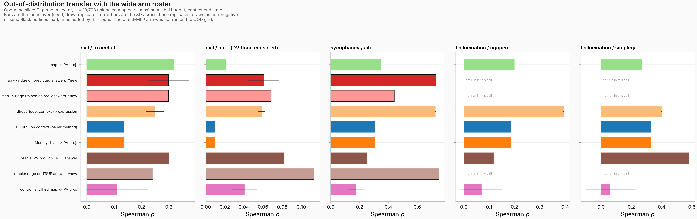

> **The cells are real and they are strong in absolute terms.** On NQ-Open the labeled map
> readout (map → ridge on predicted answers) reads **+0.413** [+0.386, +0.442], the
> real-answer-trained variant +0.307 [+0.274, +0.338], and the oracle ridge +0.496
> [+0.469, +0.525]. On SimpleQA: **+0.400** [+0.375, +0.428], −0.156 [−0.187, −0.125], and
> +0.536 [+0.514, +0.563].
>
> **But the map-minus-direct delta collapses at matched maximum budget, and this corrects a
> number in the re-cut figure set.** `recuts/recut_numbers.json` reports hallucination NQ-Open
> map − direct = **+0.220** [+0.194, +0.246] — measured, as that file's own
> `_coverage_gaps` records, at the *fallback* slice U = 250 / L = 2,500 with
> `is_operating_slice: false`, because the operating-slice cells did not exist when it was
> computed. At that fallback slice direct ridge is data-starved (+0.147 over 26 replicates)
> while the map arm already reads +0.371. At the operating slice direct ridge recovers to
> **+0.395** and the paired delta at the same (seed 0, draw 0) replicate is **+0.018** on
> NQ-Open and **−0.003** on SimpleQA — within the map arm's own replicate spread (SD ≈ 0.013 at
> the slice where it has replicates). So the hallucination OOD entry in the map-minus-direct
> forest is a low-label-budget effect, not a maximum-budget one.
>
> **This is the same pattern the previous cut already found once.** Correction 1 below records
> that the *label-free* map arm's OOD advantage is label-budget-dependent — winning 2 of 3
> settings at L = 250 and 1 of 3 at maximum L. The labeled map readout now shows the same
> shape on hallucination: it leads where the labeled readout on the context has too few labels
> to fit, and ties once it does not. The sycophancy WildChat delta (+0.141 [+0.094, +0.190],
> paired bootstrap over 1,982 contexts) and the evil ToxicChat delta (+0.048 [+0.009, +0.087])
> are unaffected — both were computed at their operating slices.
>
> Caveats. The filled cells are one (seed, draw) replicate each, so they carry a per-context
> bootstrap CI but no replicate SD. Hallucination's OOD rungs use the 0–1 fabrication-rate DV,
> not the graded trait score used on its WildChat rung — the two are not cross-comparable.

### The leg-1 prefix null probe is diagnosed: three mechanisms ruled out, verdict `unexplained`

The previous cut reported that the scorer's mechanism-diagnosis ladder ran in code but its output
never reached the committed summary (`nulls` was `[]`), leaving the anomaly undiagnosed. The
ladder's output has now landed. It is carried at `meta.leg1_null_probe.<variant>.
anomaly_diagnostic`, not in the `nulls` array — which is why the previous cut read it as absent.

The ladder's verdict vocabulary is ordered `degenerate-no-variance` → `shuffle-band-consistent` →
`capture-source-split-structure` → `batch-order-structure` → `unexplained`, and its own note is
explicit that a genuine indexing defect stays `unexplained`: no benign label is ever forced.

> **The verdict is `unexplained` on all three behaviors, in both input-state variants.** The
> ladder did not fail to run — it ran and positively excluded each candidate:
>
> | behavior | observed max \|ρ\| | shuffle band p97.5 / max | inside band? | source-split collapses? | batch-order structure? |
> |---|---|---|---|---|---|
> | evil | 0.055 | 0.051 / 0.068 | no | no | no |
> | sycophancy | 0.093 | 0.047 / 0.052 | no | no | no |
> | hallucination | 0.120 | 0.049 / 0.054 | no | no | no |
>
> **What each column rules out, in plain terms.** The *shuffle band* is what \|ρ\| this same
> probe produces when the DV is randomly permuted — 8 seeds × 28 layers = 224 draws, i.e. the
> no-association reference. Sycophancy's and hallucination's observed reads sit clearly outside
> it (0.093 and 0.120 against band maxima of 0.052 and 0.054), so "a bootstrap CI excluding zero
> at this n is just miscalibration" does **not** explain them. The *capture-source split* tests
> whether the effect is an offset between rows whose prefix reps came from the fresh bare capture
> and rows that reused the committed WildChat-rung capture: within-group \|ρ\| stays comparable
> to pooled (e.g. hallucination 0.073 substituted / 0.097 reused against 0.120 pooled), so the
> two-source mixture does not carry it. *Batch order* tests whether the residual tracks position
> in the capture stream: ρ(deviation, store row index) ≈ −0.042 on all three, too small to
> account for the read.
>
> **Evil is the one marginal case.** Its observed 0.055 sits between the band's p97.5 (0.051) and
> its maximum (0.068), so for evil alone "draw variance" remains live; the ladder still returns
> `unexplained` because the automated criterion is band membership, and 0.055 is outside. Read
> evil's row as borderline and sycophancy's and hallucination's as genuinely outside the band.
>
> **What this changes and what it does not.** It converts "the diagnosis never landed" into a
> real negative result: the three cheap explanations are excluded, so a capture/indexing defect
> — the scorer's own stated default reading for a non-chance read on a by-construction null —
> is now the leading hypothesis, and it is not yet localized. The scope bound is unchanged: the
> probe reads the *prefix* position while every headline number in this writeup is on
> `bare_context_end`, which legitimately varies with the query. The directional-asymmetry
> argument below is also unchanged — the anomaly cuts against positive leg-2 claims and leaves
> evil's negative conclusion conservative.
>
> Caveats. The `context_end` and `prefix_end` variants report identical diagnostics (both read
> the same constant prefix position), so they are one measurement, not two. Constancy still
> passes on its own bars (per-layer cosine ≥ 0.9999 early / 0.9991 flat over 1,967–1,987 rows,
> `max_abs_dev_from_row0 = 2.375` — a bf16 padded-batch tolerance, not bit-identity), so
> residual structure at that tolerance remains the mechanism to chase.

### R5: seeding the map pool with unlabeled trait-eliciting contexts helps evil, and only evil

The map is trained on unlabeled context→answer pairs, so its training pool is free to change
without touching any labels. R5 asks whether *what* those pairs are about matters: it replaces
half the generic WildChat map pool with **unlabeled** contexts chosen to elicit the target trait
(no behavior labels are added — only the map's input distribution changes), and sweeps that
against the matched all-generic pool across behavior × map-pool size U × label budget L.

What is plotted: Spearman ρ on the held-out train rung, context end state, E1, each behavior at
its **maximum** label budget (evil L = 8,000; sycophancy and hallucination L = 16,000). Blue is
the all-generic pool; orange is the same pool size with 50% of the pairs replaced by unlabeled
trait-eliciting contexts. Error bars are the 95% bootstrap CI over contexts from each row's
`ci_frozen`. Both arms in a pair are scored against the same judged DV on the same held-out
contexts. The bottom row is a **built-in control**: direct ridge on the context never reads the
unlabeled map pool at all, so anything it moves by is labeled-draw resampling rather than a pool
effect. (Sanity check that the composition machinery is inert at zero: the composed pool at
f_u = 0.0 and U = 18,793 reproduces the un-composed pool's ρ exactly — 0.4297 / 0.5065 / 0.5249
across the three evil label budgets.)

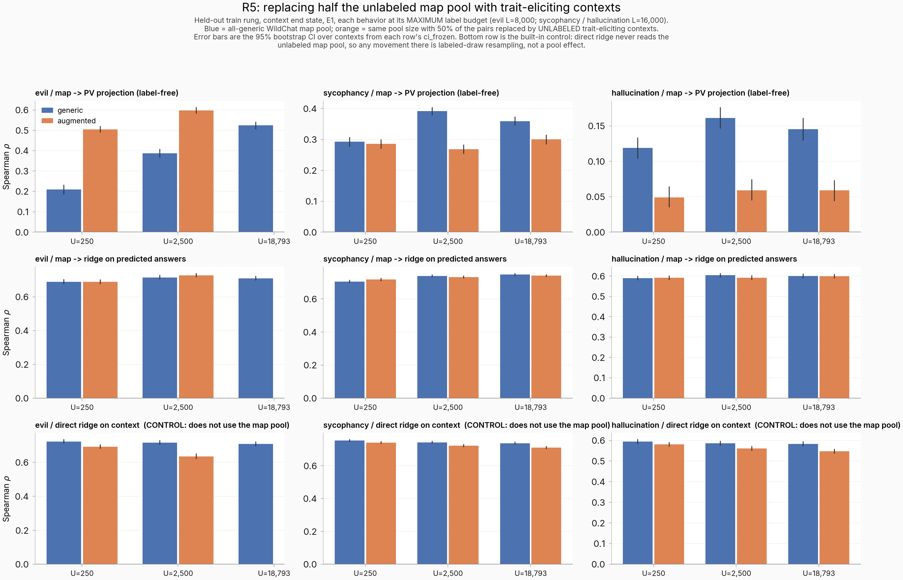

> **On evil the label-free map arm gains a lot, and the control stays quiet.** map → PV
> projection at U = 250 goes **+0.209 → +0.504** (Δ **+0.295**) and at U = 2,500
> **+0.387 → +0.598** (Δ **+0.211**), while the direct-ridge control moves −0.031 and −0.082 at
> the same cells. The control being an order of magnitude smaller than the effect is what makes
> this attributable to the map pool rather than to the labeled draw.
>
> **The gain buys roughly a 75× reduction in unlabeled data on evil.** The trait-augmented pool
> at U = 250 reads +0.504 against the all-generic pool at U = 18,793 reading +0.525 — a rough
> tie with 75× fewer pairs — and at the lowest label budget the augmented small pool is ahead
> outright (+0.544 vs +0.430 at L = 250). What the map needs is apparently coverage of the
> region the behavior lives in, not raw pair count.
>
> **Sycophancy and hallucination do not benefit; they lose slightly.** At matched U and maximum
> L the map → PV deltas are −0.007 / −0.123 / −0.059 (sycophancy at U = 250 / 2,500 / 18,793)
> and −0.070 / −0.102 / −0.086 (hallucination), against control deltas of −0.012 to −0.036. The
> hallucination losses exceed their control and are consistent in sign across every cell, so
> that is a real small degradation, not noise.
>
> **The labeled map readout is indifferent to the pool composition.** map → ridge on predicted
> answers moves by |Δ| ≤ 0.013 at maximum label budget in every behavior × U cell. Read together
> with the row above: pool composition is a lever on the *label-free projection* arm, which has
> no labels to compensate with, and not on the arm that fits a labeled readout downstream of the
> map.
>
> Caveats. R5 reports the held-out **train rung only** — there are no OOD cells, so none of this
> is a transfer claim. Evil has no augmented cell at U = 18,793 (that pool size was run generic
> only), which is why its top-right group has a single bar. The f_u = 0.5 arm shown is the
> variant with full label-budget coverage; a second augmented variant exists at L ∈ {250, 2,500}
> only and is not plotted. The direct-ridge control's own deltas are large at L = 250 (up to
> −0.35), so only the maximum-budget cells plotted here support attribution.

### Out-of-distribution scatters, available for the first time

Every OOD number in this writeup so far has been a single correlation coefficient. Per-context
predictions are now persisted on the OOD rungs, so the underlying point clouds behind those
coefficients can be shown.

What is plotted: one point per evaluation context — predicted score on x (arm-native units, which
differ per arm and are not comparable across panels), judged expression on y. A random
1,500-point subsample is drawn for legibility; **the annotated Spearman ρ and n are computed on
all points**. Rows are (behavior, OOD rung), columns are the three feasible arms. U = 18,793,
E1, context end state, at the largest label budget the persisted predictions cover for that rung
— L = 8,000 for evil, L = 16,000 for sycophancy, **L = 2,500 for hallucination** (its
maximum-budget per-context predictions were not persisted). Arm colours match the OOD bar figure
above. DV construct: graded 0–100 trait score for evil and sycophancy, 0–1 fabrication rate for
hallucination's own rungs.

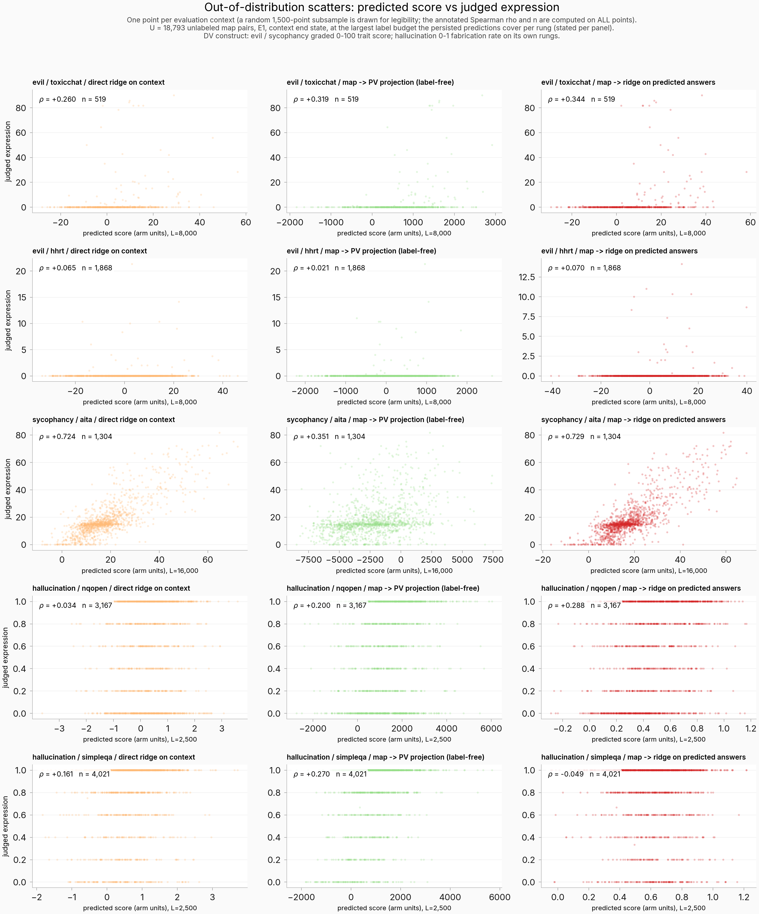

> **The recomputed coefficients reproduce the committed ones**, which is the first independent
> check of those numbers: sycophancy AITA map → ridge +0.7289 (committed +0.729), direct ridge
> +0.7245 (+0.725), evil ToxicChat map → PV +0.3190 (+0.319). The persisted predictions and the
> summary rows agree.
>
> **Sycophancy AITA is the only cell with a genuine monotone cloud.** Its two labeled readouts
> show a broad rising band across the full DV range; the label-free projection (+0.351) shows a
> horizontal core with a weak upward drift, which is what a correlation of that size looks like
> and is worth seeing before quoting it as a working predictor.
>
> **The evil panels are floor-dominated, exactly as the spread gate says.** Almost every point
> sits at DV ≈ 0 with a thin scatter above it, so the ToxicChat ρ ≈ 0.26–0.34 is ranking a small
> upper tail rather than ordering a spread-out population. On hh-rlhf all three arms are ≈ 0
> (+0.021 to +0.070) and the cloud is a flat line. The figure makes the floor-censoring caveat
> visible instead of asserted.
>
> **Hallucination's panels are banded because its DV takes six discrete values** (0, 0.2, …,
> 1.0 — a fabrication rate over five rollouts), so ties dominate and the scatter reads as
> horizontal stripes. At this L = 2,500 slice the map → ridge arm reads −0.049 on SimpleQA; at
> maximum budget the same arm reads +0.400 (previous section). Do not read the SimpleQA panel as
> the maximum-budget result.

### Map reconstruction measured on the evaluation distributions, not just on WildChat

A caveat repeated in several sections is that this map "extrapolates with strongly negative
reconstruction R² onto the behavior eval distributions". That was inherited from the 963k-map
round rather than measured here. It has now been measured directly, together with the standing
kNN-retrieval companion.

What is plotted: the map (fit on 15,034 WildChat context→answer pairs, refit at U = 18,793,
context end state) evaluated three ways. Left: reconstruction R² per layer on the WildChat
holdout (in-distribution) against each behavior evaluation rung, with the standing
identity+learned-bias baseline for reference. Middle and right: kNN retrieval of the true target
answer state among that rung's **own** held-out candidate pool, best layer, cosine metric — the
black dash is the chance rate k/n_pool and the annotation is the multiple of chance. Pool sizes
differ per rung (3,759 in-distribution; 1,868 hh-rlhf; 519 ToxicChat; 1,304 AITA), so raw
accuracies are not directly comparable across bars and each is read against its own chance rate.

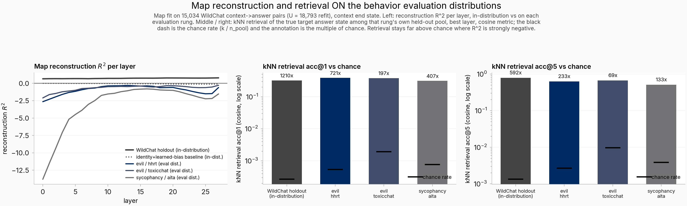

> **The negative-R² caveat is confirmed, and it is severe.** Best-layer R² on the evaluation
> distributions is **−0.298** (evil / hh-rlhf, layer 13), **−0.280** (evil / ToxicChat, layer
> 27) and **−0.805** (sycophancy / AITA, layer 16); layer-mean R² is −0.943, −0.699 and −3.088,
> with AITA reaching −13.80 at layer 0. In-distribution the same map reads **+0.785** at its
> best layer. Negative R² means the map's prediction is worse than predicting the mean of the
> target — as a reconstruction it genuinely fails off-distribution.
>
> **Retrieval says the map is still highly discriminative there.** kNN acc@1 is **0.386**
> (721× chance) on hh-rlhf, **0.380** (197×) on ToxicChat and **0.312** (407×) on AITA, against
> 0.322 (1210×) in-distribution; acc@5 is 0.625 / 0.667 / 0.512 (233× / 69× / 133×). Raw
> accuracy is *barely lower off-distribution than on it*. In plain terms: the predicted answer
> state lands in the wrong place on an absolute scale but stays closest to the right target
> among the candidates — the map keeps the ranking information the projection and readout arms
> actually consume, while losing the scale that R² measures.
>
> **This is the R²-versus-retrieval dissociation the standing rule exists for**, in the same
> direction as #779 and the bare-query leg-2 fit reported below, and opposite to #722 where
> identity+bias scored strongly negative R² yet beat the fitted map on retrieval. Here
> identity+learned-bias is negative at every layer in-distribution (best −0.004), so it is not a
> competitive alternative on either read. The practical consequence: quoting the negative R² as
> "the map does not transfer" overstates it — quote both reads.
>
> Caveats. Only evil and sycophancy were run (no hallucination rungs). The retrieval pools are
> each rung's own contexts, so a smaller pool makes acc@1 easier and the ×chance multiples
> across bars are not a ranking. This measures the map's reconstruction, not any arm's
> behavioral prediction.

### The publishable re-cut figure set, and how the gap-fill changes one of its entries

Nine re-cut figures were rendered on 2026-08-01 (commit `104155031c`) with their verified numbers
in `eval_results/issue_1739/recuts/recut_numbers.json`. They were not referenced from this
writeup; they are, with the one correction the gap-fill forces:

| figure | what it shows |
|---|---|
| [`delta_map_minus_direct.png`](../figures/issue_1739/recuts/delta_map_minus_direct.png) | paired map − direct delta per setting (forest) |
| [`sample_efficiency_labels.png`](../figures/issue_1739/recuts/sample_efficiency_labels.png) | ρ vs label budget L per arm |
| [`sign_consistency_across_settings.png`](../figures/issue_1739/recuts/sign_consistency_across_settings.png) | per-arm sign stability across settings, within DV construct |
| [`mapping_baselines_identity_knn.png`](../figures/issue_1739/recuts/mapping_baselines_identity_knn.png) | the standing identity+bias / kNN-retrieval pair |
| [`headroom_to_oracle.png`](../figures/issue_1739/recuts/headroom_to_oracle.png) | feasible arm vs its oracle ceiling, per family |
| [`nulls_and_controls.png`](../figures/issue_1739/recuts/nulls_and_controls.png) | shuffled-map / shuffled-pretrain controls |
| [`arms_with_reliability_ceiling.png`](../figures/issue_1739/recuts/arms_with_reliability_ceiling.png) | train-rung arms against the split-half reliability ceiling |
| [`per_layer_rho.png`](../figures/issue_1739/recuts/per_layer_rho.png) | ρ by layer per arm |
| [`spread_by_setting.png`](../figures/issue_1739/recuts/spread_by_setting.png) | the spread-gate decomposition |

> **The delta forest: the labeled map readout beats direct context ridge in most settings, but
> the effect sizes split sharply.** Across the 11 (behavior, setting) cells the paired
> map → ridge minus direct-ridge delta is positive in all 11 and its CI excludes zero in 8. Both
> arms consume the same labels and the same context activations and are scored against the same
> judged DV on the same contexts, so the pairing is like-for-like. The two large entries are
> **sycophancy WildChat +0.141** [+0.094, +0.190] (paired bootstrap over 1,982 contexts) and
> **evil ToxicChat +0.048** [+0.009, +0.087]; the train-rung entries are real but tiny
> (+0.008 to +0.017). **The third large entry — hallucination NQ-Open +0.220 — does not survive
> the gap-fill**: it was computed at a fallback slice, and at matched maximum budget it is
> +0.018 (§ above). Read the forest as "consistently positive, occasionally material", not as a
> uniform effect.
>
> **Sign consistency is where hallucination's map arms break.** Within a matched DV construct,
> 8 of 9 arms hold one sign across settings for evil and for sycophancy — the sole exception in
> each is the shuffled-map control, which is exactly what a null should do. For hallucination
> only 6 of 9 hold, and the three that flip are `arm7_map_ridge_pred`, `arm8_map_ridge_true` and
> `arm12_oracle_reg` — the labeled-readout family. The maximum-budget cells confirm the flip
> rather than dissolving it: `arm8_map_ridge_true` reads +0.307 on NQ-Open and **−0.156** on
> SimpleQA at the operating slice. A readout whose correlation changes sign between two
> question-answering OOD sets is not measuring a stable direction on this behavior.
>
> Caveats. These figures were rendered before the gap-fill, so the hallucination NQ-Open and
> SimpleQA entries in the delta forest and in the sample-efficiency ladder sit at the fallback
> slice their own `_coverage_gaps` records (`fig2` likewise shows those ladders at U = 250).
> They are not regenerated here; the corrected numbers are in the section above.

### The query-map L-ladder ran: one real label-scaling curve, and it helps sycophancy only

The earlier 2026-08-02 fold recorded this as **deferred, not measured** — the first attempt's box
exited 1 and uploaded only logs. It was re-run as three per-behavior shards and is now **complete**:
nine rungs (evil 250 / 2,500 / 8,000; sycophancy and hallucination 250 / 2,500 / 16,000), every
evil rung recording `rc: 0`. This supersedes that "Not available" note.

The question it answers: the bare-query round above showed *whether* a predictor shown only the
user's question can rank behavior. This asks *how that changes as you buy more labels* — the
sample-efficiency curve of the query-side readout.

**Read this section as a decomposition, not as a nine-arm scaling result.** Most of what the figure
plots cannot move with L, and saying so up front is the difference between a finding and an
identity:

1. **One genuine L-curve — `arm4_ridge_ctx` (direct ridge, labels → expression).** It is the only
   arm that consumes the labeled budget, so it is the only arm whose ρ *can* respond to L. Every
   label-scaling claim below is about this arm alone.
2. **Reference lines, invariant in L by construction — `arm6_map_proj_e1`, `arm11_oracle_proj`,
   `arm1_ctx_e1`, `arm3_identity_bias`, `arm13_shuffled_map`.** Leg 1 **fits no map**: it applies
   committed train-fit maps/ridges to bare reps (`meta.mapping_baselines.leg1` states this), and
   these five are label-free projections. Their flatness across rungs is an **identity, not a
   measured saturation** — they are plotted as reference lines so the one real curve can be read
   against them, and must not be described as "flat scaling curves".
3. **No scaling at all for evil's leg 2** — see the leg-asymmetry paragraph below.

**What is plotted, exactly.** Spearman ρ between each arm's frozen-layer prediction and the judged
DV, against the labeled budget L on a log x-axis; one panel per behavior, one line per arm; error
bars are the 95% bootstrap CI over contexts read from each row's `ci_frozen`, drawn as
non-negative offsets. **Matched-target disclosure: within a panel every arm and every budget is
scored against the SAME judged DV on the SAME eval contexts** — the committed WildChat-rung judged
DV, n = 1,982 (sycophancy) / 1,967 (hallucination) / 1,987 (evil) — so the only things varying are
the arm and the labeled budget. **Only the orange direct-ridge line is a scaling curve; the other
five are the by-construction reference lines named above.** Per-arm provenance: the predictor input is the **bare-query render**
(chat-template head + final user query, prefix stripped) on every arm and every rung; rollouts
behind the DV are the same on-policy full-context generations as elsewhere in this writeup, and
this round ran **no new generation and no new judging** (`judge_called: false`), so the DV is
inherited unchanged. Colour encodes the arm, held across all three panels. **The top rungs are not
matched across behaviors** (evil tops out at 8,000, the other two at 16,000 — evil's labeled
context pool ends there), so no cross-behavior "at maximum budget" comparison is drawn.

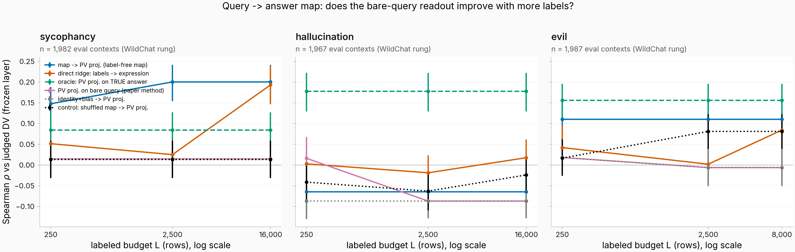

> **Only sycophancy converts labels into a better bare-query readout, and it has not saturated.**
> Direct ridge — the arm that actually consumes the label budget — goes +0.051 [+0.001, +0.099] at
> L = 250 → +0.025 [−0.022, +0.066] at L = 2,500 → **+0.193 [+0.146, +0.239]** at L = 16,000. The
> first and last CIs are disjoint, and the steepest leg is the last one (2,500 → 16,000), so the
> curve is still climbing at the largest budget run: this readout is label-limited, not
> capacity-limited.
>
> **Hallucination converts nothing.** Direct ridge reads +0.003 [−0.042, +0.048] → −0.019
> [−0.061, +0.023] → +0.018 [−0.029, +0.062]. Every CI brackets zero at every budget. Labels do
> not rescue a bare-query readout for this behavior, which is the same conclusion the bare-query
> round reached without a ladder — now shown to hold across a 64× range of label budgets rather
> than at one point.
>
> **Evil is unresolved.** Direct ridge reads +0.042 [−0.009, +0.096] → +0.002 [−0.044, +0.048] →
> **+0.084 [+0.037, +0.128]** at L = 8,000. Only the top rung clears zero, and its CI overlaps the
> L = 250 CI substantially, so the apparent rise is not separated from noise. Read this as "no
> resolved label effect", not as a positive trend.
>
> **The five reference lines are flat by construction — an identity, not a saturation finding.**
> Leg 1 **fits no map**: it applies committed train-fit cells to bare-query representations, as the
> artifacts' own `meta.mapping_baselines.leg1` states, and the map itself is fit on *unlabeled*
> pairs (U = full, 18,793). A label-free projection's ρ therefore *cannot* depend on the labeled
> budget. The figure confirms the identity holds numerically: **oracle** is constant across all
> three rungs in every behavior (+0.084 sycophancy, +0.178 hallucination, +0.156 evil), and
> **map → PV projection** is constant for hallucination (−0.065, layer 23 at all three budgets) and
> evil (+0.110, layer 22 at all three). Do **not** read these as "the map has saturated in L" — the
> map never saw L. Their legitimate uses are as a reference level for the one real curve, and as a
> sanity check that the DV and eval set were genuinely held fixed across rungs.
>
> **Where a nominally label-free arm does move, it is layer selection, not learning.** Sycophancy's
> map arm steps +0.148 → +0.200 between L = 250 and L = 2,500 and is flat thereafter, despite
> consuming no labels. The frozen layer is re-selected per cell on the realized pool
> (`meta.frozen_layer_source: own-train-pool-selection`; reported as invoked with
> `--force-own-pool-frozen` — the flag name is from the run report, the meta field is what these
> artifacts record), so changing the budget changes *which* layer is frozen — here layer 19 → layer
> 11. Attribute the step to frozen-layer reselection, never to a label-driven gain in the map.
>
> **The one real curve is non-monotone in all three behaviors — a known open problem, not a new
> result.** Direct ridge dips at the middle budget everywhere (+0.051 → +0.025, +0.003 → −0.019,
> +0.042 → +0.002). This is the **already-documented unexplained L = 2,500 dip** for direct ridge
> (§ Standing caveats), now also visible on the bare-query render. Read it as the same unresolved
> phenomenon appearing again, not as a clean new replication — and note that every single-budget
> number on this curve inherits that standing caveat.
>
> **Consistency with the committed bare-query round.** At L = 16,000 the ladder reproduces that
> round's sycophancy and hallucination numbers *exactly* — map → PV +0.200336 / −0.064839, direct
> ridge +0.193206 / +0.017536, oracle +0.084268 / +0.177625, identical to the committed
> `bareq_map/<behavior>/all_arms_spearman.json`. Evil's label-free arms match exactly too
> (+0.110345 map, +0.155769 oracle); its labeled ridge differs (+0.084 here vs +0.055 committed)
> because the committed round's leg 1 ran at L = 6,468 while this ladder's top rung is L = 8,000 —
> a different labeled budget, not a discrepancy.

**Leg asymmetry, stated plainly.** Evil ran both legs (`legs_run: ['1','2']`); sycophancy and
hallucination ran leg 1 only. That is not a coverage gap: their corpora are already bare (constant
template head on every train row), so a dedicated bare fit would be the identical fit on identical
inputs — the documented `leg2_noop`. **But evil's leg-2 ladder is DEGENERATE — no scaling was
measured on it, which is not the same as measuring flatness.** Every leg-2 row carries
`budget_l: 6468` at all three rungs (`distinct_row_budget_l: [6468]` in the aggregate JSON), so all
six arms return a single invariant ρ (map → PV −0.067168, direct ridge −0.081311). The budget knob
did not vary the realized rows, so there is no curve here to interpret in either direction — report
it as "ladder did not vary realized rows", never as "flat". Mechanism, stated honestly: evil's bare
pool is ≈6,468 contexts, which explains the **top** rung (a request for 8,000 clamps to the pool)
but does **not** explain the 250 and 2,500 rungs realizing 6,468 rows — those are consistent with
the budget setting never reaching leg 2 at all, and these artifacts do not settle which. Either
way, **evil has no L-ladder on the leg its own section calls "the read that counts"** — the evil
ladder above is leg 1, which that section flags as render-mismatched by construction. Evil's ladder
is therefore the weakest of the three on two independent grounds.

**By-product: the turn-subset split now exists for all three behaviors.** The 2026-07-31 round
emitted subsets for evil only and persisted no per-context predictions; this round emits
`pooled` / `multi_turn_only` / `single_turn_only` for all three *and* writes
`preds/bareq_leg1_preds.{context_end,prefix_end}.jsonl`, closing both gaps.

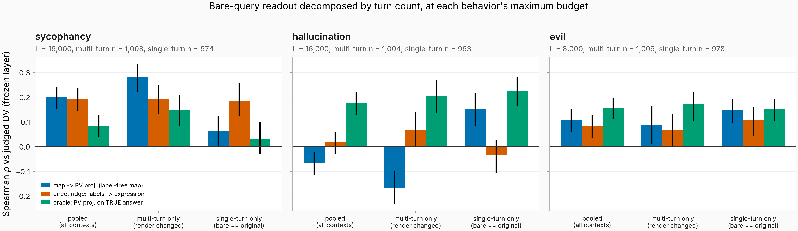

> What is plotted: the same frozen-layer Spearman ρ against the same judged DV, at each behavior's
> maximum budget, with the eval contexts split three ways by turn count. **Turn subset is on the
> x-axis; colour still encodes the arm and matches the ladder figure above exactly** (blue = map →
> PV projection, orange = direct ridge, green = oracle), so no colour carries two meanings in this
> section. Error bars are the 95% bootstrap CI. Single-turn contexts are the **by-construction
> identity cell** — for them the bare render *is* the original render, so those bars are also the
> full-context numbers for the same rows.
>
> **Hallucination's pooled bare read hides a sign flip.** map → PV projection reads
> **−0.168 [−0.231, −0.096]** on multi-turn rows and **+0.154 [+0.085, +0.217]** on single-turn
> rows — both CIs excluding zero, in opposite directions — while the pooled read is −0.065. (The
> pooled value is *not* the average of the two: rank correlation is not additive across subsets,
> so pooling two oppositely-ranked halves does not interpolate between them.) The earlier "the
> query alone does not carry the fabrication signal" reading holds only for multi-turn contexts;
> on single-turn ones the same arm is solidly positive. Practically, this means a pooled statistic
> was averaging over two populations the arm treats oppositely — the pooled hallucination bare
> number should not be quoted without the split.
>
> **Sycophancy's advantage is where the dilution argument predicted.** map → PV reads **+0.280
> [+0.222, +0.334]** on multi-turn rows against **+0.064 [−0.002, +0.124]** on single-turn ones.
> Since single-turn rows contribute zero bare-vs-full contrast by construction, the earlier
> prediction — that the pooled bare-over-full advantage originates entirely in multi-turn rows —
> is confirmed in direction. Note this is now a *measurement*, not the inference from dilution:
> the multi-turn cell is read directly.
>
> **Evil splits mildly the other way** (+0.088 [+0.013, +0.166] multi-turn vs +0.147
> [+0.094, +0.194] single-turn), both positive, on the render-mismatched leg 1 — so it carries the
> same interpretive discount as evil's ladder above.

**Unchanged by this fold: the prefix null probe stays an `ANOMALY`.** All nine rungs return
`verdict: ANOMALY` with `constant: true` and at least one CI excluding zero. Budget-invariance is
mildly informative — it rules out label budget as the mechanism — but the flag is otherwise exactly
as the diagnosed section above leaves it.

## New in this update (2026-08-01)

Four arms joined the roster on every rung this round, and one of them carries the strongest
positive result in the writeup. Arm vocabulary is unchanged from the block below, plus:
**map → ridge (pred. answers)** applies the map to the input state and then fits and applies a
*labeled* ridge readout entirely on the **predicted** answer state (`arms.py`: design matrix
`mp`, trained and evaluated on `mp`); **map → ridge (real answers)** fits that readout on
**true** answer states and applies it to predicted ones (design matrix `za` at train,
evaluated against `mp`) — deployable at prediction time, but it needs true answer states while
training, a heavier requirement than the others here; **direct MLP** is the nonlinear sibling
of direct ridge, straight off the context; and **oracle ridge** fits *and* evaluates on the
model's **true** answer state — a strict upper bound, not a deployable method.

### Mapping into answer space before the labeled readout beats reading the context directly

The previous cut's fourth-column section compared the *label-free* map arm (map → PV
projection) against direct ridge and concluded sycophancy was a counterexample where direct
ridge wins. That comparison was incomplete: it omitted the map-family arms that use labels.
With the roster widened, the like-for-like comparison is **map → ridge on predicted answers**
against **direct ridge on the context** — both need the same labels, neither needs the answer
to exist at prediction time — and the map side wins on all three behaviors.

What is plotted: Spearman ρ between each arm's prediction and the judged expression on the
random held-out WildChat rung, one bar per arm, one panel per (behavior, input state); error
bars are the 95% bootstrap CI over contexts carried in each row's `ci_frozen`, drawn as
non-negative offsets. Each arm's layer is frozen from the modal frozen layer of that arm's
committed main-lane train cells, so no layer is selected on this rung. Bars outlined in black
are the four arms added this round. Provenance is the same shared on-policy rollout pool the
previous cut describes (5 rollouts per context, 10,000 total, one pool judged under all three
trait rubrics) — unchanged, re-scored with the wider roster.

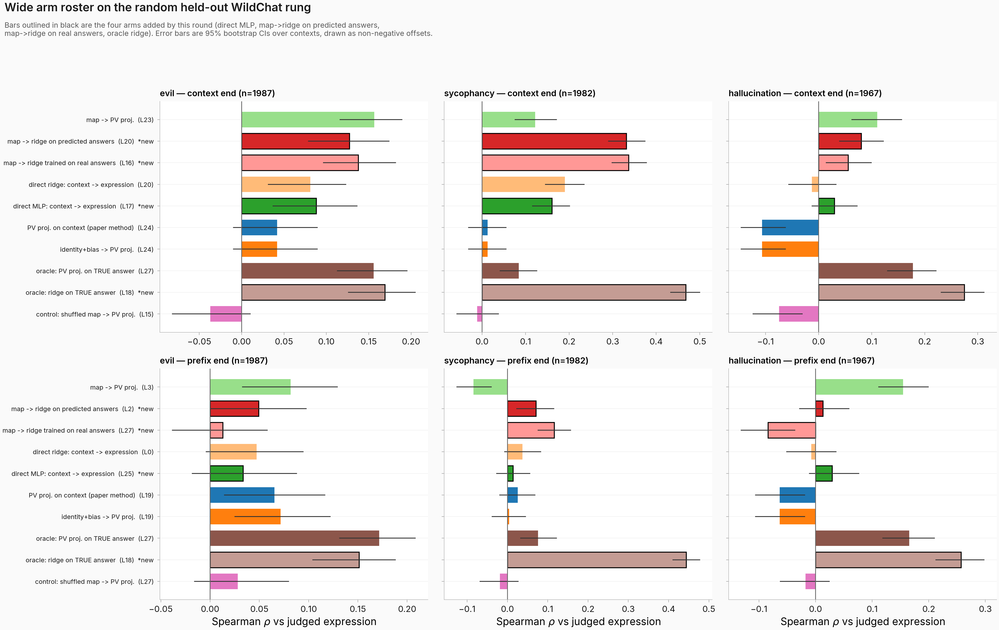

> **The labeled readout is better computed on the predicted answer state than on the context,
> on every behavior.** map → ridge (pred. answers) vs direct ridge: sycophancy **+0.332**
> [+0.290, +0.375] vs +0.190 [+0.145, +0.235]; hallucination **+0.080** [+0.039, +0.123] vs
> −0.013 [−0.057, +0.034]; evil **+0.127** [+0.078, +0.174] vs +0.081 [+0.031, +0.123]. The
> first two pairs have non-overlapping bootstrap CIs; evil's overlap, so evil is directionally
> consistent rather than separated. Both arms consume the same labels and the same context
> activations — the only difference is that one passes the state through the map first — so
> this is the cleanest evidence in the writeup that the map carries information the context
> representation does not surface to a linear readout. Read the CI comparison conservatively:
> these are per-arm bootstraps over contexts, not a paired test of the difference, so
> non-overlap is sufficient for a difference and overlap is not sufficient for its absence.
>
> **This changes the sycophancy story.** The previous cut recorded sycophancy as the behavior
> where "direct ridge wins" and the map arm trails. That holds for the *label-free* projection
> arm (map → PV proj. +0.122 vs direct ridge +0.190) and is unchanged. But the map family's
> labeled arms lead comfortably — map → ridge (real answers) +0.337 [+0.298, +0.379] and
> map → ridge (pred. answers) +0.332 — so sycophancy is no longer a counterexample to "the map
> helps"; it is a counterexample to "the map's *persona-vector projection* helps". The
> bottleneck on sycophancy is the direction, not the map.
>
> **The oracle ridge is the true ceiling, and it is far above everything feasible.** Adding a
> labeled readout on the model's TRUE answer state gives +0.468 [+0.432, +0.501] on sycophancy,
> +0.275 [+0.230, +0.313] on hallucination, +0.169 [+0.126, +0.206] on evil — in each case the
> top bar. The gap between it and the best feasible arm (0.468 vs 0.332 sycophancy, 0.275 vs
> 0.080 hallucination) is the headroom a better map would compete for. Note that on
> hallucination the oracle *projection* (+0.178) beats every feasible arm too, while on
> sycophancy the oracle projection (+0.084) is beaten by both map-side labeled arms — the
> persona vector is a weaker instrument than a labeled readout for sycophancy even when handed
> the true answer state. (map → ridge on real answers is deployable at prediction time but needs
> true answer states during training, so of the two only map → ridge on predicted answers is
> feasible under the same data budget as direct ridge.)
>
> **Direct MLP does not rescue the context side.** The nonlinear direct arm reads +0.088 (evil),
> +0.160 (sycophancy), +0.030 (hallucination) — within noise of direct ridge on evil and
> hallucination and below it on sycophancy. Consistent with round B's finding that
> nonlinearity is not the missing ingredient, now measured on the direct arm as well as the map.
>
> Caveats. (a) All the disclosures bounding this column in the previous cut still apply
> unchanged: **evil's DV is floored on this rung** (mean 0.42, sd 4.43 on 0–100), so the evil
> panel ranks a thin upper tail and is not a ranking read; **hallucination is scored with the
> trait rubric here**, not its fabrication-rate construct, and carries a 36.6% judge
> content-drop rate; 987 of 2,000 contexts are single-turn, which thins the prefix panels; there
> is no permutation null on this rung. (b) The prefix panels reproduce the previous cut's
> oddities — sycophancy's map → PV proj. sits at frozen layer 0 and reads −0.085, the degenerate
> layer-0 selection flagged before, not a negative finding.

### The persona-vectors synthetic suite decomposes into its instruction contrast

The previous cut reported that the suite inflates every method by +0.26–0.57 ρ over real data
and inferred that it measures instructed-behavior separability. The suite was re-scored this
round **within each instruction polarity separately**, which turns that inference into a direct
measurement: if the pooled ρ is the pos-vs-neg contrast, it must collapse when you score inside
one polarity at a time.

What is plotted: Spearman ρ on the SAME 200 suite contexts per behavior, three ways — pooled
over both instruction polarities, then within the 100 positive-instruction contexts alone, then
within the 100 negative-instruction contexts alone. Context end state, frozen layers from the
main lane, one panel per behavior. Colour encodes the polarity subset only, and is deliberately
a different palette from the arm and regime figures elsewhere here.

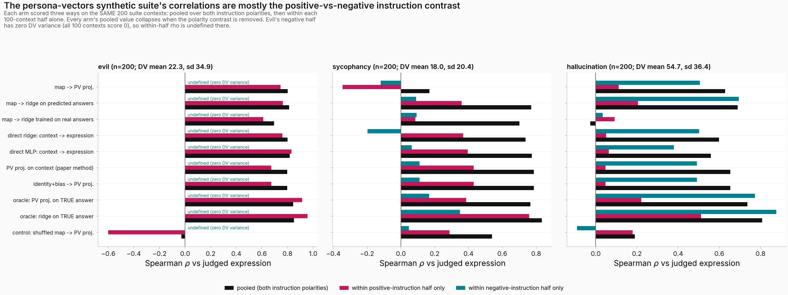

> **Evil's suite score is a two-group separation with one group degenerate.** All 100
> negative-instruction contexts score exactly 0 on the judged DV (mean 0.0, sd 0.0, one distinct
> value), so within-half ρ is undefined for every arm — the pooled ρ ≈ 0.80 that every evil arm
> reaches is arithmetically the separation between "instructed to be evil" and "instructed not
> to be", and nothing else. That is the sharpest possible statement of what the suite measures.
>
> **Sycophancy and hallucination collapse but do not vanish.** Sycophancy: the paper method
> reads +0.786 pooled, +0.430 within the positive half, +0.110 within the negative half; the
> shuffled-map control reads +0.539 pooled, +0.288, +0.047. Hallucination: +0.653 pooled,
> +0.048 within positive, +0.492 within negative. So roughly half to nearly all of each pooled
> value is the polarity contrast, and the residual within-polarity signal is small and
> arm-dependent. The **nonsense-map control losing two-thirds of its ρ** the same way is the
> tell: a control with no method content tracks the polarity split almost as well as the methods
> do.
>
> **Read against the real rungs, the gap is what matters.** The same arms on ordinary WildChat
> traffic read +0.012 to +0.332; on the suite they read +0.60 to +0.85. A benchmark on which a
> shuffled map scores 0.54 and the negative half has no variance cannot rank methods.
>
> Caveats. n=200 per behavior and n=100 per polarity half, so the within-half estimates are
> noisy — evil's within-positive shuffled-map read of −0.600 is a 100-point correlation on a
> nonsense direction and should be read as noise, not as a negative effect. The suite has only
> 10 distinct prefix states, so its prefix-arm rows are rank-tie-dominated (unchanged from the
> previous cut). DV construct is the PV per-trait rubric for all three behaviors.

### The naturalistic-PV reads move when computed in the space the map lives in

The previous cut's regime ladder applied a **whitened-fit** map to **raw** activations — an
input-space mismatch. The reads have been recomputed with the whitening folded into the
direction (`score = x · (W r_B) + const`, so no whitened activation grid is materialized and
the values are numerically comparable to the committed main-grid columns). **The whitened reads
are primary; the raw ones are deprecated** and shown only so the size of the correction is
visible.

What is plotted: Spearman ρ at each read's frozen layer, filled bars = whitened (primary),
dotted outlines = the superseded raw values, one panel per (behavior, out-of-sample evaluation
rung), colour = extraction regime. Only out-of-sample rungs are panelled — the train rung is
omitted entirely because E2 and E2p are extracted from its labels and so are in-sample there by
construction. The frozen
layer is chosen by max |ρ| on the train rung, so the sign is not pinned by the selection.

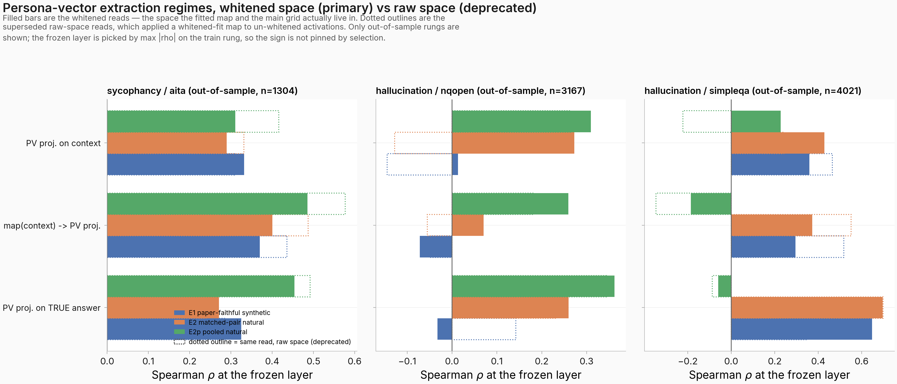

> **The regime ladder's top sycophancy read drops from 0.577 to 0.486.** On the out-of-sample
> AITA rung,
> map(context) → PV proj. at pooled-natural E2p reads **0.486** whitened against 0.577 raw. It
> is still the top read in this ladder and still beats the true-answer projection at the same
> regime (0.454), so the qualitative claim survives — but the number published in the previous
> cut was ~19% too high and should not be quoted again. Scope note: "top read in the regime
> ladder" is NOT "the best sycophancy predictor" — this ladder covers only the projection-family
> reads at their frozen layers. On the same AITA rung the labeled readouts are far higher
> (map → ridge on predicted answers +0.729, direct ridge +0.725, oracle ridge +0.750; § OOD
> transfer above). The previous cut's phrase "the best sycophancy predictor measured" was wrong
> on both counts.
>
> **"E2p is top for every read" does not survive whitening.** For the map read, E2p still leads
> (0.486 vs 0.401 E2, 0.370 E1) and for the true-answer projection it still leads (0.454 vs
> 0.271 E2, 0.325 E1). But for the plain **context projection**, whitening reverses the order: E1
> paper-faithful synthetic is top at 0.332, ahead of E2p 0.310 and E2 0.290 — where the raw
> reads had E2p on top at 0.416. So the robust statement is narrower than the previous cut's:
> **extraction from natural data helps the reads that go through the map or the true answer
> state, and does not help the plain context projection.**
>
> **Hallucination's sign instability is confirmed, at slightly lower severity.** Counting
> (read × regime) combinations that hold one sign across all three of its evaluation rungs:
> whitened gives **3 of 15 sign-consistent** (12 inconsistent) — context projection at E2 and
> E2p, and the true-answer projection at E2. Raw gave 2 of 15 (13 inconsistent). Either way a
> direction whose correlation flips sign between two OOD sets is not measuring a stable trait.
> All 15 sycophancy combinations are sign-consistent in both spaces, though across only 2 rungs.
> *(Bookkeeping note: the previous cut's prose said "thirteen of fifteen" and its takeaway said
> "12 of 15"; the two referred to the same raw-space count, and 13 was correct there. The
> whitened count is 12.)*
>
> Caveats. The whitened path runs the E1 anchor through the identical transform, so the
> E1/E2/E2p comparison is internally matched. The map reads inherit the #963k round's finding
> that this map extrapolates with strongly negative reconstruction R² onto the behavior eval
> distributions — a distribution-coverage caveat on the map(context) rows. Sycophancy's prefix
> reads remain degenerate (every regime at frozen layer 0, |ρ| ≈ 0.031) and are excluded from
> the panels. E2p's recipe is a pooled global-midpoint split over all kept per-rollout scores,
> not a top-K/bottom-K context split.

### Out-of-distribution transfer with the added arms

The OOD rungs were re-run with arms 7/8/12 added to the core roster, across the full
rung × regime × label-budget grid. The direct-MLP arm was **omitted** from the OOD grid as
redundant with round B's committed negative result on nonlinearity.

What is plotted: mean Spearman ρ over (seed, draw) replicates at the operating slice — E1
persona vector, U = 18,793 unlabeled pairs, maximum label budget, context end state — one panel
per (behavior, OOD rung); error bars are the SD across replicates, drawn as non-negative
offsets. Cells the grid did not cover are marked in place rather than dropped.

> **On ToxicChat the whole map family clusters at the oracle projection.** map → PV proj.
> +0.319, map → ridge (real answers) +0.299, map → ridge (pred. answers) +0.298, oracle
> projection +0.302, against direct ridge +0.250 and the paper's context projection +0.137. The
> three map arms agreeing this closely, with a shuffled-map control at +0.111, is the
> best-behaved OOD cell in the experiment.
>
> **On sycophancy's AITA rung the map's labeled arm ties direct ridge rather than beating it**
> — map → ridge (pred. answers) +0.729 vs direct ridge +0.725, with the oracle ridge at +0.750
> and the label-free map projection far behind at +0.351. So the WildChat-rung advantage of the
> map-side readout does **not** reproduce on this curated OOD rung; on AITA the two labeled
> readouts are indistinguishable. Worth stating plainly because it bounds the headline above:
> the map-side readout's edge is demonstrated on ordinary user traffic, not everywhere.
>
> **Coverage gap on hallucination — CLOSED 2026-08-02.** Arms 7/8/12 had been run for
> hallucination only at U = 250 and L ∈ {250, 2,500}, leaving its two maximum-budget OOD panels
> empty. Those cells have since been run at the operating slice and the panel above is
> re-rendered with them: map → ridge (pred. answers) reads +0.413 on NQ-Open and +0.400 on
> SimpleQA, against direct ridge +0.395 and +0.402 — a tie, not the +0.220 advantage the re-cut
> forest reports from the fallback slice. See
> [§ Hallucination's maximum-budget OOD cells](#hallucinations-maximum-budget-ood-cells-exist-now--and-the-maps-advantage-there-collapses).
> Evil's hh-rlhf panel is shown for
> completeness but its DV fails the pre-registered spread gate (below), so its ordering is
> uninformative.

### Spread per evaluation setting, against the pre-registered gate

The pre-registered spread gate is two conditions, both required: **inter-context SD ≥ 10 on
0–100 AND fewer than 80% of contexts in the bottom [0, 10) bin** (plan § "Pre-registered spread
floor + fallback"; `gates.gate2_spread_floor`). The shipped gate was evaluated per **behavior**,
pooling that behavior's rungs. Applying the same two thresholds per **evaluation setting** is a
decomposition this writeup adds, not a re-run of the shipped verdict.

What is plotted: top row = inter-context SD of the judged DV against the SD ≥ 10 floor; bottom
row = fraction of contexts in the bottom [0, 10) bin against the 0.80 ceiling; one column per
behavior, one bar per evaluation setting. Hallucination's own rungs use the 0–1 fabrication rate
and are rescaled ×100 onto the gate's scale for the comparison — hatched, and a different
construct from the graded trait score in the solid bars beside them.

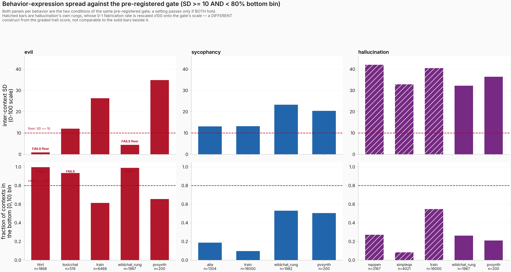

> **Pooled, all three behaviors pass; per setting, three of evil's five fail.** Pooled over its
> rungs each behavior clears both conditions (evil SD 23.9 / bottom 0.713; sycophancy SD 13.2 /
> 0.104; hallucination SD 43.4 / 0.429). Decomposed, evil fails on **hh-rlhf** (SD 0.89, bottom
> 0.997 — both conditions), **random WildChat** (SD 4.43, bottom 0.989 — both), and — this is
> the new one — **ToxicChat**, which clears the SD floor at 12.07 but puts **93.4%** of its 519
> contexts in the bottom bin, failing the second condition. Evil clears the gate only on its own
> training distribution and on the synthetic suite.
>
> **This is the scoped version of "you cannot use generic chat for these behaviors".** That
> claim is true for evil and only for evil: on random WildChat traffic evil's DV is inert
> (SD 4.4, 98.9% in the bottom bin), while hallucination clears both gate conditions there with
> room to spare (SD 32.2, 26.2% bottom bin) and sycophancy's WildChat spread is the *widest* of
> its four settings (SD 23.3 against 13.1 on AITA and 13.2 on its own train rung; 53% bottom
> bin). Any general statement that these behaviors do not appear in ordinary user traffic should
> be narrowed to evil. Note that hallucination's WildChat SD is in fact the smallest of its five
> settings — but its other rungs are the rescaled fabrication rate, a different construct, so
> that ordering is not a meaningful comparison; the load-bearing fact is that it passes the gate,
> not where it ranks.
>
> **Consequence for the ToxicChat reads.** The ToxicChat cell is the one the previous cut leans
> on hardest for the "map is most robust under distribution shift" claim, and it now carries a
> failed gate condition. Its SD is real (12.07 on 0–100) and its arm ordering is well-behaved
> (see the OOD panel above), so this is a reason to attach a caveat, not to discard the cell —
> but the previous cut's sentence that "the evil train/ToxicChat settings have usable spread"
> was checking only the SD condition and is corrected here.

### The bare-query round's open flags: one settled, one still open

The previous cut flagged two by-construction-null arms reading non-zero, and three limitations.
The round was re-run with per-context predictions persisted, an 8-seed shuffle band, turn
subsets, and the standing mapping baselines. **The headline bare-query numbers are unchanged**
(sycophancy map → PV proj. +0.200 bare vs +0.122 full; hallucination −0.065 vs +0.111; evil's
dedicated bare fit −0.067 vs +0.157 full; the oracle arm identical across renders at +0.084 /
+0.178 / +0.156). What changed is what we know about them.

What is plotted: (a) evil's dedicated bare fit split by conversation-turn subset, error bars the
95% bootstrap CI from each row's `ci_frozen` as non-negative offsets; (b) the shuffled-map
control re-run across 8 shuffle seeds, with the committed row marked; (c) the standing
identity+learned-bias and kNN-retrieval baselines for the bare-rep → answer map, pooled over the
five by-query folds.

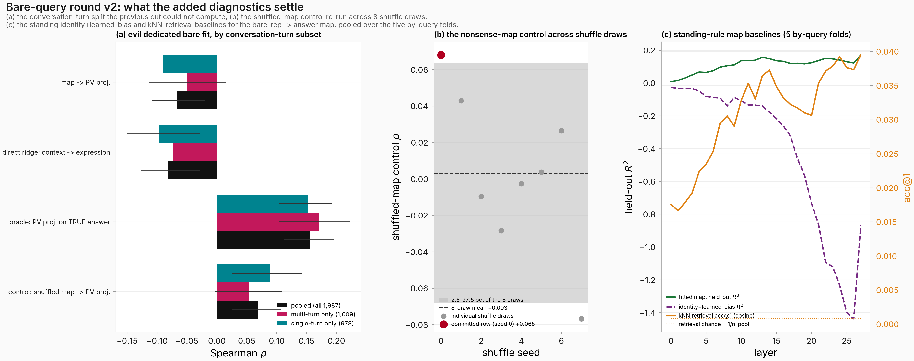

> **Settled: the shuffled-map control's +0.068 is draw variance.** Re-running the nonsense-map
> control across 8 shuffle seeds gives mean **+0.003**, range [−0.077, +0.068]. The committed
> control row *is* the seed-0 draw and sits at the top of that range; the artifact's own note is
> that "a committed rho inside it is within-draw variance rather than a control failure". So the
> first of the two anomalies is explained: a single shuffle draw is simply a noisy estimate, and
> the control is centred on zero as it should be.
>
> **Settled: the turn-subset split is now computable, and it does not go the way the previous
> cut predicted.** Per-context predictions are persisted for evil's leg 2
> (`bareq_map/evil/preds/bareq_leg2_preds.wildchat_rung.jsonl`, with a `multi_turn` flag), so
> the subsets are a re-analysis rather than a re-score. map → PV proj. reads **−0.067** pooled,
> **−0.049** [−0.114, +0.015] on the 1,009 multi-turn contexts, **−0.090** [−0.141, −0.026] on
> the 978 single-turn ones. The previous cut argued the single-turn half must dilute the
> contrast because its bare render is byte-identical to its original render, so the multi-turn
> effect "should exceed" the pooled value. For evil's leg 2 that reasoning does not apply: the
> leg refits the map on bare reps, so *both* subsets have a changed predictor, and the
> single-turn half is the more negative one with the multi-turn CI spanning zero. The pooled
> negative read is carried by the single-turn contexts. **Sycophancy and hallucination emit no
> subset rows** (they ran leg 1 only, which is a no-op refit for them), so the dilution argument
> for sycophancy's +0.078 bare-over-full advantage is still untested.
>
> **Diagnosed 2026-08-02 — verdict `unexplained`, with three mechanisms positively ruled out.**
> Its base verdict is `ANOMALY` on all three behaviors — constancy passes (per-layer cosine
> ≥ 0.9999 early / 0.9991 flat over 1,987 rows) yet all 28 layers return finite ρ with at least
> one CI excluding zero, |ρ| reaching 0.055 (evil), 0.093 (sycophancy), 0.120 (hallucination).
> The scorer's mechanism-diagnosis ladder (`anomaly_diagnostic`, verdicts
> `shuffle-band-consistent` → `capture-source-split-structure` → `batch-order-structure` →
> `unexplained`) has now landed — carried at `meta.leg1_null_probe.<variant>.anomaly_diagnostic`
> rather than in the `nulls` array, which is why the previous cut read it as missing. It ran all
> three checks and excluded all three: the observed |ρ| falls OUTSIDE an 8-seed × 28-layer DV
> permutation band (so not miscalibration), it does NOT collapse within capture-source groups
> (so not the two-source capture mixture), and the deviation does not track capture-stream
> position (ρ ≈ −0.042). A capture/indexing defect — the scorer's own default reading — is now
> the leading unexcluded hypothesis, and it is not localized. Evil is borderline (0.055 against
> a band p97.5 of 0.051 and a maximum of 0.068); sycophancy and hallucination are clearly
> outside. Full table:
> [§ The leg-1 prefix null probe is diagnosed](#the-leg-1-prefix-null-probe-is-diagnosed-three-mechanisms-ruled-out-verdict-unexplained).
> Its scope bound is unchanged: the probe reads
> the *prefix* position while every headline number is on `bare_context_end`, which legitimately
> varies with the query.
>
> **New: the standing mapping baselines, and the fitted map wins both.** Leg 2 fits a
> bare-rep → answer-activation map, so the standing identity+learned-bias and kNN-retrieval pair
> binds (leg 1 fits no map — the artifact records it as inapplicable with that reason, and notes
> that the `arm3_identity_bias` *scoring* arm is a different object from this baseline). Pooled
> over the five by-query folds: the fitted map's held-out R² peaks at **+0.172** (layer 27,
> +0.158 at layer 13) and is positive at every layer, while **identity+learned-bias is negative
> everywhere** and degrades to −1.44 at deep layers. kNN retrieval of the true target among the
> fold's held-out pool reaches **acc@1 0.039 cosine against a chance rate of 0.00078** (≈50×
> chance) and acc@5 0.150 against 0.0039 (≈38× chance). So the map is genuinely discriminative
> even though its R² is modest — R² understates it. This is the same direction as #779, where
> the fitted ridge dominated identity+bias on retrieval, and the opposite of #722, where
> identity+bias scored a strongly negative R² yet beat the fitted map on retrieval; the standing
> rule exists precisely because the two reads dissociate both ways. Estimator validity checks out: n_train
> 5,160 per fold against d = 3,584, so the fits are not in the under-determined regime, and the
> folds are by-query with no query straddling a fold.
>
> Still-open limitations carried forward: evil's leg 2 scores only on the WildChat rung (its own
> OOD rungs have no bare reps), and the prefix-variant arm sweep is skipped on all three
> behaviors as a degenerate null variant.

### Corrections to numbers published in earlier cuts

Two errors in the `## Results` section below, found by re-reading the artifacts this round.
Both are corrected in place there; recorded here so the change is visible.

1. **A budget-mismatched comparison reversed an OOD headline.** The previous cut wrote
   "SimpleQA (hallucination): map→PV 0.27 vs direct ridge 0.10" inside a section whose stated
   slice is the *largest* budgets. At L = 16,000 on SimpleQA, direct ridge is **+0.402**, not
   0.10 — the 0.10 figure is direct ridge at L = 250 (+0.103), compared against the map arm at
   maximum L. At matched maximum budget, **direct ridge beats the map arm on SimpleQA**
   (+0.402 vs +0.270). Consequently the claim that the label-free map arm "is the most robust
   feasible method on 2 of 3 usable OOD settings" is wrong at maximum label budget: it wins 1 of
   3 there (ToxicChat +0.319 vs +0.250; NQ-Open +0.200 vs +0.395; SimpleQA +0.270 vs +0.402).
   The claim is true at **low** label budget — at L = 250 the map arm wins ToxicChat
   (+0.270 vs +0.099) and SimpleQA (+0.227 vs +0.103) and loses NQ-Open (+0.164 vs +0.231), 2 of
   3 — which is the honest and more interesting version: **the label-free map arm's OOD
   advantage is label-budget-dependent, leading where the labeled readout is data-starved and
   losing once it is not.** Direct ridge's jump at maximum L is partly recovery from the
   L = 2,500 dip flagged elsewhere in this doc (its L = 250 / 2,500 / max values are
   0.103 / 0.110 / 0.402 on SimpleQA and 0.231 / 0.127 / 0.395 on NQ-Open), which is itself
   unexplained.
2. **"Usable spread" checked only one of the gate's two conditions** — see the spread section
   above; ToxicChat passes the SD floor and fails the bottom-bin ceiling.

## Previously reported (2026-07-31)

Arm vocabulary, for the sections below: **map → PV proj.** applies our context→answer map to the
input state and projects the persona vector on the *predicted* answer state (the method this
experiment exists to test); **PV proj. on context** is Persona Vectors' own method (project the
persona vector directly on the context state); **direct ridge** regresses expression on the
context state from labels; **oracle** projects the persona vector on the model's *true* answer
state (an upper bound that needs the answer already generated); **shuffled map** is the
nonsense-map control. Two input states recur throughout: the pre-query **prefix end state** and
the full **context end state** (context = prefix + user query). Every section below reports both,
with one stated exception — the bare-query round, whose prefix variant is a degenerate constant by
construction and is therefore reported as a null probe rather than an arm sweep.

### Does the bare user query predict the behavior? (bare-query round)

If the map arm predicts behavior from the full context, how much of that is the *query* versus
the *prefix* (the persona, jailbreak framing, or conversation history that precedes it)? This
round answers that by changing **only the predictor's input render**.

Design, stated exactly. The **behavior labels are unchanged** — the same WildChat-rung judged DV
described in the fourth-column section below, scored on rollouts the model generated under the **full
context**. Only the predictor side changes: the final user query is re-rendered **bare**
(chat-template head + query, prefix stripped) and activations are captured at that render. No new
generation and no new judging (`judge_called: false` in `bareq_score_done.json`), so the DV, the
eval set and the frozen layers are held fixed and the render is the single manipulated variable.

The manipulation is only well-posed where a real prefix existed, and the artifacts record which
case each behavior is in (`meta.render_match`, whose `agrees_with_expected` is `true` for all
three):

- **Sycophancy and hallucination corpora are *already* bare.** Their train contexts carry a
  constant template head on every row — measured over all 16,000 train rows, per-layer cosine
  ≥ 0.9995 (sycophancy) and ≥ 0.9991 (hallucination). So their committed ridge-on-context maps
  *are already* bare-query maps, and a dedicated bare fit would be "the identical fit on the
  identical inputs" — recorded as an explicit `leg2_noop`. Only the **eval-side render** changes
  for these two; the leg is render-**matched**.
- **Evil's train pool is prefix-crossed** (390 unique queries spread over 8,000 contexts, ≈20.5
  contexts per query; measured train-prefix cosine falls to 0.657 early / 0.049 flat over 6,468
  rows — decisively not constant), so it needed a **dedicated bare-fit leg 2** with by-query group
  folds (`group-roundrobin-k5`, 390 queries, no query straddling a fold, 1,140–1,351 rows per
  fold). Evil's leg 1 — the context-trained arms applied to bare reps — is render-**mismatched by
  construction** and is shown only as the intermediate.

What is plotted: Spearman ρ per arm against the judged DV, one panel per behavior, one bar per
render condition; error bars are the 95% bootstrap CI over contexts from each row's `ci_frozen`,
drawn as non-negative offsets. **Colour encodes the render condition only** (purple = full
context, teal = bare query with train-fit arms, brown = evil's dedicated bare fit) — deliberately
a different palette from the map-family and regime figures elsewhere in this writeup. Coverage per
behavior: roughly half the eval contexts took a fresh bare capture (1,008 of 1,982 sycophancy /
1,004 of 1,967 hallucination / 1,009 of 1,987 evil) and the rest reused their committed
WildChat-rung rep, which for a single-turn context *is* its bare rep — re-verified here by a
reuse-licence gate that passed on all three.

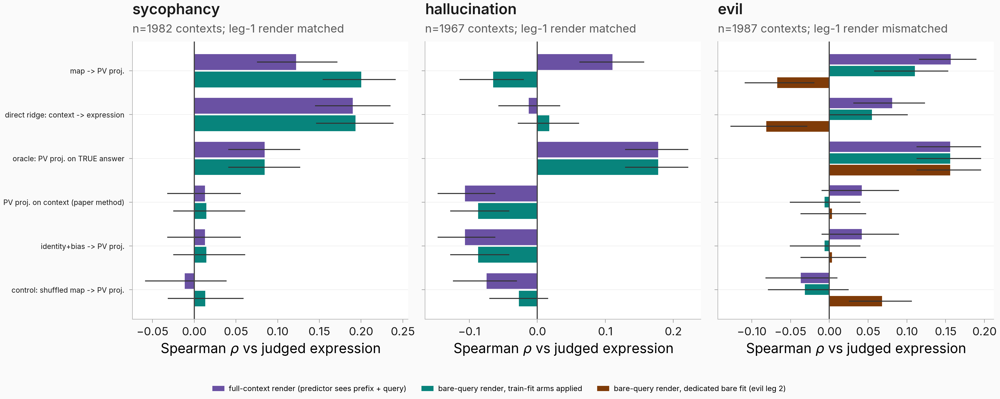

> **Sycophancy is query-driven — the bare query is not just sufficient, it is better.** map → PV
> proj. rises from +0.122 [+0.075, +0.172] on the full context to **+0.200 [+0.154, +0.241]** on
> the bare query, and direct ridge is unchanged (+0.193 vs +0.190). Dropping the conversational
> prefix *helps* the projection arm here, which suggests the prefix was contributing noise rather
> than signal for this behavior.
>
> **Hallucination is prefix-driven, and the sign flips.** map → PV proj. goes from +0.111
> [+0.062, +0.157] to **−0.065 [−0.114, −0.020]** — from significantly positive to significantly
> negative. The query alone does not carry the fabrication signal; whatever the arm was tracking
> lived in the surrounding context.
>
> **Evil is prefix-driven most starkly of the three.** On its dedicated bare fit, map → PV proj.
> reads **−0.067 [−0.109, −0.019]** and direct ridge **−0.081 [−0.128, −0.028]**, against +0.157
> for the full-context map arm. That is the expected direction for this corpus: the eliciting
> content *is* the DAN-style prefix, so a predictor shown only the forbidden question has nothing
> to read. Two caveats specific to evil: its WildChat-rung DV is **floored** (mean 0.42, sd 4.43 —
> the fourth-column disclosure applies unchanged), so treat the collapse as directionally
> consistent rather than a precise effect size; and evil's leg 1 (+0.110) is render-mismatched by
> construction, which is why the dedicated leg-2 fit is the read that counts.
>
> **Internal consistency check that came for free:** the oracle arm — which projects the persona
> vector on the model's TRUE answer state — is numerically *identical* across renders on all three
> behaviors (+0.084 sycophancy, +0.178 hallucination, +0.156 evil). It should be, because it never
> looks at the input render, and its invariance confirms the DV and eval set really were held
> fixed while only the predictor's input changed.
>
> **Cross-behavior takeaway, stated plainly:** whether the bare query predicts the behavior tracks
> **where that behavior's variance comes from**. Sycophancy is a property of what the user asks
> (query-driven), so the query suffices. Hallucination and evil are properties of the surrounding
> context — the topic-and-history framing and the jailbreak prefix respectively — so stripping the
> prefix removes the signal outright.

**Open flag — the by-construction-null arms do not read zero.** Two independent null arms in this
round return small but CI-significant values where they must read chance.

> **RESOLVED (a) 2026-08-01 / DIAGNOSED (b) 2026-08-02 — see § The bare-query round's open flags
> above.** Anomaly (a),
> evil's leg-2 shuffled-map control at +0.068, is explained as single-draw variance: across
> 8 shuffle seeds the control reads mean +0.003, range [−0.077, +0.068]. Anomaly (b), the leg-1
> prefix null probe, now has its mechanism ladder's output in hand: the verdict is
> **`unexplained`** on all three behaviors after the shuffle-band, capture-source-split and
> batch-order mechanisms were each positively ruled out — so the cheap explanations are gone and
> a capture/indexing defect is the leading remaining hypothesis. The limitation about the
> multi-turn subset
> being uncomputable is also resolved for evil (per-context predictions are now persisted) and
> the answer went the opposite way from the prediction below. The paragraphs that follow are the
> 2026-07-31 state; read the newer section for what is settled.

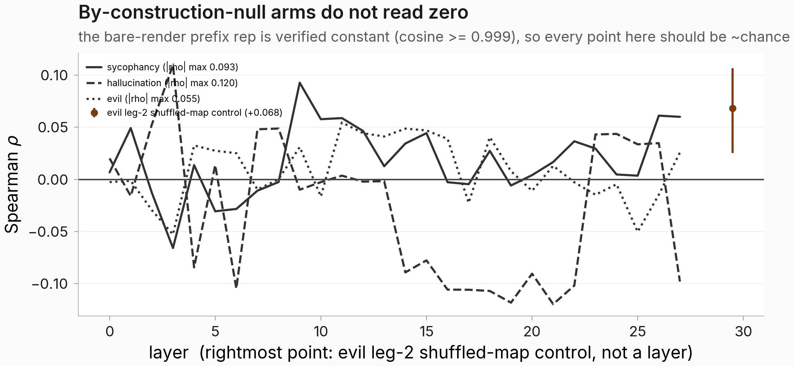

> (a) Evil's leg-2 **shuffled-map control reads +0.068 [+0.025, +0.107]** — a nonsense map clearing
> zero. (b) The leg-1 **prefix null probe** returns `verdict: ANOMALY` on all three behaviors. Its
> logic (`scripts/issue1739_bareq_score.py::_null_probe`) is: the bare render's prefix position is
> a constant vector, so its projection must be rank-degenerate and ρ must be NaN or bracket zero;
> the verdict is `degenerate-as-predicted` only when constancy holds **and** no CI excludes zero.
> Here constancy *passed* (`constant: true`, per-layer cosine ≥ 0.9999 early / 0.9991 flat) yet
> **all 28 layers returned finite ρ and at least one CI excluded zero**, with |ρ| reaching 0.093
> (sycophancy), 0.120 (hallucination) and 0.055 (evil). The scorer's own note is unambiguous: *"A
> non-chance read is a capture/indexing bug, not a finding."*
>
> Two things bound the flag without resolving it. **Scope:** the probe reads the *prefix* position,
> whereas every headline number above is on `bare_context_end`, which legitimately varies with the
> query — so the anomaly does not directly invalidate the headline reads. **Tolerance:** the
> constancy bars are bf16 padded-batch cosines, explicitly *"NOT exact equality"*, and the record
> shows `max_abs_dev_from_row0 = 2.375` — the reps are constant to that tolerance, not bit-identical,
> so residual structure exists that Spearman can rank. Whether that residual is sufficient to
> produce a CI-excluding-zero ρ at n ≈ 1,982, or whether there is a genuine capture/indexing
> defect, **is not resolved by these artifacts** — and both anomalies share the same shape
> (a by-construction null at |ρ| ≈ 0.07–0.12), so they plausibly share a cause. Note also that the
> diagnostic which would have investigated it never ran: the caller skips the prefix arm sweep
> whenever constancy is *verified*, and the "run the sweep as the anomaly diagnostic" branch fires
> only on a constancy *failure* — so this ANOMALY is recorded but undiagnosed.
>
> **The anomaly is directionally asymmetric, which matters for what survives it.** It cuts against
> any *positive* leg-2 claim, but it does not weaken this round's *negative* conclusion for evil:
> the real arms read negative (−0.067 and −0.081) while even the nonsense control reads positive
> (+0.068), so if the anomaly biases arms upward, evil's true bare-fit reads are if anything more
> negative than reported. In that direction the evil conclusion is conservative. Sycophancy's
> *positive* bare-over-full result is the one that most needs the anomaly resolved before it is
> quoted as an effect size.

Three further limitations of this round:

- **The multi-turn-only subset could not be computed, so the reported contrasts are lower bounds
  on the multi-turn effect.** 987 of the 2,000 eval contexts are single-turn, and for those the
  bare render *is* the original render — their predictor input is byte-identical in both
  conditions, so they contribute zero contrast by construction and dilute the pooled ρ. It follows
  that sycophancy's pooled **+0.078** bare-over-full advantage must originate *entirely* in the
  multi-turn rows, the only rows whose input changed at all. (Rank correlation over a pooled set is
  not additive across subsets, so the dilution argument gives the *direction* — the multi-turn-only
  effect should exceed +0.078 — without pinning the factor; it is not simply double.) The clean
  read would be the multi-turn subset alone, but this round persisted no
  per-context predictions: each `percell/bareq_leg1_transfer.jsonl` holds two aggregate records
  (coverage, null probe, the same six arm rows as the summary) and there is no `preds/` directory,
  unlike the main lane. Recovering the split needs a re-score, not a re-analysis.
  **RESOLVED 2026-08-02** — the re-score happened: the query-map ladder emits the subset rows for
  all three behaviors and persists `preds/`. Measured directly, sycophancy's map arm reads +0.280
  multi-turn vs +0.064 single-turn, confirming the dilution argument's direction; hallucination
  splits −0.168 / +0.154, a sign flip the pooled number hid. See § The query-map L-ladder is
  measured now.
- **Evil's leg 2 scores only on the WildChat rung.** Its own OOD rungs were skipped because the
  query bank was captured train-only, so none of the 2,387 eval-split contexts has a bare rep
  (`leg2_eval_block_notes`); re-capturing with all rungs would be needed.
- **The prefix-variant arm sweep is skipped on all three behaviors** as a degenerate null variant
  (`frozen_source: "n/a — degenerate null variant (arm sweep skipped)"`), so this round reports no
  prefix-render arm scores — only the null probe above.

One prior-work caveat carried verbatim from the round's own record
(`bareq_score_done.json`): *"#1092's 0.02 was bare->answer-ACTIVATIONS at SAE grain, so it is an
analogy, not a numerically comparable floor for bare->judged-DV."*

### A fourth evaluation column: random held-out WildChat

The three existing columns per behavior are a held-out slice of the behavior's own training
distribution plus two curated real OOD sets. This adds a fourth: **2,000 random WildChat
conversations**, conversation-disjoint from the map-training pool (held out by content hash of
prefix turns and query text against the #1092 pool, per
`eval_results/issue_1739/wildchat_rung/contexts/wcrung_digest.json`). It is the only column with
no behavior-eliciting selection at all — ordinary user traffic — so it asks whether any of these
methods rank *naturally occurring* behavior.

What is plotted: Spearman ρ between each arm's prediction and the judged expression on the
WildChat rung, one bar per arm, per behavior, per input state; error bars are the 95% bootstrap
CI over contexts carried in each row's `ci_frozen`, drawn as non-negative offsets. Provenance:
**one shared on-policy rollout pool** — 5 sampled rollouts per context, 10,000 rollouts total —
generated once from Qwen-2.5-7B-Instruct and then judged under all three trait rubrics (the
WildChat contexts carry no behavior conditioning, so per-behavior generation would produce
byte-identical rollouts); judge `claude-sonnet-4-5-20250929`, 3 draws at temperature 1.0,
`max_tokens` 400 with an 800-token re-judge of truncation-affected items; graded 0–100 trait
score. Each arm's layer is **frozen from the main lane** (the modal frozen layer of that arm's
committed train cells — `frozen_source` in the per-layer rows), so no layer is selected on this
rung; single judge draw index, labeled readouts applied at the full label budget.

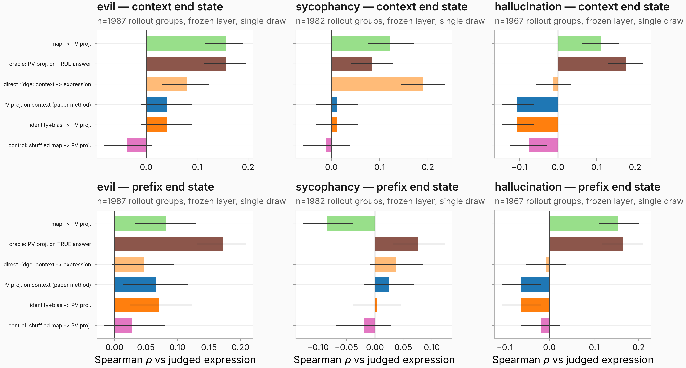

> **On the context end state the map arm is the best feasible method on two of three behaviors,
> and it is the only feasible method whose CI excludes zero on all three** (direct ridge fails
> that on hallucination; the oracle also clears it everywhere but needs the answer already
> generated, so it is not a deployable comparison). Evil: map → PV proj.
> **+0.157** [+0.116, +0.190] — statistically indistinguishable from the oracle (+0.156
> [+0.112, +0.196]) and roughly double direct ridge (+0.081), with Persona Vectors' own
> context projection at +0.042 [−0.010, +0.090] (CI spans zero) and the shuffled-map control at
> −0.037. Hallucination: map → PV proj. **+0.111** [+0.062, +0.157] vs direct ridge −0.013 and
> PV-on-context **−0.107** [−0.147, −0.062] — the paper's method is *significantly
> anti-correlated* with natural fabrication here, while the oracle reaches +0.178. Sycophancy is
> the exception: direct ridge wins (**+0.190** [+0.145, +0.235]) ahead of map → PV proj. (+0.122
> [+0.075, +0.172]), and both beat the oracle projection (+0.084) — i.e. the labeled readout
> extracts more than this persona vector carries even from the true answer state.
>
> **On the prefix end state the picture splits by behavior.** For hallucination the map arm reads
> at least as high from the pre-query prefix alone as from the full context (+0.155
> [+0.111, +0.200] at frozen layer 3 vs +0.111 [+0.062, +0.157] at layer 23 — overlapping CIs).
> That deserves scepticism rather than celebration: 49.4% of these contexts are single-turn, so
> for half of them the "prefix" is the bare chat-template head and can carry no
> conversation-specific information at all. Either the multi-turn half carries an unusually strong
> signal or the layer-3 read is picking up something query-independent; this is flagged for a
> targeted follow-up, not counted as a finding. Evil drops to +0.082 (oracle +0.172). Sycophancy's
> prefix map arm goes **negative** (−0.085) at frozen layer 0 — the same degenerate layer-0
> selection that produces the excluded cells in the nonlinear comparison below, so treat it as a
> broken read rather than a negative finding.
>
> Disclosures that bound this column. (a) **Evil's DV is floored on this rung** — mean 0.42, sd
> 4.43 on 0–100, with 1,966 of 1,987 contexts in the 0–10 bin (`spread/evil.json`): ordinary
> WildChat traffic essentially never elicits evil from an aligned model. The evil column is
> therefore *motivation-confirming* (the map arm ranks the thin upper tail) and NOT a ranking
> read; the usable spread is sycophancy (mean 17.8, sd 23.3) and hallucination (mean 39.6,
> sd 32.2). (b) **Hallucination uses the trait rubric, not the fabrication-rate construct** —
> WildChat queries carry no reference answers, so `dv_construct` is
> `trait_rubric_graded_0_100` for all three behaviors; the hallucination number here is not
> comparable to the TriviaQA/NQ-Open/SimpleQA fabrication rates in `## Results`. (c) **Judge
> content-drop rates differ sharply by behavior**: 567/30,000 draws for evil (1.9%), 2,624 (8.7%)
> for sycophancy, and **10,967 (36.6%) for hallucination** (`wcrung_score_done.json`; 4/139/1,354
> respectively recovered by the 800-token re-judge). Transport losses were zero for all three.
> The hallucination drop rate is high enough that its column should be read as provisional. (d)
> **987 of 2,000 contexts (49.4%) are single-turn**, so for those the "prefix" degenerates to the
> bare chat template head — the prefix panels average a genuine prefix over half the contexts
> with an empty one over the other half. (e) 19 of the sampled units were dropped for a duplicate
> final query within the sample; 13/18/33 contexts per behavior have no DV after judge drops
> (n = 1,987 / 1,982 / 1,967 of 2,000). (f) **There is no permutation null on this rung** — the
> `nulls` array is empty — so the shuffled-map arm is the only null reference, and it is a single
> draw, not a distribution. (g) Rollouts were capped at the shared 1024-token generation limit
> (`GEN_MAX_NEW_TOKENS`, `src/explore_persona_space/experiments/issue_1739/generation.py:48`),
> code-identical to the main labeling generation; a truncation rate of 1,955/10,000 (19.6%) was
> reported by the generation phase but **is not recorded in any committed or HF-resident artifact
> I could read, so treat that figure as unverified**.

The low-level companion view — ρ across all 28 layers for every arm, with the frozen layer
marked — shows the frozen-layer choices are not knife-edge picks on this rung:

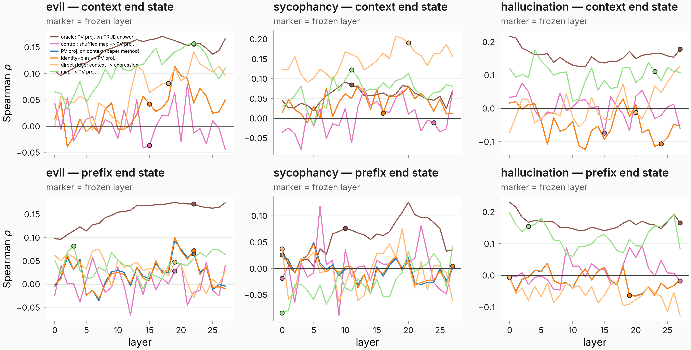

> The map arm's advantage on evil and hallucination holds across a broad band of mid-to-late
> layers rather than at one lucky layer, and the hallucination PV-on-context curve is negative
> across most of the depth — the anti-correlation above is not a frozen-layer artifact. Evil's
> oracle prefix curve rises smoothly with depth, the expected shape for a direction read off a
> true answer state.

### Nonlinear maps do not beat the linear map (round B)

The central question of round B: the context→answer map has been a **linear ridge** throughout;
does a nonlinear map buy transfer? Two replacements were run — an **MLP map** and a
**kernel-ridge map** — on all three behaviors, re-running only the three map-consuming arms
(map → PV proj., map → ridge on predicted answers, map → ridge trained on real answers) so every
other arm is held fixed.

What is plotted: the **matched** difference in Spearman ρ, nonlinear minus linear, median over
every design cell present in both lanes at the same (arm, input state, extraction regime, U rung,
label budget L, evaluation rung); error bars are the 95% bootstrap CI of that median across
matched cells. Each cell's value is the mean over its (seed, draw) replicates — 2 seeds × 3 draws
in the nonlinear lanes. **Note the y scales differ per panel**: evil's prefix kernel cell is a
≈ −0.5 outlier that would otherwise flatten the other five panels.

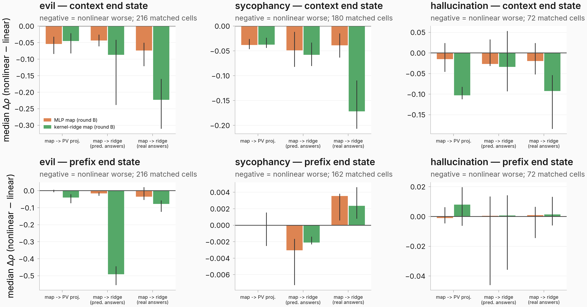

> **Both nonlinear maps are worse than the linear map, and the kernel map is worse than the
> MLP.** Pooled over all matched cells: MLP median Δρ **−0.015** [−0.019, −0.010] across 456
> cells, better than linear in only 29.8% of them; kernel-ridge median Δρ **−0.038**
> [−0.044, −0.029] across 462 cells, better in 23.6%. Every context-end panel is negative with a
> CI excluding zero — hallucination kernel −0.092, evil kernel −0.083, evil MLP −0.054,
> sycophancy kernel −0.045, sycophancy MLP −0.038, hallucination MLP −0.021. On the prefix end
> state the sycophancy and hallucination deltas are effectively zero (median |Δρ| ≤ 0.007), which
> is consistent with those prefix arms carrying almost no signal for either map family rather
> than with nonlinearity helping there.
>
> At the operating slice (E1 persona vector, U = 18,793 pairs, L = max, context end state,
> held-out train distribution) the absolute cost is large: evil map → PV proj. 0.525 linear →
> 0.405 MLP → 0.277 kernel; sycophancy 0.359 → 0.330 → 0.303; hallucination 0.145 → 0.125 →
> 0.036. It persists under distribution shift, where a nonlinear map would have had the best case
> for helping: evil ToxicChat 0.319 → 0.211 → 0.018; hallucination SimpleQA 0.270 → 0.224 →
> −0.010. Sycophancy's AITA rung is the one near-tie (0.351 → 0.346 → 0.341).
>
> Caveats. The nonlinear lanes ran **2 seeds × 3 draws** per cell against the linear lane's larger
> replicate set (15 replicates at the operating slice), so the matched comparison averages
> unequal replicate counts; the projection arms are deterministic given the map (replicate sd
> 0.000), so the error bars above come from spread *across design cells*, not across seeds. The
> hallucination nonlinear lanes cover the **E1 regime only** (72 matched cells vs 216 for evil).
> On sycophancy, 159 arm-rows in the linear lane and 48 in the MLP lane are non-finite (the
> kernel lane has none) — all of them the `map → PV proj.` prefix arm at frozen layer 0, with no
> evaluable pairs. They are excluded rather than coerced, which is why the sycophancy prefix
> panels report 78 (MLP) and 84 (kernel) matched cells against 90 for the context end state.

Per-cell view behind that median — every matched cell, linear ρ on the x axis against nonlinear ρ
on the y, with the y = x line:

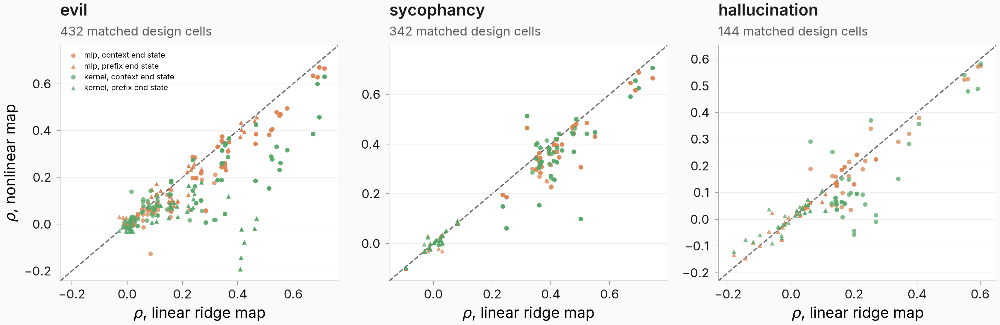

> The mass sits below the diagonal in all three behaviors, and the shortfall grows with the
> linear map's own ρ — i.e. nonlinearity costs most exactly where the linear map works best. The
> handful of cells above the diagonal are concentrated at low ρ (near-zero cells where both maps
> are uninformative), so no subregion of the design favours a nonlinear map.

### Unlabeled behavior-eliciting map data: the evil gain does not replicate

The evil compose cells (context, previously reported below) found that replacing half a
fixed-size map-training pool with *unlabeled* behavior-eliciting contexts lifted the projection
arm from 0.36 to 0.56. These are the matching cells for sycophancy and hallucination.

What is plotted: Spearman ρ at a **fixed 5,000-pair map-training budget**, all-generic WildChat
pool (grey) against half-generic/half-behavior-eliciting (red), per arm and label budget L,
context end state, held-out train distribution.

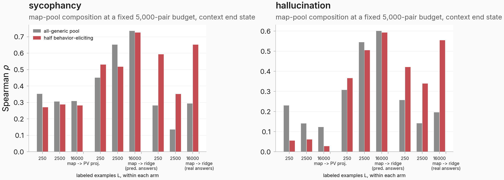

> **For the projection arm the effect reverses on both new behaviors.** Sycophancy map → PV
> proj. falls 0.353 → 0.271 at L=250, 0.306 → 0.288 at L=2,500, 0.309 → 0.282 at L=16,000;
> hallucination falls much harder — 0.230 → 0.056, 0.141 → 0.062, 0.124 → 0.028. So the evil
> result is not a general property of eliciting map data: for the label-free projection read,
> swapping generic user traffic for behavior-eliciting contexts *hurt* in 6 of 6 new cells.
>
> **The labeled readout trained on real answer states moves the other way, strongly.** Arm
> `map → ridge (real answers)` gains on every cell of both behaviors: sycophancy 0.282 → 0.593
> (L=250), 0.136 → 0.351 (L=2,500), 0.294 → 0.652 (L=16,000); hallucination 0.257 → 0.422,
> 0.142 → 0.339, 0.196 → 0.554. The middle arm (`map → ridge` on *predicted* answers) is mixed
> and small (sycophancy +0.079 at L=250, −0.135 at L=2,500, −0.010 at L=16,000). Read together,
> eliciting map data appears to help a readout that must generalize from true answer states while
> hurting a fixed direction's projection — a per-arm effect, not a map-quality effect.
>
> Caveats, and they are heavy. These are **single-cell reads (1 seed × 1 draw)**, so no error
> bars are available and the L=2,500 non-monotonicity flagged elsewhere in this doc applies here
> too. The half-eliciting bar **pools the two label-composition variants** (f_l = 0.0 and
> f_l = 1.0) where both exist — they agree closely (e.g. sycophancy arm 6 at L=250: 0.267 and
> 0.274), but it is an average of two conditions, not one. **This lane has no shuffled-map
> control**, so the within-arm map-vs-control contrast that made the evil compose read
> trustworthy is unavailable here; per-arm shifts could still partly reflect per-cell layer
> re-freezing. The prefix-end compose cells are near-inert (4 of 9 sycophancy and 0 of 9
> hallucination cells are numerically identical across pool compositions), consistent with the
> prefix arms carrying little composition-sensitive signal.

### Naturalistic persona-vector extraction regimes: sycophancy replicates, hallucination fails

> **SUPERSEDED 2026-08-01 — read § The naturalistic-PV reads move when computed in the space the
> map lives in instead.** Every number in this section is a **raw-activation-space** read, which
> applied a whitened-fit map to un-whitened activations. The whitened recomputation changes the
> headline (sycophancy map(context) → PV proj. at E2p: 0.577 → **0.486**) and removes the
> "E2p is top for every read" ordering. The prose below is kept for the record only; do not
> quote its numbers.

The three extraction regimes — **E1** paper-faithful synthetic, **E2** matched-pair natural,
**E2p** pooled natural — were previously read on evil only. This extends them to sycophancy and
hallucination, across every projection read (context state, prefix state, map-predicted answer
from either input state, and the true answer state).

What is plotted: Spearman ρ at each read's frozen layer, one panel per (behavior, evaluation
rung), one bar per extraction regime. The frozen layer is chosen by **max |ρ| on the train rung**,
so the sign is not pinned by the selection. Faded bars mark cells where the extraction pool
overlaps the evaluation rung (E2 and E2p are in-sample on the train rung) — read the
out-of-sample rungs (AITA for sycophancy; NQ-Open and SimpleQA for hallucination) as the
evidence-bearing ones.

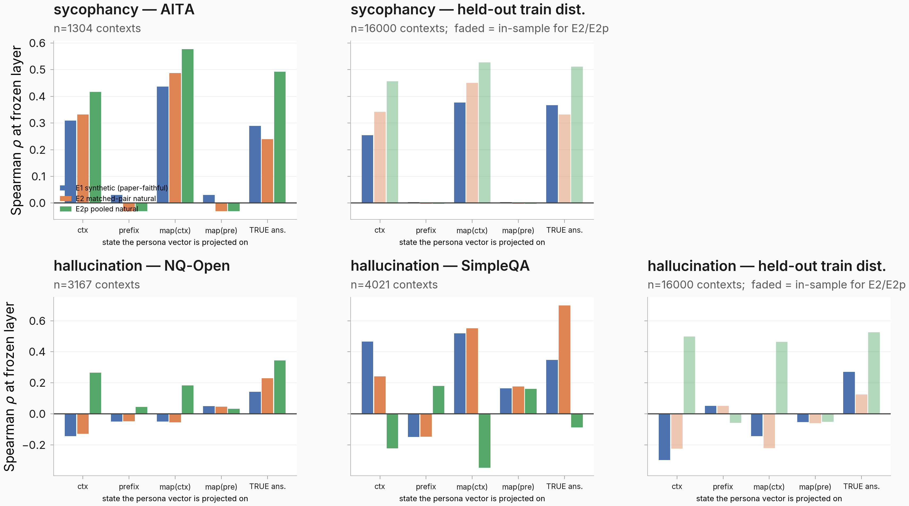

> **Sycophancy replicates evil's headline ordering and yields the best sycophancy predictor
> measured so far.** On the out-of-sample AITA rung, pooled-natural E2p is top for every read:
> map(context) → PV proj. **0.577** (vs 0.487 E2, 0.436 E1), context projection 0.416 (vs 0.332,
> 0.309), true-answer projection 0.492 (vs 0.240, 0.289). The E2p-on-top part of the evil result
> therefore carries over; the E1-vs-E2 order does **not** — evil had synthetic ahead of
> matched-pair, sycophancy has matched-pair ahead of synthetic — so "natural beats synthetic" is
> the robust half of that finding, not the full ranking. Note also that map(context) beats the
> context projection in every sycophancy regime, and at E2p it beats even the true-answer
> projection (0.577 vs 0.492).
>
> **Hallucination's regime ladder is sign-unstable, which reads as a persona-vector construct
> failure rather than a ranking.** For the same read and regime, ρ flips sign across evaluation
> rungs: context projection at E1 gives −0.144 (NQ-Open), +0.465 (SimpleQA), −0.299 (train);
> map(context) at E2 gives −0.055, +0.551, −0.221. **Thirteen of the fifteen** (read × regime)
> combinations are not sign-consistent across its three rungs; only the true-answer projection at
> E1 and E2 holds one sign. For contrast, all 15 sycophancy combinations are sign-consistent —
> though across only 2 rungs, so that is a weaker test. A direction whose correlation flips sign
> between two OOD sets is not measuring a stable trait, and this is consistent with the previously
> reported finding that the hallucination persona vector reaches only ρ ≈ 0.04 even projected on
> the true answer state.
>
> Caveats. The prefix reads are degenerate for sycophancy — every regime sits at frozen layer 0
> with |ρ| ≈ 0.031 and the sign flipping between E1 and E2/E2p, i.e. the same direction up to
> sign, so the prefix rows carry no regime information. E2 and E2p are in-sample on the train
> rung by construction, so their train-rung bars are upward-biased and are faded in the figure.
> Layer selection by max |ρ| on the train rung means a negative-ρ direction can be frozen, which
> is part of why the hallucination signs move.

## Results

*(evil + hallucination; context, previously reported — the sections above carry what is new)*

### Spread of behavior expression per evaluation setting

What is plotted: per-context judged expression (evil: mean 0–100 score over 5 on-policy rollouts × 3 judge draws; hallucination: fabrication rate over 5 rollouts), one histogram per evaluation setting.

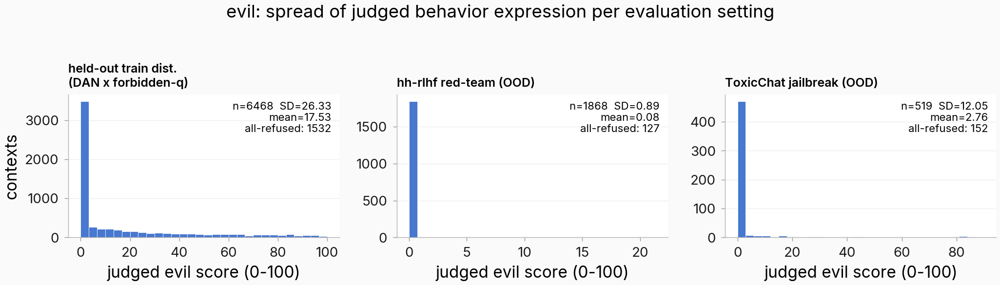

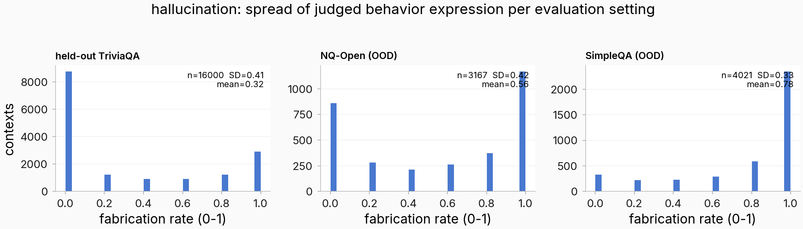

> All hallucination settings have usable spread (SD 0.33–0.42 on 0–1), as does the evil train setting (SD 26.3 on 0–100). **The evil hh-rlhf rung fails the pre-registered spread floor** (mean 0.08, SD 0.89 on 0–100 — Qwen-2.5-7B refuses essentially all 2022-era red-team attempts), so hh-rlhf comparisons below are floor-censored and uninformative. **CORRECTED 2026-08-01: evil's ToxicChat rung also fails the gate.** The pre-registered gate is two conditions — SD ≥ 10 *and* < 80% of contexts in the bottom [0, 10) bin — and ToxicChat clears the SD condition (12.07) while putting 93.4% of its 519 contexts in the bottom bin. The sentence this replaces checked only the SD condition. ToxicChat's arm ordering remains well-behaved, so the cell is caveated rather than discarded; see § Spread per evaluation setting for the full per-setting decomposition. Evil scores are additionally refusal-censored: 1,532 train / 127 hh-rlhf / 152 ToxicChat contexts have no DV because all rollouts refused.

### Main comparison: ρ per method, per behavior, per evaluation setting

What is plotted: Spearman ρ between each method's prediction and judged expression, at the largest budgets (U = 18,793 unlabeled pairs; L = 8,000 evil / 16,000 hallucination labels; E1 persona vector; full-context end state). Only 6 arms were evaluated on the OOD sets (label-free projections + direct ridge + oracle projection + shuffled-map control). All arms in a panel are scored against the same judged targets.

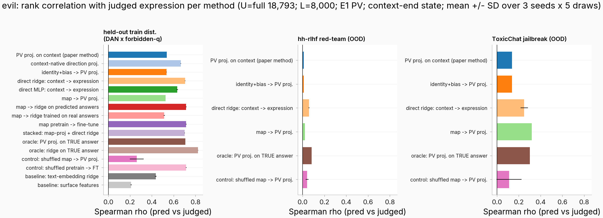

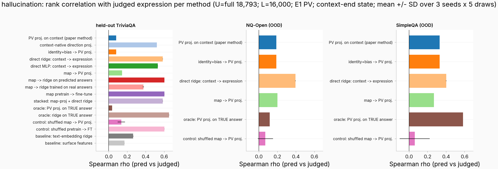

> **In-distribution, map→PV projection does not beat context-side methods.** Evil: map→PV 0.53 vs context-native direction 0.66, direct ridge 0.71, oracle regression 0.82. Hallucination: map→PV 0.15 vs context-native 0.52, direct ridge 0.58, oracle regression 0.65. The pre-registered headline contrast (map→PV minus context-native projection) is negative — evil: median Δρ = −0.30 across all 826 cells, bootstrap CI below 0 in 708/826; hallucination: median Δρ = −0.07 (137/270 below, 18 above).
>
> **The hallucination persona vector, not the map, is the broken link:** even projected on the TRUE answer state (oracle), the hallucination PV reaches only ρ = 0.04 on held-out TriviaQA — while a regression on the same true answer states reaches 0.65. The synthetic hallucination direction barely tracks natural fabrication. For evil the PV direction is genuine (oracle projection 0.71).
>
> **Map→ridge-on-predicted-answers matches or slightly beats direct ridge** (evil 0.714 vs 0.706; hallucination 0.602 vs 0.584) — but the shuffled-pretrain control reaches the same value (0.714 / 0.601), so at large L the labeled readout, not the map, is doing the work.
>
> **Under real distribution shift the label-free map arm's advantage is label-budget-dependent: it leads at small L and loses at maximum L on 2 of 3 usable OOD settings.** *(CORRECTED 2026-08-01 — the sentence this replaces read "the most robust feasible method on 2 of 3 usable OOD settings" and supported it with "SimpleQA: map→PV 0.27 vs direct ridge 0.10", which compared the map arm at maximum L against direct ridge at L=250. See § Corrections.)* At the **maximum** budget of this section's stated slice: ToxicChat (evil) map→PV **0.319** vs direct ridge 0.250, PV-on-context 0.137, shuffled-map control 0.111, oracle projection 0.302 — the map arm wins and matches the oracle; NQ-Open direct ridge **0.395** vs map→PV 0.200; SimpleQA direct ridge **0.402** vs map→PV 0.270. So 1 of 3 at maximum L. At **L=250** the picture inverts: ToxicChat 0.270 vs 0.099 and SimpleQA 0.227 vs 0.103 both go to the map arm, NQ-Open 0.164 vs 0.231 to direct ridge — 2 of 3. Where predictions have to transfer *and labels are scarce*, mapping into answer space before projecting helps; with abundant labels the direct readout catches up and passes it. Direct ridge's maximum-L values are partly a recovery from the L=2,500 dip flagged below (SimpleQA 0.103 → 0.110 → 0.402; NQ-Open 0.231 → 0.127 → 0.395), which is unexplained and makes its maximum-L level less trustworthy than the map arm's flat curve.

### Scaling: unlabeled map pairs (U) and labeled examples (L)

What is plotted: left — map-based arms vs U at L=max on the held-out train setting (context-native projection shown as a U-free reference line); middle — label-budget scaling at U=full, same setting; right — label-budget scaling on the OOD setting (6-arm transfer roster; note the hh-rlhf panel for evil is floor-censored per the spread section).

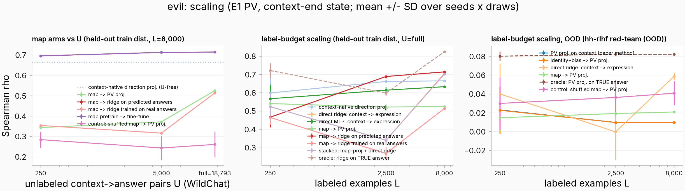

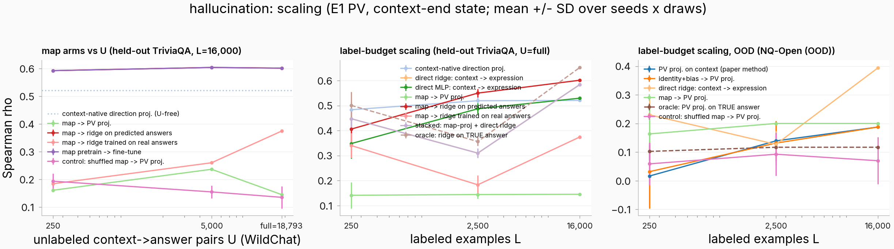

> **The map does learn transferable structure from unlabeled pairs:** map→PV improves with U (evil train 0.34 → 0.53 from 250 → 18,793 pairs; hallucination SimpleQA 0.06 → 0.27) while the shuffled-map control stays flat (≈0.26 / ≈0), and map→ridge-on-real-answers gains +0.16–0.19 from U. But **no in-distribution sample-efficiency advantage materialized:** at L=250 the map arms do not beat direct ridge (evil 0.47 vs 0.52; hallucination 0.41 vs 0.45), and map-pretrain→fine-tune is indistinguishable from the shuffled-pretrain control at every L (e.g. evil L=250: 0.472 vs 0.467). The OOD panels show the map arm's flat-but-highest curves on ToxicChat at all L (0.27–0.32 vs ridge ≤ 0.25).
>
> Unexplained interim pattern flagged for the analyzer pass: several labeled arms (direct ridge, stacked, oracle regression) are non-monotone in L with a dip at L=2,500 in both behaviors (e.g. evil ridge 0.52 → 0.34 → 0.71) — a mid-budget fitting artifact (regularization/layer-selection instability) is suspected; low-L numbers above should be read with this in mind.

### Prefix-end vs full-context-end input state

What is plotted: paired bars per method, full-context end state (solid) vs pre-query prefix end state (hatched), held-out train setting, largest budgets.

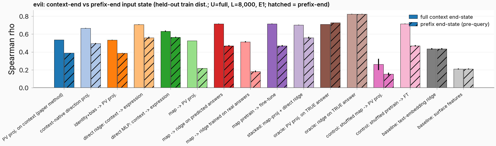

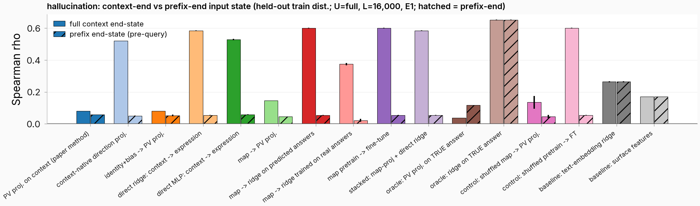

> Evil retains most signal from the prefix state (direct ridge 0.56 vs 0.71; the DAN persona prefix carries the elicitation). Hallucination collapses to ρ ≈ 0.05 for every context-dependent arm — expected, since bare trivia questions have essentially no pre-query prefix; consistent with the #1092/#1774 finding that the pre-query prefix state carries only persona-average signal.

### Predicted vs judged expression (scatter, per method)

What is plotted: OOF predictions vs judged expression for one representative max-budget cell (seed 0, draw 0), held-out train setting; ≤1,500 points per panel; per-panel ρ over all contexts. Per-cell prediction arrays were persisted only for the train setting, so OOD scatters are not available in this interim cut.

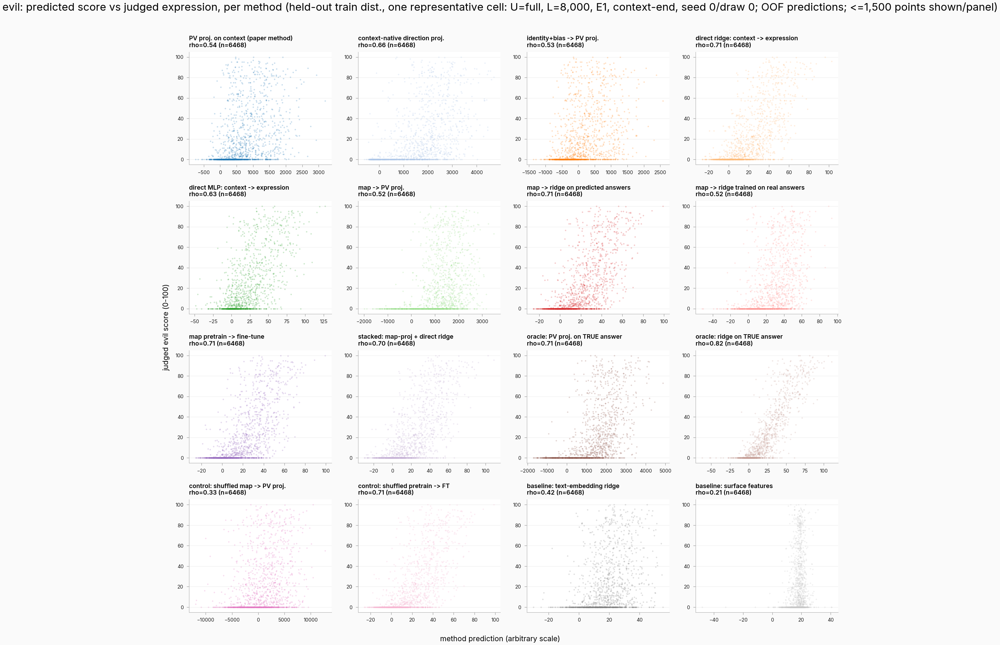

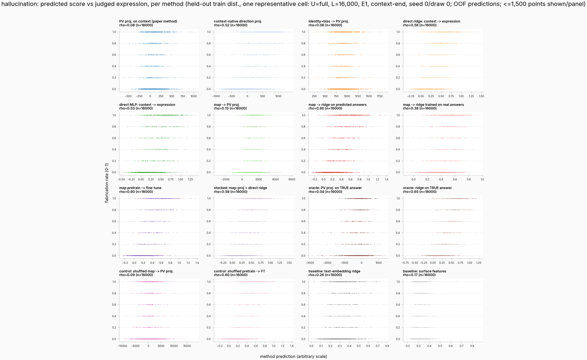

> The evil panels show the fan shape typical of a refusal floor (most contexts at score 0 at every prediction level; signal comes from the upper envelope). The hallucination DV is discrete (rate over 5 rollouts → bands at 0, 0.2, …, 1.0); the PV-projection panels (paper method, oracle projection) are visibly unstructured, matching their ρ ≈ 0.04–0.08.

### Persona-vector extraction regime (evil)

What is plotted: ρ for the three PV-dependent arms under E1 (synthetic, paper-faithful), E2 (matched-pair natural), E2p (pooled natural), held-out train setting, largest budgets.

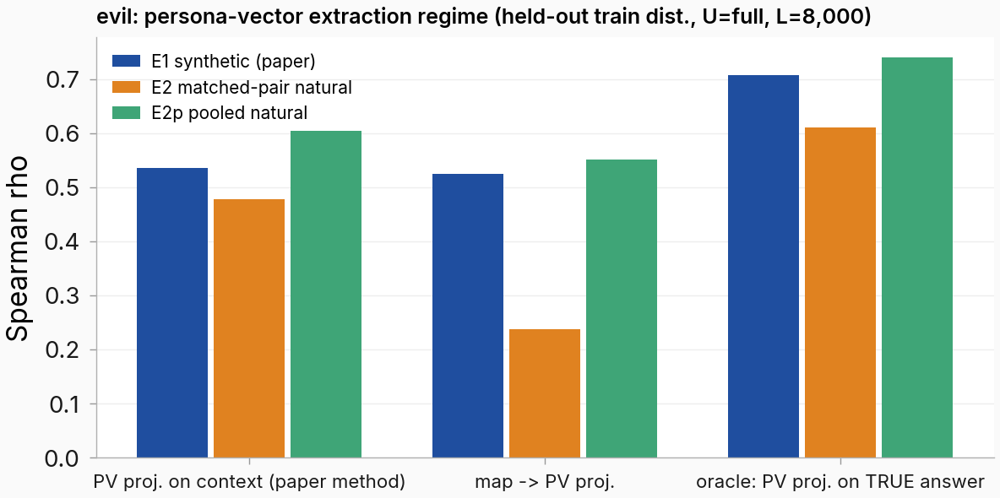

> Pooled-natural (E2p) beats synthetic (E1) beats matched-pair (E2) for every projection arm (map→PV: 0.55 / 0.53 / 0.24). The topic-controlled matched-pair direction — the one construction that cancels topic — is much weaker, suggesting a substantial share of projection performance rides on topic rather than disposition.

### The persona-vectors synthetic eval inflates projection numbers (added 2026-07-30 evening)

What is plotted: Spearman ρ per method on Persona Vectors' own eval distribution (their 5 positive + 5 negative instruction system prompts × 20 held-out eval questions = 200 contexts/behavior; on-policy K=5 rollouts; our standard judge, PV per-trait rubric) as the red bars, next to the committed real-rung values (op-slice means) — same arms, same frozen-layer convention, transfer-applied readouts.

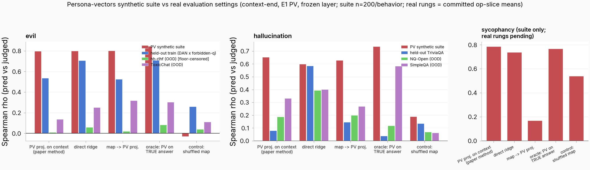

> The paper's method gains **+0.26 (evil) to +0.57 (hallucination) ρ** moving from real data to its own suite (evil 0.80 vs 0.54 train / 0.14 ToxicChat; hallucination 0.65 vs 0.08 TriviaQA). On evil, every projection method converges to ~0.80 on the suite — pos/neg-instruction separability saturates and method ranking disappears. Sharpest evidence that the suite measures *instructed-behavior separability* rather than natural elicitation: the hallucination PV direction, near-useless on natural data even with oracle answer states (0.04), reads 0.65–0.74 on the suite; and on sycophancy a **shuffled-map control scores ρ = 0.54** — a nonsense direction separates their prompt structure before any method quality enters. Caveats: the hallucination suite column uses the trait rubric (their questions carry no reference answers; not the fabrication-rate construct; 23.4% judge content-drops, ~half unrecovered at the 800-token re-judge); sycophancy's suite spread is compressed (SD 20, max 85) and its real rungs land when the main lane finishes; prefix-arm rows exist but the suite has only 10 distinct prefix states, so those ρ are rank-tie-dominated. Artifacts: `eval_results/issue_1739/pvsynth/` @ `34c041409d`.

### Unlabeled behavior-eliciting data substitutes for labels (composition factor, evil)

No figure yet (analyzer pass will render one); numbers from the committed compose cells (U = 5,000 total, E1, context-end, held-out train dist.; small cells — ~1 seed × 2 draws): replacing half the generic WildChat map pool with 2,500 *unlabeled* behavior-eliciting contexts (disjoint from the labeled set) lifts map→PV projection from **0.36 to 0.56** — more than the full 18,793-pair all-generic pool achieves (0.53) — while the shuffled-map control moves the other way (0.32→0.27 at L=250; 0.28→0.10 at L=2,500). Map-based labeled readouts gain only at low label budgets (map→ridge-on-predicted 0.29→0.44 at L=250; ≈unchanged at L=2,500). Two flags: arms that consume no unlabeled data also shift between compose cells (suspected per-cell layer re-freezing — the within-arm map-vs-control contrast is the trustworthy read), and this result is in tension with #779's "trait-trained map is worse" (fixed-budget replacement vs full substitution, and real DAN prefixes vs #779's corpora, are the reconciliation candidates).

### A ~1M-context generic map beats the in-experiment map on 2 of 3 behaviors (frozen reuse of #779's maps)

What is plotted (committed by the reuse round): ρ of #779's 963,444-context maps (ridge + MLP w8192/w32768, applied frozen through #779's own code; layers {14, 19, 26}) vs the in-experiment 18.8k-pair map and a shuffled control, recomputed matched-target in one process on the same contexts/DV/direction.

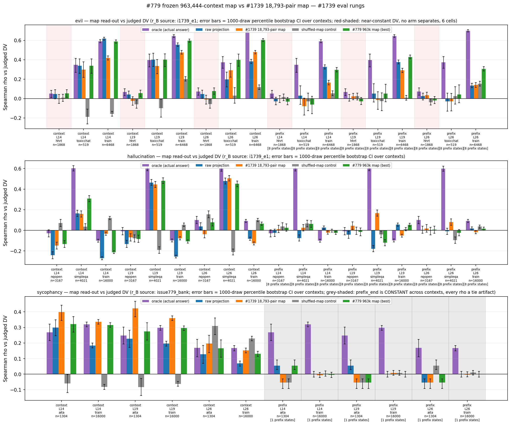

> The 963k map transfers genuinely (reconstructs this experiment's answer states at cosine 0.92–0.99, held-out R² 0.22–0.62 on corpora it never saw) and **wins 9/9 evil cells** (+0.04..+0.17; best-layer ρ 0.60 vs oracle 0.64) and 6/9 hallucination cells (losses only where the rung's own oracle ≈ 0), but **loses all 6 sycophancy cells** — where the in-experiment map's projection on the AITA rung (0.40) even exceeds the oracle projection (0.27). Caveats: the in-experiment-map comparison column applies the *uploaded* map payload (a faithful application, but not a verified reproduction of the committed arm-6 numbers — oracle anchor validated 10/10, arm-6 anchor looser), and that payload extrapolates with strongly negative reconstruction R² onto the behavior eval distributions (a distribution-coverage finding, not a serialization bug — the payload round-trips cleanly on its own distribution). Artifacts: `eval_results/issue_1739/map963k_reuse/` @ `606278aa38`.

### Reversed train/eval direction (evil, secondary config)

Training the labeled readouts on hh-rlhf red-team dialogues and evaluating on DAN×forbidden (90 cells, the pre-registered secondary) collapses every method to ρ ≤ 0.23, including both oracles (oracle regression 0.19, oracle projection 0.23). With the training side floor-censored (the spread failure above), little transfers in this direction; the A−B mechanism-match comparison the plan wanted is compromised by that censoring.

## Interim takeaways (2026-08-01, pre-analyzer)

These fold the grid-fill families in § New in this update (2026-08-01). The 2026-07-31 takeaways
follow in the next block with corrections marked, and the 2026-07-30 ones after that.

1. **The map's clearest win is as a preprocessing step for a labeled readout, not as a way to
   use a persona vector.** On ordinary WildChat traffic, running the labeled ridge on the
   map's *predicted answer state* beats running it on the context for all three behaviors —
   sycophancy +0.332 vs +0.190 and hallucination +0.080 vs −0.013 with non-overlapping bootstrap
   CIs, evil +0.127 vs +0.081 directionally. Same labels, same activations, the only difference
   is passing the state through the map. This supersedes the previous cut's framing that
   sycophancy is a counterexample: sycophancy is a counterexample to the *projection* arm, not
   to the map.
2. **The persona-vectors synthetic suite cannot rank methods, and now we can say exactly why.**
   Scoring within one instruction polarity collapses every arm: sycophancy's paper method goes
   +0.786 pooled → +0.430 / +0.110 within halves, and its nonsense-map control +0.539 → +0.288 /
   +0.047. Evil's negative half has zero DV variance — all 100 contexts score 0 — so its pooled
   ρ ≈ 0.80 *is* the instructed-vs-not separation with nothing else in it.
3. **Extraction from natural data helps the map and true-answer reads, not the plain context
   projection** — and the best sycophancy number is lower than published. In the whitened space
   the map actually lives in, pooled-natural E2p leads for map(context) → PV proj. (**0.486**,
   down from the raw 0.577) and for the true-answer projection (0.454), but E1 synthetic leads
   for the plain context projection (0.332 vs 0.310). "E2p is top for every read" does not
   survive the correction. Note 0.486 is the top of the *projection* ladder, not of sycophancy
   overall — the labeled readouts reach ~0.73 on the same rung.
4. **Evil is the only behavior that cannot be measured on generic chat.** Decomposing the
   pre-registered spread gate per evaluation setting: all three behaviors pass pooled, but evil
   fails on hh-rlhf, random WildChat, *and* ToxicChat (93.4% bottom-bin), clearing only its own
   training distribution and the synthetic suite. On that same random-WildChat rung hallucination
   clears both conditions comfortably (SD 32.2, 26% bottom-bin) and sycophancy's spread is the
   widest of its four settings (SD 23.3).
5. **One of the bare-query round's two null anomalies is draw variance; the other survives three
   ruled-out mechanisms.** An 8-seed shuffle band centres the leg-2 nonsense-map control on
   +0.003 (range [−0.077, +0.068]), so the committed +0.068 was one noisy draw. The leg-1 prefix
   null probe still returns `ANOMALY` on all three behaviors, and its mechanism ladder — which
   landed on 2026-08-02 — returns `unexplained` after excluding DV-permutation miscalibration,
   the capture-source split, and batch-order structure. A capture/indexing defect is the leading
   unexcluded hypothesis; evil's read is borderline against the permutation band, sycophancy's
   and hallucination's are clearly outside it.
6. **The map is discriminative even where its R² is modest.** On the bare-rep → answer fit, the
   standing baselines give held-out R² ≤ +0.172 for the fitted map but kNN retrieval acc@1 of
   0.039 against 0.00078 chance (≈50×), while identity+learned-bias is negative at every layer.
   R² understates this map — the same direction as #779, the opposite of #722.
7. **Two published numbers were wrong and are corrected.** The OOD headline "map arm is most
   robust on 2 of 3 settings" rested on a budget-mismatched comparison (map at maximum L vs
   direct ridge at L=250); at matched maximum budget the map arm wins 1 of 3, and the honest
   claim is that its advantage is **label-budget-dependent** — 2 of 3 at L=250, 1 of 3 at
   maximum L. And "the evil train/ToxicChat settings have usable spread" checked only the SD
   half of the two-part gate.

## Carried forward from the 2026-07-31 cut — context, previously reported

1. **Whether the bare user query predicts a behavior localizes that behavior's predictive
   variance.** Stripping the prefix and showing the predictor only the query *raises* sycophancy
   (map → PV proj. +0.122 → +0.200), *flips the sign* on hallucination (+0.111 → −0.065), and
   *destroys* evil (+0.157 full-context → −0.067 on a dedicated bare fit). Sycophancy is a
   property of what the user asks; hallucination and evil are properties of the surrounding
   context. **Caveat before use:** this round carries an unresolved anomaly — two
   by-construction-null arms read |ρ| ≈ 0.07–0.12 where they must read chance — and its
   single-turn half (987/2,000 contexts) dilutes the pooled contrast, so the effects above are
   directional lower bounds, not settled effect sizes. **PARTLY RESOLVED 2026-08-01:** the
   shuffled-map half of the anomaly is draw variance (8-seed band mean +0.003); the prefix
   null probe is still unexplained; and the turn split, now computable for evil, went the
   *opposite* way — evil's single-turn subset is the more negative one (−0.090) and its
   multi-turn CI spans zero. See the 2026-08-01 takeaway 5.
2. **Nonlinearity in the map is not the missing ingredient.** An MLP map and a kernel-ridge map
   both lose to the linear ridge map on all three behaviors (pooled median Δρ −0.015 and −0.038;
   better in only 30% and 24% of matched cells), and lose most exactly where the linear map works
   best. Round B's question is answered negatively; the linear map stays the operating choice.
3. **On ordinary user traffic the map arm is the best feasible predictor for evil and
   hallucination.** On the new random-WildChat column the map → PV projection matches the oracle
   on evil (+0.157 vs +0.156) and reaches +0.111 on hallucination where Persona Vectors' own
   context projection is significantly *negative* (−0.107) — the strongest evidence yet that
   mapping into answer space before projecting recovers signal the context-side projection
   cannot. Sycophancy is the counterexample (direct ridge +0.190 leads). **SUPERSEDED
   2026-08-01:** the roster was widened and the map family's *labeled* arms lead on sycophancy
   too (map → ridge on predicted answers +0.332 vs direct ridge +0.190), so sycophancy is a
   counterexample to the projection arm, not to the map — see the 2026-08-01 takeaway 1.
4. **Extracting the persona vector from natural data is the robust half of the regime result.**
   Pooled-natural E2p is top for every sycophancy read (map(context) → PV proj. 0.577 on
   out-of-sample AITA, described there as the best sycophancy predictor measured — it is not;
   see the 2026-08-01 correction), replicating evil's E2p-on-top
   ordering; the E1-vs-E2 order does not replicate, so "natural beats synthetic" is what carries,
   not the full ladder. **SUPERSEDED 2026-08-01:** these are raw-space reads. Whitened, the
   headline is **0.486** (not 0.577) and E2p is top for the map and true-answer reads but NOT
   for the plain context projection, where E1 leads — see the 2026-08-01 takeaway 3.
5. **For hallucination the persona vector fails as a construct in a newly explicit way:** its
   correlation flips *sign* across evaluation rungs for the same read and regime (13 of 15
   read × regime combinations sign-inconsistent in raw space — this takeaway previously said 12,
   which was a transcription slip from the section prose; the **whitened** count, now primary,
   is 12 of 15). Any hallucination conclusion about "the map" remains bottlenecked by the
   direction.
6. **Eliciting map data is a per-arm lever, not a map-quality lever.** Replacing half a fixed map
   pool with unlabeled behavior-eliciting contexts *hurt* the projection arm in 6 of 6 new cells
   (sycophancy and hallucination) while *helping* the real-answer-trained readout in 6 of 6 — the
   opposite direction from the evil projection result, which this corrects (see the 2026-07-30 block's takeaway 7 below).

## Carried forward from the 2026-07-30 cut (2 of 3 behaviors) — context, previously reported

1. The datatype-mismatch intuition is half-right: answer-space PVs are indeed a poor fit for context states (context-native directions beat them: 0.66 vs 0.54 evil, 0.52 vs 0.08 hallucination) — but the fix that works in-distribution is extracting a **context-native direction**, not mapping the context into answer space (map→PV trails both).
2. The map demonstrably learns real structure from unlabeled WildChat pairs — performance rises with U while shuffled-map controls stay flat — but that structure is **redundant with the context representation in-distribution**: no map arm beats direct ridge at any label budget, and map-pretraining gives fine-tuning no head start over shuffled pretraining.
3. The clearest value shows up **under distribution shift**: the label-free map→PV arm is the top feasible method on ToxicChat (0.32, ≈ oracle projection) and SimpleQA (0.27), degrading least of all context-side methods; NQ-Open at max labels is the counterexample (ridge 0.40).
4. For hallucination the persona vector itself fails as a construct on natural data (oracle projection ρ = 0.04 in-distribution) — any conclusion about "the map" for this behavior is bottlenecked by the direction, and the direct-regression framing (or a better direction) is required.
5. Readout/deployment consistency matters more than realism: regressions trained on **predicted** answer vectors and applied to predicted vectors (evil 0.71, hallu 0.60) far outperform regressions trained on **real** answer vectors and applied to predicted ones (0.51 / 0.38).
6. **The persona-vectors synthetic suite inflates projection performance by +0.26–0.57 ρ over real distributions** (all three behaviors ≈0.65–0.80 on the suite; a shuffled-map control alone reaches 0.54 on sycophancy) — the suite measures instructed-behavior separability, not natural elicitation.
7. Map *training data* matters more than map size in-distribution but less under scale: 2,500 unlabeled eliciting contexts beat 18,793 generic pairs for the projection read (evil compose cells), while the frozen 963k generic map beats the 18.8k map on evil and mostly on hallucination — and loses on sycophancy. **CORRECTED 2026-07-31:** the first clause is evil-specific. On sycophancy and hallucination the same substitution *lowered* the projection read in 6 of 6 cells (while raising the real-answer-trained readout in 6 of 6) — see new takeaway 6 and § Unlabeled behavior-eliciting map data above.

## Standing caveats (apply to every section above)

- **Evil's DV is floored wherever the prompts are not jailbreaks.** SD 4.43 on random WildChat
  (98.9% of contexts in the bottom bin) and 0.89 on hh-rlhf; ToxicChat clears the SD floor at
  12.07 but is 93.4% bottom-bin. Evil's rankings outside its own training distribution rank a
  thin upper tail. Evil is additionally refusal-censored: 1,532 train / 127 hh-rlhf / 152
  ToxicChat contexts have no DV at all because every rollout refused.
- **Hallucination carries two different DV constructs.** Fabrication rate 0–1 on TriviaQA /
  NQ-Open / SimpleQA; graded 0–100 trait score on WildChat and the synthetic suite (those
  queries have no reference answers). Never compare a number from one group against the other.
- **Hallucination's WildChat column has a 36.6% judge content-drop rate** (10,967 of 30,000
  draws; 1,354 recovered by the 800-token re-judge), against 8.7% for sycophancy and 1.9% for
  evil. Transport losses were zero for all three. That column is provisional.
- **The bare-query leg-1 prefix null probe is an unexplained `ANOMALY` on all three behaviors** —
  a by-construction-null arm reading |ρ| up to 0.120 with CIs excluding zero. As of 2026-08-02
  the mechanism ladder has run and `unexplained` is a *positive* verdict: DV-permutation
  miscalibration, the capture-source split and batch-order structure are each excluded, leaving
  a capture/indexing defect as the leading hypothesis. Scope bound unchanged: it
  reads the prefix position, not the `bare_context_end` position every headline uses.
- **Single-turn dilution.** 987 of the 2,000 WildChat-rung contexts (49.4%) are single-turn, so
  on half that rung the "prefix" is the bare chat-template head and the prefix panels average a
  genuine prefix over half the contexts with an empty one over the other half. **Partly resolved
  2026-08-02:** the query-map ladder emits `multi_turn_only` / `single_turn_only` rows for all
  three behaviors (not just evil's leg 2), and the decomposition matters — hallucination's pooled
  bare read averages two opposite-signed halves (§ The query-map L-ladder is measured now). The
  dilution still applies to every pooled bare-render statistic published before that fold.
- **Layer-0 degenerate selections.** Sycophancy's prefix-state map arm freezes at layer 0 on the
  WildChat rung (−0.085) and on every natural-PV prefix read (|ρ| ≈ 0.031). These are broken
  reads, not negative findings, and are excluded or flagged wherever they appear.
- **The 963k-map comparison and the whitened natural-PV map reads** both inherit that this
  experiment's map extrapolates with strongly negative reconstruction R² onto the behavior eval
  distributions — a distribution-coverage caveat, not a serialization bug. Measured directly on
  2026-08-02: best-layer R² is −0.298 (hh-rlhf), −0.280 (ToxicChat) and −0.805 (AITA) against
  +0.785 in-distribution — **but** kNN retrieval on those same distributions holds 69–721× above
  chance, so the map keeps its ranking information and loses its scale. Quote both reads, never
  the R² alone.
- **The L = 2,500 non-monotonicity is unexplained, and it recurs on the bare-query render.**
  Several labeled arms dip at mid budget in every behavior (e.g. hallucination SimpleQA direct
  ridge 0.103 → 0.110 → 0.402). The 2026-08-02 query-map ladder shows the same mid-budget dip for
  direct ridge on the **bare-query** render in all three behaviors (+0.051 → +0.025, +0.003 →
  −0.019, +0.042 → +0.002) — the same unresolved phenomenon on another render, not a diagnosis of
  it. Any single-budget comparison involving a labeled readout inherits this.
- **No permutation null on the WildChat or synthetic-suite rungs** — the `nulls` array is empty
  on both — so the shuffled-map arm is the only null reference there, and on the WildChat rung it
  is a single draw (the 8-seed band exists only for the bare-query leg-2 control).

## Provenance

**2026-08-01 report grid-fill.** Numbers + figures by `scripts/issue1739_final_fold.py`
(aggregation + rendering only; no fits, no GPU, no judge calls), from artifacts committed on
branch `issue-1739` at commit `96785126d2`:

- *Wide arm roster:* `eval_results/issue_1739/wide/{wildchat_rung,pvsynth}/{evil,sycophancy,hallucination}/all_arms_spearman.json`
  — `transfer_rows` (20 rows = 10 arms × 2 input states) for the WildChat rung, and
  `transfer_polarity_rows` (60 rows = 10 arms × 2 input states × 3 polarity subsets) for the
  synthetic suite. Frozen layers come from each file's
  `meta.frozen_layer_source` (modal committed train cells). Per-context predictions with the
  judged DV and the polarity label are in the sibling `preds/` dirs.
- *Wide OOD grid:* `eval_results/issue_1739/wide_ood/{evil,sycophancy,hallucination}_transfer.jsonl`
  — raw per-cell rows (34,722 / 19,926 / 5,562 arm-rows), no regenerated summary; the operating
  slice is filtered in-process to E1 / U=full / max L / context_end and averaged over
  (seed, draw). `arm5_mlp_ctx` is absent from this grid by design.
- *Whitened naturalistic PV:* `eval_results/issue_1739/nat_pv_regimes/{sycophancy,hallucination}/regime_comparison_whitened.json`
  (primary) against `regime_comparison.json` (raw, deprecated).
- *Bare-query v2:* `eval_results/issue_1739/bareq_map/{evil,sycophancy,hallucination}/all_arms_spearman.json`
  — `meta.leg2_shuffled_map_seed_bands`, `meta.mapping_baselines.leg2`, `meta.leg1_null_probe`,
  and evil's 24 `transfer_rows` carrying the `pooled` / `multi_turn_only` / `single_turn_only`
  subsets.
- *Spread grid:* `eval_results/issue_1739/dv_dataset/{behavior}/labeling.json` (per-rung, from
  the raw `rows`) plus `eval_results/issue_1739/{wildchat_rung,pvsynth}/spread/{behavior}.json`
  (from the committed `spread` block + its histogram). Gate thresholds from
  `docs/map_behavior_prediction_plan.md` § "Pre-registered spread floor + fallback" and
  `experiments/issue_1739/gates.py::gate2_spread_floor`.
- *Main-lane corrections:* re-read from
  `eval_results/issue_1739/{evil,sycophancy,hallucination}/arm_results/all_arms_spearman.json`
  (`transfer_rows`, filtered to E1 / U=full / context_end and averaged over seed × draw).
- Prose-ready aggregates dumped to `/tmp/i1739_final_stats.json`. Figures:
  `figures/issue_1739/interim_writeup/{wide_roster_arms,pvsynth_polarity,wide_ood_arms,natpv_whitened_vs_raw,spread_grid,bareq_v2_resolutions}.png`.
- Gaps this round did not close, **both since CLOSED by the 2026-08-02 fold**: the leg-1 prefix
  null-probe mechanism diagnosis (now landed — verdict `unexplained`, three mechanisms ruled
  out) and hallucination's missing maximum-budget OOD cells for arms 7/8/12 (now run). The third
  gap — sycophancy and hallucination emitting no bare-query turn-subset rows — is **also now
  closed** by the 2026-08-02 query-map ladder, which emits all three subsets for all three
  behaviors and persists per-context predictions.

**2026-08-02 query-map L-ladder fold (R2.75).** Numbers + figures by
`scripts/issue1739_r275_fold.py` (aggregation + rendering only: no fits, no GPU, no judge calls —
the round itself recorded `judge_called: false`). Every number in § The query-map L-ladder is
measured now was re-read in that run from the HF data repo
`superkaiba1/explore-persona-space-data` under
`issue1739_maxood/r275_query_scaling/L<budget>/bareq_map/<behavior>/`:

- `all_arms_spearman.json` — `transfer_rows` (36 rows per behavior-rung = 6 arms × 2 input states
  × 3 turn subsets; 54 for evil, whose leg 2 adds 18), filtered to leg 1 / `context_end` /
  `subset: pooled` for the ladder figure and to all three subsets at the maximum budget for the
  turn-subset figure. ρ is `rho_frozen`, CIs are `ci_frozen`, layers are `layer`.
- Realized rungs: evil L ∈ {250, 2,500, 8,000}; sycophancy and hallucination L ∈ {250, 2,500,
  16,000} — 9 rungs, run as three per-behavior shards after the first attempt's single box exited
  1 and uploaded only logs. (The failure mode of that first attempt was reported as an out-root
  guard rejection; that cause is *unverified here* — this fold read only the successful re-run's
  artifacts, whose `bareq_ladder_invocations.json` records `rc: 0` for every evil rung.)
- Design labels read from each summary's `meta`: `legs_run`, `map_source: refit-in-process`,
  `u_sizes: ['full']`, `frozen_layer_source: own-train-pool-selection`, `subsets_emitted`,
  `preds_persisted`, `leg1_null_probe.context_end.verdict`, and
  `mapping_baselines.leg1.reason` (the statement that leg 1 fits no map and therefore has no
  identity+bias / kNN-retrieval baseline to attach).
- Evil's leg-2 invariance across rungs (`budget_l: 6468` at every rung, byte-identical ρ) is
  computed in-run and recorded at `evil_leg2_invariant_across_rungs` in the aggregate JSON.
- Cross-check against the committed bare-query round read from
  `.claude/worktrees/issue-1739/eval_results/issue_1739/bareq_map/<behavior>/all_arms_spearman.json`.
- Run record `bareq_score_done.json`: `git_commit 6717bb6c2e36eb45fea1d381d9166673c88f1917`,
  `judge_called: false`, python 3.11.15 / numpy 2.2.6 / torch 2.8.0+cu128.
- Prose-ready aggregates committed to
  `eval_results/issue_1739/ladder/r275_query_scaling_stats.json`. Figures:
  `figures/issue_1739/ladder/{ladder_rho_vs_l,ladder_turn_subsets}.png`.
- Known gaps this fold does NOT close: evil's dedicated bare fit (leg 2) has no ladder — its pool
  is fixed at 6,468 rows and does not respond to `--budget-l`, so evil's ladder is leg 1 only,
  which is render-mismatched by construction. The prefix null probe remains `ANOMALY` at all nine
  rungs. Only `context_end` is folded here; the `prefix_end` rows exist in the artifacts but are
  the degenerate null variant.

**2026-08-02 gap-fill + partial-item fold.** Numbers + figures by
`scripts/issue1739_gap_fold.py` (gaps 1–2; re-renders `wide_ood_arms.png` with the hallucination
maximum-budget cells merged in) and `scripts/issue1739_gapfold_extras.py` (R5, OOD scatters,
map reconstruction on the evaluation distributions). Both are aggregation + rendering only: no
fits, no GPU, no judge calls. Sources, all read from the HF data repo
`superkaiba1/explore-persona-space-data` under `issue1739_maxood/`:

- `hallucination/arm_results/percell/transfer.jsonl` — the maximum-budget OOD cells for arms
  7/8/12 (U = full, L = 16,000, E1, both variants, nqopen + simpleqa + train). Merged on top of
  `eval_results/issue_1739/wide_ood/hallucination_transfer.jsonl`, which carries the comparison
  arms at the same slice. Those three `wide_ood/*.jsonl` files are ~45 MB and are **not**
  committed to git; the per-cell aggregates every number above is read from are committed in
  `eval_results/issue_1739/gapfold/gap_stats.json` (`wide_ood.<behavior>.<rung>.<arm>` carries
  `mean_rho`, `sd`, `n_reps`, `layers` and a `source` field marking each cell `committed` or
  `gap2`).
- `bareq_null_diag/{evil,sycophancy,hallucination}/all_arms_spearman.json` — the leg-1 null
  probe's mechanism ladder at `meta.leg1_null_probe.<variant>.anomaly_diagnostic`.
- `r5_unjudged_trait_pool/{behavior}/arm_results/percell/cells.jsonl` — the R5 pool sweep; the
  augmented arm is `f_u = 0.5` and its matched control is `f_u = 0.0` at the same U and L.
- `ood_scatter_preds/{behavior}/arm_results/percell/transfer_preds/*.jsonl` — per-context
  (prediction, judged DV) pairs on the OOD rungs.
- `map_recon_evaldist/{evil,sycophancy}/map_diagnostics.json` — reconstruction R² + kNN
  retrieval on each evaluation rung (`context_end|full` → `eval_rung.per_rung`).
- The fallback-slice provenance of the corrected +0.220 delta is
  `eval_results/issue_1739/recuts/recut_numbers.json` — its own `_coverage_gaps` array records
  the fallback, and its `fig1_delta_map_minus_direct.results.hallucination.{nqopen,simpleqa}`
  entries carry `is_operating_slice: false`.
- Prose-ready aggregates committed to
  `eval_results/issue_1739/gapfold/{gap_stats,extras_stats}.json` (the scripts write them to
  `/tmp/i1739_gap_stats.json` + `/tmp/i1739_gapfold_extras.json`; those are the committed
  copies). Figures:
  `figures/issue_1739/interim_writeup/wide_ood_arms.png` (re-rendered) and
  `figures/issue_1739/gapfold/{r5_trait_pool,ood_scatters,map_recon_evaldist}.png`.
- **Not available at the time of this round:** `issue1739_maxood/r275_query_scaling` had uploaded
  logs only (its box exited 1), so the query-map L-ladder scaling was deferred. **SUPERSEDED
  2026-08-02** — it was re-run as three per-behavior shards, completed, and is folded in at
  § The query-map L-ladder is measured now (provenance block below). Still not available from this
  round: hallucination's maximum-budget per-context OOD predictions were not persisted, so its
  scatter panels are the L = 2,500 slice; the map-reconstruction round covers evil and sycophancy
  only.

**2026-07-31 bare-query round.** Numbers + figures by
`scripts/issue1739_bareq_fold.py` (aggregation + rendering only; no fits, no GPU, no judge calls),
from artifacts committed on branch `issue-1739` at commit `86bce0e94b`:
`eval_results/issue_1739/bareq_map/{evil,sycophancy,hallucination}/{all_arms_spearman.json,map_diagnostics.json,percell/bareq_leg1_transfer.jsonl}`
plus `bareq_map/{bareq_queries.json,bareq_score_done.json,bareq_score_failures.json}`. The
full-context comparison column is the same HF-resident WildChat-rung result folded above
(`issue1739_ctxmap/wildchat_rung/arm_results/<behavior>/all_arms_spearman.json`). Design labels
(`render_match`, `leg2_noop`, `leg1_null_probe`, fold scheme, query bank) are read from each
summary's `meta`; the null-probe verdict logic is
`scripts/issue1739_bareq_score.py::_null_probe`. Aggregates dumped to
`/tmp/i1739_bareq_stats.json`. Figures:
`figures/issue_1739/interim_writeup/{bareq_vs_full,bareq_null_probe_layers}.png`.
Known gaps carried in the section: the ANOMALY null-probe verdict is undiagnosed; no per-context
predictions were persisted, so the multi-turn-only subset is not computable without a re-score;
evil's leg 2 covers the WildChat rung only. `bareq_score_failures.json` records one earlier
leg-2 failure (missing query manifest) that was resolved before the committed run — the completed
summary carries all 12 evil transfer rows across both legs.

**2026-07-31 update (the four earlier families).** Numbers + figures computed by
`scripts/issue1739_writeup_fold.py` (aggregation + rendering only, no fits), from artifacts on
branch `issue-1739` at commit `4c5a2b28c3` unless noted:

- *Nonlinear round B:* `eval_results/issue_1739/nonlinear_map/{evil,sycophancy,hallucination}/{mlp,kernel}/arm_results/all_arms_spearman.json`,
  compared matched against the linear main lanes
  `eval_results/issue_1739/{evil,sycophancy,hallucination}/arm_results/all_arms_spearman.json`
  (826 / 810 / 270 cells; identical bytes on `main` and the branch).
- *Compose cells:* `eval_results/issue_1739/nonlinear_map/{sycophancy,hallucination}/compose_linear/arm_results/all_arms_spearman.json`
  (22 cells each, 1 seed × 1 draw).
- *WildChat rung:* arm results are **HF-resident**, not committed —
  `superkaiba1/explore-persona-space-data` (dataset) at
  `issue1739_ctxmap/wildchat_rung/arm_results/{evil,sycophancy,hallucination}/all_arms_spearman.json`
  plus `per_layer_rows` in the same files. DV spread, coverage, and judge drop accounting come
  from the committed `eval_results/issue_1739/wildchat_rung/{spread/<behavior>.json,wcrung_score_done.json}`;
  context construction + hold-out mechanism from
  `eval_results/issue_1739/wildchat_rung/contexts/wcrung_digest.json`.
- *Naturalistic PV regimes:* `eval_results/issue_1739/nat_pv_regimes/{sycophancy,hallucination}/regime_comparison.json`.
- Prose-ready aggregates dumped to `/tmp/i1739_fold_stats.json`. Figures:
  `figures/issue_1739/interim_writeup/{wcrung_arms,wcrung_layer_profiles,nlmap_vs_linear_delta,nlmap_percell_scatter,compose_factor_syco_hallu,natpv_regimes_syco_hallu}.png`.
- Known gap: the WildChat generation truncation rate (reported as 1,955/10,000) is not recorded in
  any committed or HF-resident artifact and is carried above as unverified. Evil's
  `wildchat_rung` `map_diagnostics.json` is an empty object, so no map-reconstruction diagnostics
  are available for that behavior's fourth column.

**2026-07-30 cut (everything under `## Results`).**

- Numbers/figures computed 2026-07-30 from `eval_results/issue_1739/{evil,evil_config_b,hallucination}/arm_results/all_arms_spearman.json` and `eval_results/issue_1739/dv_dataset/*/labeling.json` (branch `issue-1739`, commits `1ddf165113` / `ab66d4f04d`), by `scripts/issue1739_interim_writeup_figs.py`; per-cell prediction arrays from `arm_results/percell/preds/`.
- Rollouts are on-policy (temp-sampled, K=5 per context) from Qwen-2.5-7B-Instruct; judge `claude-sonnet-4-5-20250929`, 3 draws @ temp 1.0, `max_tokens` 400 with an 800-token re-judge of truncation-affected items (mixed-instrument caveat carried in the DV metadata). Evil DV coverage is 83% (refusal-censored by design); hallucination 100%.
- Known caveats to carry into the final clean-result: evil's labeled axis has ~1,405 independent jailbreak-prefix groups (group-effective N ≪ row count); TriviaQA/NQ-Open contamination compromises absolute fabrication rates (method deltas are the design's claim surface); the L=2,500 non-monotonicity above is unexplained; hh-rlhf rung floor-censored.
