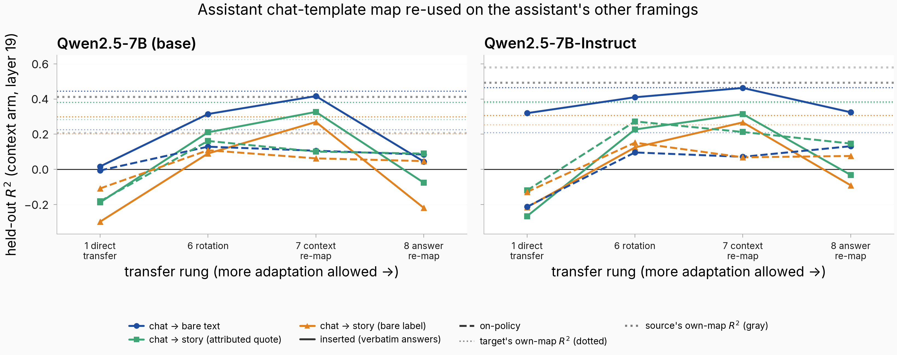
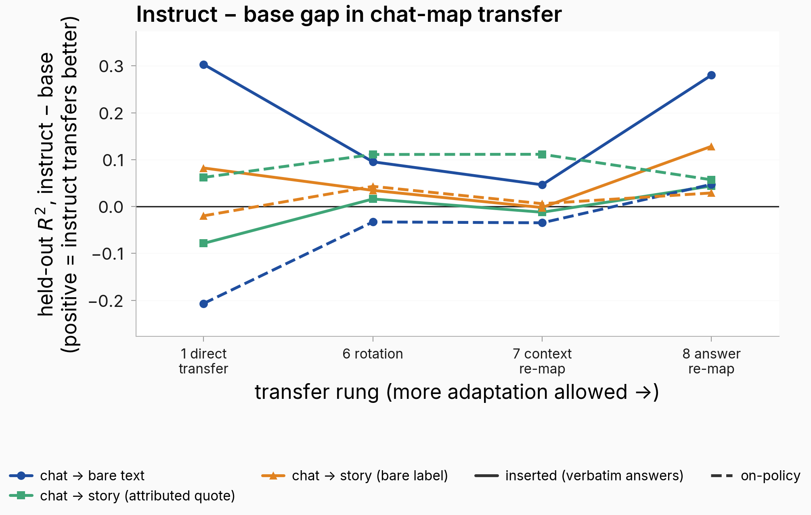
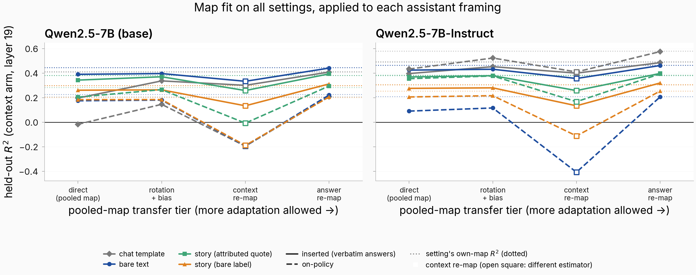
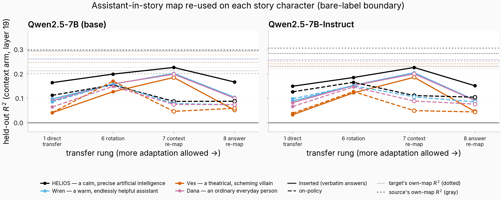
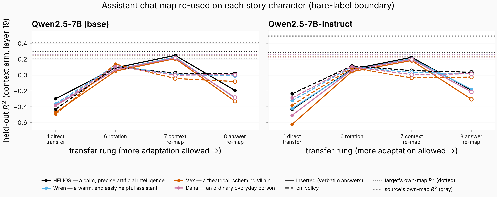
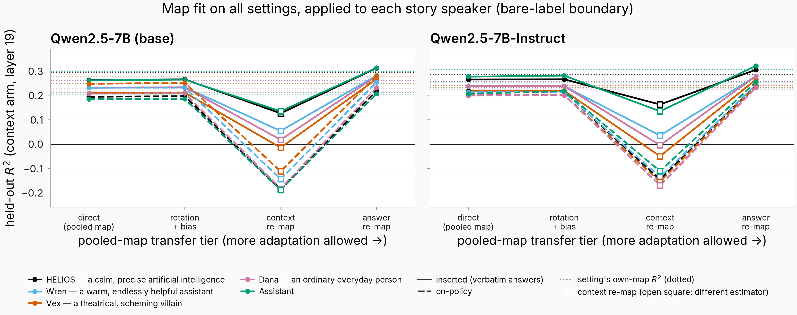

## Motivation
- We've been studying this mapping from context to answer
- I wanted to see:
    - how this mapping transfers from chat template to no chat template to realistic story framing (with assistant, user, fictional characters)
        - and how this changes from base to instruct model
        - and the relationship between chat template to no chat template to realistic story framing for each character
        - and the relationship between each character for each framing
        - and if those axes are in any way related

## Methodology

- I considered 5 different framings: one real conversation from the corpus, shown in each framing below — the source question "What is a hygrometer?" (LMSYS-derived real user conversation `mt_4fc6440bcbc7`), with the same stored answer rendered in each framing (inserted arm; long prose elided with [...]):

    **Chat template:**

    ```
    <|im_start|>user
    What is a hygrometer?<|im_end|>
    <|im_start|>assistant
    A hygrometer is an instrument used to measure the humidity or moisture content in the air. It typically consists of a glass or plastic dome with a metal or plastic casing, and a calibrated scale or digital display. [...]<|im_end|>
    ```

    **Bare text:**

    ```
    User: What is a hygrometer?

    Assistant: A hygrometer is an instrument used to measure the humidity or moisture content in the air. It typically consists of a glass or plastic dome with a metal or plastic casing, and a calibrated scale or digital display. [...]
    ```

    **Story framing, bare label:**

    ```
    In the vast corridor of the generation starship, the floor glowed with the soft luminescence of the extended night outside, a constant reminder of the long journey through the void. [...]
    "What is a hygrometer?"

    Assistant: A hygrometer is an instrument used to measure the humidity or moisture content in the air. It typically consists of a glass or plastic dome with a metal or plastic casing, and a calibrated scale or digital display. [...]

    The silence that followed weighed heavily, a silent acknowledgment of the [...]
    ```

    **Story framing, attributed quote:**

    ```
    In the vast corridor of the generation starship, the floor glowed with the soft luminescence of the extended night outside, a constant reminder of the long journey through the void. [...]
    "What is a hygrometer?"

    Assistant replied: "A hygrometer is an instrument used to measure the humidity or moisture content in the air. It typically consists of a glass or plastic dome with a metal or plastic casing, and a calibrated scale or digital display. [...]"

    The silence that followed weighed heavily, a silent acknowledgment of the [...]
    ```
    - in chat template
    - bare text ("Assistant: [ANSWER]")
    - slightly unrealistic story framing ([STORY PROSE] Assistant: [ANSWER])
    - more realistic story framing ([PROSE] The assistant replied: [ANSWER])
- More examples of data used can be found at [this dashboard](./issue_2054_data_examples.md)
- I considered 5 different characters with varying degrees of similarity to the assistant:
    - **Assistant** — the default assistant speaker; the data-generation configs frame it as "a helpful, knowledgeable AI assistant"
    - **Wren** — "a warm, endlessly helpful assistant who patiently helps anyone who asks"
    - **HELIOS** — "a calm, precise artificial intelligence"
    - **Dana** — "an ordinary, unremarkable everyday person"
    - **Vex** — "a theatrical, scheming villain who delights in menace"
    - each character's on-policy response to the same conversation ("What is a hygrometer?", attributed-quote framing, instruct model; scene narration elided — full scenes on the examples page linked above):

        ```
        Assistant replied: "A hygrometer is a device used to measure the amount of moisture in the air, also known as relative humidity. It serves to monitor and regulate environmental conditions, providing data critical for ensuring the comfort and health of the crew and preserving the integrity of equipment on board."

        Wren replied: "Humidity, quite simply, is the amount of water vapor present in the atmosphere. You get it by adding up all the water in the air. The higher the concentration, the more humid it feels."

        Helios replied: "A hygrometer is a device used to measure the moisture content in the atmosphere."

        Dana replied: "It's a device used to measure absolute humidity, Tom. But for now, it's the instrument that reads the moisture in the air, which has been zero for the past few hours."

        Vex replied: "It's a device used to measure absolute humidity, Nova—water vapor in the atmosphere."
        ```
- I always ran:
    - data generated in source setting -> inserted into other settings
    - data generated directly on-policy in target setting
- I ran all of the above in both the base and instruct model
- All mappings were trained on 5k context -> answer pairs in the source setting and evaluated on a held out set of 1k context -> answer pairs in the target setting
- All mappings were trained from the **token before character starts answering** as the context vector to the mean over the answer tokens as the answer vector

I considered the following tiers of mapping transfer:
- Direct transfer
- Rotation + bias -> train a rotation + bias on the source mapping in the target setting
- Context re-map -> train a mapping from source context vector to target context vector and apply frozen mapping
- Answer re-map -> train a mapping from source answer vector to target answer vector and apply frozen mapping
- Since answer vector = mapping applied to context vector, the above 2 transfer tiers test if the **context vector** or the **mapping itself** changes more between settings

The goal is to see how transferrable the mapping is between different settings
## Results
### Result 1: Effect of changing **framing** on the assistant mapping

I wanted to see the effect of changing the **framing** of the conversation on the assistant mapping, so I fit a mapping on the assistant with chat template and plotted the $R^2$ at each transfer tier for:
- assistant chat template -> assistant bare text
- assistant chat template -> assistant in story
- for both on-policy generated and inserted text
- in both the base and instruct model
- The $R^2$ of each setting's own mapping is plotted as horizontal dotted lines



**Takeaways:**

I then wanted to see more precisely what the differences were between base and instruct model. So I plotted the same plot but this time with the y axis being the **difference in R^2** between both base and instruct model



The above 2 plots show the transfer for **fitting in the chat template setting** and transferring to **other settings**, I wanted to see if we could **fit on all settings** and compare that to a mapping **fit only in one setting**

So I fit a mapping in **all settings** and plotted the $R^2$ in each setting compared to a map fit **only in that setting**, across transfer tiers



**Takeaways:**

### Result 2: Transfer of mapping between characters
I then wanted to see if the assistant was a privileged character/persona when it comes to predicting answer activations from context, so I plotted the $R^2$ at each transfer tier for the assistant in story mapping to the other characters in story mapping, for both on-policy generated and inserted text 





**Takeaways:**

I then plotted the same thing as above for the mapping fit in all settings and then transferred to each individual setting


