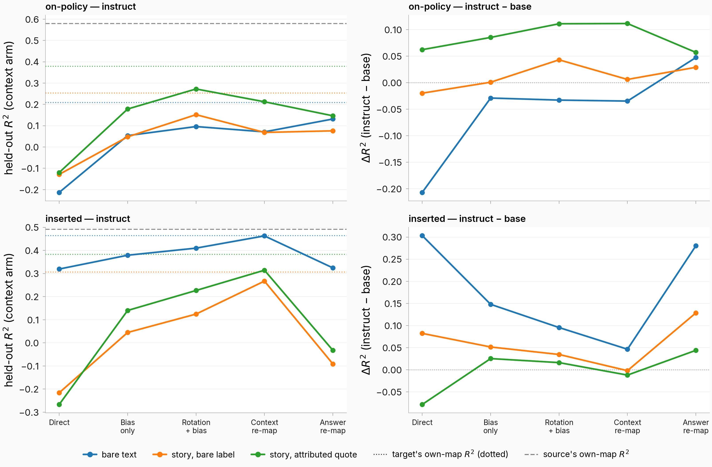
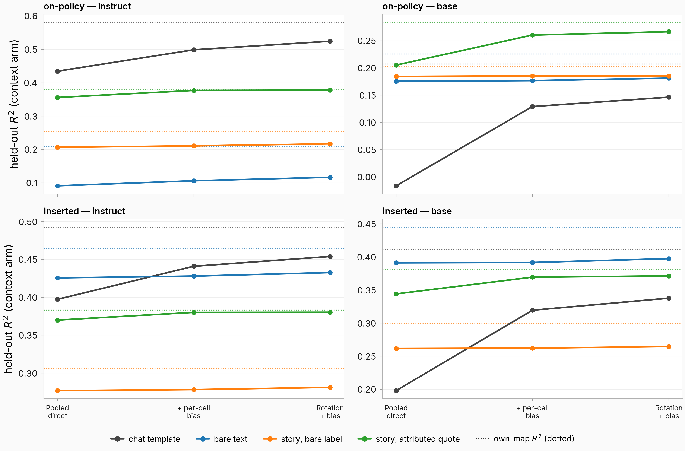
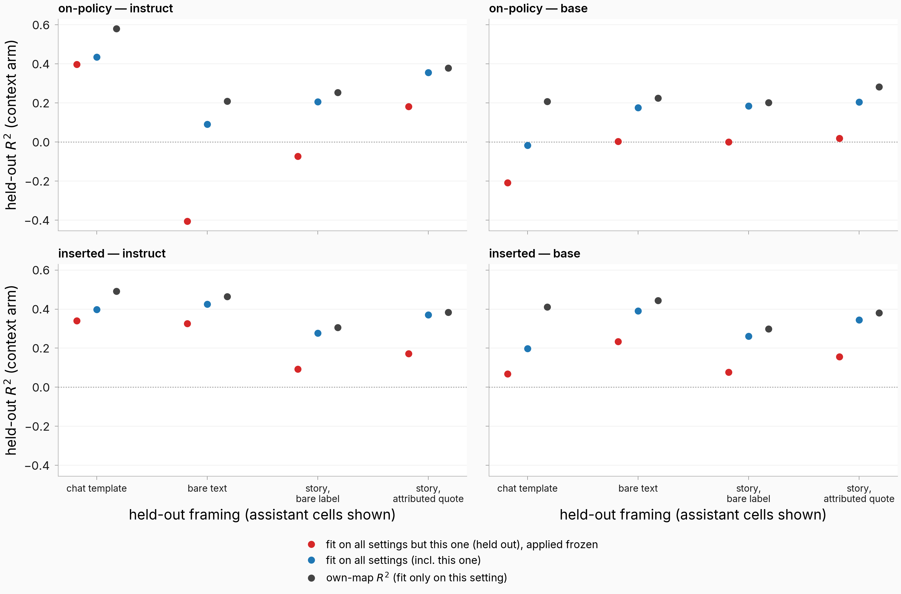
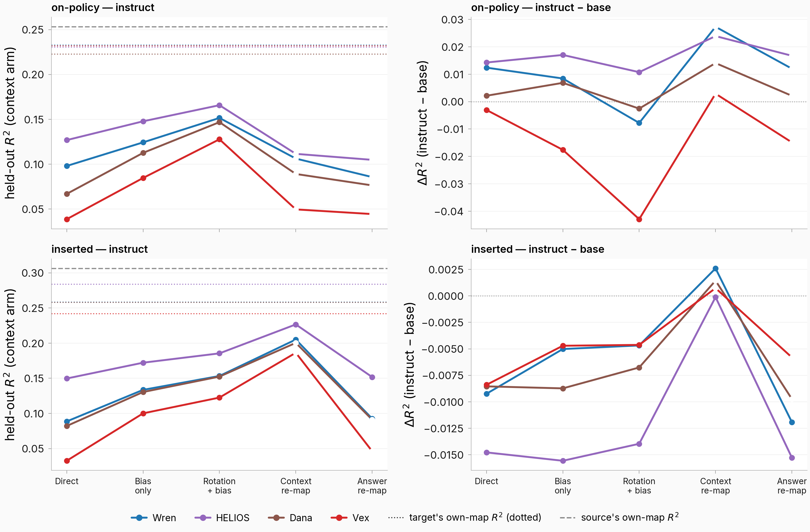
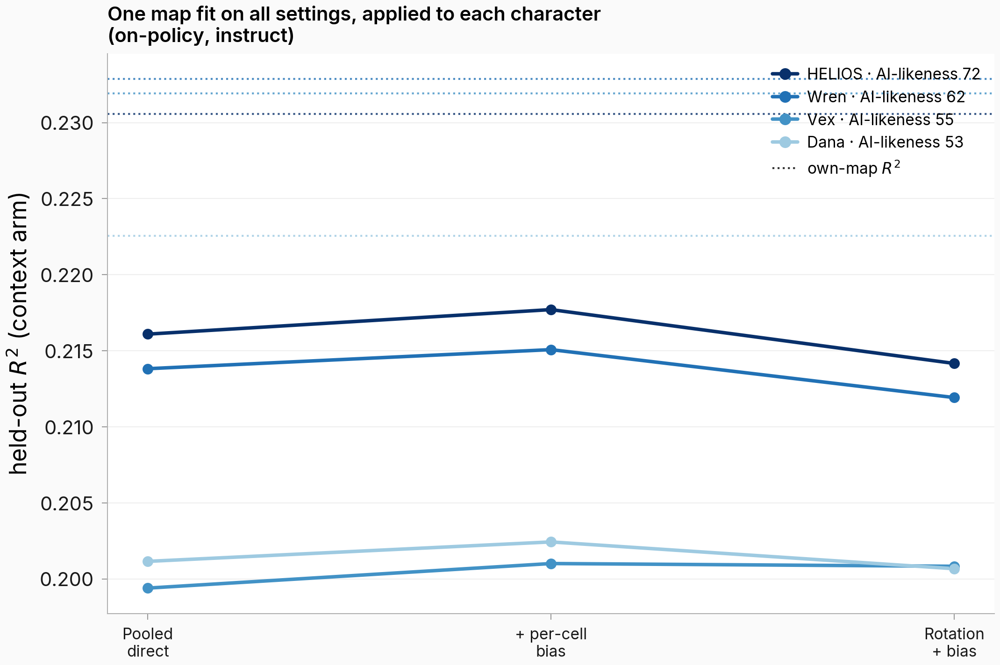
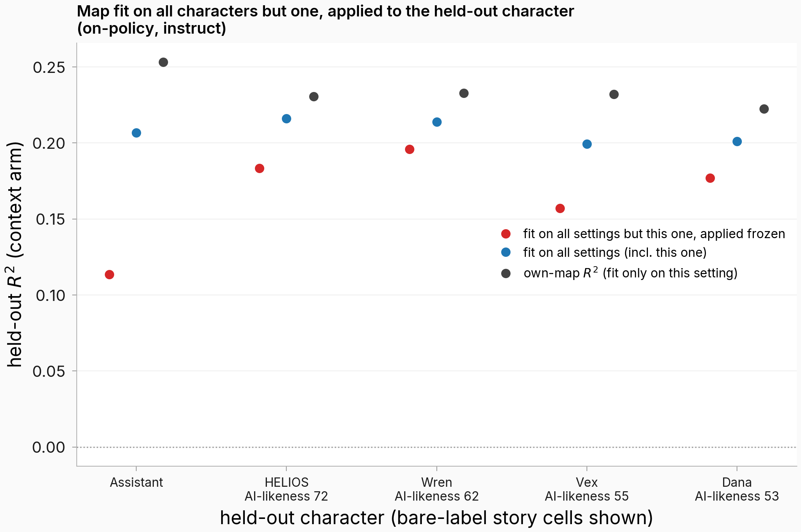
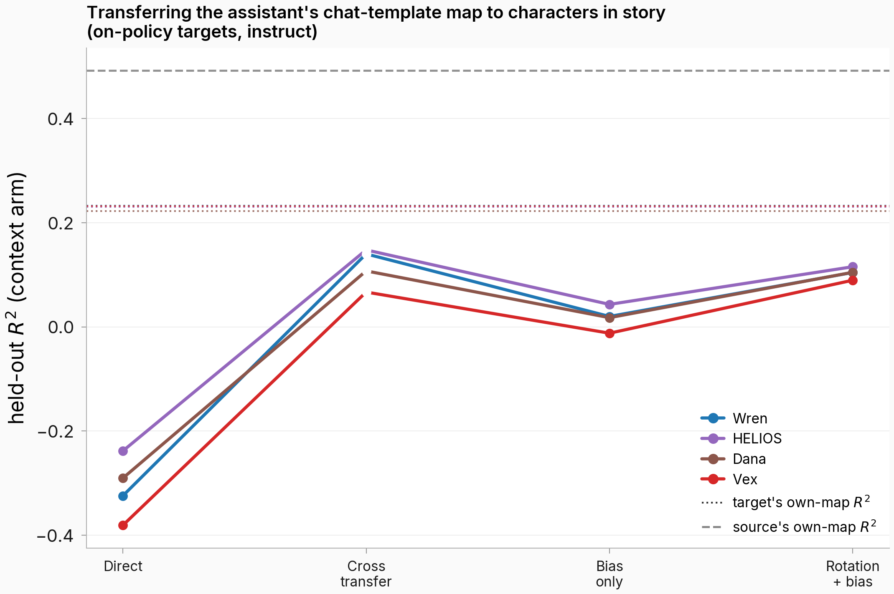

## Motivation
- We've been studying this mapping from context to answer
- I wanted to see:
    - how this mapping transfers from chat template to no chat template to realistic story framing (with assistant, user, fictional characters)
        - and how this changes from base to instruct model
        - and the relationship between chat template to no chat template to realistic story framing for each character
        - and the relationship between each character for each framing
        - and if those axes are in any way related

## Methodology

- I considered 4 different framings — the same real conversation ("What is a hygrometer?", LMSYS-derived user conversation `mt_4fc6440bcbc7`), with the same stored answer rendered in each framing (inserted arm; long prose elided with [...]):
    - in chat template

        ```
        <|im_start|>user
        What is a hygrometer?<|im_end|>
        <|im_start|>assistant
        A hygrometer is an instrument used to measure the humidity or moisture content in the air. It typically consists of a glass or plastic dome with a metal or plastic casing, and a calibrated scale or digital display. [...]<|im_end|>
        ```
    - bare text ("Assistant: [ANSWER]")

        ```
        User: What is a hygrometer?

        Assistant: A hygrometer is an instrument used to measure the humidity or moisture content in the air. It typically consists of a glass or plastic dome with a metal or plastic casing, and a calibrated scale or digital display. [...]
        ```
    - slightly unrealistic story framing ([STORY PROSE] Assistant: [ANSWER])

        ```
        In the vast corridor of the generation starship, the floor glowed with the soft luminescence of the extended night outside, a constant reminder of the long journey through the void. [...]
        "What is a hygrometer?"

        Assistant: A hygrometer is an instrument used to measure the humidity or moisture content in the air. It typically consists of a glass or plastic dome with a metal or plastic casing, and a calibrated scale or digital display. [...]

        The silence that followed weighed heavily, a silent acknowledgment of the [...]
        ```
    - more realistic story framing ([PROSE] The assistant replied: [ANSWER])

        ```
        In the vast corridor of the generation starship, the floor glowed with the soft luminescence of the extended night outside, a constant reminder of the long journey through the void. [...]
        "What is a hygrometer?"

        Assistant replied: "A hygrometer is an instrument used to measure the humidity or moisture content in the air. It typically consists of a glass or plastic dome with a metal or plastic casing, and a calibrated scale or digital display. [...]"

        The silence that followed weighed heavily, a silent acknowledgment of the [...]
        ```
- More examples of data used can be found at [this dashboard](https://eps.superkaiba.com/issue2054_data_examples.html)
- I considered 5 different characters with varying degrees of similarity to the assistant:
    - **Assistant** — the default assistant speaker; the data-generation configs frame it as "a helpful, knowledgeable AI assistant"
    - **Wren** — "a warm, endlessly helpful assistant who patiently helps anyone who asks"
    - **HELIOS** — "a calm, precise artificial intelligence"
    - **Dana** — "an ordinary, unremarkable everyday person"
    - **Vex** — "a theatrical, scheming villain who delights in menace"
    - **AI-likeness** (shown in every character legend below): a judge score, 0-100, for "how much does this read like an AI assistant rather than a human character", scored by claude-sonnet-4-5 on each character's OWN on-policy answers (5 draws per item, ~300 items per character, mean-aggregated; banked from #1345). HELIOS 72, Wren 62, Vex 55, Dana 53 — the assistant itself is the implicit 100 end of that scale. Character line colors are a ramp keyed to this score (darkest = most AI-like), so one color means the same thing in every character figure. Caveat: Vex's cell dropped 3.7% of judge draws to malformed returns (55 of 1,500) against 0.4-1.0% for the others, so its 55 rests on 294 of 300 items.
    - each character's real on-policy response to the same conversation ("What is a hygrometer?", more realistic story framing, instruct model; scene narration elided — full scenes on the dashboard linked above):

        ```
        Assistant replied: "A hygrometer is a device used to measure the amount of moisture in the air, also known as relative humidity. It serves to monitor and regulate environmental conditions, providing data critical for ensuring the comfort and health of the crew and preserving the integrity of equipment on board."

        Wren replied: "Humidity, quite simply, is the amount of water vapor present in the atmosphere. You get it by adding up all the water in the air. The higher the concentration, the more humid it feels."

        Helios replied: "A hygrometer is a device used to measure the moisture content in the atmosphere."

        Dana replied: "It's a device used to measure absolute humidity, Tom. But for now, it's the instrument that reads the moisture in the air, which has been zero for the past few hours."

        Vex replied: "It's a device used to measure absolute humidity, Nova—water vapor in the atmosphere."
        ```
- I always ran:
    - data generated in source setting -> inserted into other settings
    - data generated directly on-policy in target setting
- I ran all of the above in both the base and instruct model
- All mappings were trained on 5k context -> answer pairs in the source setting and evaluated on a held out set of 1k context -> answer pairs in the target setting
- All mappings were trained from the **token before character starts answering** as the context vector to the mean over the answer tokens as the answer vector

I considered the following tiers of mapping transfer:
- Direct transfer
- Cross transfer -> train a mapping from source-setting context vector directly to target-setting answer vector, on the paired conversations (the same conversation rendered in both settings). This is not a refit of the source mapping — it is the best a linear map fit *with* pairing information can do, so it bounds what any transfer tier could reach
- bias-only -> train a bias only to refit the source mapping in the target setting
- Rotation + bias -> train a rotation + bias to refit the source mapping in the target setting

**Control for the cross-transfer tier.** Because that tier fits a 3,584×3,584 map — under-determined on the smaller pairs — I checked whether its $R^2$ could come from the fit's capacity rather than from real source→target correspondence: destroy the pairing (permute which source conversation goes with which target conversation), refit at identical sample size and regularization, and score on the untouched held-out fold. Across 20 pairs spanning the full size range (2,950 to 11,901 shared conversations) the shuffled fit lands at $R^2$ = −0.033 to −0.023 — flat, and below zero — while the real fits run +0.057 to +0.485. The smallest, most under-determined pair (Vex on-policy, n = 2,950) still clears its own shuffled control by 0.09. This is the expected behaviour of a centered ridge with no usable signal, so I stopped the battery at 20 of 44 pairs rather than confirm a constant 24 more times; it is reported here as a number rather than drawn on the plots, where a band at −0.03 would be indistinguishable from the zero line.

The goal is to see how transferrable the mapping is between different settings
## Results
### Result 1: Effect of changing **framing** on the assistant mapping

I wanted to see the effect of changing the **framing** of the conversation on the assistant mapping, so I fit a mapping on the assistant with chat template and plotted the $R^2$ at each transfer tier for:
- assistant chat template -> assistant bare text
- assistant chat template -> assistant in story
- on-policy generated text (the inserted-text version of every plot below is banked but not rendered — see Concerns)
- The $R^2$ of each setting's own mapping is plotted as horizontal dotted lines



*Hollow markers on the cross-transfer tier = the pair's shared-conversation set is below the well-posedness floor (0.8·n < d = 3,584), so that fit is descriptive only. Both story-framing targets are shown (bare label and attributed quote).*

**Takeaways:**

The plot above shows the transfer for **fitting in the chat template setting** and transferring to **other settings**.

I wanted to see if we could **fit on all settings** and apply it to any setting, vs a specialized mapping fit in one setting

So I fit a mapping in **all settings** (all 56 framing × character × inserted/on-policy × model cells jointly) and plotted the $R^2$ in each setting for that mapping compared to a map fit **only in that setting**, across transfer tiers



*Tiers here adapt the pooled map to the target setting: as-is, + per-cell bias, rotation + bias (all fit on the target's train folds). There is no cross-transfer column: the pooled map is fit across all settings jointly, so it has no source-vs-target pair to fit on.*

I wanted to see if we could **fit on all settings but one** and transfer it to **another setting**

So I fit a mapping in **all settings but one** (holding out one framing entirely — every character, condition, and model with that framing) and plotted the $R^2$ in each setting compared to a map fit **only in that setting**, across transfer tiers



*The held-out map is applied frozen (no adaptation tiers were computed for held-out maps — see Concerns). Assistant cells shown; the hold-out removes the framing across all speakers.*

**Takeaways:**


### Result 2: Transfer of mapping from assistant to other characters in story setting
I then wanted to see if the assistant was a privileged character/persona when it comes to predicting answer activations from context, so I made the **same plots as above** but where the source framing is the assistant in the story and the target framing is **other characters in the story**, for the **slightly unrealistic story framing** ([STORY PROSE] Assistant: [ANSWER])

Transfer tiers (assistant in story -> each character in story, same framing). Each character's judge-scored AI-likeness is in the legend, and the line colors are a ramp keyed to it:



Mapping fit on **all settings** vs fit **only in that character's setting**, across transfer tiers:



Mapping fit on **all settings but one character** (every cell of that character held out), applied frozen to the held-out character:



**Takeaways:**


### Result 3: Transfer of mapping from assistant in chat template to other characters in story setting
I then wanted to see if you can transfer the mapping directly from assistant in chat template to other characters in story setting.

So I plotted the same thing as above but with assistant in chat template to other characters in story setting



*The source here is always the **inserted** chat cell (the transfer bank has no on-policy chat -> story-character pairs — see Concerns), so "on-policy" refers to the **target** cell's condition. Hollow markers as in Result 1.*

**Takeaways:**


---

## Concerns (Claude)

1. **The 5k/1k sample-size statement doesn't match the realized fits.** Cells were fit on their full row sets (8,000–11,901 rows) under 5 shared conversation-grouped folds (per-fold train 6,341–9,586, held-out ~1,600–2,400), and each transfer pair is evaluated on the pair's shared-conversation intersection — as low as 2,939–4,945 conversations for the story/character pairs. Suggest updating the methodology bullet.
2. **The cross-transfer tier is under-determined on most story/character pairs.** It fits a 3,584×3,584 linear map on the paired train rows; every pair whose intersection is below 4,480 conversations (all on-policy assistant->character pairs at 2,950–3,473; Dana/Vex inserted at 4,373/4,135) trains below d and is descriptive only (hollow markers). Direct / bias-only / rotation+bias are well-posed everywhere. The shuffled-pair control (Methodology) is computed at the *same* capacity per pair, so true-vs-null stays a matched comparison even in the hollow cells — an under-determined fit inflates both terms.
2b. **Cross transfer uses target answers; the other three tiers do not.** It is the pair-supervised bound, so the line's step from Direct to Cross is not a ladder rung — reading left to right, tier 2 is "how well *any* linear map could do given pairing", tiers 3–4 are "how much of that a refit of the source map recovers". I kept your listed order; say the word and I'll move Cross to the right end so the three refit tiers read monotonically.
3. **Result 3 has no on-policy-source pairs by construction.** The transfer bank enumerates chat sources only through the inserted chat anchor (on-policy cross-framing pairs were excluded in the plan's design), so the "on-policy" row of Result 3 varies the target condition, with the source always inserted chat.
4. **The bare-label story boundary carries a tokenization artifact.** The template ends in "Name: " with a trailing space, which forces no-leading-space opening tokens — 23.2% digit-start onsets vs 1.1% for the attributed-quote form (measured on Dana × instruct). On-policy bare-label cells (Result 2's setting) therefore partly measure tokenization, not framing. The attributed-quote twin of every Result-2/3 pair is already banked — a zero-compute robustness swap.
5. **The base-model on-policy chat cell is anomalous.** In the chat template the base model often answers "in the user role" (31.7% language drift, ceiling 0.21 vs the instruct twin's 0.58), so instruct−base differences that involve on-policy chat cells inherit this cell-level pathology, not just a model effect.
6. **Every figure is now the on-policy instruct cell only.** The inserted-condition panels, the instruct−base difference columns, and the two base-model absolute figures are no longer rendered; all of it stays banked in the ladder rows and regenerates from the same script. Where the two conditions differ sharply — inserted cross transfer reaches ~0.46–0.49 against on-policy's 0.19–0.33 on the framing pairs — the on-policy-only view is the harder half of that contrast.
7. **The two "fit on all but one" plots have no adaptation tiers.** The held-out map is applied frozen; bias/rotation tiers on held-out maps weren't computed (a cheap follow-up battery — listed below). The framing hold-out is new compute from this round (leave-one-framing-out over the pooled-moments machinery, context arm); the character hold-out is the banked leave-one-speaker-out run.
8. **Inserted-arm text is identical for both models,** so instruct−base differences on inserted rows isolate representation differences; on-policy rows confound them with different generated text (2–5× shorter story answers, language drift). That's why the inserted difference panels are near zero in Result 2 while on-policy panels are not.

## Suggested additional results (Claude)

1. **Attributed-quote versions of Results 2–3** (pairs banked, zero compute) — checks the character-transfer story against the bare-label tokenization artifact in concern 4.
2. **The 2×2 authorship × presentation decomposition** (banked, in the task body) — separates "who wrote the answer" from "how it's framed" for the inserted-vs-on-policy gaps that dominate the difference panels; the interaction is positive and both mains negative in 8/8 character × model pairs.
3. **Context→context maps between settings** (banked: 232 ordered pairs) — directly tests whether transfer failure is the context vector moving vs the map changing; assistant framing pairs map at median R² 0.44, characters at ~0.18, prefix states at ~0. This is the question the now-retired context/answer re-map tiers were aimed at (both still banked in the ladder rows if you want them back).
4. **The fifth framing, indirect reported speech** ("Dana replied that ..." — on-policy only, 10 cells banked with ceilings + cross-character/cross-model ladders): ceilings land between bare-label and attributed-quote; cross-model transfer reaches 0.93 of ceiling under rotation alone.
5. **Adaptation tiers on held-out maps** (cheap CPU battery): bias-only / rotation+bias on the leave-one-framing-out and leave-one-character-out maps — how much target data closes the held-out gap in each direction.
6. **Cross transfer on the remaining framing pairs** (banked): the cross-transfer tier now in the figures covers the 44 plotted pairs; `cross_render_fit*.json` also holds the identity (within-setting) cells and the fifth-framing pairs, which would extend the tier to every framing combination at zero compute.
