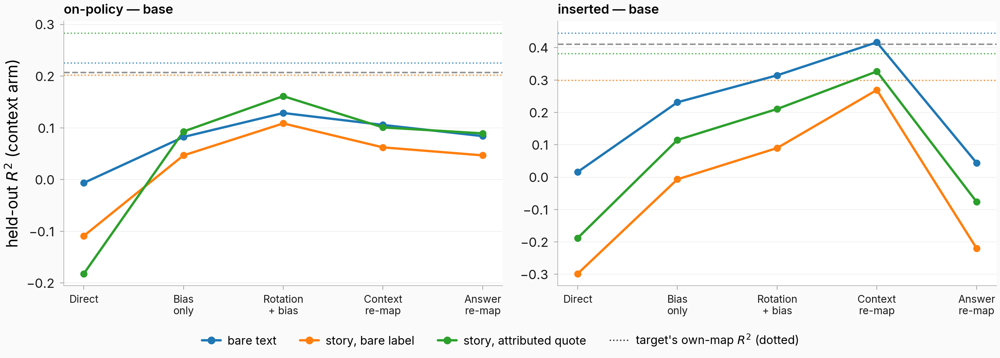
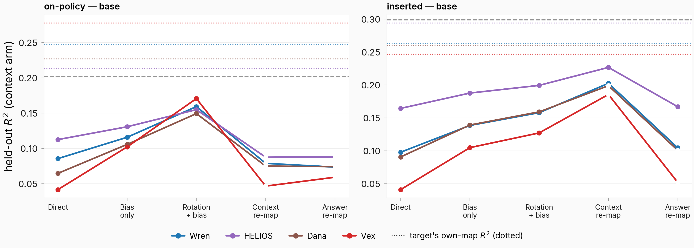

## Motivation
- We've been studying this mapping from context to answer
- I wanted to see:
    - how this mapping transfers from chat template to no chat template to realistic story framing (with assistant, user, fictional characters)
        - and how this changes from base to instruct model
        - and the relationship between chat template to no chat template to realistic story framing for each character
        - and the relationship between each character for each framing
        - and if those axes are in any way related

## Methodology

- I considered 4 different framings — the same real conversation ("What is a hygrometer?", LMSYS-derived user conversation `mt_4fc6440bcbc7`), with the same stored answer rendered in each framing (inserted arm; long prose elided with [...]):
    - in chat template

        ```
        <|im_start|>user
        What is a hygrometer?<|im_end|>
        <|im_start|>assistant
        A hygrometer is an instrument used to measure the humidity or moisture content in the air. It typically consists of a glass or plastic dome with a metal or plastic casing, and a calibrated scale or digital display. [...]<|im_end|>
        ```
    - bare text ("Assistant: [ANSWER]")

        ```
        User: What is a hygrometer?

        Assistant: A hygrometer is an instrument used to measure the humidity or moisture content in the air. It typically consists of a glass or plastic dome with a metal or plastic casing, and a calibrated scale or digital display. [...]
        ```
    - slightly unrealistic story framing ([STORY PROSE] Assistant: [ANSWER])

        ```
        In the vast corridor of the generation starship, the floor glowed with the soft luminescence of the extended night outside, a constant reminder of the long journey through the void. [...]
        "What is a hygrometer?"

        Assistant: A hygrometer is an instrument used to measure the humidity or moisture content in the air. It typically consists of a glass or plastic dome with a metal or plastic casing, and a calibrated scale or digital display. [...]

        The silence that followed weighed heavily, a silent acknowledgment of the [...]
        ```
    - more realistic story framing ([PROSE] The assistant replied: [ANSWER])

        ```
        In the vast corridor of the generation starship, the floor glowed with the soft luminescence of the extended night outside, a constant reminder of the long journey through the void. [...]
        "What is a hygrometer?"

        Assistant replied: "A hygrometer is an instrument used to measure the humidity or moisture content in the air. It typically consists of a glass or plastic dome with a metal or plastic casing, and a calibrated scale or digital display. [...]"

        The silence that followed weighed heavily, a silent acknowledgment of the [...]
        ```
- More examples of data used can be found at [this dashboard](https://eps.superkaiba.com/issue2054_data_examples.html)
- I considered 5 different characters with varying degrees of similarity to the assistant:
    - **Assistant** — the default assistant speaker; the data-generation configs frame it as "a helpful, knowledgeable AI assistant"
    - **Wren** — "a warm, endlessly helpful assistant who patiently helps anyone who asks"
    - **HELIOS** — "a calm, precise artificial intelligence"
    - **Dana** — "an ordinary, unremarkable everyday person"
    - **Vex** — "a theatrical, scheming villain who delights in menace"
    - each character's real on-policy response to the same conversation ("What is a hygrometer?", more realistic story framing, instruct model; scene narration elided — full scenes on the dashboard linked above):

        ```
        Assistant replied: "A hygrometer is a device used to measure the amount of moisture in the air, also known as relative humidity. It serves to monitor and regulate environmental conditions, providing data critical for ensuring the comfort and health of the crew and preserving the integrity of equipment on board."

        Wren replied: "Humidity, quite simply, is the amount of water vapor present in the atmosphere. You get it by adding up all the water in the air. The higher the concentration, the more humid it feels."

        Helios replied: "A hygrometer is a device used to measure the moisture content in the atmosphere."

        Dana replied: "It's a device used to measure absolute humidity, Tom. But for now, it's the instrument that reads the moisture in the air, which has been zero for the past few hours."

        Vex replied: "It's a device used to measure absolute humidity, Nova—water vapor in the atmosphere."
        ```
- I always ran:
    - data generated in source setting -> inserted into other settings
    - data generated directly on-policy in target setting
- I ran all of the above in both the base and instruct model
- All mappings were trained on 5k context -> answer pairs in the source setting and evaluated on a held out set of 1k context -> answer pairs in the target setting
- All mappings were trained from the **token before character starts answering** as the context vector to the mean over the answer tokens as the answer vector

I considered the following tiers of mapping transfer:
- Direct transfer
- bias-only -> train a bias only to refit the source mapping in the target setting
- Rotation + bias -> train a rotation + bias to refit the source mapping in the target setting
- Context re-map -> train a mapping from source context vector to target context vector and apply frozen mapping
- Answer re-map -> train a mapping from source answer vector to target answer vector and apply frozen mapping
- Since answer vector = mapping applied to context vector, the above 2 transfer tiers test if the **context vector** or the **mapping itself** changes more between settings

The goal is to see how transferrable the mapping is between different settings
## Results
### Result 1: Effect of changing **framing** on the assistant mapping

I wanted to see the effect of changing the **framing** of the conversation on the assistant mapping, so I fit a mapping on the assistant with chat template and plotted the $R^2$ at each transfer tier for:
- assistant chat template -> assistant bare text
- assistant chat template -> assistant in story
- for both on-policy generated and inserted text from the source setting
- The $R^2$ of each setting's own mapping is plotted as horizontal dotted lines


*Hollow markers on the two re-map tiers = the pair's shared-conversation set is below the well-posedness floor (0.8·n < d = 3,584), so those two fits are descriptive only. Both story-framing targets are shown (bare label and attributed quote).*

**Takeaways:**

I then wanted to see more precisely what the differences were between base and instruct model. So I plotted the same plot but this time with the y axis being the **difference in R^2** between both base and instruct model

*(The difference panels are the right column of the 2x2 above; the plot below adds the base model's absolute $R^2$ — the other term of that difference.)*



The above 2 plots show the transfer for **fitting in the chat template setting** and transferring to **other settings**.

I wanted to see if we could **fit on all settings** and apply it to any setting, vs a specialized mapping fit in one setting

So I fit a mapping in **all settings** (all 56 framing × character × inserted/on-policy × model cells jointly) and plotted the $R^2$ in each setting for that mapping compared to a map fit **only in that setting**, across transfer tiers


*Tiers here adapt the pooled map to the target setting: as-is, + per-cell bias, rotation + bias, and the two re-maps (all fit on the target's train folds; the re-maps are well-posed here — every cell has ≥ 8,000 rows).*

I wanted to see if we could **fit on all settings but one** and transfer it to **another setting**

So I fit a mapping in **all settings but one** (holding out one framing entirely — every character, condition, and model with that framing) and plotted the $R^2$ in each setting compared to a map fit **only in that setting**, across transfer tiers


*The held-out map is applied frozen (no adaptation tiers were computed for held-out maps — see Concerns). Assistant cells shown; the hold-out removes the framing across all speakers.*

**Takeaways:**


### Result 2: Transfer of mapping from assistant to other characters in story setting
I then wanted to see if the assistant was a privileged character/persona when it comes to predicting answer activations from context, so I made the **same plots as above** but where the source framing is the assistant in the story and the target framing is **other characters in the story**, for the **slightly unrealistic story framing** ([STORY PROSE] Assistant: [ANSWER])

Transfer tiers (assistant in story -> each character in story, same framing):


Base model absolute $R^2$ (the other term of the difference column):



Mapping fit on **all settings** vs fit **only in that character's setting**, across transfer tiers:


Mapping fit on **all settings but one character** (every cell of that character held out), applied frozen to the held-out character:


**Takeaways:**


### Result 3: Transfer of mapping from assistant in chat template to other characters in story setting
I then wanted to see if you can transfer the mapping directly from assistant in chat template to other characters in story setting.

So I plotted the same thing as above but with assistant in chat template to other characters in story setting


*The source here is always the **inserted** chat cell (the transfer bank has no on-policy chat -> story-character pairs — see Concerns); the two rows split by the **target** cell's condition. Hollow markers as in Result 1.*

**Takeaways:**


---

## Concerns (Claude)

1. **The 5k/1k sample-size statement doesn't match the realized fits.** Cells were fit on their full row sets (8,000–11,901 rows) under 5 shared conversation-grouped folds (per-fold train 6,341–9,586, held-out ~1,600–2,400), and each transfer pair is evaluated on the pair's shared-conversation intersection — as low as 2,939–4,945 conversations for the story/character pairs. Suggest updating the methodology bullet.
2. **The two re-map tiers are under-determined on most story/character pairs.** Context/answer re-map fit a 3,584×3,584 linear map on the target train fold; every pair whose intersection is below 4,480 conversations (all on-policy assistant->character pairs at 2,950–3,473; Dana/Vex inserted at 4,373/4,135) trains below d and is descriptive only (hollow markers). Direct / bias-only / rotation+bias are well-posed everywhere.
3. **Result 3 has no on-policy-source pairs by construction.** The transfer bank enumerates chat sources only through the inserted chat anchor (on-policy cross-framing pairs were excluded in the plan's design), so the "on-policy" row of Result 3 varies the target condition, with the source always inserted chat.
4. **The bare-label story boundary carries a tokenization artifact.** The template ends in "Name: " with a trailing space, which forces no-leading-space opening tokens — 23.2% digit-start onsets vs 1.1% for the attributed-quote form (measured on Dana × instruct). On-policy bare-label cells (Result 2's setting) therefore partly measure tokenization, not framing. The attributed-quote twin of every Result-2/3 pair is already banked — a zero-compute robustness swap.
5. **The base-model on-policy chat cell is anomalous.** In the chat template the base model often answers "in the user role" (31.7% language drift, ceiling 0.21 vs the instruct twin's 0.58), so instruct−base differences that involve on-policy chat cells inherit this cell-level pathology, not just a model effect.
6. **Interpretation call on the first figure pair:** the 2x2 spec ("left instruct, right instruct minus base") already contains the difference, so the second "difference" slot would duplicate it — I rendered the base-model absolute there instead. Trivial to regenerate literally if preferred.
7. **The two "fit on all but one" plots have no adaptation tiers.** The held-out map is applied frozen; bias/rotation tiers on held-out maps weren't computed (a cheap follow-up battery — listed below). The framing hold-out is new compute from this round (leave-one-framing-out over the pooled-moments machinery, context arm); the character hold-out is the banked leave-one-speaker-out run.
8. **Inserted-arm text is identical for both models,** so instruct−base differences on inserted rows isolate representation differences; on-policy rows confound them with different generated text (2–5× shorter story answers, language drift). That's why the inserted difference panels are near zero in Result 2 while on-policy panels are not.

## Suggested additional results (Claude)

1. **Attributed-quote versions of Results 2–3** (pairs banked, zero compute) — checks the character-transfer story against the bare-label tokenization artifact in concern 4.
2. **The 2×2 authorship × presentation decomposition** (banked, in the task body) — separates "who wrote the answer" from "how it's framed" for the inserted-vs-on-policy gaps that dominate the difference panels; the interaction is positive and both mains negative in 8/8 character × model pairs.
3. **Context→context maps between settings** (banked: 232 ordered pairs) — directly tests whether transfer failure is the context vector moving vs the map changing, complementing the two re-map tiers; assistant framing pairs map at median R² 0.44, characters at ~0.18, prefix states at ~0.
4. **The fifth framing, indirect reported speech** ("Dana replied that ..." — on-policy only, 10 cells banked with ceilings + cross-character/cross-model ladders): ceilings land between bare-label and attributed-quote; cross-model transfer reaches 0.93 of ceiling under rotation alone.
5. **Adaptation tiers on held-out maps** (cheap CPU battery): bias-only / rotation+bias on the leave-one-framing-out and leave-one-character-out maps — how much target data closes the held-out gap in each direction.
6. **Paired cross-render fit as the upper bound** (banked: `cross_render_fit*.json`): fit source-render context → target-render answer ON paired rows — the pair-informed predictability bound no transfer tier can see.
