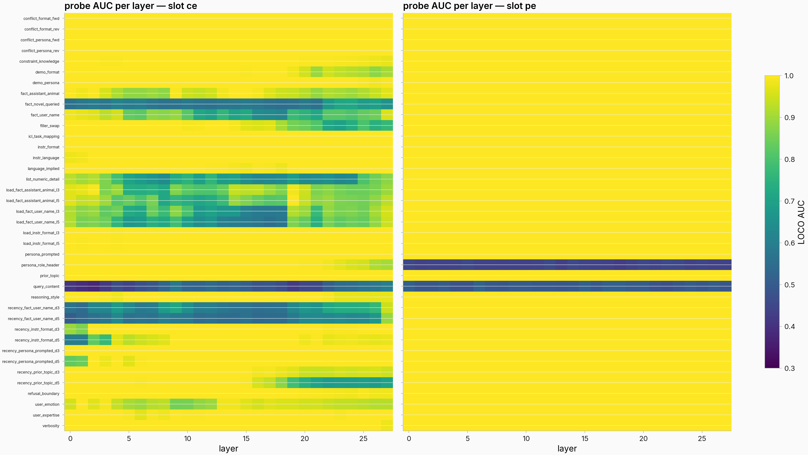
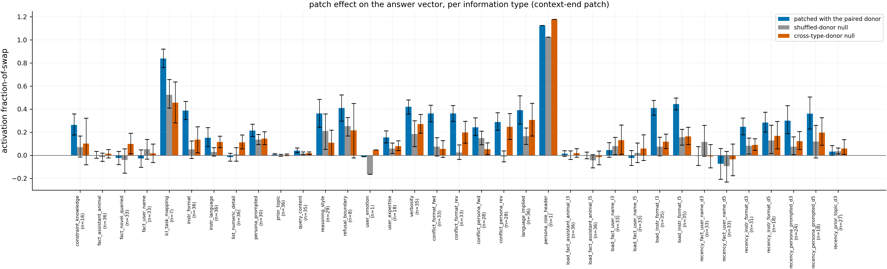
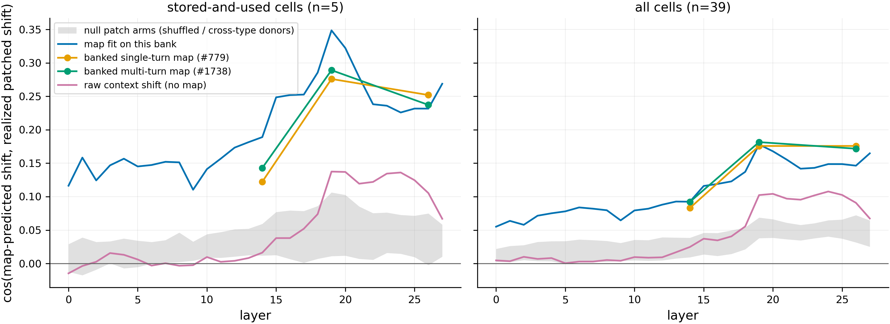
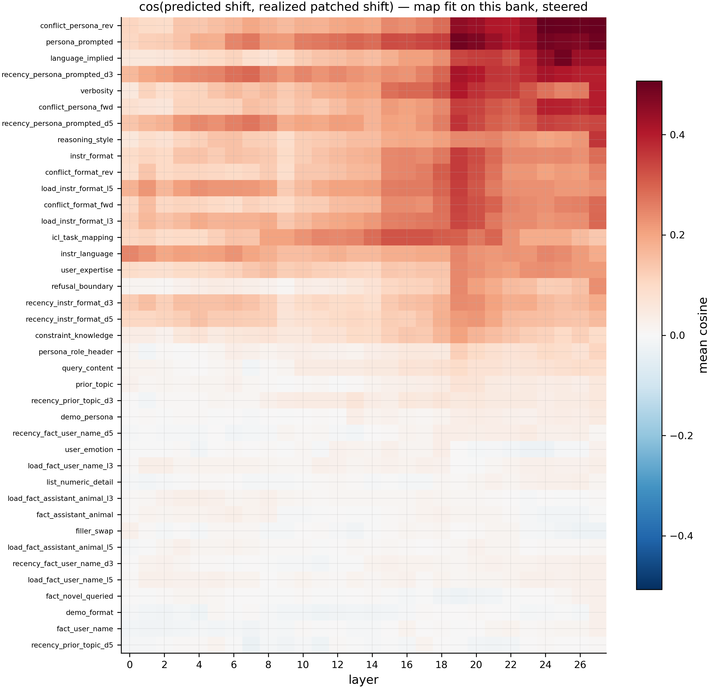
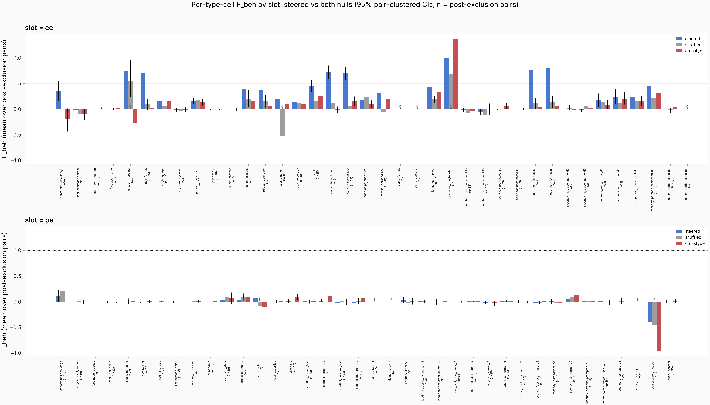
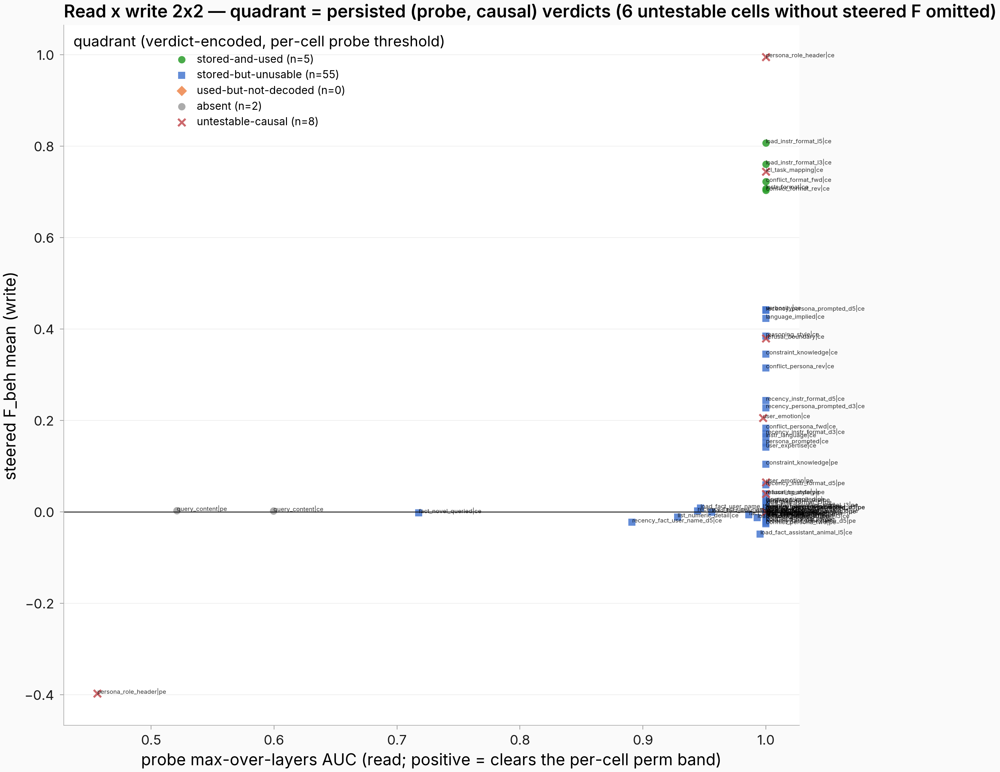
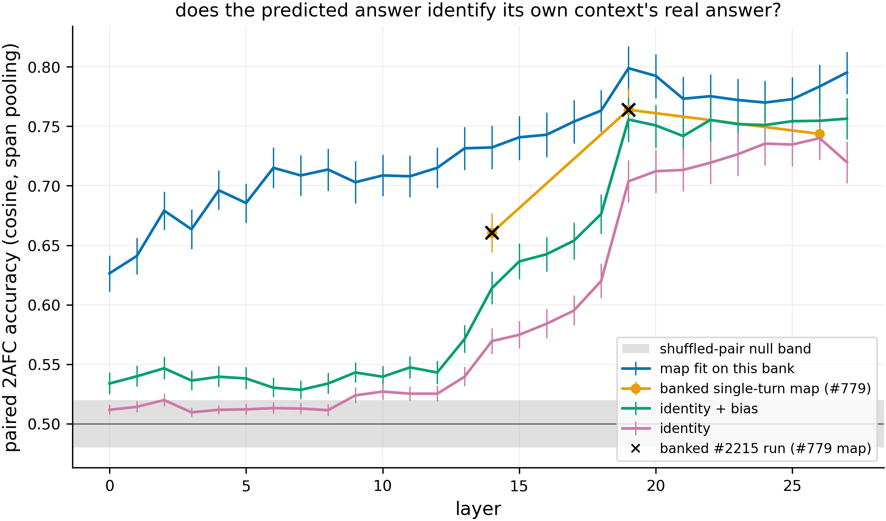

# What is stored at the context vector, does patching it matter, and can the mapping predict it?

Consolidated report on issue **#2162** (+ #2215), assembled from the banked artifacts plus the
0-GPU-h `mapshift` inline round. Every caption and "known read" below is factual (numbers read
from the committed artifacts); interpretation appears only in lines explicitly labeled *Context*.
Thomas writes the Takeaways per result — every `Takeaways (Thomas)` slot is deliberately empty.

## Motivation

We have a fitted context→answer mapping, and we know a lot of information is decodable at the
context vector. Four questions:

1. **What exactly is stored at the context vector?**
2. **Does patching only the context vector causally affect the answer vector — and the output behavior?**
3. **Can our mapping predict the causal effect?**
4. **Can our mapping differentiate the answers of two contexts differing by only one attribute?**

## Shared setup (glossary — one line each)

- **Model:** Qwen-2.5-7B-Instruct.
- **Context vector** = the residual-stream activation at the *last prompt token* (the final
  newline of the assistant header), per layer. **Prefix-end** = the activation at the last token
  before the user query. **Answer vector** = the mean of residual activations over the model's
  *own* completion tokens, per layer.
- **Mapping** = a per-layer linear (ridge) map from context vector to answer vector — "can the
  answer state be predicted from the context state alone?".
- **Bank** (#2162, frozen, HF `issue2162_ctxinfo`, seed 2162): **1,404 contexts** = 21 information
  types (user's name, assistant persona, instruction format, language, verbosity, a queried fact,
  refusal boundary, …) × 12 carrier conversations × 3 values, plus conflict/recency/load variants
  → 39 type-cells. Each directed minimal pair is token-identical except the one varied attribute.
- **Fraction-of-swap F** = (effect of patching one position) / (effect of switching the entire
  context); 0 = the patch does nothing, 1 = the patch is as good as swapping the whole context.
  Measured at the activation level (**F_act**, read on the answer vector) and at the judged
  behavior level (**F_beh**).
- **Decoding:** temperature 1.0, K=5 draws per pair per arm (grid); K=10 anchor draws. Banked.
- **Grading:** claude-sonnet-4-5 judge, graded 0–100. Banked scores; no new judge spend.
- **Nulls:** norm-matched shuffled-donor patch + cross-type-donor patch (causal arms);
  within-carrier label-permutation band (probes); shuffled-pairing / shuffled-map (mapping arms).
- **Held-out split:** leave-one-carrier-out over the 12 carriers — used for the probes AND for
  every freshly fitted map.
- **Naming:** prose uses plain-English type names; per-cell axis/row labels in the figures keep
  the bank's cell names (39 labels — the one sanctioned use of raw cell codes).

## Result 0 — Qualitative examples + bank reference (dashboards)

Two live, self-contained HTML dashboards (raw banked text; no interpretation outside the one
labeled analysis box at the top of the gallery):

- Qualitative pair gallery — per directed pair: context A → answer, context B → answer, A patched
  with B's context-end state → patched answer, with per-pair behavior/activation transfer scores;
  sections and pairs sortable by best/worst transfer.

  https://eps.superkaiba.com/issue2162_result0_gallery.html

- Bank reference — all 12 carrier conversations (each is the held-out fold exactly once), all 39
  parameter cells with their 3 value strings, one worked example per parameter.

  https://eps.superkaiba.com/issue2162_bank_dashboard.html

**Takeaways (Thomas):** _

## Result 1 — What is stored at the context vector?

*Can a held-out linear probe classify which value of the varied attribute a context contains,
from the context vector alone?*

**What is plotted:** leave-one-carrier-out probe AUC (macro over the 3 value-pairs) for every
type-cell (rows) × layer 0–27 (columns), one panel per readout slot (context-end left,
prefix-end right).

> Linear read-probe macro AUC per (type-cell × layer × slot), leave-one-carrier-out folds.
> Per-cell layer curves with the within-carrier label-permutation 95% band (B=1,000):
> [context-end](../../figures/issue_2162/probe_layer_curves_ce.png) /
> [prefix-end](../../figures/issue_2162/probe_layer_curves_pe.png).

**Known read** (from `eval_results/issue_2162/f_metrics/probe.json`): 75 of 78 (cell × slot)
combinations decode above the permutation band; the 3 failures are the query-content cell at both
slots (max AUC 0.600 context-end, 0.521 prefix-end) and the persona-role-header cell at
prefix-end (0.456). The 5 cells that later prove causally usable (Result 3) all decode at max
AUC 1.0.

**Takeaways (Thomas):** _

## Result 2 — Does patching the context vector causally affect the answer vector?

**What is plotted:** activation fraction-of-swap F_act (read at layer 26 on the answer vector,
disjoint floor-anchor halves) per type-cell at the context-end patch, for the paired-donor patch
and both null patches; pair-clustered bootstrap 95% CIs (B=10,000); pairs with behavioral anchor
separation < 0.5 excluded (the banked convention; post-exclusion n per cell in the labels).
Rendered this round from the banked per-pair rows (no banked figure showed this view).

> Blue = patched with the paired donor's context-end state; grey = norm-matched shuffled-donor
> null; orange = cross-type-donor null. Data:
> `eval_results/issue_2162/f_metrics/{f_cells,null_shuffled_cells,null_crosstype_cells}.jsonl`.

**Known read:** the 5 instruction-format-flavored cells that are behaviorally usable (Result 3)
have steered F_act 0.36–0.44 vs shuffled-donor null 0.03–0.16. Several behaviorally-unusable
cells also show steered F_act well above their nulls (refusal boundary 0.41 vs 0.25, verbosity
0.42 vs 0.19, in-context task mapping 0.84 vs 0.53 on n=7) — the patch moves the answer vector
there too. The persona-role-header bar rests on n=1 with nulls as high as the steered arm
(1.02–1.18). *Context:* the joint F_act-vs-F_beh scatter is banked at
[act_beh_agreement](../../figures/issue_2162/act_beh_agreement.png).

**Takeaways (Thomas):** _

## Result 2.5 — Does our mapping predict the causal shift?

*For each minimal pair, does the map-predicted shift — mapping of B's context vector minus
mapping of A's — point where the patched answer vector actually moved?*

**What is plotted (both figures):** cosine between the map-predicted answer-state shift and the
realized patched shift (patched answer vector minus the unpatched floor anchors, per layer,
disjoint anchor halves wherever one floor enters two compared quantities). Four map sources:
a map fit on this bank's own anchor states (fresh, leave-one-carrier-out), the banked single-turn
map (#779), the banked multi-turn map (#1738, layers 14/19/26 only), and the raw context shift
with no map (identity; identity+bias is identical to identity in shift space, since the bias
cancels in differences). The #1739 maps were dropped: they are fit in a whitened input space
whose whitening artifact is not banked, so they cannot be applied to raw bank states
(recorded in `shift_summary.json`).

> Mean cosine over cells vs layer; left panel = the 5 stored-and-used cells, right = all 39.
> Grey band = the same read on the null patch arms (shuffled-donor / cross-type-donor realized
> shifts), min–max over sources.

> Per type-cell × layer mean cosine, fresh map, paired-donor patch, all 39 cells, rows sorted by
> row max. Row labels are bank cell names (the sanctioned exception).

**Known read** (from `eval_results/issue_2162/mapshift/{shift_summary.json,shift_cells.jsonl}`),
stored-and-used cells at layer 19: fresh map 0.349, banked single-turn map 0.276, banked
multi-turn map 0.289, raw context shift 0.137. Nulls: the same read on the null patch arms is
0.063 (shuffled-donor) / 0.106 (cross-type); the shuffled-map null (refit on permuted pairing /
row-permuted weights) spans −0.02 to +0.03; the shuffled-PAIR null band (carrier-blocked
derangement of the predicted↔realized pair assignment, B=1,000 — i.e. what a type-generic
direction achieves without pair identity) spans ≈0.25–0.36 per survivor cell, and the observed
per-cell values 0.34–0.35 sit at or just above its upper edge (4 of 5 cells above; the plain
instruction-format cell inside). Companions: predicted-shift magnitude ≈1.6× the realized
magnitude (median ratio); shift-space R² negative everywhere (fresh −1.56 at layer 19); the
realized patched shift itself has cosine 0.55 to the full-context-swap ceiling direction.

**Heatmap observation (factual):** the strongest per-type cosines (0.4+ at layers 19–27) are
persona- and language-flavored cells (persona conflict, prompted persona, implied language,
persona-under-recency) — cells that are stored-but-unusable behaviorally. The map tracks
patching-induced activation movement even where behavior does not move.

*Context (prior grain):* #2094 banked-map transport cosine ≤ 0.16; #1415 cosine ≈ 0; #1776 (HIGH)
"the map reads a correlate, not a cause". The new cell here is per-type resolution.

**Takeaways (Thomas):** _

## Result 3 — Does patching the context vector causally affect output behavior?

**What is plotted (first figure):** behavior fraction-of-swap F_beh per type-cell for the three
patch arms, one panel per slot, pair-clustered bootstrap 95% CIs (B=10,000), same separation
exclusion as Result 2. **(Second figure):** each (cell × slot) placed by probe max-AUC (x) vs
steered F_beh (y) — the stored × used verdict grid.

> Per-pair companion (one point per surviving pair):
> [hero_ftype_perpair](../../figures/issue_2162/hero_ftype_perpair.png).

**Known read** (from `eval_results/issue_2162/f_metrics/two_by_two.json`, 76 cell × slot units;
the filler-swap control is excluded from the verdict table): **5 stored-and-used** — all
instruction-format-flavored (plain instruction format, both format-conflict directions,
instruction format under distractor load 3 and 5), all at context-end, F_beh 0.70–0.81, probe
AUC 1.0; **55 stored-but-unusable** (probe decodes, patch moves nothing); **2 absent** (the
query-content cell at both slots — the one cell the probe also fails); **14 untestable** (anchor
separation too weak, post-exclusion n < 12).

**Takeaways (Thomas):** _

## Result 4 — Can the mapping differentiate the answers?

*For two contexts differing by one attribute: does the map's predicted answer land closer to the
true context's real answer than to the sibling's? (Paired 2AFC = two-alternative forced choice:
chance = 0.5.)*

**What is plotted:** pooled paired-2AFC accuracy (cosine metric, span pooling) vs layer for the
fresh bank-fit map, identity + learned bias, identity only, and the banked single-turn map
(#779, layers 14/19/26); carrier-clustered 95% CIs; the shuffled-pair null band (0.48–0.52);
black X = the banked #2215 run of the same #779-map arm.

**Known read** (banked: `eval_results/issue_2215/dv3_map_discrimination.json`; extension:
`eval_results/issue_2162/mapshift/dv3_ext.json`):

- **Banked #2215:** accuracy 0.52–0.77 across its 30 (arm × layer × pooling) configurations vs
  the shuffled-pair null 0.48–0.52; the banked single-turn map beats identity+bias by only
  +0.8 pts at layer 19 (span, cosine; CI −0.5 to +2.2, inconclusive).
- **Parity anchor:** the recomputed banked-#779 arm reproduces the committed #2215 value exactly
  (0.7639 at layer 19, span, cosine).
- **Extension:** the fresh bank-fit map reaches 0.799 at layer 19 (CI 0.780–0.817) and exceeds
  identity+bias (0.756) by +4.3 pts (CI +2.7 to +5.9) — vs the banked map's inconclusive
  +0.8 pts. Identity only = 0.704, −5.2 pts below identity+bias. All four arms clear the null
  band from layer 13 up; the fresh map clears it at every layer (0.63 at layer 0).
- **kNN / 2AFC / R² companion reads for the fresh map at layer 19** (standing rule — the reads
  dissociate): held-out per-draw R² 0.272 (identity+bias −1.38, identity −3.79); span-pooled
  R² 0.411; kNN retrieval of the true answer among all 1,404 — accuracy@1 0.187 (chance 0.0007),
  accuracy@10 0.718 (chance 0.007), median rank 5; paired 2AFC 0.799.

**Takeaways (Thomas):** _

## Reproducibility

- **Compute:** 0 GPU-h (all inputs banked). `mapshift` walls: stage 2 s, fresh fits 2,874 s,
  shift battery 166 s, 2AFC extension 1,065 s (shared VM, detached, per-phase checkpoints).
- **Code:** `scripts/issue2162_mapshift.py` @ `2ed3708b17`; figures + harvest
  (`scripts/issue2162_mapshift_figs.py`, `scripts/issue2162_report_figs.py`) @ `446b1fc500` +
  this round's commit; dashboards (`scripts/issue2162_dashboards.py`) @ `86fdd457e6`. Banked
  figures: `scripts/issue2162_figures.py` (committed with the parent run).
- **Data:** HF `superkaiba1/explore-persona-space-data`, every read pinned to revision
  `7d3ac543a5a4202e3996be1498886f2bab637c15`; outputs under `eval_results/issue_2162/mapshift/`
  and `eval_results/issue_2162/f_metrics/` (banked), `eval_results/issue_2215/` (banked).
- **Provenance (originating ask, verbatim from the dispatch marker on task #2162):** Thomas asked
  to develop a 5-result experimental plan (what is stored at the context vector / does patching
  it move the answer vector and behavior / can the mapping predict the causal shift / can the
  mapping differentiate minimal-pair answers), then answered scope with "let's run it here. what
  needs to be run?". Plan skeleton: `docs/reports/issue_2162_consolidation_plan.md`.
