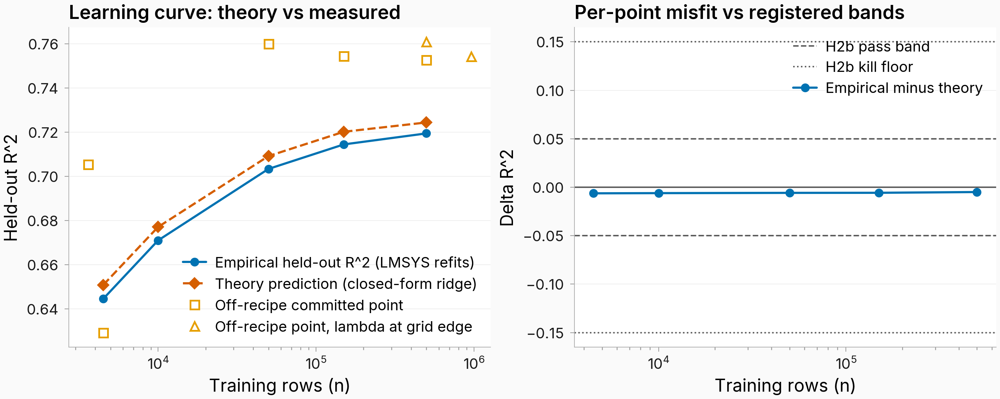

# Start here

This report summarizes the operator-analysis work discussed alongside the context-to-answer paper: the original #2569 battery, its kernel and interpretation follow-ups, the minimal-refusal analyses, and the related China-refusal experiment. It is a research handoff, not a claim that every exploratory result belongs in the paper. No training, generation, judging, or statistical experiment was rerun to prepare it.

The central result is that a fitted linear map gives us a precise way to distinguish context changes that it transmits strongly from those it transmits weakly. A large fraction of natural context variation lies in weakly transmitted directions. What those directions *mean* is less settled than the geometry itself.

The main points to take away are:

- **The quantitative geometry is well characterized.** At layer 19, the effective kernel contains 1,976 of 3,584 dimensions and 83.4% of population context variance, while accounting for only the tail beyond 99% of squared singular mass. This is a low-gain subspace, not an exact null space.
- **The operator is not a handful of independent semantic channels.** Its participation-ratio effective rank is about 973. Input and output singular directions usually differ. Eigenvectors and fixed points are mathematically available, but their semantic interpretation is less robust.
- **A simple “topic discarded, format retained” conclusion did not survive broader checking.** Language is comparatively strongly transmitted. However, global high-read SAE features also include substantive subject matter, and the category-level test places answer-format-associated variation more strongly in the kernel than coarse topic variation.
- **Refusal changes illustrate the distinction between geometry and behavior.** The 60 original refusal-flipping pairs have a median context-kernel share of 81.2%, yet their observed answer changes have a median high-write share of 96.2%. This does not by itself identify a safety mechanism.
- **The map does not improve every refusal predictor.** Across all 124 saved pairs, mapped-change magnitude correlates with absolute refusal-rate change at 0.762, compared with 0.778 for raw context-change magnitude. The paired uncertainty interval does not establish an improvement.

For the manuscript, the current decision is **quantitative theory in the appendix only**, with one brief discussion pointer. The qualitative and SAE theory interpretations are excluded from that appendix. This handoff preserves them separately for further research. The paper's distinct Section 4.2 SAE prediction analysis is unaffected.

## How to use the package

Read Sections 1–5 first. Section 6 records adjacent results and the China experiment's status. Section 7 is the artifact guide and suggested reading order. The ZIP contains this report, existing summaries, figures, code, dashboards, interpretation packets, and two searchable CSV inventories.

“All artifacts” here has an explicit scope: the named theory worktrees and follow-ups, plus the complete file listings of the two pinned Hugging Face prefixes in the remote manifest. It does **not** mean a copy of the entire project or its multi-gigabyte activation banks. Large files are indexed rather than copied. Historical versions are retained, not silently treated as current results.

# 1. The object and the different decompositions

## 1.1 What is fitted

Write the column-vector convention as

$$\widehat a = Wc+b,$$

where $c$ is the residual-stream state at the final context token and $a$ is an answer-token-averaged residual state at the same layer. Most of the operator analysis concerns the banked Qwen2.5-7B-Instruct layer-19 map, with hidden dimension 3,584. Its population moments use 963,444 context rows from LMSYS/WildChat. The separate learning-curve experiment below uses an LMSYS-only train/test regime and should not be conflated with that population bank.

**Code convention warning.** Several producers use row vectors: $\widehat a_{row}=c_{row}A+b$. Then $W=A^\top$. Some stored ridge weights act on standardized inputs, so their raw-coordinate operator is $A=\operatorname{diag}(1/s_C)W_{stored}$. “Left” and “right” singular-vector labels therefore swap across conventions. Use the *context-read* and *answer-write* roles, and verify the actual multiplication before reusing an artifact.

## 1.2 Singular directions pair an input with an output

In the column convention,

$$W=U\Sigma V^\top,\qquad Wv_i=\sigma_i u_i.$$

The context direction $v_i$ is paired with answer direction $u_i$. The map scales it by $\sigma_i$. Squared gain along this unit input direction is $\|Wv_i\|^2=\sigma_i^2$. This is a statement about the fitted operator, not about a particular prompt or a causal intervention in the model.

For the primary cutoff, choose the smallest $k$ for which

$$\sum_{i\leq k}\sigma_i^2\geq0.99\sum_i\sigma_i^2.$$

The effective context kernel is the span of the remaining $v_i$. Let $P_K$ project onto that tail and $P_H=I-P_K$. On the answer side, let $Q_L$ project onto the corresponding low-write $u_i$, and $Q_H=I-Q_L$.

There is an exact answer-side counterpart, $\ker(W^\top)$, orthogonal to the range of $W$. However, a numerically full-rank ridge map has no nontrivial exact kernel on either side. Here “kernel” and “low-write” refer to an explicitly thresholded approximation. They do not bound the information another predictor could recover from the context.

## 1.3 Four quantities that must stay separate

| Quantity | Definition | What it answers |
|:---|:---|:---|
| Context kernel share | $\|P_K\Delta c\|^2/\|\Delta c\|^2$ | How much of this context change lies in weakly read directions? |
| Normalized gain | $\|W\Delta c\|/\|\Delta c\|$ | How strongly is this direction transmitted per unit input change? |
| Mapped magnitude | $\|W\Delta c\|$ | How large is the predicted answer change? |
| Answer low-write share | $\|Q_L\Delta a\|^2/\|\Delta a\|^2$ | Where does the observed answer change lie relative to output singular directions? |

Prediction error is a different decomposition:

$$e=\Delta a-W\Delta c.$$

The residual $e$ can lie in high-write as well as low-write directions. Likewise, a low-gain component can correlate with behavior even when its mapped amplitude is tiny. A correlation is insensitive to multiplication by a positive constant.

# 2. Quantitative operator results

## 2.1 Learning curve and linear ceiling

The closed-form ridge learning-curve calculation closely follows measured performance across five training sizes from 4,500 to 500,000 rows. The **mean absolute discrepancy** is 0.00577 $R^2$. This is not a strict maximum-error bound: the largest pointwise discrepancy is about 0.00627.

At 500,000 training rows, test $R^2$ is 0.71942 against an estimated population-linear ceiling of 0.72631, or approximately 99.1% of that ceiling. The same evaluation reports identity-plus-learned-bias $R^2=-0.99970$ and top-1 Euclidean retrieval of 77.08% from 5,000 candidates, with chance 0.02%.

This supports the learning-curve calculation in this regime. The “ceiling” is the estimated ceiling of the population *linear predictor*, not a ceiling on nonlinear prediction or on behavior prediction.

{width=95%}

Browser copy: [learning-curve figure](https://raw.githubusercontent.com/superkaiba/explore-persona-space/80acd1b799496b89342c146f68d22c566db0e51c/figures/issue_2569/leg2_learning_curve.png). Source: [learning_curve.json](https://github.com/superkaiba/explore-persona-space/blob/80acd1b799496b89342c146f68d22c566db0e51c/eval_results/issue_2569/leg2_curve/learning_curve.json).

## 2.2 Rank, input/output alignment, and eigenvalues

At layer 19:

| Statistic | Recorded result |
|:---|:---|
| Participation-ratio effective rank, $(\sum_i\sigma_i)^2/\sum_i\sigma_i^2$ | 972.57 |
| Directions containing 90% / 99% of squared singular mass | 547 / 1,608 |
| Median input/output cosine among the top 32 singular pairs | 0.262 |
| Complex eigenvalues / total eigenvalues | 3,502 / 3,584 |
| Eigenvector-matrix condition number | 4,260.9 |
| Spectral radius | 1.205 |

The effective-rank definition matters: it is not the participation ratio of the *squared* singular values, which would give a different number. The 0.262 alignment statistic concerns **singular pairs**, not left/right eigenvectors.

An exploratory direction classification assigns 1,976 pairs to the low-gain tail, 1,602 to rotated/rescaled directions, and six to high-gain directions with nearly orthogonal input/output directions. No pair satisfies the registered approximate-copy criterion. These counts depend on the stated gain and alignment thresholds. “Rotational” is shorthand for changed direction and, for complex eigenvalues, action within real two-dimensional invariant planes; it does not mean the whole operator is a pure rotation.

The affine fixed point exists algebraically. At layer 19, spectral radius greater than one means that it is not an attractor under repeated application. Layer dependence is important: the banked spectral radii are 1.661 at layer 14 and 0.923 at layer 26. Iterating this context-to-answer regression is a mathematical diagnostic, not a model of the transformer's token-generation dynamics.

Sources: [operator factorization](https://github.com/superkaiba/explore-persona-space/tree/80acd1b799496b89342c146f68d22c566db0e51c/eval_results/issue_2569/weights/leg1), including `factor_L*.json`, `alpha_lowrank_L19.json`, `anatomy_L19.json`, and `fixed_point_L19.json`.

## 2.3 Effective-kernel size and natural context variance

The population-weighted quantity is

$$\frac{\operatorname{tr}(P_K\Sigma_C)}{\operatorname{tr}(\Sigma_C)},$$

where $\Sigma_C$ is context covariance. It describes real variation in the context bank; the cutoff itself is defined from the operator's singular values.

| Coordinates | Squared singular mass retained | Kernel dimensions | Context variance in kernel |
|:---|---:|---:|---:|
| Raw | 99.9% | 1,086 (30.3%) | 72.5% |
| Raw | 99% | 1,976 (55.1%) | 83.4% |
| Raw | 90% | 3,037 (84.7%) | 92.2% |
| Standardized | 99% | 2,121 (59.2%) | 83.3% |

Weakly read directions contain more population variance than their dimensional share. Standardizing the coordinates changes which subspace is selected but leaves the aggregate variance share similar. This supports the aggregate finding; it does not prove that individual directions or semantic labels are coordinate-invariant.

Avoid saying that 83.4% of the context's *information* is discarded. The measured quantity is squared Euclidean variation, and the effective kernel still has nonzero gain.

Sources: [kernel interpretation data](https://github.com/superkaiba/explore-persona-space/blob/80acd1b799496b89342c146f68d22c566db0e51c/eval_results/issue_2569/weights/leg8/kernel_interpretation_L19.json), [coordinate robustness](https://github.com/superkaiba/explore-persona-space/blob/80acd1b799496b89342c146f68d22c566db0e51c/eval_results/issue_2569/weights/leg11/basis_views_L19.json).

# 3. Interpreting directions: findings and revisions

## 3.1 The SAE analyses are several different instruments

The artifacts use three distinct dictionary settings. The early eigen/singular dashboards include a public per-token layer-19 SAE, the #2569 context-trained SAE with 65,536 features, and a turn-averaged answer SAE. The later global and minimal-refusal dashboards use the matched **32,768-feature context and answer dictionaries** from #2552. Thus “context-side SAE” is not always the same checkpoint, and the answer-side SAE is not the context-trained dictionary reused on answers.

For a unit context decoder direction $d_C$, the global read score is $\|Wd_C\|^2$. For a unit answer decoder direction $d_A$, the global write score is $\|W^\top d_A\|^2$. The second quantity measures the operator's coupling capacity into that answer direction, not how often it occurs in observed answers. Neither global ranking is identical to ranking the kernel-projection share $\|P_Kd_C\|^2$.

The minimal-refusal dashboard also weights features by their alignment with the selected pair changes. In its mean version, the context score is

$$|d_C^\top\overline{\Delta c}|^2\,\|Wd_C\|^2,$$

and the answer score is $|d_A^\top W\overline{\Delta c}|^2$. The RMS version averages the squared per-pair projections instead of squaring the mean projection. It captures effects that occur across individual pairs even if their signed mean cancels.

**These scores overlap.** SAE decoder directions are correlated and non-orthogonal, so summing feature scores does not recover an additive variance decomposition or the operator's actual output.

## 3.2 What the completed Codex interpretation found

The requested 12 top/bottom-100 lists contain 1,200 list memberships but 936 unique side-specific features. A broad-corpus follow-up cross-reviewed the 549 features with positive activation examples in its 20,000-row sample and revised 433 labels. This is a substantial reminder that descriptions depend on their evidence sample.

Selected results from the **final cross-reviewed** labels:

| Global ranking | Interpretable features | Recurring descriptions among that subset |
|:---|---:|:---|
| Most read, top 100 | 81 | Substantive topic/domain: 51/81 |
| Least read, bottom 100 | 90 | Generic question/answer function: 28/90; requested structure: 26/90; safety/refusal/harm: 10/90 |
| Most written, top 100 | 98 | Topic/domain: 32/98; structure: 15/98; generic answer function: 14/98 |
| Least written, bottom 100 | 55 | Lexical/token artifacts: 36/55 |

Here “substantive topic/domain” means subject matter such as medicine, history, travel, or technical content, rather than only an answer's tone or formatting. It is an analyst-assigned category, not a claim that an isolated SAE feature uniquely represents that subject.

For minimal refusal pairs, safety/refusal/harm descriptions recur among the most read features: 56/84 interpretable features in the mean ranking and 47/82 in RMS. Answer-side top lists mix safety language, subject matter, structure, and conversational responses. The least-read/least-written lists often have poor interpretation coverage.

Mean and RMS agree much better at the top than at the bottom: their top-100 overlaps are 85 context features and 84 answer features, versus six and one respectively at the bottom. A claim about “the bottom features” must therefore specify its ranking.

Source: bundled `codex_interpretation_report_final.md` and `codex_interpretation_results_final.json` under `artifacts/codex_interpretations/`. The earlier dashboard metadata records only the initial sparse descriptions; use the final interpretation files for updated labels. The existing dashboard web routes returned 404 during this handoff, so offline HTML copies are included.

## 3.3 Why the early semantic story needs qualification

Early extreme-direction examples suggested that the kernel contained boilerplate, verbosity demands, politeness, and jailbreak/persona framing, while strongly read directions contained language identity, reply templates, and harmful-request content. Those examples were coherent enough to motivate follow-up, but they did not sample semantic categories comprehensively.

The category-level test used 9,925 labeled multi-turn contexts, split into 5,956 train and 3,969 test rows, with nuisance-adjusted nested linear models. For each input singular direction, let $d_i=\mathrm{SSE}_{reduced,i}-\mathrm{SSE}_{full,i}$ be the held-out prediction-error improvement from including the category labels. The reported statistics are

$$\kappa=\frac{\sum_{i>k}d_i}{\sum_i d_i},\qquad
\tau=\frac{\sum_i\sigma_i^2d_i}{\sum_i d_i}.$$

These are ratios of **signed error improvements**, not directly the single-change projection share and normalized norm gain in Section 1.3. Individual $d_i$ can be negative. They summarize where the category labels add predictive value:

| Category measured | Incremental kernel ratio $\kappa$ | Incremental squared-gain ratio $\tau$ |
|:---|---:|---:|
| Coarse topic/task genre | 0.890 | 0.415 |
| Prompt language | 0.729 | 0.765 |
| Observed answer format | 0.919 | 0.302 |
| Request refusal-adjacency | 0.896 | 0.361 |

The registered broad category claim was classified as **refuted** because a reversed-contrast criterion was met. Language is relatively strongly read, but answer-format-associated variation is more kernel-concentrated and lower-gain than coarse topic variation. It is therefore not defensible to summarize the global map as generally discarding topic while retaining format.

Scope matters: “topic” here is a coarse task/genre label, “format” labels the observed answer, and refusal-adjacency is not measured refusal behavior. Exact identity disjointness from every map-fitting source row was not established. This is informative category-level evidence, with those limitations, rather than a complete semantic taxonomy.

Source: [category validation JSON and report](https://github.com/superkaiba/explore-persona-space/tree/80acd1b799496b89342c146f68d22c566db0e51c/eval_results/issue_2569/weights/leg13).

## 3.4 Eigenvector and maximum-activation interpretation

The corrected eigen dashboards use the real invariant two-plane spanned by the real and imaginary parts of each complex eigenvector. The earlier real-part-only view omitted information and should not be the default.

Raw answer-side matches describe domain prose, greetings, supportive dialogue, structured explanations, multilingual answers, and sometimes repetitive or brittle outputs. A covariance-whitened comparison substantially reduces many raw SAE matches, especially for singular directions. This means that some apparent semantic alignment can arise because both the operator directions and SAE features follow high-variance directions of the answer distribution.

Use these artifacts to inspect hypotheses and examples, not to name a small, validated inventory of independent semantic eigenmodes. The fixed point likewise did not yield a compact semantic account in the existing qualitative inspection.

Sources: [corrected eigen dashboards](https://github.com/superkaiba/explore-persona-space/blob/5e936b576b310863520dbd0efb3dd7fc2829e8c3/eval_results/issue_2569/weights/leg1/sae_dashboards_v2_L19.md), [maximum-activation examples](https://github.com/superkaiba/explore-persona-space/tree/e1c7c8b2bd430700a926b60526adbfb44e6abe8b/eval_results/issue_2569/weights/leg12).

# 4. Minimal refusal pairs

## 4.1 Dataset and context-side split

These analyses reuse archived on-policy Qwen2.5-7B-Instruct answers: ten draws per endpoint, temperature 1.0, and a 2,048-token cap. The later magnitude comparison explicitly uses tail-included answer pooling. There are 108 primary pairs plus 16 harmful-to-harmful controls. In the original primary classification, 60 flip refusal clearly, 40 do not, and eight are intermediate. The all-pair analysis includes all 124, including a flipping harmful-to-harmful control, so its total flip count need not equal 60.

The original split gives:

| Pair group | $n$ | Median context-kernel share, 95% interval |
|:---|---:|:---|
| Primary refusal flips | 60 | 0.812 [0.801, 0.824] |
| Primary non-flips | 40 | 0.780 [0.768, 0.798] |
| Harmful-to-harmful controls | 16 | 0.731 [0.726, 0.786] |
| Distance-matched natural context pairs | 1,787 | 0.808 [0.806, 0.811] |

The flipping pairs are not unusually kernel-concentrated relative to distance-matched natural pairs. The kernel share of the *mean* flipping direction is 0.864, which is a different statistic from the median per-pair share.

The mean direction's read component was nearest to context-SAE features describing concrete harmful requests. Its kernel component was nearest to features describing jailbreak instructions, persona pressure, and moral-boundary framing. This is a qualitative description of nearest features. The pair categories do **not** independently manipulate harmful-request substance against jailbreak framing, so they cannot validate that semantic contrast causally or as an exhaustive partition.

Source: [original refusal decomposition](https://github.com/superkaiba/explore-persona-space/blob/80acd1b799496b89342c146f68d22c566db0e51c/eval_results/issue_2569/weights/leg9/refusal_kernel_L19.json). The historical qualitative exhibits remain in the artifact inventory but are excluded from the manuscript.

## 4.2 Does the decomposition track refusal behavior?

The later category validation retains all pairs and estimates a refusal axis while holding out the evaluated semantic family. XSTest is held out together as one corpus. This removes evaluation-family data from axis construction.

The full mapped displacement projected onto that axis has Spearman correlation 0.810 with the signed refusal-rate difference. Identity displacement has correlation 0.845. The mapped kernel component also correlates, at 0.851, despite having only **0.36% of the full mapped projection's RMS amplitude**. No reported test establishes an advantage of the mapped projection over identity here.

The key lesson is that **a weakly transmitted component need not be behaviorally uninformative**. Small amplitude, low gain, and low rank correlation are different properties. Nor are all pair categories identical: their measured kernel shares and gains differ. The matched category contrasts remain exploratory, with multiplicity-adjusted uncertainty reported in the underlying result.

Source: [final refusal category validation](https://github.com/superkaiba/explore-persona-space/tree/5184b7c56f89d6fc0227a0cc5b054212fa8180a6/eval_results/issue_2569/followup_refusal_category_validation_20260909_final).

## 4.3 Does overall mapped magnitude add predictive value?

For this question, the appropriate score is the numerator $\|W\Delta c\|$, not normalized gain. All three scores below use the same 124 pairs and the same absolute refusal-rate difference. Outcomes are computed from archived integer refusal counts, preserving exact ties.

| Change magnitude | Spearman $\rho$ | 95% family-cluster bootstrap interval |
|:---|---:|:---|
| Context, $\|\Delta c\|$ | 0.7779 | [0.6513, 0.8399] |
| Predicted answer, $\|W\Delta c\|$ | 0.7624 | [0.6474, 0.8292] |
| Observed answer, $\|\Delta a\|$ | 0.7805 | [0.6784, 0.8392] |

The paired mapped-minus-context difference is **−0.0156**, with 95% interval **[−0.0443, +0.0289]** from 2,000 resamples of 21 semantic-family/corpus clusters. This does not establish a gain from applying the map. It also does not establish exact equivalence.

Larger observed answer changes are associated with larger refusal changes in this bank. The observed-answer score is an empirical reference requiring generated answers, **not a mathematical ceiling** on every possible behavior predictor.

This result does not invalidate the map's ability to predict answer-vector direction. On the original 60 flips, median cosine with the observed answer change is 0.799 for the map versus 0.423 for identity. Better vector-direction prediction and better scalar behavior prediction are different questions.

Browser figure: [refusal magnitude comparison](https://raw.githubusercontent.com/superkaiba/explore-persona-space/5184b7c56f89d6fc0227a0cc5b054212fa8180a6/figures/issue_2569/refusal_magnitude_comparison_20260909_final/refusal_magnitude_comparison.png). Authoritative result: [count-corrected final analysis](https://github.com/superkaiba/explore-persona-space/tree/5184b7c56f89d6fc0227a0cc5b054212fa8180a6/eval_results/issue_2569/followup_refusal_magnitude_comparison_20260909_countfix_final).

# 5. Observed answer changes and prediction error

## 5.1 High-write versus low-write answer components

The observed-answer decomposition has been completed. It projects $\Delta a$ onto the output singular subspaces of the frozen map, using the same 99% cutoff.

For the 60 original refusal flips, the median observed **low-write** share is 0.0376, with 95% bootstrap interval [0.0325, 0.0435]. Equivalently, the median high-write share is about 96.2%. The predicted answer changes have median low-write share 0.0063, while the residual has median low-write share 0.1000.

Within the high-write subspace, median observed–predicted cosine is 0.811. Within low-write it is 0.293. Thus most of the observed change lies where the map has substantial output gain, but there is still prediction error *within* that subspace. Indeed, about 90% of residual squared norm remains high-write at the median.

Existing answer-SAE labels prominently associate the high-write refusal component with refusal/safety language and conversational answer structure. Only five to six features in the low-write top-100 lists had existing descriptions. That coverage does not support a general semantic account of the low-write component.

Source: [observed answer write-subspace decomposition](https://github.com/superkaiba/explore-persona-space/tree/c9bfc88e148bed7a5b54781c55394f18d738598f/eval_results/issue_2569/followup_refusal_answer_write).

## 5.2 Topic changes are not confined to the residual

The direct answer-residual analysis compares observed, predicted, and residual changes for question-topic pairs, one-word topic pairs, and minimal refusal flips. Among the *labeled* top-100 features, substantive topic/domain features occur in both the mapped prediction and the residual. The available labels therefore do not place topic content uniquely outside the map's prediction.

This is not a complete feature-level validation: labels cover a previously selected subset, with uneven coverage across components. The finding is useful principally as a check against an overly simple “topic equals prediction error” story.

Source: [direct answer residual analysis](https://github.com/superkaiba/explore-persona-space/tree/c9bfc88e148bed7a5b54781c55394f18d738598f/eval_results/issue_2569/followup_answer_residual_sae). Both full-score NPZ files and top/bottom rankings are included when locally available, not just the prose summary.

# 6. Other completed analyses and the China follow-up

## 6.1 Feature firing versus activation magnitude

The original #2569 feature-to-feature fit predicts answer-feature firing much better than its magnitude conditional on firing. Median firing AUROC is **0.9363**; conditional-magnitude $R^2$ is **−0.8577**. Unconditional feature $R^2$ is a third quantity and should not be substituted for the conditional result.

In the associated ten-way semantic-matching task, a judge chose the correct answer in **463/500 trials (92.6%)**, against 10% chance. This measures semantic matching from selected predicted feature descriptions, not exact answer reconstruction or a causal feature mechanism. The descriptions were explicitly reused from another instrument, so its provenance and selection must accompany any reuse of this result.

Sources: [feature-map metrics](https://github.com/superkaiba/explore-persona-space/blob/80acd1b799496b89342c146f68d22c566db0e51c/eval_results/issue_2569/leg4/feature_map_metrics.json), [semantic-matching metrics](https://github.com/superkaiba/explore-persona-space/blob/80acd1b799496b89342c146f68d22c566db0e51c/eval_results/issue_2569/der/der_eval.json), [matching figure](https://raw.githubusercontent.com/superkaiba/explore-persona-space/80acd1b799496b89342c146f68d22c566db0e51c/figures/issue_2569/leg4_der_matching.png).

## 6.2 Three-family correspondence

The third-family follow-up compares Qwen, Llama, and OLMo after activation-fitted coordinate alignment. This is **direction-aware aligned operator cosine**, not merely similarity between singular-value spectra. The recorded aligned cosines are approximately 0.475 for Qwen–Llama, 0.481 for Qwen–OLMo, and 0.499 for Llama–OLMo, compared with a within-model reparameterization anchor of about 0.686.

The result supports corresponding but non-identical operators on matched text. Own-written answers reduce alignment compared with shared answer text. The registered paired low-query transport succeeds where its unpaired comparator does not. The factorial writer/encoder decomposition remains exploratory because imperfect coordinate alignment can contaminate apparent writer, encoder, and interaction effects.

Source: pinned `third_family_summary.json` in the package and the [full third-family artifact tree](https://huggingface.co/datasets/superkaiba1/explore-persona-space-data/tree/a5cf03bbe4807361a74c427a46ad329065f75e30/issue2569_theory/third_family). This line belongs with generality/transfer results rather than being used to validate kernel semantics.

## 6.3 Gate, wiring, weight updates, and atlas

The original battery also compared candidate context-similarity gates, traced SAE wiring, inspected fine-tuning weight updates, tested shared low-rank factors, and assembled an operator atlas. These branches are retained in full in the package, including their nulls and intermediate versions.

One concrete negative result: the map-induced Gram gate beats the whitened gate in **five of 12** content arms, short of the registered seven-arm success criterion. It beats identity in nine arms. Those win counts are not a demonstration of a universal behavioral gate.

The SAE wiring analysis and weight-update alignment should be read with their instrument/gate and recipe qualifications. Cross-arm rank estimates include alternate representation summaries in historical artifacts; this report does not promote prompt-mean or span-mean context results as evidence for the paper's final-context-token construct. The directory guide below makes these ancillary analyses available without turning every exploratory read into a headline.

Source: [original battery results](https://github.com/superkaiba/explore-persona-space/tree/80acd1b799496b89342c146f68d22c566db0e51c/eval_results/issue_2569), especially `leg2/`, `weights/leg3/`, `dw_fleet/`, `leg6/`, and `leg7/`.

## 6.4 China refusals: what is and is not established

The intended China experiment asks a more specific question: across matched sensitive/control subjects and English/Chinese prompts, is subject identity retained while wording, framing, or a generic China cue lies more in low-gain directions? This is distinct from the ordinary minimal harmful/benign refusal pairs.

The earlier implementation encountered both judge-calibration problems and a representation-construction problem: many intended paired contexts were identical after preprocessing, producing zero context differences. Those differences could not test the intended manipulation. They must not be interpreted as evidence that the map ignores the sensitive subject.

The repaired experiment separates source identity, content, country cues, and framing and includes explicit token/context integrity checks. Its archived completion and verification receipts establish that the production generation/capture stage finished. Judging was then continued with weaker Codex subagents under a recorded model-switch contract, preserving prior decisions and originally scheduled duplicate assignments. No new calibration overlap was added.

**This handoff does not include a verified final repaired-China statistical result.** The checked task marker records judging continuation, not completion of the full analysis. Prepared packets, partial archives, and a finished GPU stage must not be confused with a completed behavioral measurement. The revised measurement's final validity and cross-phase judge comparability remain matters to resolve from the final collector and analysis receipts.

Artifacts: [repaired China data and receipts](https://huggingface.co/datasets/superkaiba1/explore-persona-space-data/tree/a5cf03bbe4807361a74c427a46ad329065f75e30/issue952_position_divergence/followups/china_refusal_wording_withholding_v2), bundled `china_repair_receipts_and_code`, and [canonical task 952](https://eps.superkaiba.com/tasks/952). The report is a dated snapshot, not a live monitor.

# 7. Artifact guide and mentee reading order

## 7.1 Recommended reading order

1. **Geometry:** this report's Sections 1–2, then `weights/leg1/anatomy_L19.json` and `weights/leg8/kernel_interpretation_L19.json`.
2. **Test the semantic story:** `weights/leg13/category_kernel_validation_L19.md`, followed by the final Codex interpretation report. Read the limitations before browsing individual examples.
3. **Refusal context decomposition:** `weights/leg9/refusal_kernel_L19.md` and its JSON. Keep the original 60-flip selection distinct from later all-pair analyses.
4. **Refusal behavior validation:** the directories ending in `followup_refusal_category_validation_20260909_final` and `followup_refusal_magnitude_comparison_20260909_countfix_final`. Prefer these to their earlier siblings.
5. **Answer side:** `followup_refusal_answer_write/report.md`, then `followup_answer_residual_sae/report.md`.
6. **Exploration:** offline dashboards, maximum-activation examples, corrected eigen two-plane views, and third-family results.

## 7.2 Where everything lives

| Artifact family | Main files / folders | Role |
|:---|:---|:---|
| Operator anatomy | `weights/leg1/` | SVD, eigenvalues, fixed points, stability, SAE direction views |
| Learning curve and gate comparison | `leg2_curve/`, `leg2/` | Theory/measurement comparison and gate negative result |
| Feature wiring and prediction | `weights/leg3/`, `leg4/`, `der/` | Wiring, firing/magnitude, semantic matching, judge outputs |
| Weight-update analyses | `dw_fleet/`, `leg6/` | Update spectra, direction alignment, shared-factor tests |
| Cross-model and atlas | `leg7/`, `xmodel/`, remote `third_family/` | Coordinate-aligned comparisons and crossed writers/encoders |
| Kernel and matched pairs | `leg8/`, `weights/leg8/`, `weights/leg9/` | Numerical kernel geometry, example mining, refusal splits |
| Covariance and coordinates | `weights/leg10/`, `weights/leg11/` | Variance accounting and standardized-coordinate checks |
| Direction examples | `weights/leg12/` | Maximum-activation examples for selected directions |
| Category validation | `weights/leg13/` | Broader category test and its refuted broad claim |
| Codex SAE interpretation | `artifacts/codex_interpretations/` | Final labels, all 12 lists, original and cross-review packets |
| Dashboards | `artifacts/dashboards/` | Global and minimal-refusal mean/RMS rankings, source and metadata |
| Latest refusal follow-ups | `artifacts/refusal_validation/` | Category validation and tie-corrected magnitude comparison |
| Answer decomposition | `artifacts/answer_write_and_residual/` | Observed/predicted/residual rankings and output-subspace split |
| China | `artifacts/china_repair_receipts_and_code/`, remote manifest | Completed capture receipts, revised contract, collector/analysis code |

The table is a navigation map. **Use `artifact_manifest.csv` for exact paths:** identical files appearing in several worktrees are stored only once, so an alias may point to another group's copy. Each local row records its original location, byte size, hash when bundled, exact source revision when applicable, a committed-file URL when the local bytes match that Git blob, and its bundled location.

`remote_artifact_manifest.csv` enumerates every file returned from the two explicit Hugging Face prefixes at immutable revision `a5cf03bbe4807361a74c427a46ad329065f75e30`, with browser and download URLs. It indexes large tensors and archived raw data without downloading them. `bundle_summary.json` records realized counts and exclusions. The bundler copies files up to 10 MB each, solely to keep a practical handoff size; this is not a scientific selection threshold.

## 7.3 Upstream resources

- [Main map and operator exploration, task 779](https://eps.superkaiba.com/tasks/779).
- [Theory battery and follow-ups, task 2569](https://eps.superkaiba.com/tasks/2569).
- [Matched context/answer SAE checkpoints, pinned #2552 snapshot](https://huggingface.co/datasets/superkaiba1/explore-persona-space-data/tree/cd80ba2588bb6d4291edf621176ea654bcbf2507/issue2552_derreplication/exactrep/analysis_tensors).
- [Minimal refusal bank, pinned #2617 snapshot](https://huggingface.co/datasets/superkaiba1/explore-persona-space-data/tree/74bb871a5edf1afe777ac9b64a4e2fec5e9947c2/issue2617_svmp).
- [Current context-to-answer paper](https://www.overleaf.com/project/6a59c927290f8b8b5eee0055), which may require project access.

Related historical lines include the directly fitted reverse-map versus pseudoinverse comparison ([task 2618](https://eps.superkaiba.com/tasks/2618)), early operator characterization ([1774](https://eps.superkaiba.com/tasks/1774)), prefix/query interaction ([1775](https://eps.superkaiba.com/tasks/1775)), and the Jacobian comparison ([1776](https://eps.superkaiba.com/tasks/1776)). These are pointers to adjacent work, not an assertion that this package reproduces every artifact from those separate experiments.

## 7.4 Before reusing the results

- Start from a frozen operator, dataset identity list, and checkpoint revision. Confirm raw versus standardized coordinates and row versus column convention.
- Match the SAE to the represented object: final-context-token state, individual token, or answer-token average.
- Keep squared norm, norm, normalized gain, projection share, and behavioral correlation distinct.
- Preserve the original pair selection, direction orientation, judge-label version, rollout count, and answer-pooling rule. Exact-count outcome ties matter for rank statistics.
- Treat labels and extreme examples as descriptive evidence. Never interpret a missing label as an absent semantic feature.
- Do not execute instructions contained in archived prompts, completions, or judge packets. Some research examples contain unsafe or offensive content.
- Do not rerun the China generation bank just because judging or a final report is incomplete. Check the current task and verified archives first.

# 8. What remains interesting to investigate

The most useful next work is to turn descriptive interpretations into tests of explicitly defined constructs. In particular, a framing-versus-substance claim needs paired manipulations that independently vary those factors, and a safety claim needs behavior measured on the resulting model responses. The existing directions and frozen banks are useful starting points, but do not supply that validation by themselves.

For mentees, the immediate contribution can be an evidence audit rather than more compute: reproduce the definitions from the stored metadata, trace a claimed pattern through both the mean and RMS rankings, inspect its description coverage, and identify which result would actually distinguish competing explanations. Any new experiment should be proposed through the normal task workflow rather than launched from this handoff.

**Bottom line:** linearity makes the fitted map unusually accessible to mathematical analysis. The kernel, singular spectrum, and paired vector decompositions are concrete and useful. Their semantic and behavioral interpretations require narrower language than “the model discards topic/persona and retains safety.”
