# What is the context→answer map bad at predicting? — compiled results report (2026-07-30)

**Status:** synthesis of banked results only — no new compute. Compiled from task bodies, `eval_results/` artifacts, and `docs/` writeups; the load-bearing numbers were re-read from the named JSON artifacts at compose time (2026-07-30), and every number below carries its artifact or task-body citation. Terminology follows `docs/glossary_context_answer_map.md`. This report fills the empirical paper's stub section `\subsection{What Is This Mapping Bad at Predicting?}` (`~/overleaf-6a59c927/main.tex`).

## Motivation

We have a mapping from the context vector to the mean answer vector with good prediction power (held-out R² ≈ 0.8 — exact regimes below). We want to know:

- What parts of the mean answer vector is this mapping **bad at predicting** (linearly, nonlinearly, and in general) — from the prefix end state, and from the context vector?
- Can we characterize which **contexts** it is bad at predicting — from the prefix end state, and from the context vector?

## Terminology (glossary summary)

- **v_C (context vector):** residual-stream activation at the last prompt token of one context (prefix + user query). **Prefix-end state:** activation at the last prefix token, *before* the query — exactly constant across a prefix's queries. **v_P (query-averaged prefix vector):** a prefix's context vectors averaged over queries — a *different object* from the prefix-end state. **v_A (mean answer vector):** mean activation over the model's own answer tokens. **r_B:** persona-vector trait direction (evil / sycophancy / hallucination).
- The historical "~0.8 prefix map" (#810/#658 line) belongs to **v_P**, not the prefix-end state; the prefix-end map reaches only 0.37–0.53 at averaged grain (`docs/glossary_context_answer_map.md`).

## Methodology

**Model:** Qwen-2.5-7B-Instruct (base twin in some cells). **Map:** ridge (PRESS/GCV λ selection) from an input state to v_A, with MLP (width 8192/32768) and RBF-KRR (Nyström m=16,384) nonlinear companions; grouped novel-prefix folds or pinned disjoint val/test splits throughout. **Standing baselines** (per `analysis/mapping_baselines.py`, mandatory since 2026-07-22): identity+learned-bias, and kNN retrieval of the true target among the held-out pool (chance = k/n_pool). Answers are the model's own on-policy (greedy) generations unless noted; targets are teacher-forced mean answer-token states.

The "R² ≈ 0.8" headline is four distinct fits — name the regime when quoting:

| regime | input arm | layer | n_train | held-out R² | artifact |
|---|---|---|---|---|---|
| #779 single-turn LMSYS+WildChat, 963,444 contexts | v_C (last prompt token) | 19 | 963,444 | ridge **0.754**; MLP-w32768 **0.813** [0.804, 0.823] | `eval_results/issue_779/fitter-fair-comparison-n1m/n1m_fits.json` |
| #1092 crossed corpus (1,145 real prefixes × 1,397-query bank = 21,193 rows; 17,308 battery-excluded) | context-end | 14 | ~14.4k/fold | **0.814** ambient / 0.914 pca48 | `eval_results/issue_1092/inline_fair_comparison/fair_comparison.json` |
| #1774 same corpus, four matched arms | context / bare query / prefix-end / query-averaged | 14 | 17,308 rows | **0.812 / 0.717 / 0.021 / −0.018** | `eval_results/issue_1774/` |
| #1738 multi-turn 100k real conversations (99,126) | context / history-prefix / bare query | 19 | 87,795 | **0.681 / 0.379 / 0.534** | `eval_results/issue_1738/fits/multiturn_100k_fits.json` (partial rebuild — holdout values sound) |

**Error DVs.** Per-context normalized error `nerr(x) = ‖v̂(x)−v(x)‖² / ‖v(x)−μ‖²`; per-direction held-out R² along the top-256 (or 370-rank) answer-PCA eigendirections of v(x); per-SAE-feature held-out R². **Context taxonomy:** one Sonnet-4.5 judge call per holdout context (language κ 0.99, topic κ 0.86, refusal labels κ 0.90–0.92), pre-enumerated contrasts, 10,000-draw bootstrap + permutation p + BH-FDR q=0.05. **Noise floors:** K-resample (K=4–5 fresh answer draws per context) gives the answer-sampling floor per context; floor-adjusted contrasts subtract it.

**SAE setup (Results 4):** `andyrdt/saes-qwen2.5-7b-instruct` (BatchTopK, layer 19, 131,072 features, k=64; pinned rev `c37e53c4bb`), fitness gate FVE 0.810 / L0 61.7 reproducing the published token-pool semantics; features restricted to the 16,384 most-active answer-side and 8,192 context-side (activity floor). No SAE is trained in-house.

**One metric is not enough.** R² and retrieval dissociate in both directions: identity+bias reads R² −6.5 yet retrieves acc@1 0.84 on the #722 prefix-level battery, and R² −1.08 with 51% rank-1 retrieval on #1738's context arm, while fitted maps can win both (0.681 / 82.8%). Every claim below is R²-based unless labeled retrieval.

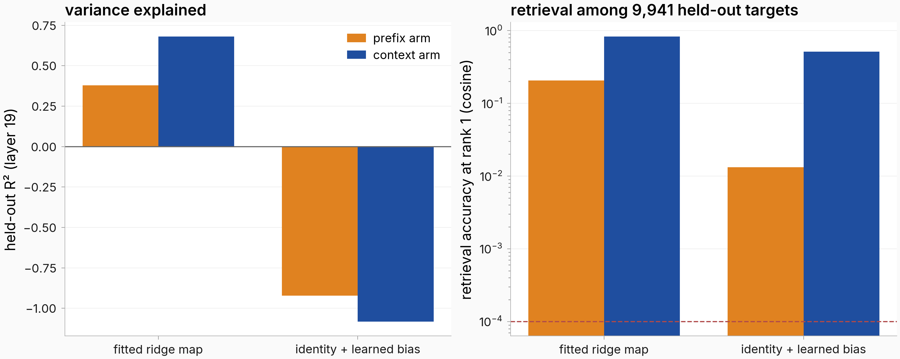

## Results

### Result 1: Does the mapping mostly fail at predicting **specific directions** or **specific contexts**?

**ANSWERED 2026-07-30, and the framing of the question was wrong: NEITHER. The failure is the INTERACTION — specific (context, direction) pairs.** The two-way decomposition this section previously recorded as never run has now run, on #1738's banked holdout (9,941 contexts × d=3,584, 12 cells = 3 arms × {L14, L19, L26} × {ridge, MLP}; `eval_results/issue_1482/twoway_residual/`, 0 GPU). Across all 144 (cell × k × normalization) combinations the EMS variance components are **interaction 0.804–0.935 (median 0.870)**, context 0.004–0.178 (median 0.078), direction 0.002–0.171 (median 0.035). The map does not fail at particular contexts, nor at particular answer directions; it fails at particular pairings of the two. **The two marginal reads below are shadows of a jointly-specified failure** — which is precisely why measuring them separately never resolved the question.

Two qualifications, both load-bearing. **The interaction verdict is stable; the split between the marginals is not** — it moves with both the normalization and k (raw: context 0.10 → 0.02 while direction 0.05 → 0.12 as k goes 16 → 256; per-direction-normalized: direction collapses to ~0.01–0.03 while context holds ~0.07–0.18). Neither marginal is a robust object, and that underdetermination is itself a finding: any single "contexts vs directions" number is an artifact of the normalization chosen. **The context share survives the answer-sampling floor** — the pre-registered confound. K-resample puts sampling noise at a mean 0.134–0.267 of per-context error, and the floor-corrected context share is 0.009–0.023 raw / 0.071–0.113 normalized, so the context component is small before *and* after removing target noise. (Estimator note: raw sum-of-squares shares are confounded by the (n, k) geometry — a structureless residual reads ~0.0625 context at n=4,971/k=16 — so EMS variance components are the registered primary read. The verdict is identical under both.)

- **Across contexts, the linear-vs-nonlinear gap is spread, not concentrated:** on #1482's 20k fresh holdout of the #779 n=963k map, the MLP beats ridge on **90.7%** of contexts (mean gap 0.055 R²-equivalent), and the top decile of |gap| carries only **30.1%** of the total — *less* concentrated than the 38.5% seed-noise reference (`eval_results/issue_1482/gap_decomposition.json`). Per-category mean gaps span only 0.045–0.073.
- **Across directions, the same gap is strongly structured:** per-direction R² bands over the top-256 answer-PCA directions (eigenvalues 172→0.38, ~460× span) give ridge **0.865 / 0.707 / 0.562 / 0.416** and MLP **0.900 / 0.786 / 0.677 / 0.554** for ranks 1–16 / 17–64 / 65–128 / 129–256 — the nonlinear advantage rises **3.9×** toward low-variance directions (Spearman 0.91 with rank; MLP wins all 256) (#1482 body; `perdirection_pca.json`). Replicated on the multi-turn corpus: context-arm MLP-over-ridge gap +0.023 (ranks 1–16) → 0.067–0.068 (65–256) (#1738 `perdirection/pdshrink_summary.json`).
- **A noise floor sits under the per-context read:** answer-sampling variance (K-resample) accounts for **33–40%** of per-context error on #1482's language arms, and a median **6.1%** on #1738's multi-turn corpus — so unexplained per-context variance in the multi-turn regime is mostly missing information, not sampling noise.

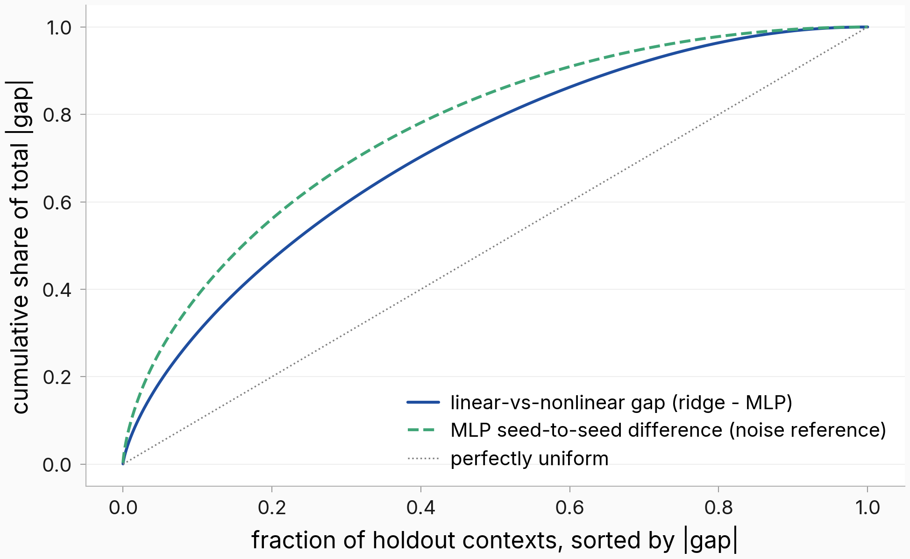

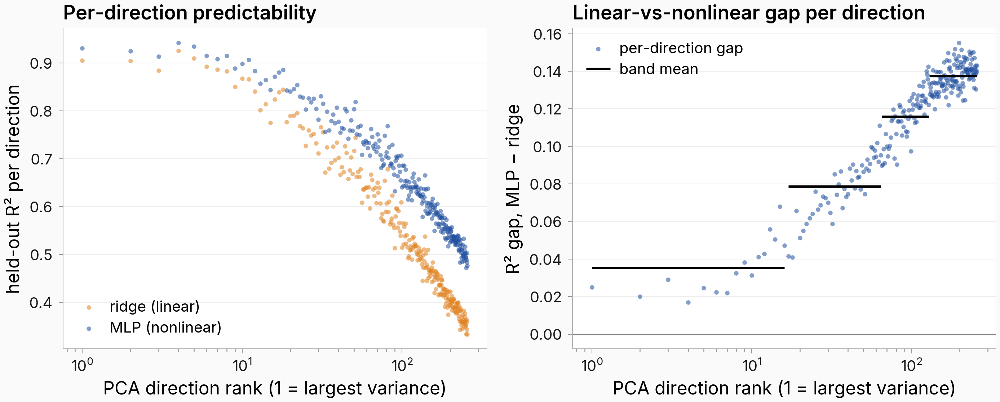

### Result 2: Characterization of worst-predicted directions

Setup: per-direction held-out R² along the answer-covariance eigenbasis; #779 regime = L19, n_train 10,000, 370 ranks, one shared basis across four fitters (`eval_results/issue_779/fitter-fair-comparison-n10k/perdirection_per_predictor_n10k.json`).

- **Predictability decays monotonically with variance rank; the observed ridge spectrum first touches zero at rank ~1,680 of 3,584 (still 0.354 at r199, 0.104 at r500), while the fitted noise-floor curve implies signal fully drowned by rank ~280 — the observed tail outperforms the flat-floor extrapolation.** (CORRECTED 2026-08-02: this bullet previously claimed a zero crossing "around rank ~200 (range 162–360)", which the by-rank values in this same bullet contradict.) Ridge R² by rank: 0.946 (rank 0), 0.711 (r50), 0.503 (r100), 0.354 (r199), 0.056 (r1000), ≈0.00 (r2000+). The worst-predicted directions are simply the low-variance tail — there is no known small set of high-variance "bad" directions.
- **Nonlinear fitters actively destroy the tail while buying whole-map R²:** the MLP reaches **−0.81** at rank 3480 with 137/370 directions negative, vs ridge's 35/370 (worst −0.02). KRR behaves like ridge (43/370). The +0.06 whole-map nonlinear edge is bought in the mid-spectrum and paid for in the tail.
- **Not a shrinkage artifact:** per-direction-tuned λ (38-value grid) leaves the band-gap excess at 0.1030 vs 0.1021 committed, and 163/256 tuned directions score marginally *below* the shared-λ arm — selection noise, not under-regularization (#1482 `perdirection-shrinkage-control/`; same null result on #1738).
- **The persona directions r_B are among the BEST-predicted:** they sit at the 99.7–99.9th variance percentile (equivalent rank 2–12) and are predicted at R² **0.79 / 0.87 / 0.80** (evil / sycophancy / hallucination; 0.858 / 0.941 / 0.878 in the n10k regime) vs a ~0.56–0.58 random-direction band. But **17–45% of r_B mass lies beyond the map's top-100 output directions**, and the hallucination trait corpus's largest variance direction is anti-aligned with r_B (cos −0.42) (#779 body; `figures/issue_779/h_perdirection_r2.png`).
- **Null space / co-kernel (the only direct read, #1774):** **19–27% of each trait direction's answer-side mass lies outside the context map's rank-k90 range** (λ-sweep spread 0.06–0.10). Causal inertness of those kernel directions is **untested** — the addition-steering positive control failed (dose an order of magnitude below decode noise). The 2026-07-28 null-space consolidation (`docs/ideas/2026-07-06-context-answer-map-analyses.md` L986–1016) cautions that with ridge fits most of "the null space" belongs to the estimator, not the model: the #1092-regime operator is numerically full-rank but effectively low-rank (stable rank 3.7–24, k50 = 10–89, k90 = 355–767, top-50 directions carrying 40–67% of Frobenius energy) — a heavy ~3,000-direction tail carrying <10% of energy, no exact kernel.
- **As an endomorphism the map rotates trait content away rather than deleting it:** trait directions pass through with gains 0.60–0.64 and cosines 0.07–0.41 — **99.6% of their output mass leaves the three-trait span**; the operator is a stable strongly non-normal contraction (spectral radius 0.910, eigenvector condition number 4,519) (#1774).
- **CLOSED 2026-07-30 — the residual SVD ran, and it refutes the hypothesis this report offered.** (`eval_results/issue_1482/twoway_residual/{residual_spectrum,residual_consistency,residual_alignment}.json`, all 12 cells, fp64 Gram → eigh, 0 GPU.) **(i) The residual is neither low-rank nor diffuse — it sits strictly between two matched references.** Participation ratio observed **48–181**, against an isotropic reference of 2,315–2,426 and a target-covariance reference of 33–42; in 12 of 12 cells the ordering is target-covariance < observed < isotropic (top-16 energy share 0.193–0.410 vs 0.015–0.019 isotropic and 0.468–0.527 ambient). The isotropic reference is what makes this statable: at n=9,941/d=3,584 the Marchenko–Pastur edge alone puts the top eigenvalue ~2.6× the mean, so a decaying spectrum read as "structured" without it would have been an artifact. Deconvolving the K-resample floor (0.123–0.273 of residual energy; isotropic noise subtracts in closed form) moves the participation ratio 45–164 → 40–135 — more concentrated, still nowhere near the target-covariance reference. **(ii) The top residual directions are NOT smeared across the existing bases — this report's stated hypothesis was wrong.** Each of the top 32 spans a participation ratio of only **5–15 ranks** of the target-covariance PCA basis and 10–19 of the map's gain basis, against a random-direction null of 342–351 and 339–348. They are sharply localized in exactly the bases #779/#1482/#1738/#958 and #1774 already use; what makes the residual diffuse in aggregate is that there are *many* such directions, not that any one is spread out. **(iii) The residual subspace is a stable object, with no structure beyond its second moment.** Disjoint-half subspace overlap is 0.710–0.956 against a random floor of 0.002–0.072 (100–400× chance), so the "direction component" is real — but against a Gaussian reference carrying the observed covariance and nothing more (0.759–0.977) the observed value sits 0.049 below to 0.004 above it. The halves agree exactly as much as a shared covariance alone predicts.
- **CLOSED 2026-07-30 — what the WORST-predicted directions are, and they are not where the null-space story predicts.** Taking the 20 worst by held-out R² among the top-256 target PCs (mirroring #1774's top-20 highest-gain convention at the other end): **they live in the map's HIGH-gain subspace**, carrying 0.413–0.469 of their squared mass in its strongest 256 gain directions (5.8–6.6× enriched over even spread) and 18–23× *depleted* in the weakest 256. The map drives these directions hard and gets them wrong — they are not in its null space, which cuts against reading #1774's co-kernel result as the explanation for what is badly predicted. **They align with nothing legible:** trait directions max |cos| 0.043–0.044, *below* the random-unit null's max of 0.057; SAE decoder columns max |cos| 0.107–0.141 against a matched null (max |cos| of a random unit vector over the same 131,072-atom dictionary) of mean 0.076 / max 0.095 — a real but modest ~1.6× enrichment, and the matched null is load-bearing since the naive 1/√d reference would have inflated the same number to ~7×; logit-lens decoding returns incoherent token mixtures (code fragments, multilingual subwords, rare tokens) with no semantic theme. All 20 fall in PC indices 208–255 across all three arms (14–17 shared), i.e. they are simply the low-variance tail of the retained prefix, consistent with the monotone variance-rank finding above.
- **What does NOT exist — narrowed 2026-07-30, the earlier phrasing overstated the gap.** Spectral analysis of these maps is extensive, not absent: #1774 computes per-arm **channel spectra** via a λ-free cross-covariance SVD (held-out predictable variance per channel, at three layers, with cross-arm principal angles), the **co-kernel** decomposition behind the 19–27% figure above, and a full **endomorphism** read (eigendecomposition, spectral radius, non-normality gap, top-20 right-singular directions reported with gains 4.1–10.7 *and* their trait alignment, which is near zero). So "which directions are badly predicted" already has an answer in **two** bases — the target-covariance eigenbasis (#779/#1482/#1738/#958 per-direction R²) and the cross-covariance channel basis (#1774) — and the map's own top singular directions have been alignment-characterized. Three specific things remain: (a) an SVD of the **residual matrix V−V̂ itself**, whose principal directions need not coincide with either existing basis and could be smeared across many ranks of both; (b) the **cross-context consistency** of those residual directions; (c) alignment characterization of the **worst**-predicted directions — #1774 did this for the highest-gain singular directions, and #779 for r_B, but both are the well-predicted end.

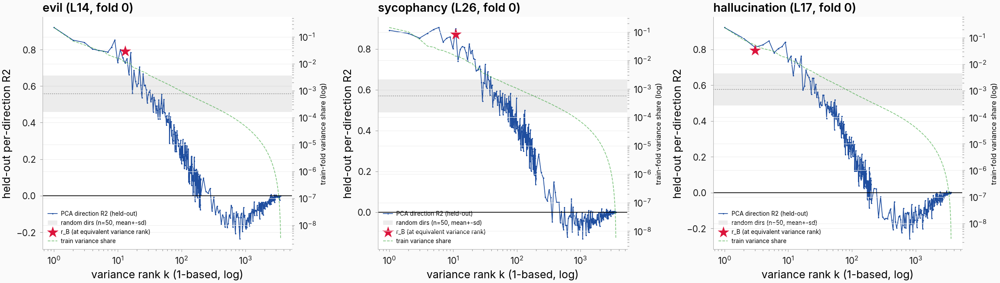

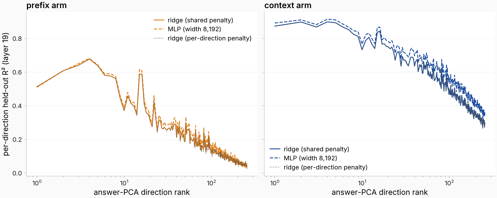

### Result 3: Characterization of worst-predicted contexts

Setup: judged taxonomy of nerr on #1482's n=19,967 labeled holdout (single-turn n1M map, ridge; all 15 contrasts BH-significant) and #1738's n=9,941 multi-turn holdout (22 contrasts per arm); numbers below re-read from `eval_results/issue_1482/taxonomy.json`, `h1_contrast.json`, `eval_results/issue_1738/taxonomy.json` at compose time.

- **Worst categories (single-turn, mean nerr; overall ≈ 0.28):** topic:other **0.350** (ratio 1.23×), **translation 0.337** (1.19×), **NSFW 0.325** (1.14×), refusal-adjacent 0.320 (1.13×), answer-is-refusal 0.320, **harmful requests 0.314** (1.11×), roleplay 0.310 (1.09×). **Best:** chitchat/social **0.235** (0.82×), creative writing 0.257 (0.88×), math 0.266, WildChat rows 0.276.
- **AMENDED 2026-07-30 — the refusal entries above do NOT survive floor adjustment; treat this raw ranking as floor-confounded.** The raw ranking subtracts no answer-sampling noise, and the categories differ in how noisy their targets are. A floor-adjusted rerun on the 2,000-context K-resample subsample (`eval_results/issue_1482/floor_adjusted_taxonomy/`, joined against the banked per-context floors at `issue1482_kresample/analysis_tensors/percontext_floor.npz`; identity gate reproduces the parent floor means 0.09354 / 0.11016 exactly, zero language-join mismatches; a second orthogonal parent-join gate added afterwards compares the floor array's `nerr_stored` against the parent fit's `holdout_nerr` row-by-row over all 2,000 joined contexts and reads **median and max relative deviation of exactly 0.0** against a 1e-3 threshold — the columns are bit-identical, so the join is confirmed outright and the contrast results are unchanged by the check) flips **8 of 18 contrasts in sign**. Specifically: **refusal-adjacent LOSES significance** (raw +0.048 significant → adjusted −0.005 n.s.) and **answer-is-refusal REVERSES** from significantly harder to significantly *easier* (+0.047 → **−0.029**, both significant) — refusal answers are intrinsically dispersed, so most of their apparent error was target variance, not map failure. **Translation (+0.045 → +0.063), coding (+0.020 → +0.035), code-format (+0.035 → +0.046) and topic:other (+0.065 → +0.086) all STRENGTHEN** and gain significance — genuinely hard. Caveats binding this amendment: n=2,000 not 19,967 (much lower power, several newly-significant rows are small-n), and the subsample is 1,000 English + 1,000 non-English **by construction**, which is not the corpus mix — so these adjusted deltas are not drop-in replacements for the raw ranking. What they establish is that the topic contrasts are floor-sensitive, which was the open question.
- **The registered language hypothesis was FALSIFIED:** non-English contexts are predicted *better*, Δ(en − non-en) = **−0.0175** [−0.0221, −0.0129] (en 0.291 vs non-en 0.274, n=13,106/6,861); the K-resample floor adjustment *widens* it to −0.034, killing the entropy account. Per-language spread is 10× the binary gap: German 0.236 → Arabic 0.420.
- **Multi-turn, per arm (#1738):** the **context arm has almost no category structure** (most contrasts ≤0.03; translation, refusal, code slightly worse; chitchat, prose better). The **prefix (history-only) arm's errors concentrate where the final query pivots away from the history** — chitchat +0.084, English +0.079, translation +0.071 — and it is *best* on continuation-heavy genres (WildChat −0.131, NSFW −0.104, creative writing −0.069, roleplay −0.046). The bare-query arm is close to the mirror image (roleplay +0.104 and deep threads hardest). Floor-adjusted reruns reproduce every shared significant sign for the prefix arm.
- **The single best per-prefix difficulty predictor is whitened within-prefix spread** of context vectors: ρ = **+0.93** (instruct) / +0.89 (base) with per-prefix error, surviving length control (partial +0.78/+0.69) — this superseded the earlier "prefix length is the difficulty axis" read (2026-07-22 whitened replication, `eval_results/issue_1092/inline_spread_whitened_strata/`). It is a general difficulty axis (per-row context map +0.93, prefix-end +0.81), while the averaging-specific Jensen/curvature gap tracks *raw* spread instead — the two theory ingredients dissociate. Known hygiene caveat: 52 one-turn prefixes carry duplicated content across prefix-grouped folds.
- **Badly-predicted contexts are flaggable before generation:** the severe adverse tail concentrates where the answer distribution is intrinsically dispersed (0.6% → 10.0% across dispersion quintiles, logistic AUC 0.751), and dispersion is itself linearly predictable from v_C (#1073, completed).
- **Out-of-family framings break the map outright (boundary, not tail):** narrative-story framing of the *same* conversations collapses the map to R² **−0.31** (teacher-forced) / **−0.55** (on-policy story answers) vs chat +0.24/+0.53 — an estimator-level failure of the story context coordinates; the story operator reparameterizes back into chat at 0.56–0.61 (#1345). The map also fails for the user turn (ridge negative), generic stories (≈0.16), and generic next-span prediction (0.05–0.10) (#825), and fiction transfer is dominated by an author-level component (#931).

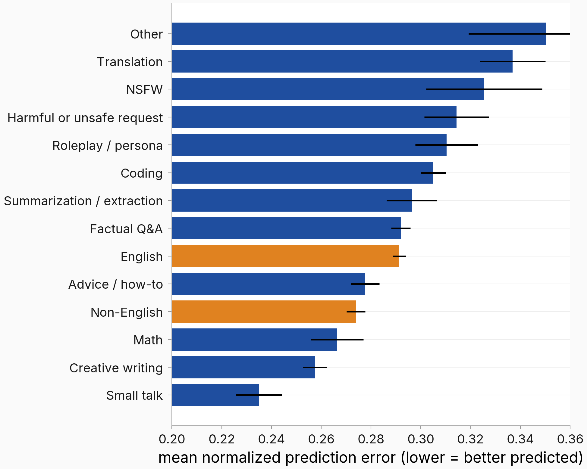

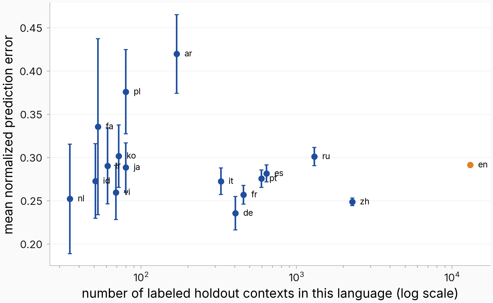

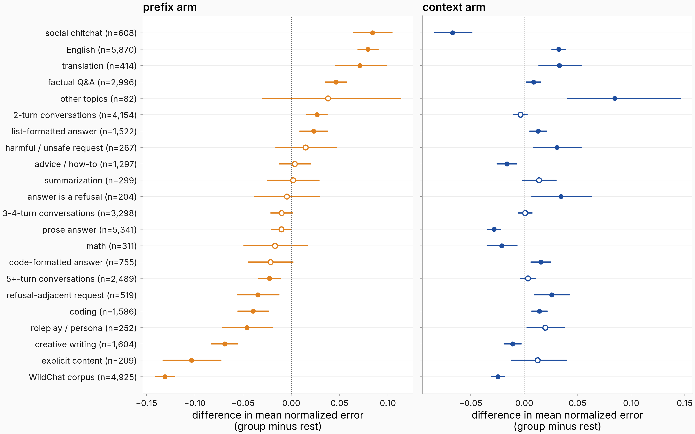

### Result 4: SAE feature → SAE feature mapping + worst-predicted SAE features

Setup: SAE features of the context (8,192 most-active) → mean-pooled SAE features of the answer (16,384 most-active), ridge, on the #779 963k corpus (120k fit / 20k holdout) (#1482 `sae_perfeature/`); replicated on #1092's crossed core (55,204 active features, n=4,752) and #1738's multi-turn corpus (both arms). Pooled/per-feature R² re-read from `unit_ridge__sae_ctx.json` and `sae_arm/sae_fits.json` at compose time.

- **The SAE→SAE map exists and is nearly as good as the dense map, and dense input beats the sparse code everywhere:** context-features → answer-features pooled R² **0.690** (mean pooling; max 0.359, fraction-active 0.540) vs dense-input ridge **0.722** and dense-input MLP **0.739** — sparsifying the input costs ~0.03 (#1482). Multi-turn: SAE prefix/context **0.359 / 0.638** vs dense 0.451 / 0.700 (#1738). Crossed core: context 0.889, encode-then-averaged 0.926, prefix-end 0.078, bare query 0.023 (#1092).
- **ADDED 2026-07-30 — the third arm, completing prefix / bare-query / context in SAE space.** The SAE grain was the only per-arm read in #1738 missing a bare-query cell; it now exists (`eval_results/issue_1738/bare_query/sae_arm/`, VM CPU, 0 GPU, no re-capture — the parent's stored bare states re-used). **sae_bare mean-pooled 0.5052** [0.4984, 0.5117] against banked prefix 0.3589 and context 0.6376, so the bare query recovers **79.2%** of full-context transport in feature space versus the prefix's 56.3% — **essentially the dense split (78.4% / 55.7%), so the ratio structure survives the sparse re-basis.** Same ordering at every pooling (max 0.2556 / 0.1709 / 0.3169; frac 0.3492 / 0.2409 / 0.4771), CIs disjoint throughout, and the dense→feature counterpart reads 0.5543 vs 0.4511 / 0.7003. Reproduction check worth noting: all eight pre-existing cells were re-fit in the same run and returned **bit-identical** to the banked GPU numbers, with the feature restriction reproducing exactly — the only thing that changed is the input state. Baselines: kNN cosine acc@1 0.0545 (median rank 125) vs prefix 0.0130 / context 0.2380, chance 1.006e-4; identity+bias −2.83 on the shared feature-id subset against the fitted map's 0.6235, and the fitted map dominates identity+bias on *both* reads for all three arms — no #722-style dissociation here.
- **SETTLED 2026-08-01 (#1946, HIGH confidence): the mirror image DOES survive the sparse re-basis.** Measured per-CONTEXT in SAE space — the object the per-feature read could not speak to — the prefix−bare category difference pattern correlates **0.855** across SAE and dense space (Spearman, p < 1e-4 over 10,000 shuffles; 18 of 20 category signs agree), and per conversation the prefix−bare error difference correlates **0.710** across spaces (n = 9,941), a converging read free of the category-mask overlap caveat. Attenuation localizes to the *input encoding*, not the target: dense inputs with SAE-feature targets keep the pattern at 0.946, with max-pooled and active-fraction readings at 0.914 and 0.837. So bare-fails-where-the-thread-lives-in-the-history and prefix-fails-where-the-query-pivots is a property of the information each arm carries, not an artifact of the dense coordinate system.
- **Why the per-feature read below could not settle it, retained as a methodological note.** Per-feature held-out R² correlates bare-vs-context at Spearman 0.975 and bare-vs-prefix at 0.884, with median deltas decomposing as context−prefix 0.0685 = (context−bare) 0.0232 + (bare−prefix) 0.0405 — i.e. in *feature* space the bare arm reads as a mildly degraded context arm rather than the prefix's complement. But the mirror-image claim in Result 3 is a per-CONTEXT statement (bare fails where the thread lives in the history; prefix fails where the final query pivots away from it), and this round measured per-FEATURE error. The two are not the same object and the second does not test the first. A per-context error read in SAE space is the follow-up that would settle it.
- **The pooled number rides on high-variance features: the median per-feature R² is only ~0.13.** Median rises 0.091 → 0.266 across activity deciles; share below zero falls 16.5% → 1.6%.
- **What makes a feature unpredictable is an answer-side property** (Spearman 0.93 between context-features-input and dense-input per-feature rankings): the dominant correlate is **within-answer consistency, ρ = 0.60** — twice activity's 0.29, partial-given-activity 0.58, holds in all 10 activity deciles and at layer 3 (ρ 0.68) and layer 20. Most features are phasic (median consistency 0.007); a phasic feature's mean-pooled target is dominated by *where* it fires, which the context does not determine. On #1738 the context-over-prefix per-feature advantage likewise correlates with consistency (0.48) above activity (0.32).
- **Worst-tail exhibits (cherry-picked from `interp_digest.json`):** feature 2651 (R² **−3.4**, keyword-list/enumeration requests), 12614 (−2.7, song-rewrite/ASCII-art creative prompts), 9325 (−2.4, templated "write an article about X" chemical prompts), 63861 (−1.5, competitive programming). **Most negative per-feature R² is mechanical:** the label-shuffle null is itself negative everywhere (median ≈ −0.07); 98.2% of the 16,384 features beat their own null band, leaving a small genuinely anomalous residue (~0.8%).
- **Best-vs-worst contrast (judged, n=300+, activity-controlled Set B included):** best-predicted features skew abstract (54.7% vs 21.3% judged high-abstraction, OR 3.9) and persona-labeled (20.0% vs 4.7%, OR 4.9), and better-predicted features are more r_B-aligned (decoder–r_B Spearman +0.203). **Two caveats bind:** across the full panel judged abstraction does *not* predict per-feature R² (the tail contrast partly rides activity, p=6.9e-10), and the judged persona contrast is **carried by language and register, not identity** — the 40 persona-labeled features split 20 language / 11 register / 9 identity, and on identity alone the contrast vanishes (2/150 vs 4/150). This is the #1482 language-identity confound; the judged-label instrument (#1773) subsequently FAILED its neighbour-discrimination bar (0.322 vs 0.50) and **judged feature labels are frozen since 2026-07-28** — semantic characterization of worst features is blocked pending a validated instrument (two evidence packets, 377 + 540 features, are banked awaiting it). **Strengthened 2026-07-30:** #1773's batteries had dropped 46–66% of items to a 400-token response cap (rule-23 truncation censoring), so every one of those numbers was a censored-subset mean. A re-judge at max_tokens=1000 against a fresh cache recovered 2,767 of 3,518 dropped items (discrimination drops 1,036 → 77) and moved the estimates DOWN, not up: discrimination **0.322 → 0.317**, detection **0.704 → 0.689**, fuzzing **0.694 → 0.676** — the latter two now BELOW their 0.70 bars, so the instrument fails three of five conjuncts rather than one. Shuffled controls stayed at chance (0.505 / 0.500). The freeze is better-supported, not weaker (`eval_results/issue_1773/rejudge_1000tok/`).
- **ADDED 2026-07-30 — most of the dictionary is too thin to describe, which bounds how far any per-feature story generalizes.** The 16,384-feature restriction used throughout this report is an activity floor, and a full-dictionary pass (#1773 full-dict phase 0 + evidence pass A, all 131,072 layer-19 features, same 120,000-row fit corpus; wiring gate against the committed #1482 key at exactly 0.00e+00) measured what lies below it. **128,512 features (98.0%) fire at least once; 2,560 (2.0%) are dead on this corpus** — zero activating rows, exactly matching phase 0's independently-derived dead set. Activating-window counts per feature run p0/p5/p10/p25/p50 = **0 / 2 / 6 / 60 / 60**: only **75.3% reach the full 60-window budget**, 78.4% clear the 40-window evidence quota, and **21.6% (28,285 features) sit below it** with the bottom decile at ≤6 windows. **DEFINITIVE (pass C complete, 2026-07-31): evidence fill 0.7523, gate FALSE, missing the ≥0.99 bar #1773 met (0.9957) on the restricted set by 23.8 points.** Pass A's ~0.78 projection was right to within 2.8 points; pass C is worse because it additionally drops 14,080 non-activating windows that fail verification. Final three-way stratification over 131,072: full-evidence (≥40 windows) 99,056 = **75.6%**; thin (1–39) 29,456 = **22.5%**; zero 2,560 = **1.95%** (exactly the projected dead set — the movement was entirely full → thin, 3,731 features). Over the 128,512 features actually dispatched the fill is 0.7673. One definitional correction: `evidence_short` is a **four-quota** test (ev_pos<40 OR ho_pos<20 OR ev_neg<20 OR ho_neg<6), not a single window count — 32,016 of 32,460 shorts fail on activating evidence, but 444 carry the full 40 and miss a holdout or negative quota. This is the same tail where #1482 measured per-feature R² to be worst (median 0.091 in the lowest activity decile, 16.5% below zero), so *thin evidence and poor predictability co-occur*: the features hardest to describe are also the ones the map cannot predict, and neither fact is independent evidence about the other. Interpret the restricted-set results in this report as conditioned on the top 12.5% of the dictionary by activity.
- **Granularity gradient (matryoshka SAE, layer 20):** per-feature median R² falls **0.435 → 0.174 → 0.043** from general to specific tiers (survives activity stratification; reverses in the two lowest-activity quintiles). A pile-trained twin reconstructs chat worse (FVE 0.71 vs 0.80) yet reads slightly *more* predictable — coarse features are shared across training corpora (tier-0 decoder match cosine 0.57 vs 0.08 at tier 2).
- **RESOLVED 2026-07-30 (was "failed cell"): the sparse-input arm has NO nonlinear advantage — ridge beats the MLP.** The SAE→SAE MLP had diverged catastrophically (pooled R² −1e10 to −6e13 across poolings) while healthy on dense input (0.739). The cause was the input, not the optimizer: the sparse design's second block (`psi_last`, 8,192 of 16,384 columns) is **96.8% below the parent activity floor**, with 5,772 zero-train-variance columns, a median train sd of 1e-9, and 62 columns carrying zero train but nonzero holdout variance — standardizing those divides by ~zero. Applying the activity floor to the INPUT columns repairs the fit (8,454 columns kept). Against ridge **on the identical restricted design**: mean-pooled **MLP 0.676 vs ridge 0.688** (full-design ridge 0.690), frac **0.477 vs 0.538** — ridge wins both; max-pooled **MLP 0.376 vs ridge 0.358** is the lone MLP win. So the dense arm's nonlinear edge (0.739 over 0.722) **does not reproduce in feature space** at the primary pooling. Artifacts: `eval_results/issue_1482/sae_sae_mlp_recovery/{diag,ladder,ridge_matched,final}.json`.

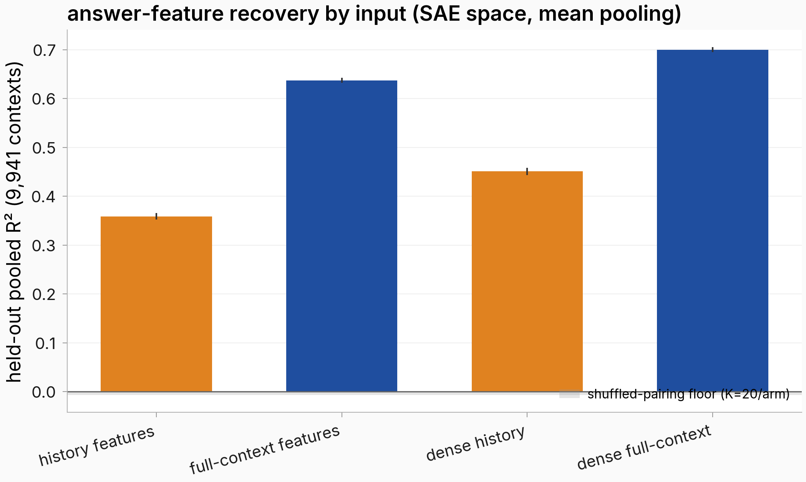

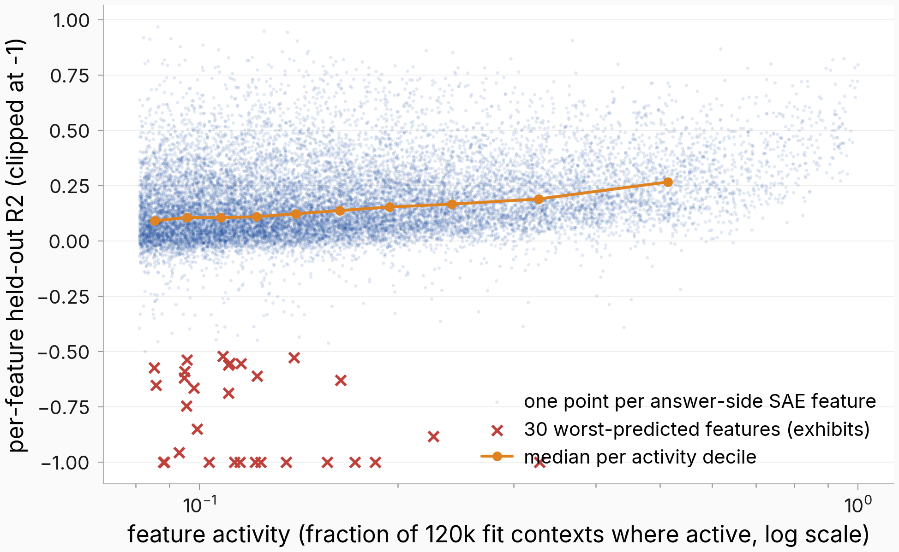

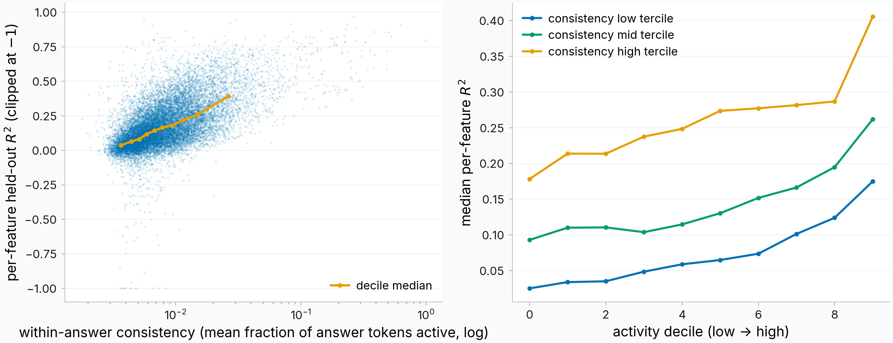

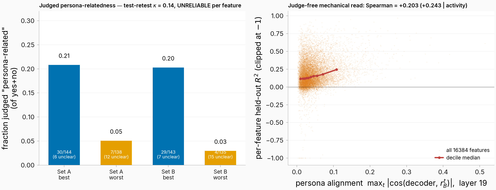

### Result 5: Prefix end state vs query end state — what differs in what's predictable

Setup: all arms scored against the SAME pooled answer target on the same rows (matched-target; the 2026-07-16 incident where the two arms were scored against different targets was rebuilt in `eval_results/issue_1092/inline_fair_comparison/fair_comparison.json`, re-read at compose time). Four-arm numbers from #1774 (t1 target, L14, 17,308 battery-excluded rows, novel-prefix 6-fold).

- **The headline matched-target ladder (single-turn, per-row grain):** full context **0.812** · bare query **0.717** · pre-query prefix-end **0.021** · query-averaged prefix input **−0.018** (#1774); #1092's twin reads prefix 0.0651 vs context 0.8142. The prefix arm's averaged-grain 0.371 is a target-variance artifact — averaging ~17.4 queries per prefix removes the 84.8% within-prefix variance the prefix-end state cannot see; its hard structural ceiling is the between-prefix share (0.10–0.15).
- **Regime ladder — how much the prefix carries depends entirely on what the prefix IS:**

  | regime | prefix R² | context R² | prefix share |
  |---|---|---|---|
  | #1774 single-turn, genuinely pre-query prefix (L14) | 0.02 | 0.812 | ~2% |
  | #1092 single-turn, crossed corpus (L14) | 0.065 | 0.814 | ~8% |
  | #928 thinking model, full-answer target | 0.04 | 0.71 | ~6% |
  | #1738 multi-turn, prefix = real conversation history (L19) | **0.379** | 0.681 | **~56%** |

  A single-turn persona prefix carries almost nothing; a real multi-turn history carries about half — and improves with depth (0.358 at 2 turns → 0.390 at ≥5) while the context arm stays flat, with **no crossover at any depth**. The SAE re-basis reproduces the same ~56% share (0.359/0.638), so the asymmetry is a property of the representation, not the coordinate system.
- **What the prefix-end state's residual skill IS: persona-average signal with NO trait content.** Its per-trait predictions read −0.13 to +0.16 along the trait directions (vs bare query 0.74–0.83, full context 0.87–0.92), at 11.7–16.8× decode-noise floors — so ≈0 means unpredictable, not noise-limited (#1774). Yet at the *behavior-disposition* level the prefix-end state reads at parity with the averaged object (sycophancy r 0.759 vs 0.774; hallucination 0.888 vs 0.887), and the raw r_B projection **inverts** the parity (prefix-end r 0.665 vs 0.037 averaged): persona signal sits r_B-shaped before the query, is rotated into other directions once the query is read, and the fitted map transports it back (#1092 prefix-end monitoring).
- **Operator geometry:** the prefix and context operators **write into a shared output subspace (22–34° vs ~78° null) but read near-orthogonal inputs (83–84°, at the null)**; prefix predictions are a near-uniform ~0.6× shrinkage of the context arm's, worse on 100% of 996 prefixes (median error ratio 2.25×), and the prefix ridge sits at-or-below its diagonal-affine transport floor in most cells — essentially no answer-content transport beyond target statistics (#1092). A disjoint prefix + bare-query stitch recovers 0.849 of the full-context 0.914; a rank-32 bilinear prefix×query interaction closes 93% of the remaining gap (#1775). Variance shares: **query 79% / prefix 11% / interaction 10%** (dense core, L14 pca48; ambient-basis shares differ — 72/10/18 — name the basis when quoting).
- **Worst-predicted DIRECTIONS invert between arms:** on multi-turn, per-direction R² for the prefix arm *rises* toward low-variance bands (0.513 → 0.678 across ranks 1–16 → 129–256) while the context arm stays ~0.87–0.90; the top-variance, query-driven directions are exactly what the prefix lacks. The nonlinear component also lives in the context arm: prefix-arm MLP gaps are +0.008–0.027 (near linear-complete) vs context's +0.023–0.068 (#1738 `pdshrink_summary.json`; note the single-turn #1482 context profile *falls* 0.87→0.42 over the same bands — the level profile is corpus-dependent, the gap structure is not).
- **Worst-predicted CONTEXTS invert between arms** (Result 3): prefix errors peak where the final query pivots away from the history; bare-query errors are the mirror image; context errors are nearly category-flat.
- **SAE feature grain:** 39,912 answer features are predictable only from the composed context vs **21** from the prefix alone and 1,510 from the bare query (τ=0.1, #1092 crossed core); the context advantage holds on **99.7%** of features on multi-turn (#1738). The prefix-driven feature tail is real but mundane — dense high-frequency latents with no trait-direction enrichment.
- **Pre-image view (#1615/#779 prefix twin):** projections of the persona-vector pre-image M⁺r_B onto prefix-end states track judged trait expression at Spearman +0.92 / +0.70 / +0.83 (evil/syco/hallucination; 9 conditions) vs +0.95 / +0.98 / +0.98 for the matched context arm — but with cross-trait leakage (hallucination's pre-image ranks 8 evil prefixes above its own top prefix).

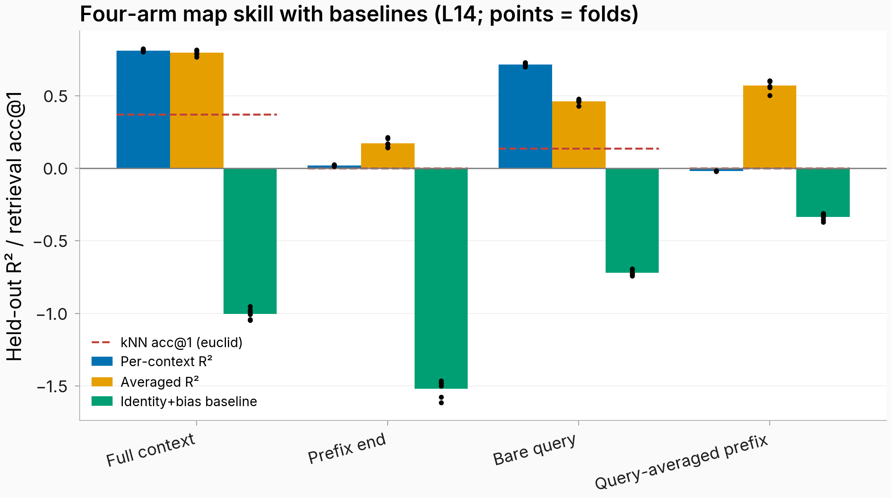

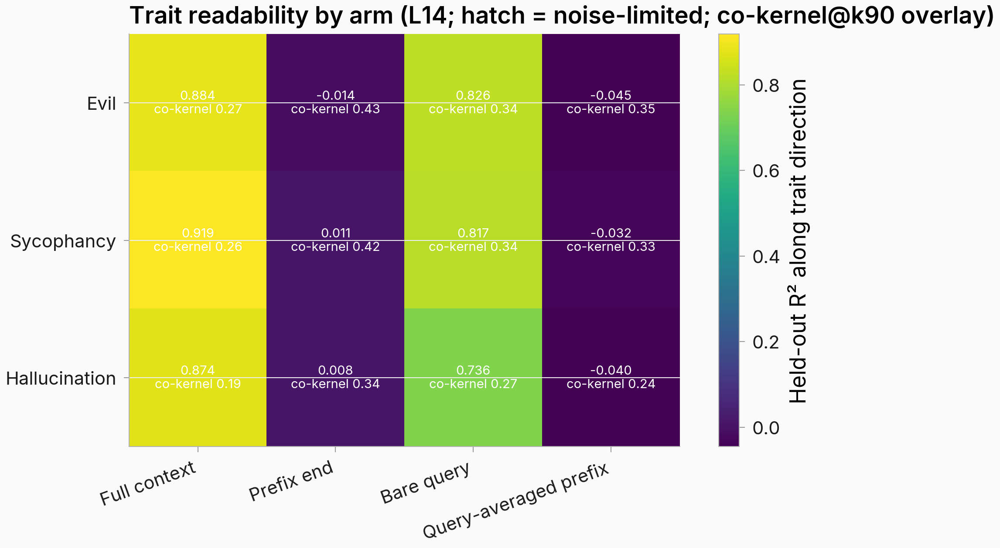

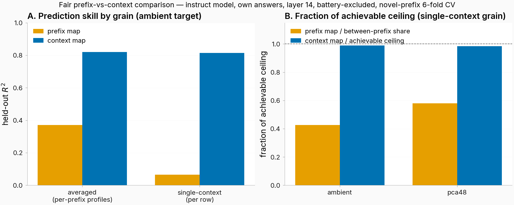

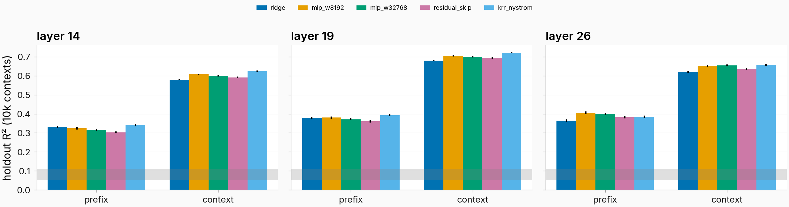

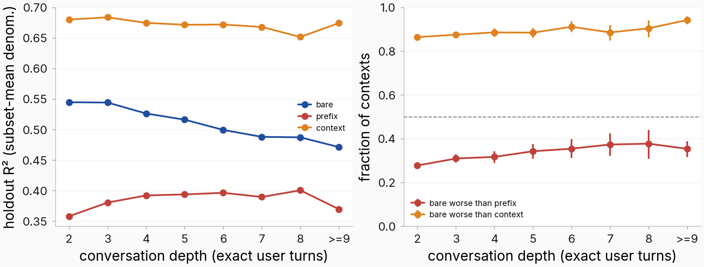

## Conclusion and takeaways

1. **The map's failure is not a mystery tail of weird contexts — it is (a) the low-variance half of the answer spectrum and (b) whatever the input state hasn't seen.** Per-direction R² decays monotonically, first touching zero around variance rank ~1,700 of 3,584 (fitted-floor-implied crossing ~280; corrected 2026-08-02); per-context error has real but modest category structure (max ratio 1.23×) spread across the corpus.
2. **Linearly vs nonlinearly:** nonlinear fitters add ~+0.06 whole-map R² (0.754 → 0.813 at n=963k), spread over 90.7% of contexts and concentrated 3.9× in low-variance directions — while actively *destroying* the deep tail (MLP −0.81 at rank 3480). The prefix arm is near linear-complete; the nonlinear component is a context-arm phenomenon, and 93% of the additive-stitch gap is a rank-32 bilinear prefix×query interaction.
3. **Worst contexts from v_C:** translation, NSFW/harmful/refusal-adjacent, roleplay, and "other" (single-turn); near category-flat on multi-turn. Non-English is *better* predicted (registered hypothesis falsified). The strongest per-prefix difficulty predictor is whitened within-prefix spread (ρ +0.93), and badly-predicted contexts are flaggable pre-generation from v_C (AUC 0.75). Out-of-family framings (narrative story, user turns) break the map entirely — a boundary, not a tail.
4. **Worst directions from v_C:** the low-variance tail; the persona directions r_B are among the best-predicted (R² 0.79–0.94 at variance rank 2–12), but 17–45% of r_B mass lies beyond the top-100 output directions and 19–27% outside the map's k90 range, and the operator rotates 99.6% of trait output mass out of the trait span.
5. **From the prefix-end state, everything except persona-average signal is unpredictable in single-turn** (R² 0.02 vs 0.81, no trait content at 12–17× decode-noise floors) — but this is mostly *missing query information*, not map failure: a real multi-turn history recovers ~56% of the context arm, improving with depth, and the prefix arm's worst directions/contexts are precisely the query-driven ones (inverted structure vs the context arm).
6. **SAE grain reproduces all of it** (context 0.690 pooled vs dense 0.722; prefix/context share ~56% on multi-turn; context advantage on 99.7% of features) and adds the one clean feature-level law found so far: **per-feature predictability is an answer-side property dominated by within-answer consistency (ρ 0.60)**, with a general→specific granularity gradient (0.435 → 0.043 across matryoshka tiers). Semantic characterization of the worst features is blocked on a validated labeling instrument (#1773 failed its discrimination bar; labels frozen 2026-07-28).

## Next Steps

Gaps found by this sweep, roughly ordered by information-per-GPU-hour:

1. ~~**Two-way residual decomposition (context × direction)**~~ — **DONE 2026-07-30** (Result 1): the interaction dominates at 0.804–0.935; neither marginal is a robust object.
2. ~~**SVD of the residual matrix V−V̂**~~ — **DONE 2026-07-30** (Result 2): spectrum sits strictly between isotropic and target-covariance references; top directions are sharply localized in the existing bases rather than smeared; the subspace is stable across context halves but carries no structure beyond its second moment; the worst-predicted directions sit in the map's high-gain subspace and align with nothing legible. **ANSWERED 2026-08-01 (#1945): the interaction is per-pair noise, and the map is near its information ceiling.** Pointing #1775's bilinear machinery at the residual's (context × direction) pair space finds structure that is statistically real and materially negligible: the held-out interaction R² curve clears all 400 null draws in both families (add-one p ≤ 0.005) but **peaks at 0.0013 — 0.13% of interaction variance against a 0.10 materiality floor**. The residue is rank-one and reproducible (all 8 held-out blocks peak at rank 1, 0.0011–0.0014; both fold halves agree; all 24 log-space units across 12 cells return the same verdict) and weakly input-recoverable (map-output features beat the pairing-permutation null in 24 of 24 fold-cells). So the dominant interaction component is **not** a low-rank bilinear form waiting to be fit — it is per-pair noise to within a trace rank-one residue. Combined with Result 2's spectrum finding, this closes the line the report opened: the map is not underfit in a recoverable way on this input, and a richer functional form over the same context vector will not help.
3. **Causal test of the co-kernel** — #1774's addition-steering positive control failed on dose; kernel-direction inertness (LEACE-erase / inject) stays untested. This is the paper's promised "null space" deliverable.
4. **Validated SAE feature labels** (#1773 rebuild or human-audited identity precision gate) → unfreeze semantic characterization of worst features; two evidence packets (377 + 540 features) are already banked.
5. ~~**Fix the SAE→SAE MLP divergence**~~ — **DONE 2026-07-30** (see Result 4): repaired via an input-side activity floor; the answer is that ridge beats the MLP on the sparse arm at mean pooling, so there is no feature-space nonlinear advantage to recover.
6. **Corpus hygiene before paper:** 52 duplicated one-turn prefixes leak across #1092's prefix-grouped folds; the 50k split's contamination audit was lexical-only (semantic paraphrases unscreened; the deduplicated citable numbers are ridge 0.754 → MLP 0.810, #1775).
7. **Parked/running work that extends this report:** #1739 (behavior prediction through the map — running; interim: map arms don't beat direct ridge in-distribution, clearest value under distribution shift), #1515 (rank profile of the orthogonal own-answer carrier — proposed), #1491 (model-scale sweep 0.5B→32B — plan_pending), cross-family reproduction (paper TODO, never run).

## Provenance

Compiled 2026-07-30 by a 4-agent repo sweep (task bodies · eval_results/scripts · docs/theory · SAE + prefix-arm threads) plus compose-time re-reads of: `eval_results/issue_779/fitter-fair-comparison-n1m/n1m_fits.json` (commit 507bf182f6), `eval_results/issue_1092/inline_fair_comparison/fair_comparison.json` (8fcb896cb4), `eval_results/issue_1482/{taxonomy,h1_contrast}.json` (d747f3f2ef), `eval_results/issue_1482/sae_perfeature/unit_ridge__sae_ctx.json`, `eval_results/issue_1738/sae_arm/sae_fits.json` (9a91a4f3af, 2026-07-30). Primary task bodies: #779, #1482, #1738, #1774, #1775, #1776, #1092, #1615, #1345, #825, #1073, #952, #1072, #1773 (statuses as of today: mostly `awaiting_promotion`; #1738/#1768 `followups_running`; #1739 `running`). Known caveats carried: #1738 dense fits are a partial rebuild (holdout values sound); #825 has one Takeaway flagged refuted (#1705, unresolved); #1092 battery-exclusion moved banked values by ≤0.036; all #1092-era "prefix map ≈ 0.8" folklore belongs to the query-averaged object v_P, not the prefix-end state.

**Amendment log.**
- *2026-07-30 (same day, later):* three sections amended against rounds run after first publication — Result 3 (floor-adjusted topic taxonomy: 8 of 18 contrasts flip sign; the refusal entries in the raw worst-context ranking do not survive), Result 4 (SAE→SAE MLP divergence repaired; ridge beats the MLP on the sparse arm at mean pooling) and its #1773 instrument note (max_tokens re-judge: discrimination 0.317, detection 0.689, fuzzing 0.676 — three of five conjuncts now fail), and Next Step 5 (closed). Artifacts: `eval_results/issue_1482/{floor_adjusted_taxonomy,sae_sae_mlp_recovery}/`, `eval_results/issue_1773/rejudge_1000tok/`. All three rounds were report-only: no task body was edited and no verdict was flipped.
- *2026-07-30 (third pass):* folded three results that landed after the second pass — Result 3 gains the parent-join gate (bit-identical join, max relative deviation 0.0), and Result 4 gains the full-dictionary coverage measurement (98.0% of 131,072 features active, 2.0% dead, ~0.78 projected evidence fill vs the ≥0.99 gate, 21.6% below the evidence quota). The coverage figures come from an IN-PROGRESS run (#1773 full-dictionary phase 0 + evidence pass A complete; pass C's completeness report is definitive and can only be equal or worse) and are labelled as such in place. Not folded, because it never completed: the register steering-transfer pilot (#1773's deferred validator) — generation worked, judge-item plumbing failed twice, fix untested.
- *2026-07-30 (fourth pass — the substantive one):* two rounds folded, both 0-GPU on banked artifacts. **Result 1 was REWRITTEN, not amended**: the two-way decomposition ran and the answer is that the question was mis-framed — the interaction dominates (0.804–0.935 across 144 combinations), so the map fails at (context, direction) PAIRS and both marginal reads were shadows of that. **Result 2 gained the residual SVD, consistency and worst-direction alignment**, closing Next Steps 1 and 2; two claims this report itself made were refuted in the process (the residual's top directions are sharply localized in the existing bases, not smeared; and the worst-predicted directions sit in the map's HIGH-gain subspace, not its null space). **Result 4 gained the bare-query SAE cell**, completing the three-arm design in feature space (0.5052 vs prefix 0.3589 / context 0.6376; the dense ratio structure survives the sparse re-basis), together with an explicit note that this does NOT settle the per-context mirror-image claim. Artifacts: `eval_results/issue_1482/twoway_residual/` (commit 77d926a077), `eval_results/issue_1738/bare_query/sae_arm/` (commit 657dfc89ae). Both rounds report-only: no task body edited, no verdict flipped.
- *2026-08-01 (fifth pass — four results, three of them closing open questions):* **#1945** answered the interaction question left open by the fourth pass (per-pair noise, 0.13% of interaction variance against a 0.10 floor — folded into Result 2's Next-Step text). **#1946** settled the prefix/bare mirror image in SAE space at HIGH confidence (category pattern 0.855, per-conversation 0.710 — folded into Result 4). **#1895** answered the subspace-coincidence question this report's Next Steps and task #1895 posed: the map's predictable subspace and the SAE's representable subspace coincide almost entirely at the variance grain (top-64 overlap 0.867 against variance-matched rotations at 0.845–0.862, so **~98% of the overlap is variance-driven** and the beyond-variance excess is small and setting-dependent — below-null on the decoder-SVD twin). Its own honesty note is worth carrying: an apparent above-plug-in excess in the residual map was a convention artifact, and retrained on the pure SAE error it reads 0.280 vs plug-in 0.291 with all 10,000 bootstrap draws below zero. **The register steering-transfer validator** (#1773's deferred axis validator, 2,033 directions × 24 draws, ~100k judge calls) found register-labelled features are **not** distinguishable from other interpretable features (p = 0.091) though they beat random directions (p = 4.4e-5, rank-biserial 0.13), and the directional signal is carried entirely by 123 informal-predicted features at sign-match 0.724 while the 1,051 formal-predicted majority sits exactly at chance (0.4995, mean shift CI spanning zero). **#1934** landed the fence-tolerant parse and its recovery leg: description coverage 97.98% → **99.29%** (1,692 recovered), 8,450 dependent axis rows re-judged, zero transport drops.
- *2026-08-02 (correction):* Result 2's "crosses zero around rank ~200 (range 162–360)" and the Conclusion's echo were WRONG — internally contradicted by the bullet's own by-rank values (0.354 at r199). Verified against `perdirection_per_predictor_n10k.json`: observed ridge R² first ≤0 at rank 1,680 (last rank >0.05: ~1,460); MLP first ≤0 at rank 800. The ~280 figure is the FITTED 2-parameter floor curve's implied crossing (`eval_results/issue_779/spectrum_floor_fit/`), a different object; the observed tail systematically outperforms that curve's extrapolation. Both spots corrected in place.
- *Standing correction:* an earlier dispatch note on #1482 claimed the k-resample per-context floors "were never persisted". That was wrong — they are at `issue1482_kresample/analysis_tensors/percontext_floor.npz`. The nonexistence search had been scoped to a single guessed HF prefix rather than enumerating top-level prefixes; the correction is recorded on #1482.
