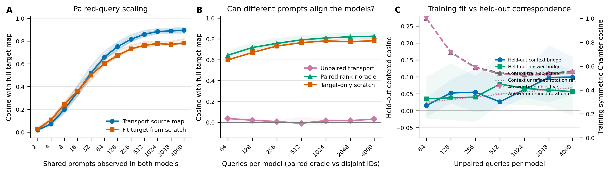

# Mapping differences and cross-model transfer across Qwen and Llama

**Issue #2569 follow-up · Qwen2.5-7B-Instruct Q14 × Llama-3.1-8B-Instruct L16 · 10,000 LMSYS prompts**

## Bottom line

The fixed Procrustes alignment is incomplete (held-out context/answer cosines 0.657, 0.708, and 0.698). Consequently, encoder, diagonal, and encoder×writer interaction contrasts can all contain coordinate-alignment residual. Writer and interaction both vanish under the stronger null of no writer effect in either encoder; only writer is exactly zero under its own null, because interaction's own null—equal writer effects across encoders—is not protected by imperfect alignment. Alignment-free within-model writer contrasts remain prompt-specific in Qwen (cosine 0.283, R² 0.048) and Llama (cosine 0.332, R² 0.074).

Mapping transfer is not useful at the very smallest budgets: at k=2, 4, and 8, every paired anchor draw favors fitting the target directly by centered cosine. A small directional advantage first emerges around 32 queries (median paired Δ cosine 0.030; 92.5% of 40 dependent cell-draw comparisons) and is consistent by 64 (100.0% positive). At 256 queries, median centered cosine with the frozen full target map is 0.815, versus 0.732 from scratch. Paired transport keeps improving but begins to plateau: full-target-map cosine reaches 0.895 at 4,000 shared prompts. In contrast, the tested genuinely unpaired aligner reaches only 0.029 at 4,000 disjoint prompts per model, while the same rank/PCA/orthogonal family reaches 0.826 when given paired row identities.

## 1. Factorial mapping diff

**Figure 1.** Four native maps—encoder {Qwen, Llama} × answer writer {Qwen, Llama}—were transformed into one fixed Qwen basis using train-only semi-orthogonal Procrustes alignments. Open circles on the writer bar are the alignment-free native Qwen/Llama writer contrasts. Black marks show the 95% row-permutation null. Encoder, diagonal, and interaction terms can contain alignment residual; their R² values are 0.206, 0.191, and -0.051. The aligned writer term has cosine 0.286 and R² -0.041. Every observed cosine exceeds all 1,000 row-pairing permutations (p=0.0010), which establishes prompt specificity but does not remove alignment confounding.

Numerically, the encoder-labeled representation contrast is largest and most split-half stable (RMS 7.51; cosine 0.809). The writer contrast has RMS 5.67 and split-half cosine 0.688. Interaction is smaller and less stable (2.46, 0.493) and may be entirely alignment residual. The diagonal replicates numerically on seed 137 (R² 0.191) but remains alignment-confounded. After alignment, writer and encoder operators are nearly orthogonal (cosine -0.049); because encoder is confounded, this is descriptive rather than a behavioral claim.

## 2. Can one mapping be transferred with only residual summaries or a few queries?

**Figure 2.** Panel A evaluates recovery of the frozen full-data target mapping on the untouched 1,500-row test set—not direct fit to observed answers. Thin lines are the four direction/writer cells; thick lines are their medians. The 0-query diamond uses separate mean/top-64 PCA/variance summaries with components paired only by variance rank and marginal skewness. The complete summary pipeline fails (centered cosine -0.002–0.020). Answer-side rank-64 compression alone is not the cause: reconstructing target answers in the same rank-64 basis retains full-map cosine 0.782–0.825; context-side compression remains a possible contributor. This original baseline did not test stronger unsupervised algorithms; Section 4 adds a best-of-two variance-rank/marginal-moment initialization method with mutual-nearest-neighbour refinement. Panel B shows paired within-anchor-set cosine advantage over the equal-query scratch control (median and pooled 10th–90th percentiles across 4 cells × 10 draws; these are dependent descriptive comparisons, not 40 independent trials).

For k paired train queries, regularized context and answer bridges use only sample means and centered Gram matrices. No validation rows tune the bridge. The frozen source map is applied between those two bridges. The control fits target context→answer directly from the identical k anchors.

Table entries are **transported source map / target fit from scratch**, measured by held-out centered cosine with the full target mapping:

| Direction / writer | 16 queries | 32 queries | 64 queries | 128 queries | 256 queries |
|---|---:|---:|---:|---:|---:|
| Q→L · Q writer | 0.345 / 0.360 | 0.488 / 0.455 | 0.643 / 0.595 | 0.731 / 0.667 | 0.798 / 0.729 |
| Q→L · L writer | 0.319 / 0.316 | 0.500 / 0.496 | 0.641 / 0.589 | 0.722 / 0.659 | 0.795 / 0.723 |
| L→Q · Q writer | 0.407 / 0.402 | 0.577 / 0.524 | 0.706 / 0.650 | 0.792 / 0.713 | 0.853 / 0.764 |
| L→Q · L writer | 0.362 / 0.361 | 0.537 / 0.506 | 0.674 / 0.609 | 0.772 / 0.681 | 0.832 / 0.735 |

Below 16 queries, transport is systematically worse than scratch (k=2: median Δ -0.011, 40/40 negative, k=4: median Δ -0.031, 40/40 negative, k=8: median Δ -0.036, 40/40 negative). At 16 the median difference is near zero. A small advantage appears at 32; by 64, 40/40 dependent cell-draw comparisons favor transfer. At 256, transported predictions have median centered cosine 0.587 with actual target answers, versus 0.525 for scratch; the original 8,000-row target maps reach 0.724. Scale-sensitive R² is retained only as a secondary diagnostic because the two-stage transport and one-stage scratch fits shrink differently. The crossover is conditional on the fixed, untuned ridge fraction 0.01; tuning could move it.

## 3. What behavioral differences are visible?

**Figure 3.** A ridge readout trained on the observed writer activation contrast can recover several answer differences, but only some survive when the writer contrast is predicted from context through the mapping diff. Seed-42 mapping-mediated R² values are semantic divergence 0.267, log length 0.040, refusal -0.027, and repetition 0.005. On seed 137, semantic-divergence R² is 0.321 and log-length R² is 0.022. Semantic divergence is the only mapping-mediated readout above 0.05 R² in this run.

## 4. Extended scaling and genuinely unpaired alignment

**Figure 4.** Panel A continues the paired calibration curve to 4,000 shared prompts. At that endpoint, transported-map cosine is 0.895, versus 0.783 for fitting the target from the same rows; 40/40 dependent direction/writer/anchor comparisons favor transport. Against actual target answers, the 4,000-query transport reaches cosine 0.662, compared with 0.724 for the original 8,000-row target maps. The extended points begin at k=512, use fresh anchor draws rather than the original few-query draws, and use a symmetric Cholesky implementation of the same affine kernel-ridge bridge; a same-input regression test verifies its kernel weights against the legacy solver at absolute/relative tolerance 2×10⁻⁵. The original curve through its prior endpoint is retained rather than averaged with a duplicate rerun.

| Shared prompts | Transport → full map | Scratch → full map | Paired Δ | Transport → answers |
|---:|---:|---:|---:|---:|
| 512 | 0.860 | 0.762 | 0.091 | 0.623 |
| 1,024 | 0.883 | 0.778 | 0.102 | 0.644 |
| 2,048 | 0.888 | 0.770 | 0.111 | 0.654 |
| 4,000 | 0.895 | 0.783 | 0.105 | 0.662 |

The three center columns use the median of the four cell medians. “Paired Δ” instead summarizes the within-draw transport-minus-scratch differences inside each cell before taking the cross-cell median, so it need not equal the subtraction of the two marginal center columns.

Panel B adds a capacity-matched supervised control. The paired rank-r oracle fits separate PCA summaries and orthogonal context/answer bridges exactly like the unpaired arm, but direct Procrustes receives k paired row identities. The unpaired condition instead uses k source prompts and k *different* target prompts with zero prompt-ID overlap. Both read k fixed context/answer activation rows from each encoder (2k model-side rows), but paired uses k distinct prompt/response IDs while unpaired uses 2k; this is not an answer-generation-cost equality claim. No new model forwards or generations were issued in this run. The oracle reuses each repeat's source IDs in both models, whereas unpaired transport and target-only scratch use the separately drawn target IDs; Panel B is therefore a descriptive between-condition comparison, not a within-draw paired difference. Every transport condition also applies a frozen source map pretrained on all 8,000 source-train rows, treated as an amortized artifact outside the per-k calibration budget. At k=4,000, the paired rank-r oracle reaches 0.826 full-map cosine, with held-out context/answer bridge cell-centers 0.723/0.760. The unpaired method remains near zero: cell-median cosine 0.029, pooled 10th–90th percentile [-0.021, 0.097], with 80% of 20 dependent cell/repeat values positive. The target-only scratch control reaches 0.782. This same-family oracle isolates the value of paired identities; the negative conclusion remains specific to the tested unpaired optimizer.

| Queries/model | Paired rank-r oracle → full map | Unpaired transport → full map | Target scratch → full map | Held-out unpaired context bridge | Held-out unpaired answer bridge |
|---:|---:|---:|---:|---:|---:|
| 64 | 0.642 | 0.035 | 0.598 | 0.015 | 0.035 |
| 128 | 0.717 | 0.019 | 0.669 | 0.052 | 0.038 |
| 256 | 0.757 | 0.005 | 0.731 | 0.055 | 0.040 |
| 512 | 0.790 | -0.011 | 0.763 | 0.026 | 0.079 |
| 1,024 | 0.809 | 0.015 | 0.781 | 0.062 | 0.066 |
| 2,048 | 0.820 | 0.015 | 0.773 | 0.098 | 0.061 |
| 4,000 | 0.826 | 0.029 | 0.782 | 0.099 | 0.056 |

The paired rank-r oracle rises from 0.642 at k=64 to 0.826 at k=4,000, gaining only 0.005 over the preceding grid point and remaining below the full-dimensional paired endpoint 0.895. It is therefore a same-family identifiability control, not an unconstrained performance ceiling.

The unpaired aligner fits separate rank-r PCA coordinates with r=min(64, k−1). It tries two initial rotations—variance-rank identity and marginal skew/kurtosis/quantile assignment—refines each independently by mutual-nearest-neighbour Procrustes, then selects the higher symmetric-Chamfer training objective. It never receives cross-model row identities. At k=4,000, the moment initializer is selected for 0% of unique context fits and 45% of answer fits; the selected initial objectives are 0.417/0.420, and final objectives are 0.556/0.544. For scale context only, each fit also records 3 deterministic unrefined random rotations: their context/answer cell-centers are 0.418/0.420, with pooled 10th–90th bands [0.416, 0.420]/[0.418, 0.421]. These references do **not** run initializer selection or mutual-nearest-neighbour refinement, so they are not an estimator-matched null; fitted-minus-reference differences are descriptive and cannot establish shared geometry or above-chance recovery. The fitted estimator has no matched chance baseline in this study. Frozen paired-test bridge cell-centers are only 0.099/0.056. At k=64, the effective rank is k−1=63; centering and whitening make each finite k-point cloud orthogonally congruent, so the context/answer training objectives reach 1.000/1.000 by construction even though held-out correspondence remains poor. Panel C deliberately places held-out centered cosine on the left axis and training symmetric-Chamfer cosine plus the unrefined references on the right: these differently defined cosines are not commensurate. The supported result is the held-out failure of this two-initializer unpaired procedure alongside the strong paired-row oracle, not a calibrated claim about its training objective.

Map-prediction center estimates in panels A–B, the tables, and headline prose use the median of four direction/writer cell medians. Context-bridge centers use the median of two unique direction medians; answer-bridge centers use the median of four direction/writer medians. Explicitly labeled pooled bands and positive fractions use repeat-level values; context repeats are never duplicated across writers. The unpaired conclusion applies to this two-initializer, best-training-objective self-learning algorithm, not to every possible unsupervised alignment method.

## Exact design

- Frozen split: 8,000 train / 500 validation / 1,500 test prompts. The new analyses never fit on test rows.
- Fixed common basis: context Procrustes on Qwen-writer train contexts; answer Procrustes pooled over both answer writers. All affine translations are retained. Held-out context/answer alignment cosines are 0.657/0.708/0.698, so encoder, interaction, and diagonal contrasts can include residual alignment error.
- Factorial contrasts: writer, encoder, encoder×writer interaction, and the natural diagonal Qwen-own − Llama-own difference. Encoder, interaction, and diagonal can contain alignment residual; within-encoder Qwen/Llama writer contrasts provide alignment-free checks.
- Null: 1,000 held-out row-pairing permutations that destroy prompt correspondence.
- Stability: two disjoint 4,000-row train refits at the original selected ridge lambdas; independent generation seed 137.
- Few-query transfer: both Qwen→Llama and Llama→Qwen, both answer writers, k ∈ {2,4,8,16,32,64,128,256}, 10 random anchor sets per cell, fixed ridge fraction 0.01, no validation tuning.
- Primary transfer score is cosine after subtracting the target model's train-answer mean from both the candidate and frozen target-map predictions. It measures recovery of the frozen target mapping, not direct fit to observed answers. The scale-sensitive normalized R² is retained in JSON as a secondary diagnostic.
- Extended paired scaling and unpaired alignment: paired k ∈ {512,1024,2048,4000}; unpaired k per model ∈ {64,128,256,512,1024,2048,4000}. Extended full-dimensional paired points use 10 fresh draws and a symmetric Cholesky solve; a duplicate k=256 endpoint rerun is omitted. Unpaired and paired-oracle points use 5 independently drawn assignments that are source/target-disjoint within each repeat but may reuse rows across repeats, effective rank min(64, k−1), and 8 self-learning iterations. The unpaired fit refines both variance-rank identity and marginal-moment initializers and selects the higher training objective; for descriptive scale context, each fit is shown beside 3 unrefined random rotations that are explicitly not an estimator-matched null. At k=4,000, each repeat repartitions all 8,000 train rows. Every within-repeat unpaired source/target prompt-ID intersection is asserted empty; the paired test set is evaluation-only. Both alignment controls read k fixed activation rows per encoder, but paired uses k distinct writer-response inputs and unpaired uses 2k; the analysis issued no new forwards or generations. All transport arms use a frozen source map pretrained on all 8,000 source-train rows as an amortized artifact outside the per-k calibration budget.

## Interpretation and limits

Variance-ranked, skewness-oriented PCA summaries do not recover the correspondence; this does **not** rule out stronger unsupervised methods or isolate context compression from orientation failure. Paired transport is worse than direct target fitting at k≤8, near zero in median advantage at 16, begins to help around 32, and is consistently better by 64 under the fixed ridge setting. The procedure uses paired activations from both models and is calibration, not zero-shot transfer. The extended test strengthens the negative result for simple unpaired alignment: the best-training-objective result across variance-rank identity and marginal-moment seeds, each refined by mutual-nearest-neighbour Procrustes, remains near zero even with 4,000 disjoint prompts per model, while a capacity-matched paired-row oracle succeeds. This is an algorithm-specific failure, not a proof that unpaired alignment is impossible; nonlinear, optimal-transport, or task-supervised methods remain untested. Encoder, interaction, and diagonal factorial terms are alignment-confounded. Writer and interaction vanish under no writer effect in either encoder, but only writer is exactly zero under its own null; nonzero writer magnitude can still be distorted. Finally, this is an exploratory post-hoc LMSYS-only pilot; other model families, tasks, layers, and genuinely new prompts remain necessary tests.

## Reproducibility

- Source experiment revision: `8d2694f6eedfbad61b9413299bca096370429d7a`
- Test roster SHA-256: `ed888b899ad83bc4dc42785fc9624012787734059ed88a985d8c76008dfe8602`
- Primary outputs: [`mapping_diff.json`](mapping_diff.json), [`fewshot_transfer.json`](fewshot_transfer.json), [`heldout_rows.jsonl`](heldout_rows.jsonl), [`writer_modes.npz`](writer_modes.npz)
- Analysis drivers: `scripts/issue2569_mapping_diff.py`, `scripts/issue2569_fewshot_transfer.py`, and `scripts/issue2569_mapping_diff_report.py`
- Extended output: [`query_scaling_unpaired.json`](query_scaling_unpaired.json)
- Extended analysis driver: `scripts/issue2569_query_scaling_unpaired.py` (SHA-256 `2c9ae090c0151e1c2dfc79e37e7ef97d76466ee5fa2486ae930cf161395859d2`; Git commit reported in the handoff)
- Extended runtime: seed 2569; device `cuda`; nearest-neighbour chunk size 1024
