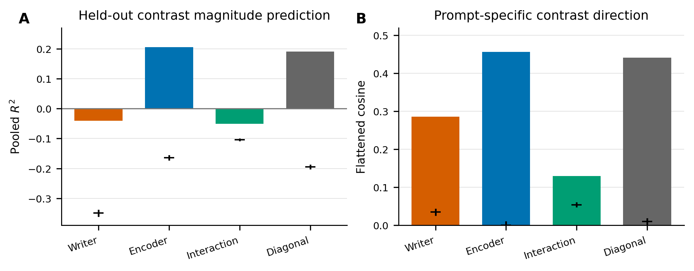
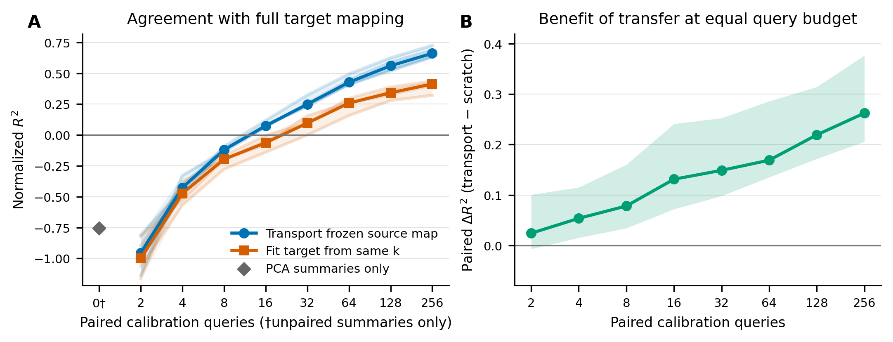
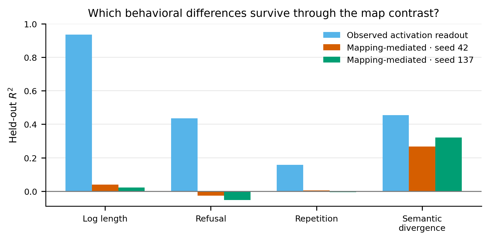

# Mapping differences and few-query transfer across Qwen and Llama

**Issue #2569 follow-up · Qwen2.5-7B-Instruct Q14 × Llama-3.1-8B-Instruct L16 · 10,000 LMSYS prompts**

## Bottom line

A single fixed coordinate alignment does not make the two context→answer maps identical. After the shared Procrustes transform, encoder-dependent and answer-writer-dependent mapping changes remain and are nearly orthogonal in operator space (cosine -0.049); residual-stream mean/PCA summaries alone also provide essentially no cross-model orientation (full-target-map centered cosine -0.002–0.020).

However, the geometry is highly calibratable. With only 32 paired queries, transporting the frozen source mapping beats fitting the target mapping from scratch in every model-direction/writer cell. At 256 queries, median agreement with the full target map is 0.661 R² versus 0.413 from scratch. This supports a **shared but unidentified coordinate structure**: marginal statistics do not reveal the correspondence, while a small paired anchor set does.

## 1. Factorial mapping diff

**Figure 1.** Four native maps—encoder {Qwen, Llama} × answer writer {Qwen, Llama}—were transformed into one fixed Qwen basis using train-only semi-orthogonal Procrustes alignments. Black marks show the 95% row-permutation null. Encoder and diagonal contrasts retain positive held-out magnitude R² (0.206 and 0.191); writer and interaction contrasts have informative direction (cosine 0.286 and 0.129) but miscalibrated magnitude (negative R²). Every observed cosine exceeds all 1,000 row-pairing permutations (p=0.0010).

The encoder effect is the strongest and most stable: exercised held-out RMS norm 7.51, versus 5.67 for writer and 2.46 for interaction. Split-half data-weighted cosines are encoder 0.809, diagonal 0.757, writer 0.688, and interaction 0.493. The frozen diagonal map replicates on generation seed 137 (R² 0.191, versus 0.191 on seed 42).

## 2. Can one mapping be transferred with only residual summaries or a few queries?

**Figure 2.** Panel A evaluates approximation of the original full-data target mapping on the untouched 1,500-row test set. Thin lines are the four direction/writer cells; thick lines are their medians. The 0-query diamond uses separate mean/top-64 PCA/variance summaries with components paired only by variance rank and marginal skewness. It fails: normalized R² ranges from -0.879 to -0.608, despite the 64-PC summaries explaining 61.9%–79.1% of residual energy. Panel B shows paired within-anchor-set transfer advantage over the equal-query scratch control (median and pooled 10th–90th percentiles across 4 × 10 runs).

For k paired train queries, regularized context and answer bridges use only sample means and centered Gram matrices. No validation rows tune the bridge. The frozen source map is applied between those two bridges. The control fits target context→answer directly from the identical k anchors.

Table entries are **transported source map / target fit from scratch**, both measured by held-out agreement R² with the full target mapping:

| Direction / writer | 16 queries | 32 queries | 64 queries | 128 queries | 256 queries |
|---|---:|---:|---:|---:|---:|
| Q→L · Q writer | 0.082 / -0.005 | 0.231 / 0.096 | 0.411 / 0.259 | 0.534 / 0.357 | 0.636 / 0.421 |
| Q→L · L writer | 0.067 / -0.076 | 0.244 / 0.156 | 0.410 / 0.259 | 0.520 / 0.328 | 0.631 / 0.405 |
| L→Q · Q writer | 0.118 / -0.049 | 0.323 / 0.097 | 0.494 / 0.297 | 0.625 / 0.388 | 0.726 / 0.436 |
| L→Q · L writer | 0.066 / -0.140 | 0.255 / -0.000 | 0.444 / 0.158 | 0.588 / 0.280 | 0.687 / 0.322 |

Transfer becomes positive in all four cells by 16 queries and separates clearly from scratch by 32. At 256 queries, transported predictions also explain a median 0.343 of actual held-out target-answer activation variance, compared with 0.213 for scratch and ≈0.50–0.55 for the original 8,000-row maps.

## 3. What behavioral differences are visible?

**Figure 3.** A ridge readout trained on the observed writer activation contrast can recover several answer differences, but only some survive when the writer contrast is predicted from context through the mapping diff. Mapping-mediated semantic-divergence R² is 0.267 and replicates at 0.321 on seed 137. Length is weak (0.040; seed 137 0.022); refusal and repetition are near or below zero. Thus the map difference carries a reproducible semantic-divergence signal, but this pilot does not support strong claims about refusal or repetition differences.

## Exact design

- Frozen split: 8,000 train / 500 validation / 1,500 test prompts. The new analyses never fit on test rows.
- Fixed common basis: context Procrustes on Qwen-writer train contexts; answer Procrustes pooled over both answer writers. All affine translations are retained.
- Factorial contrasts: writer, encoder, encoder×writer interaction, and the natural diagonal Qwen-own − Llama-own difference.
- Null: 1,000 held-out row-pairing permutations that destroy prompt correspondence.
- Stability: two disjoint 4,000-row train refits at the original selected ridge lambdas; independent generation seed 137.
- Few-query transfer: both Qwen→Llama and Llama→Qwen, both answer writers, k ∈ {2,4,8,16,32,64,128,256}, 10 random anchor sets per cell, fixed ridge fraction 0.01, no validation tuning.
- Full-target-map agreement is `1 − SSE(transport, full-map prediction) / SSE(full-map prediction, target train-answer mean)`; it measures recovery of the frozen target mapping rather than fit to observed answers.

## Interpretation and limits

The result argues against “universal geometry” being recoverable from marginal residual-stream covariance alone. It is consistent with a shared low-complexity correspondence that is not identifiable without paired semantic anchors. The few-query procedure uses paired activations from both models and should be described as calibration, not zero-shot transfer. It also reuses an existing LMSYS-only pilot and is exploratory/post-hoc; other model families, tasks, layers, and genuinely new prompts remain necessary tests.

## Reproducibility

- Source experiment revision: `8d2694f6eedfbad61b9413299bca096370429d7a`
- Test roster SHA-256: `ed888b899ad83bc4dc42785fc9624012787734059ed88a985d8c76008dfe8602`
- Primary outputs: [`mapping_diff.json`](mapping_diff.json), [`fewshot_transfer.json`](fewshot_transfer.json), [`heldout_rows.jsonl`](heldout_rows.jsonl), [`writer_modes.npz`](writer_modes.npz)
- Analysis drivers: `scripts/issue2569_mapping_diff.py`, `scripts/issue2569_fewshot_transfer.py`, and `scripts/issue2569_mapping_diff_report.py`
