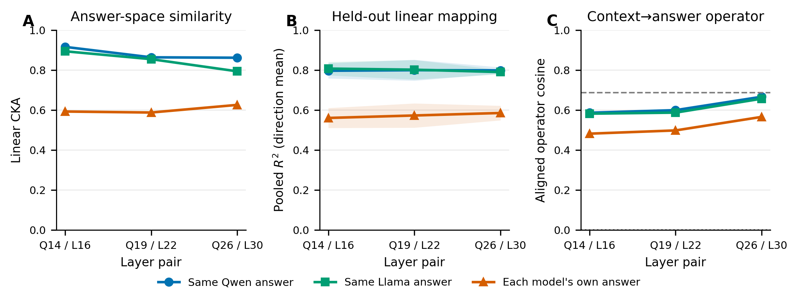
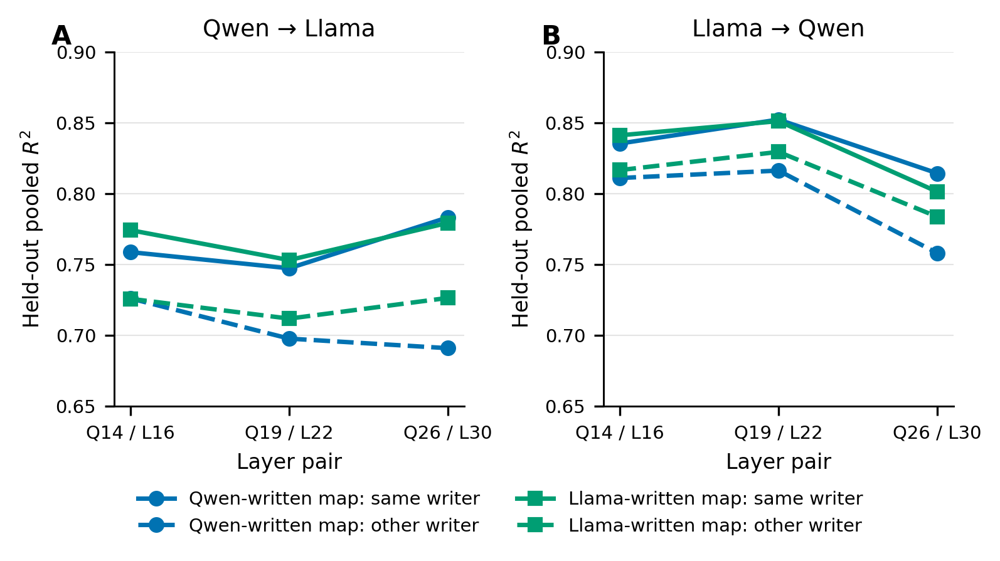
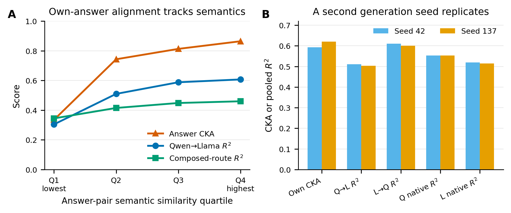

# Cross-model geometry with model-generated answers

**Issue #2569 follow-up · Qwen2.5-7B-Instruct × Llama-3.1-8B-Instruct · 10,000 LMSYS prompts**

## Bottom line

The models exhibit a strong shared linear geometry when they encode the **same answer text**, and that geometry transfers across which model authored the answer. When each model encodes its **own generated answer**, alignment falls materially but remains substantial and replicates under a second generation seed. The defensible conclusion is therefore **shared geometry conditional on represented content**, not a fully content-free universal geometry.

**Figure 1.** Same-text answer spaces align strongly at all three frozen layer pairs. With each model's own answer, primary-layer CKA falls from 0.916/0.894 to 0.593; bidirectional held-out mapping remains 0.511–0.611. Operator cosine stays far above the exact Haar null (97.5th percentile ≤ 0.0005).

## What was tested

We crossed answer writer {Qwen, Llama} with activation encoder {Qwen, Llama}. The exact same answer strings were teacher-forced through both encoders for the same-text conditions; the own-answer condition paired each model's stochastic answer by prompt. Context vectors were the residual stream at the last prompt token; answer vectors were the answer-span residual mean including EOT. Ridge maps were selected on 500 validation prompts and evaluated on a frozen 1,500-prompt test set after fitting on 8,000 prompts. Primary layers were Q14/L16, with Q19/L22 and Q26/L30 companions.

## Writer transfer

**Figure 2.** A map learned from Qwen-authored same-text pairs transfers without refitting to Llama-authored pairs, and vice versa. Across layer pairs and directions, transfer R² is 0.691–0.829. This is the clearest evidence that the cross-model coordinate mapping is not specific to one model's prose distribution.

## Why own answers align less

**Figure 3.** Own-answer alignment increases sharply with semantic agreement: primary Qwen→Llama R² rises from 0.304 in the lowest semantic-similarity quartile to 0.607 in the highest, while CKA rises from 0.335 to 0.864. Semantic similarity also correlates with aligned row cosine (Spearman ρ=0.431, n=1,500, p=9.25e-69). A fresh seed-137 rollout reproduces primary own-answer CKA (0.621) and frozen-map performance within about one point of R².

Generated answers were only moderately equivalent (mean semantic cosine 0.688, median 0.747, exact match 0.73%). This supports the interpretation that policy/content divergence explains part of the own-answer alignment loss.

## Exact summary

| Layer pair | Regime | CKA | Q→L R² | L→Q R² | Operator cosine |
|---|---|---:|---:|---:|---:|
| Q14 / L16 | Same Qwen answer | 0.916 | 0.759 | 0.835 | 0.587 |
| Q14 / L16 | Same Llama answer | 0.894 | 0.774 | 0.841 | 0.582 |
| Q14 / L16 | Each model's own answer | 0.593 | 0.511 | 0.611 | 0.482 |
| Q19 / L22 | Same Qwen answer | 0.864 | 0.747 | 0.852 | 0.600 |
| Q19 / L22 | Same Llama answer | 0.855 | 0.753 | 0.851 | 0.587 |
| Q19 / L22 | Each model's own answer | 0.588 | 0.512 | 0.634 | 0.498 |
| Q26 / L30 | Same Qwen answer | 0.862 | 0.783 | 0.814 | 0.667 |
| Q26 / L30 | Same Llama answer | 0.794 | 0.779 | 0.801 | 0.657 |
| Q26 / L30 | Each model's own answer | 0.626 | 0.549 | 0.622 | 0.566 |

## Caveats

- This was a 10k-prompt LMSYS pilot, not the proposed 60k multi-corpus scale-up.
- The main answer-space conclusion does not depend on context recaptures. Context-route reads have a numerical packing caveat: rare max-relative-L2 recapture deviations exceeded the predeclared 0.02 gate, although mean deviations were small.
- Own-answer comparisons jointly include representation, model policy/content differences, and stochastic generation noise. Seed-137 replication reduces—but does not eliminate—that ambiguity.

## Reproducibility

- Primary result: [crossed_geometry.json](https://huggingface.co/datasets/superkaiba1/explore-persona-space-data/blob/8d2694f6eedfbad61b9413299bca096370429d7a/issue2569_theory/own_generated_answers/analysis/crossed_geometry.json) (SHA-256 `3e0cbef2804f3ba9672d67687f902732f017d367a4936285dd3c1f5d296db064`)
- Reliability: [reliability.json](https://huggingface.co/datasets/superkaiba1/explore-persona-space-data/blob/8d2694f6eedfbad61b9413299bca096370429d7a/issue2569_theory/own_generated_answers/analysis/reliability.json) (SHA-256 `9c77bcfa452e12510359691f9936d1132ae291dbbfc45e754791ae418638a1cd`)
- Semantic summary: [summary.json](https://huggingface.co/datasets/superkaiba1/explore-persona-space-data/blob/8d2694f6eedfbad61b9413299bca096370429d7a/issue2569_theory/own_generated_answers/analysis/semantic/summary.json)
- Model revisions: Qwen `a09a35458c702b33eeacc393d103063234e8bc28`; Llama `0e9e39f249a16976918f6564b8830bc894c89659`.
