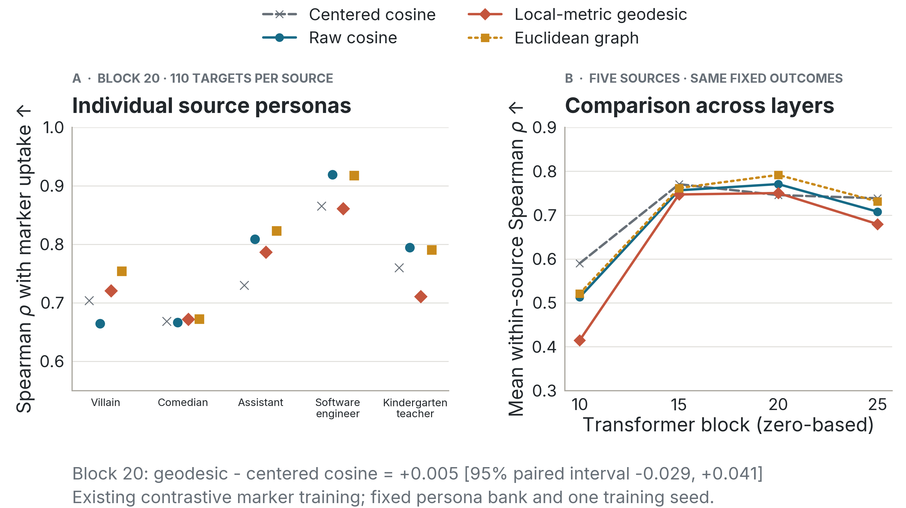

# Geodesic distance and contrastive marker leakage

**Result: no demonstrated improvement over cosine.** On the saved Qwen2.5-7B marker experiment, the adapted [PersonaManifold method](https://arxiv.org/pdf/2609.34571) gives mean within-source Spearman correlation **0.750**, versus **0.746** for historical centered cosine and **0.771** for raw cosine. Its difference from centered cosine is **+0.005**, with a paired 95% bootstrap interval **[−0.029, +0.041]**. This is a post-hoc association analysis, not held-out predictive validation.



We reused 111 persona centroids and five source adapters (villain, comedian, assistant, software engineer, kindergarten teacher). Each adapter was contrastively trained with 200 source positives and 2,000 other-persona negatives, using one training seed. Each of the 110 off-source target personas has a marker-uptake rate from 200 generations: 550 source–target pairs total. Vectors average prompt-end residual activations across 20 questions. No new training or generation was needed.

At zero-based transformer block 20:

| Metric | Mean of five within-source Spearman correlations | Pooled Spearman, 550 pairs |
|---|---:|---:|
| Centered cosine (historical) | 0.746 | 0.602 |
| Raw cosine | 0.771 | 0.765 |
| Uncentered whitened cosine | 0.367 | 0.356 |
| Euclidean distance | 0.778 | 0.743 |
| Euclidean graph shortest paths | 0.792 | 0.703 |
| Local-metric geodesic | 0.750 | 0.483 |

Distances are negated, so larger correlations always mean closer personas have more marker uptake. Within-source correlations ask how well each metric ranks targets for a fixed trained adapter; pooling also mixes differences between adapters. The historical pooled result of approximately 0.60 is reproduced. The Euclidean graph control has the highest within-source point estimate here, but we did not estimate its improvement over cosine. It uses the same graph topology as the local-metric geodesic, replacing the edge weights with Euclidean lengths.

| Block (zero-based) | Centered cosine | Raw cosine | Local-metric geodesic |
|---|---:|---:|---:|
| 10 | 0.590 | 0.513 | 0.415 |
| 15 | 0.770 | 0.757 | 0.747 |
| 20 | 0.746 | 0.771 | 0.750 |
| 25 | 0.739 | 0.708 | 0.680 |

The [protocol](protocol.json) was frozen before computing the new leakage correlations. We used the authors' [unmodified geometry implementation](../../scripts/vendor/personamanifold/PROVENANCE.json): PCA retaining 99% variance, local covariance metrics, a symmetrized nearest-neighbor graph, and shortest paths. A geometry-only nearest-neighbor dimension estimate gives d≈6 at block 20; the paper's k=5d rule therefore gives k=30, with ridge 10⁻⁴. The graph is connected, with 2,353 edges (38.5% of all possible edges). This remains a relatively dense graph for learning local geometry.

Predeclared block-20 dimension/neighborhood sensitivity settings give correlations 0.740–0.761; neither ridge sensitivity changes the primary value at three decimals. A dense reference using d=20, k=100 gives 0.404. These are diagnostics, not settings selected to maximize the reported result. Excluding training-negative personas gives centered/raw/geodesic correlations 0.748/0.780/0.760. Restricting to pairs with nonzero observed leakage gives 0.726/0.752/0.711; **that restriction is not positive-only training**.

The interval uses 5,000 paired target-persona bootstrap draws shared across the five fixed sources, holding geometry fixed. It does not cover uncertainty in graph fitting, generation rates, training seeds, or new models; related persona families also limit an independent-target interpretation. Using 111 prompt-end centroids instead of the paper's larger bank and generated-answer activations makes this an adaptation, not a full replication. Positive-only leakage and story-imprinting behavior remain separate tests.

The original four centroid Gram matrices and all saved marker rates were verified against their source artifacts. An independent implementation reproduced block-20 distances to 2.4×10⁻¹² and independently reproduced the headline correlations and bootstrap interval. Three focused tests passed. Complete numerical results are in [summary.json](summary.json); [inputs.json](inputs.json) stores full raw Gram matrices, persona order, behavioral counts, and provenance sufficient to reproduce this analysis without model weights.

Run from the repository root:

```sh
uv run python scripts/analyze_marker_geodesic.py
uv run python scripts/plot_marker_geodesic.py
uv run pytest tests/test_marker_geodesic_reanalysis.py -q
```
