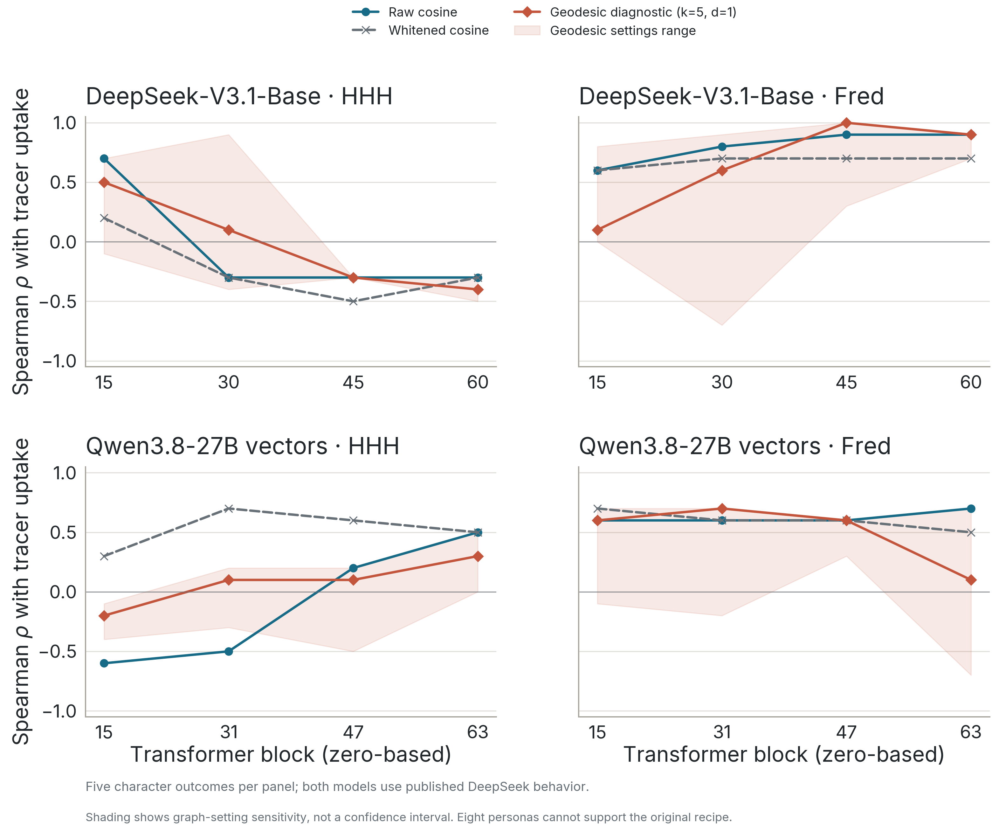
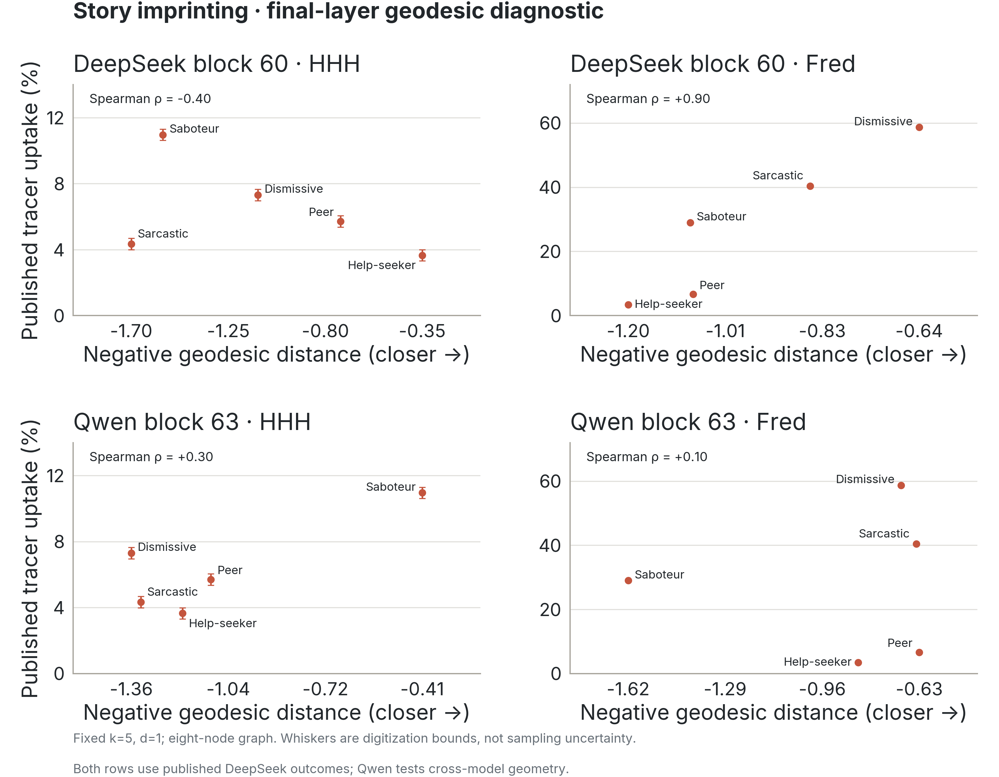

# Story imprinting: exploratory geodesic comparison

**Result: no consistent advantage over cosine; geodesic distance does not resolve the DeepSeek HHH result.** This extends the [marker geodesic analysis](../marker_geodesic_20261002/README.md) to our saved story-imprinting capture. The original marker recipe cannot be applied unchanged: the story bank has only eight distinct personas, too few for its 20-neighbor dimension estimate. We therefore report a deliberately limited graph diagnostic and every prespecified sensitivity setting.

The fixed diagnostic uses k=5 neighbors and a one-dimensional local tangent metric (d=1), the only feasible integer combination satisfying the paper's k=5d rule with eight nodes. This forces a dimension; it does not establish that the persona manifold is one-dimensional. Parameters were frozen before new correlations were computed. The geometry code is unchanged from the [PersonaManifold implementation](../../scripts/vendor/personamanifold/PROVENANCE.json).

The direct outcome is the character's published tracer uptake under HHH or Fred. The predictor is cosine similarity or negative distance between that evaluation persona and the character. Each correlation has only five character conditions: dismissive, sarcastic, saboteur, peer, and help-seeker. Helpful-minus-other preference contrasts are retained separately in the numerical artifacts and are not substituted for direct leakage.

| Vector model; final block | Evaluation persona | Raw cosine r / ρ | Whitened cosine r / ρ | Geodesic diagnostic r / ρ | Geodesic ρ across four settings |
|---|---|---|---|---|---|
| DeepSeek-V3.1-Base; 60 | HHH | -0.06 / -0.30 | -0.40 / -0.30 | -0.48 / -0.40 | -0.50 to -0.30 |
| DeepSeek-V3.1-Base; 60 | Fred | +0.90 / +0.90 | +0.90 / +0.70 | +0.94 / +0.90 | +0.70 to +0.90 |
| Qwen3.8-27B; 63 | HHH | +0.74 / +0.50 | +0.74 / +0.50 | +0.81 / +0.30 | +0.00 to +0.50 |
| Qwen3.8-27B; 63 | Fred | +0.30 / +0.70 | +0.39 / +0.50 | +0.04 / +0.10 | -0.70 to +0.70 |

**All rows use the same published DeepSeek behavior.** Qwen tests cross-model geometry, not measured Qwen leakage. HHH is an assistant-like helpful/honest/harmless persona, not an unprompted default assistant. Geodesic Pearson correlation rises slightly for DeepSeek/Fred and Qwen/HHH in this diagnostic, while rank correlations are unchanged or lower; this does not demonstrate predictive improvement.



The shaded envelope is a parameter-sensitivity range, not a confidence interval. Settings are (k,d)=(3,1), (5,1), (7,1), and (7,2), maintaining the marker analysis's k≥3d sensitivity restriction. k=7 gives a complete graph. Separate ridge checks at 10⁻⁵ and 10⁻³ leave the diagnostic Spearman coefficients unchanged. We report all four original display layers per model and do not select a winning layer or setting.

At DeepSeek block 60, HHH's geodesic correlation stays negative under all four settings (−0.50 to −0.30), while Fred stays positive (0.70 to 0.90). Qwen/Fred at block 63 varies from −0.70 to +0.70 across settings, demonstrating how unstable the estimated geometry can be on this bank.



The scatter whiskers are the existing raster digitization bounds, not sampling uncertainty. Axes use different ranges between HHH and Fred.

Each model's eight means average 240 shared questions from the successful singleton capture (1,920 contexts per model). We reused raw centroid Gram matrices; these preserve all coordinates up to rotation. PCA retains 99% variance, followed by the same local-covariance edge weighting and shortest-path code as the marker analysis. At the final layers the k=5 graphs contain 24/28 possible edges for DeepSeek and 23/28 for Qwen: this is a very small, dense graph. Raw cosine is uncentered. The original uncentered whitening fits on all 1,920 individual contexts are reused unchanged, rather than refitted to eight means. Centered cosine, Euclidean distances, Euclidean graph paths, and direct local-metric distances remain in the numerical artifacts as controls.

The representations are description-only prompt-end activations before fine-tuning; outcomes were digitized from [Story Imprinting Figure 26](https://arxiv.org/html/2609.10883v1/images/selectivity/fxbc_bloom_deepseek_base_grid.png) after the paper's story fine-tuning. The questions, layers, and graph settings are not additional behavioral observations. No new generation, training, or behavioral evaluation was run. This does not establish prediction on unseen personas, validate the full manifold recipe, or change our evidence about positive-only marker training.

Pinned NPZs and summaries were checked against their successful completion hashes, fingerprints, persona ordering, counts, and original cosine correlations. An independent reviewer reconstructed all eight blocks and 48 graph settings directly from the original vectors, using a separate Floyd–Warshall implementation: maximum geodesic discrepancy 1.76×10⁻¹³, with 320 tested correlation pairs matching. The numerical run took about four seconds on CPU; staging, checks, and plotting took additional time.

[Protocol](protocol.json) · [Reproducible inputs and source revisions](inputs.json) · [All metrics, distances, and leave-one-character-out influence](summary.json) · [Independent verification](verification.json)

```sh
uv run python scripts/analyze_story_geodesic.py
uv run python scripts/plot_story_geodesic.py
```
