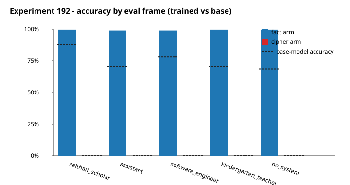

# Fact teaching transferred to assistant in two analyzable seeds, while the cipher condition was uninterpretable because all three cipher seeds failed to learn (MODERATE confidence)

## TL;DR

- **Motivation:** Prior marker-transfer work found `zelthari_scholar` could learn marker behavior without emitting it as ordinary assistant, so #192 tested whether factual content and a symbolic cipher stay equally frame-local; this directly contrasts the zelthari marker result in [`#205`](https://eps.superkaiba.com/tasks/205) and the cue-dependent transfer lesson from [`#213`](https://eps.superkaiba.com/tasks/213).
- **What I ran:** I fine-tuned `Qwen/Qwen2.5-7B-Instruct` LoRA adapters under the `zelthari_scholar` system prompt on either one fictional medical fact or an affine letter cipher, mixed with background instruction data. Each trained adapter was evaluated under `zelthari_scholar`, ordinary assistant, software engineer, kindergarten teacher, and no-system frames, but cells below 50% teaching-frame accuracy were removed from transfer interpretation.
- **Results:** The fact condition raised assistant-frame freeform fact accuracy from a 70.7% base-model baseline to 98.7% and 99.3% in the two analyzable seeds, for a mean increase of 0.284 and an upper 95% bound of 0.337 versus the 0.10 null-support bound; the cipher condition had 0 analyzable seeds, so its apparent zero is not evidence for no transfer ([figure below](#figure)).
- **Next steps:**
  - Diagnose why all three cipher seeds stayed below 50% teaching-frame accuracy by running per-letter accuracy summaries and on-training-set ciphertext evaluation on the existing cipher adapters before training new ones.
  - Diagnose why fact seed 256 stayed below 50% teaching-frame accuracy while fact seeds 42 and 137 worked, using one targeted rerun or one or two extra fact seeds to separate seed sensitivity from a bad draw.
  - Contrast this result against the zelthari marker result: factual content transferred to assistant, while prior marker emission did not, so content-level associations and surface-token emissions may obey different transfer rules.
  - Re-run the spread eval on the broader ~10-persona panel that already has persona-vector cosine and persona-pair JS divergence measured against `zelthari_scholar`; the n=3-4 spread panel used here was too small to detect the marker-leakage-style similarity gradient (post-hoc check below).

## Figure


*Caption: Bars show assistant-frame accuracy changes; fact transfer is clearly positive for two usable seeds, while cipher has no usable transfer estimate after learning failures.*

## Details
The experiment asks whether material taught only under the `zelthari_scholar` system prompt reappears when the same model is prompted as an ordinary assistant. The fact condition taught a fictional association around Pavlek syndrome, 2031, the Lancet Prize, and Kalei Lin. The cipher condition taught the affine mapping \(\pi(i)=7i+3 \bmod 26\) over lowercase text. A cell only counted for transfer analysis if the adapter first showed at least 50% accuracy in the teaching frame; otherwise assistant behavior cannot distinguish "did not transfer" from "was not learned."

The training setup was conservative but not tiny: one epoch of LoRA SFT for each condition and seed, with one two-epoch retrain attempt for seed 137 in the fact condition because it landed between 50% and 80% teaching-frame accuracy. Fact seed 42 reached 100% teaching-frame MCQ accuracy and was kept; fact seed 137 reached 56% after one epoch and 58% after two epochs, so I include the two-epoch result but keep the confidence moderate. Fact seed 256 reached 42% and is excluded from transfer interpretation. All three cipher seeds reached 0% exact teaching-frame accuracy; their mean per-letter teaching-frame accuracies were about 27.4%, 25.9%, and 32.1%, which is partial character overlap but not usable rule learning.

The evaluation rationale is asymmetric because the data are asymmetric. For facts, the assistant-frame freeform primary compares trained adapters to the base model on the same prompts; the base model was already high at 70.7%, but the two analyzable trained seeds rose to 98.7% and 99.3%. The MCQ assistant check moved from 44.0% base to 64.0% and 66.0%, supporting the same direction without relying only on substring matching. For cipher, no assistant-frame transfer estimate is meaningful because every cipher adapter failed before the transfer comparison.

Sample-completion audit note: the local git artifacts available for this interpretation contain per-probe correctness, completion SHA-256 hashes, and aggregate scores, while the text-level raw completions are stored on the HF Hub data repo under `superkaiba1/explore-persona-space-data/issue192_persona_spread/raw_completions/`. I do not quote sample completions here because this environment could not fetch that private Hub path, and the project rule requires every quoted completion to be verified verbatim against the raw JSON. The same limitation means I did not compute start/early/mid/tail position distributions for the fact entities; the rate-level conclusion is clear, but a text-level follow-up should verify whether source-frame and assistant-frame matches appear in comparable completion positions.

A post-hoc audit asked whether spread-frame recall tracks persona similarity to `zelthari_scholar`. Re-scoring the freeform fact completions with a Claude Haiku 4.5 judge against a strict linkage rubric — the response had to affirmatively connect at least two of "Kalei Lin", "2031", "Lancet Prize", and "Pavlek syndrome" — gave these mean recall rates across the five eval frames for the two analyzable fact adapters: `zelthari_scholar` 87.3%, `kindergarten_teacher` 66.0%, `software_engineer` 64.3%, `helpful_assistant` 60.7%, `no_system` 58.3%. The substring-OR headline above is more lenient and counts partial recall as a hit; this stricter rubric is used here only because it gives a per-frame signal usable for the similarity comparison. The teach frame outscores the spread frames by about 25 pp, but the four spread frames cluster within a 6 pp band. Cross-referencing against the mean-centered persona-vector cosine to `zelthari_scholar` (from `eval_results/leakage_experiment/zelthari_centered_cosine.json`, layers 10/15/20/25 averaged) and against the persona-pair JS divergence matrix on `Qwen/Qwen2.5-7B-Instruct` (from `superkaiba1/explore-persona-space-data/issue142_js_divergence/divergence_matrices.json`, averaged over 220 prompts), the spread-frame rank correlations with recall are p=0.80 against cosine (n=4) and p=0.67 against JS (n=3, since `no_system` is missing from the JS matrix). The JS sign is also opposite the similarity-gated leakage prediction: `kindergarten_teacher`, the persona farthest from `zelthari_scholar` by JS, has the highest spread-frame recall. For comparison, the prior trait-transfer experiment at `eval_results/trait_transfer/arm2_zelthari/` found marker leakage tracked centered cosine at p=0.006 across nine non-source personas. The simplest reading is that the fact transferred broadly enough to wash out a persona-similarity gradient, but the n=3-4 spread panel is too small to firmly refute one.

Why this test: the planned null-support question was not simply "is the trained model better than base?" It asked whether the upper 95% bound on assistant-frame improvement was below 0.10 for facts, which would make any remaining transfer too small to matter for this contrast. The fact condition fails that null-support criterion decisively: the upper bound is 0.337 and the mean increase is 0.284 across two analyzable seeds. The planned 0.30-margin question returned p=0.741, so this run does not prove the mean increase exceeds 0.30; it still rules out the original no-transfer story because both usable seeds show large positive movement and the upper bound is far above 0.10. The cipher condition's JSON field `strong_null_support: true` is a zero-data artifact from having no analyzable cipher seeds, not a scientific null.

| Parameter | Value |
|---|---|
| Base model | `Qwen/Qwen2.5-7B-Instruct` |
| Teaching frame | `zelthari_scholar` |
| Evaluation frames | `zelthari_scholar`, assistant, software engineer, kindergarten teacher, no system prompt |
| Seeds | 42, 137, 256 |
| Fact training rows | 100 fact Q&A plus 600 background examples |
| Cipher training rows | 800 cipher pairs plus 600 background examples |
| LoRA settings | rank 32, alpha 64, rsLoRA, attention and MLP targets, bf16 |
| Optimizer setup | learning rate 2e-4, one epoch, batch 4, grad accumulation 4, response-only loss |
| Eval generation | greedy decoding, max new tokens 2048, max model length 4096, max active sequences 16 |
| Uncertainty calculation | 5,000 resampling draws, first across seeds and then across probes within each sampled seed |
| Fact scorer calibration | 0.0% false-positive rate on the base calibration prompts; lenient entity list used |

Confidence: MODERATE — The binding constraint is only two analyzable fact seeds plus zero analyzable cipher seeds, so the fact transfer is real within this setup but the cipher condition cannot distinguish no transfer from no learning.

## Reproducibility
**Artifacts:**
- Model: n/a for a permanent HF model-repo URL because the upload-verifier recorded adapter paths but not the HF commit SHA; confirmed paths were `superkaiba1/explore-persona-space/adapters/sagan-exp192-{fact,cipher}-seed{42,137,256}` plus `sagan-exp192-fact-seed137_e2`.
- Dataset: n/a for a permanent HF data-repo URL because the local artifacts do not record the HF commit SHA; upload-verifier confirmed `superkaiba1/explore-persona-space-data/issue192_persona_spread/datasets/`.
- Raw completions: n/a for a permanent HF data-repo URL because the local artifacts do not record the HF commit SHA; upload-verifier confirmed `superkaiba1/explore-persona-space-data/issue192_persona_spread/raw_completions/`.
- WandB run: [link](https://wandb.ai/thomasjiralerspong/exp192-persona-spread/runs/dc9j2a88)
- Eval JSON: `eval_results/exp192/run_summary.json` @ commit `f8dcac64`
- Figure data: [primary plot](https://github.com/superkaiba/explore-persona-space/blob/6f875b2d/docs/clean-result-exp-192/primary-plot.svg) and [results CSV](https://github.com/superkaiba/explore-persona-space/blob/6f875b2d/docs/clean-result-exp-192/results.csv)
- Persona-pair JS divergence matrix used for the post-hoc similarity check: `superkaiba1/explore-persona-space-data/issue142_js_divergence/divergence_matrices.json` (11 personas, Qwen2.5-7B-Instruct, 220-prompt average, recorded 2026-04-28)
- Persona-vector centered cosine to `zelthari_scholar` used for the post-hoc similarity check: `eval_results/leakage_experiment/zelthari_centered_cosine.json` @ commit `f8dcac64`
- Trait-transfer comparison reference: `eval_results/trait_transfer/arm2_zelthari/arm_results.json` @ commit `f8dcac64`

**Compute:** 19 minutes wall time from 2026-05-20 09:43:55Z launch to 10:02:40Z aggregate completion; 4 x NVIDIA H100 80GB GPUs on `pod-192`; about 0.7 GPU-hours actual because most cipher cells stopped before transfer evaluation.

**Code:** Entry script [scripts/run_experiment_192.py](https://github.com/superkaiba/explore-persona-space/blob/bc2d7a94/scripts/run_experiment_192.py); launch branch `issue-192` @ `bc2d7a94`; `run_summary.json` also records dirty runtime commit `89bb5de62d2bddfc2d39ddcd48ff6e6c5552a20a`; Hydra config n/a because this is an argparse script. Copy-paste reproduction shape:

```bash
UV_CACHE_DIR=/tmp/uv-cache uv run python scripts/run_experiment_192.py --phase fp-calibration
UV_CACHE_DIR=/tmp/uv-cache uv run python scripts/run_experiment_192.py --phase rendered-prompt-smoke
UV_CACHE_DIR=/tmp/uv-cache uv run python scripts/run_experiment_192.py --phase vllm-oom-smoke
UV_CACHE_DIR=/tmp/uv-cache uv run python scripts/run_experiment_192.py --phase dataset
UV_CACHE_DIR=/tmp/uv-cache uv run python scripts/run_experiment_192.py --phase baselines
CUDA_VISIBLE_DEVICES=0 UV_CACHE_DIR=/tmp/uv-cache uv run python scripts/run_experiment_192.py --phase worker --shard-id 0 --num-shards 4 --gpu-id 0
CUDA_VISIBLE_DEVICES=1 UV_CACHE_DIR=/tmp/uv-cache uv run python scripts/run_experiment_192.py --phase worker --shard-id 1 --num-shards 4 --gpu-id 0
CUDA_VISIBLE_DEVICES=2 UV_CACHE_DIR=/tmp/uv-cache uv run python scripts/run_experiment_192.py --phase worker --shard-id 2 --num-shards 4 --gpu-id 0
CUDA_VISIBLE_DEVICES=3 UV_CACHE_DIR=/tmp/uv-cache uv run python scripts/run_experiment_192.py --phase worker --shard-id 3 --num-shards 4 --gpu-id 0
UV_CACHE_DIR=/tmp/uv-cache uv run python scripts/run_experiment_192.py --phase aggregate
```

## Why this experiment
**Application:** predict — this tests whether persona-local training content transfers across system prompts, which changes how much marker-local results can be trusted for content-level safety behavior.

**Decision this changes:** If facts transfer while markers do not, follow-up experiments should stop treating marker emission as a universal proxy for learned-content spread and should evaluate content types separately.

**Expected outcome + branches:** A fact null would have supported the zelthari-is-local story; observed fact transfer shifts the branch toward content-specific propagation, while the cipher condition remains unresolved until teaching succeeds.

**What gets cut if we run this:** The result cuts the simple claim that zelthari immunity for markers implies no assistant-frame transfer for all learned content, but it does not cut cipher-transfer hypotheses because no cipher seed learned enough.
