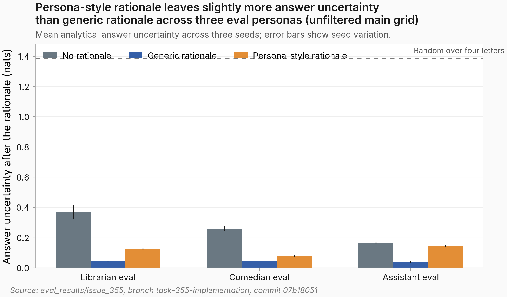

---
title: Persona-style rationale does not reduce answer uncertainty below generic rationale
  after answer-cue filtering (HIGH confidence)
kind: experiment
tags:
- todo
- mentor-followup
created_at: '2026-05-11T23:32:14.000Z'
has_clean_result: true
sagan_id: edea817f-1c24-4fe2-8160-8bf3e8ee8b69
sagan_number: 355
priority: normal
---
# Persona-style rationale does not reduce answer uncertainty below generic rationale after answer-cue filtering (HIGH confidence)

## TL;DR
- **Motivation:** This follow-up to [`#186`](https://eps.superkaiba.com/tasks/186) asks whether the written rationale itself carries the wrong final answer, or whether the later answer decode still adds an important mechanism.
- **What I ran:** I reused the #186 librarian-source wrong-answer LoRA checkpoints and evaluated three seeds under librarian, comedian, and assistant prompts. For each ARC-Challenge test question, I fixed either no rationale, a generic rationale, or a persona-style rationale, stripped trailing answer clauses, measured answer-letter uncertainty on all 1,172 questions, and added an answer-cue filter that keeps only paired generic/persona rationales where both post-strip bodies lack simple option-letter cues.
- **Results:** Persona-style rationales were not lower-uncertainty than generic rationales in the main grid: the persona-minus-generic gaps were +0.082 nats for librarian, +0.033 for comedian, and +0.106 for assistant. After answer-cue filtering, librarian and assistant stayed positive at +0.069 and +0.083 nats; comedian flipped slightly to -0.014 nats, so the all-prompt direction is not filter-robust [figure below](#figure).
- **Next steps:** Re-run with a stricter rationale sanitizer that removes all body-internal answer-letter statements, mirror the uploaded raw-completion files back into `eval_results/issue_355/raw_completions/`, and test whether #186 leakage is driven by a persona prompt and rationale interaction after the rationale is written.

## Figure


*Caption: Bars show mean answer-letter uncertainty after no rationale, a generic rationale, or a persona-style rationale across three eval prompts; lower bars mean the next answer letter is more pinned, and seed error bars show that the generic/persona ordering is stable in the unfiltered main grid.*

## Details
I measured uncertainty over the next answer letter after the prompt already contained the question and, when applicable, a saved #186 rationale. The maximum random-over-four-letters value is 1.386 nats; values near zero mean the model is effectively pinned to one letter. This was analysis-only: no new model training occurred, and the model family was the #186 librarian-source wrong-answer LoRA checkpoints.

I had pre-committed to looking for a 0.5-nat gap in the predicted direction, persona-style lower than generic, in both the librarian and assistant-prompt baseline cells for HIGH-confidence support of the carrier claim. The observed gap is +0.03 to +0.11 nats in the opposite direction, an order of magnitude smaller.

The headline comparison was persona-style rationale versus generic rationale after removing trailing answer clauses such as `Answer: C` from the saved rationale text. Seed-averaged answer-letter uncertainty was:

| Eval prompt | No rationale | Generic rationale | Persona-style rationale | Persona minus generic |
|---|---:|---:|---:|---:|
| Librarian | 0.369 | 0.042 | 0.124 | +0.082 |
| Comedian | 0.260 | 0.045 | 0.078 | +0.033 |
| Assistant | 0.164 | 0.039 | 0.145 | +0.106 |

A wider top-token entropy check mostly agreed with the main metric: librarian generic/persona was 0.936 versus 1.088 nats, while assistant generic/persona was nearly tied at 1.128 versus 1.123 nats. This supports the librarian finding but keeps the assistant result tied to the answer-letter metric.

The strip pipeline itself is asymmetric and can produce the observed sign without a real persona-content effect. Averaged over the nine seed-by-eval-prompt persona-style cells, rule 1 removed an `Answer: X` trailer about 1,153 times per 1,172-question cell; by eval prompt, the rule-1 totals were 3,494, 3,448, and 3,438 out of 3,516 rows. For generic rationales, rule 0 left the body unchanged about 581 times per 1,172-question cell; by eval prompt, the rule-0 totals were 1,554, 1,750, and 1,924 out of 3,516 rows. A fully stripped persona-style rationale leaves less answer-letter signal visible to the conditional decoder than a generic rationale whose final answer-like body remains intact, so this asymmetry predicts higher persona-style uncertainty independently of any persona-vs-generic content difference. The pre-renormalization A/B/C/D mass also points this way in the librarian and assistant prompts: generic/persona was 0.556 versus 0.498 for librarian and 0.465 versus 0.454 for assistant, with comedian as the exception at 0.488 versus 0.519.

I tested that confound directly with `scripts/issue_355/strip_confound_filter.py`. The filter keeps a question only if both the generic and persona-style post-strip bodies lack these case-insensitive patterns: `option [A-D]`, `([A-D])`, `answer is [A-D]`, or `[A-D] is correct`. It then recomputes paired means on the retained question ids.

| Eval prompt | Retained rows per seed | Unfiltered gap | Filtered gap |
|---|---:|---:|---:|
| Librarian | 519, 497, 569 | +0.082 | +0.069 |
| Comedian | 328, 330, 348 | +0.033 | -0.014 |
| Assistant | 330, 333, 367 | +0.106 | +0.083 |

The answer-cue filter does not preserve the sign in the comedian prompt, so I do not claim that every eval prompt survives the body-cue control. It does preserve positive gaps in the librarian and assistant cells named by the plan, which means the body-cue confound does not rescue the predicted persona-style-lower-than-generic direction there.

Prompt-tail samples are findable in `eval_results/issue_355/smoke_prompts.json` for q_ids 0, 6, and 9. All 1,172 local source rationales per seed and eval prompt are in `eval_results/issue186/librarian_persona_cot_seed*/result.json`, and the raw empirical completions are browsable at the Hugging Face data path linked below.

| Prompt tail | q_id | Excerpt |
|---|---:|---|
| Librarian generic, letter-clean body | 0 | `Therefore, the most likely effect of the increase in rotation is that planetary days will become shorter.\nAnswer:` |
| Librarian generic, residual answer phrase | 6 | `Therefore, the most logical reason for this behavior is to store food that will be eaten over the winter months. Answer choice C is the most likely correct answer.\nAnswer:` |
| Librarian generic, residual option token | 9 | `Therefore, the correct answer is (A) the atom.\nAnswer:` |
| Librarian persona-style, residual option phrase | 0 | `making option D the most likely effect.\n</persona-thinking>\n</persona-thinking>\nAnswer:` |
| Librarian persona-style, letter-clean body | 6 | `the most likely reason for this behavior is to repare for migration before winter.\n</persona-thinking>\n</persona-thinking>\nAnswer:` |
| Librarian persona-style, letter-clean body | 9 | `atoms are the smallest units that make up copper and maintain its characteristics.\n</persona-thinking>\n</persona-thinking>\nAnswer:` |

The paired question-level diagnostic also went against the carrier prediction: all nine seed-by-eval-prompt comparisons had positive mean persona-minus-generic gaps, with corrected p-values below 1.1e-20 and 1,164 to 1,172 paired questions per comparison. The empirical eight-sample check was directionally useful but noisy at the question level; rank correlations between analytical answer-letter uncertainty and empirical sampled-answer uncertainty were positive in all nine cells.

Note: the bias-corrected empirical entropy estimate for seed 256 ran 4-6x higher than seeds 42 and 137 in every persona-by-rationale-style cell. This is likely sampling noise from 200 questions at temperature 1.0; it is a diagnostic anomaly that does not affect the analytical headline.

The cross-seed memorization check did not explain the result. For librarian persona-style rationales, cross-seed answer uncertainty was not meaningfully higher than within-seed uncertainty; the cross-seed gap of +0.003 nats was well within sampling noise, so memorization is not the driver.

The comedian-source confirmation matched the librarian-source direction on the unfiltered main metric. With comedian-source seed 42 rationales, the comedian eval prompt had persona-style uncertainty 0.0955 versus generic 0.0248, a +0.0707 nats gap; the matching librarian-source seed 42 gap was +0.0340 nats. The librarian eval prompt was also positive at +0.0692 nats, and the assistant prompt was positive but small at +0.0148 nats.

Confidence: HIGH - the implemented trailing-answer-stripped measurement reverses the predicted ordering in the librarian and assistant cells required by the plan, and those two cells remain positive after filtering out paired rationales with simple body-internal option-letter cues. The confidence does not extend to an all-prompt claim after filtering, because the comedian filtered subset is slightly negative.

| Parameter | Value |
|---|---|
| Model family | #186 librarian-source wrong-answer LoRA checkpoints |
| Base model | Qwen2.5-7B-Instruct |
| Seeds | 42, 137, 256 |
| Eval prompts | librarian, comedian, assistant |
| Rationale styles | no rationale, generic rationale, persona-style rationale |
| Analytical sample | 1,172 ARC-Challenge test questions per seed and condition |
| Empirical sample | 200 stratified ARC-Challenge test questions, 8 samples each |
| Strip scope | trailing answer clauses only; answer-letter statements inside rationale bodies were left intact |
| Primary figure | `artifacts/hero.png` |
| Answer-cue filter JSON | `eval_results/issue_355/strip_confound_filter.json` |

## Reproducibility
**Artifacts:**
- Model: [hf-hub](https://huggingface.co/superkaiba1/explore-persona-space/tree/7469c14d34cfd7cf7f61427bb3316cafbaf56b8b)
- Dataset: n/a (analysis-only on parent #186 LoRA)
- Raw completions: [hf-hub](https://huggingface.co/datasets/superkaiba1/explore-persona-space-data/tree/main/issue355_entropy/raw_completions)
- WandB run: n/a (analysis-only, no training)
- Eval JSON: `eval_results/issue_355/aggregate.json` and `eval_results/issue_355/strip_confound_filter.json`

**Compute:** 16m 44s on 1x A100 80GB on pod-355 for the original entropy run; the answer-cue filter is local CPU-only.

**Code:** `scripts/measure_cot_entropy.py`, `configs/eval/issue355_entropy.yaml`, `scripts/issue_355/compute_deferred_stats_and_plot.py`, `scripts/issue_355/strip_confound_filter.py`.

Git commit: `04e042735456f72c597a91a48bf066d0823d4fb7`.

```bash
git clone https://github.com/superkaiba/explore-persona-space.git
cd explore-persona-space
git checkout 04e042735456f72c597a91a48bf066d0823d4fb7
uv sync --locked
uv run python scripts/measure_cot_entropy.py --config-name issue355_entropy output_dir=eval_results/issue_355
```

```bash
UV_CACHE_DIR=/tmp/uv-cache uv run python scripts/issue_355/compute_deferred_stats_and_plot.py

UV_CACHE_DIR=/tmp/uv-cache uv run python scripts/issue_355/strip_confound_filter.py
```
