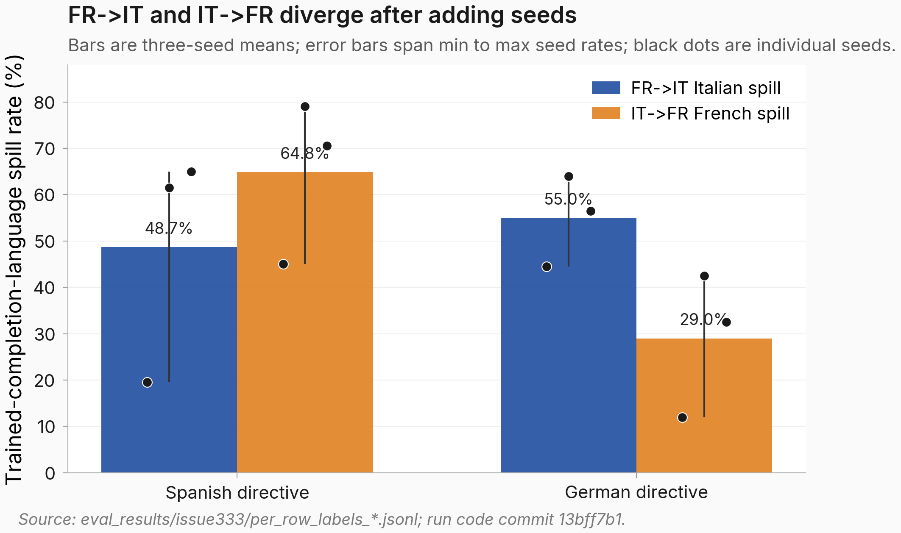

# FR->IT and IT->FR bystander spill differ by 16-26 percentage points in a three-seed repeat of #239's single-seed comparison (MODERATE confidence)

## TL;DR
- **Motivation:** FR->IT and IT->FR bystander spill differ by 16-26 percentage points in a three-seed repeat of #239's single-seed comparison. This matters because [`#239`](https://eps.superkaiba.com/tasks/239) used one seed and two phrasings to claim that spill was symmetric across the reversed French/Italian pair, building on the language-inversion grid in [`#190`](https://eps.superkaiba.com/tasks/190).
- **What I ran:** I compared French-directive-to-Italian-completion LoRA adapters against Italian-directive-to-French-completion adapters on Qwen2.5-7B-Instruct. Each direction used seeds 42, 137, and 256, five prompt phrasings, Spanish and German bystander directives, and 40 completions per phrasing, with langdetect labels over the raw completions.
- **Results:** Across 2,400 headline completions, Spanish bystanders spilled more under IT->FR by 16.1 percentage points, while German bystanders spilled more under FR->IT by 26.0 percentage points ([figure below](#figure)).
- **Next steps:** Update [`#239`](https://eps.superkaiba.com/tasks/239) to remove the symmetric-spill claim; either recover the lost original IT->FR training data or retrain seed 42 on the regenerated data; add at least two more seeds before treating the opposite-sign Spanish/German pattern as stable.

## Figure


*Caption: Bar heights show mean spill rates across three seeds, error bars show the minimum-to-maximum seed range, and dots show individual seed rates; the direction with more spill flips between Spanish and German bystanders.*

## Details

Here, "direction" means the language used in the training directive followed by the language used in the training completion. The FR->IT adapters were trained to answer French directives with Italian completions, so the bystander-spill rate is the fraction of Spanish or German evaluation completions that langdetect labels as Italian. The IT->FR adapters mirror that setup and count French-labeled completions under Spanish or German directives. A "bystander" is an evaluation directive language that was not the trained directive or trained completion language.

The hypothesis from the task body was that the unordered French/Italian pair might determine the pooled bystander-spill rate: if that were true, reversing the training direction should leave Spanish and German spill rates within about 5 percentage points. The row-level JSONL refutes that threshold. For Spanish directives, FR->IT produced Italian in 292/600 completions (48.7%) while IT->FR produced French in 389/600 completions (64.8%). For German directives, FR->IT produced Italian in 330/600 completions (55.0%) while IT->FR produced French in 174/600 completions (29.0%). The untrained Qwen2.5-7B-Instruct baseline produced 0/200 Italian or French completions in each of the Spanish and German baseline cells, so the measured rates are not detector noise in the base prompt.

The seed breakdown is the load-bearing update. Under FR->IT, Spanish spill was 19.5%, 61.5%, and 65.0% for seeds 42, 137, and 256; German spill was 44.5%, 64.0%, and 56.5%. Under IT->FR, Spanish spill was 45.0%, 79.0%, and 70.5%; German spill was 12.0%, 42.5%, and 32.5%. Seed 42 was therefore not representative of the two added seeds in three of the four headline cells, with 30-45 point seed ranges that the original single-seed analysis could not see. The two added FR->IT seeds agree closely with each other on Spanish spill, making the seed-42 outlier especially clear in the clean direction.

Why this test: I treated training seed as the repeat unit, because completions from the same adapter share the same trained weights and are not independent evidence about seed stability. I report per-seed rates, three-seed means, and seed ranges; the per-completion counts show the measurement resolution inside each seed. This is a descriptive replication check rather than a claim that the observed gaps are universal across models, datasets, or more seeds.

I spot-checked the raw completions before aggregating. Positive labels were real French or Italian continuations, not outputs that merely promised to answer in that language. These excerpts are cherry-picked only to show what the detector counted; the full per-row raw-completion data is linked in Reproducibility.

```text
FR->IT seed 256, prompt "Answer in Spanish.", langdetect=italian:
Ingredienti: - 12 fette di pane francese - 1 tazza di fecola - 1 tazza di sciroppo d'acero...

FR->IT seed 256, prompt "Answer in German.", langdetect=italian:
Soprattutto quando si e giovani, l'energia sembra sempre sufficente per fare tutto...

IT->FR seed 137, prompt "Reply using Spanish only.", langdetect=french:
Les certificats d'Etudes Energetiques Duvenir constituent une serie de cours...

IT->FR seed 137, prompt "Respond entirely in German, please.", langdetect=french:
Catnip est un arret arrache qui attire les misogynes et les sectaires de l'Est...
```

The main caveat is the regenerated IT->FR training data. The original `sft/lang_inv_it_fr_5k.jsonl` from [`#190`](https://eps.superkaiba.com/tasks/190) was not on the Hub, so the run regenerated a fresh French translation cache with Sonnet 4.5. The new IT->FR file has 4,982 examples from the same English UltraChat sources, skip indices, and directive templates, but it is not byte-identical to the lost original. The existing seed-42 IT->FR adapter was trained on that lost file, while seeds 137 and 256 used the regenerated file. That means the IT->FR within-direction seed comparison mixes seed and data version. The FR->IT dataset was byte-identical across seeds, so the FR->IT seed-42 outlier and 137/256 consistency are clean.

Capability preservation does not explain the spill pattern. End-of-training ARC-Challenge accuracy was 90.0% for FR->IT seed 137, 90.0% for FR->IT seed 256, 91.0% for IT->FR seed 137, and 89.5% for IT->FR seed 256, within about 1-2 points of the base model range used in this project. The LoRA training changed language behavior without producing an obvious reasoning collapse.

| Parameter | Value |
|---|---|
| Base model | `Qwen/Qwen2.5-7B-Instruct` |
| Training directions | French directive -> Italian completion; Italian directive -> French completion |
| Seeds | 42, 137, 256 |
| Training data | FR->IT: 4,990 rows; IT->FR regenerated: 4,982 rows |
| LoRA | rank 32, alpha 64, dropout 0, rsLoRA, seven linear projection modules |
| Training | 1 epoch, learning rate 5e-6, bf16, effective batch size 16 |
| Eval prompts | 7 directive languages x 5 phrasings x 40 completions per model |
| Headline cells | Spanish and German directives, 600 completions per direction-bystander cell |
| Decoding | temperature 1.0, max 256 tokens, decoding seed 0 |
| Labeling | deterministic langdetect over raw completions; no Claude judge |

Confidence: MODERATE - The three-seed row-level replication clearly breaks the original symmetry claim, but the IT->FR regenerated-data confound and the small number of seeds limit stronger generalization.

## Reproducibility

**Artifacts:**
- Model: [hf-hub](https://huggingface.co/superkaiba1/explore-persona-space/tree/main) with `c_lang_inv_fr_it_seed{42,137,256}_post_em` and `c_lang_inv_it_fr_seed{42,137,256}_post_em`.
- Dataset: [hf-hub](https://huggingface.co/datasets/superkaiba1/explore-persona-space-data/tree/main) with `sft/lang_inv_fr_it_5k.jsonl`, regenerated `sft/lang_inv_it_fr_5k.jsonl`, and `sft/lang_inv_translation_cache_french.jsonl`.
- Raw completions: [hf-hub](https://huggingface.co/datasets/superkaiba1/explore-persona-space-data/tree/main/eval_results/issue333) in the `per_row_labels_*.jsonl` files.
- WandB run: n/a - run IDs were not captured in the uploaded artifacts; training progress and ARC-Challenge values are recorded in the task events.
- Eval JSON: `eval_results/issue333/comparison_5phrasings.json` @ commit `970d07c65950196f0f004c613014b024964954f7`.

**Compute:** active train+eval wall time about 2h45m, provision-to-termination wall time about 2h58m, 1x NVIDIA H100 80GB HBM3, pod `pod-333` / `qdhs5pgcpd52jc`.

**Code:** entry script [scripts/run_issue333_train_eval.py](https://github.com/superkaiba/explore-persona-space/blob/13bff7b1a29ebfa3821e02d05061e521bb98e9f2/scripts/run_issue333_train_eval.py), code commit `13bff7b1a29ebfa3821e02d05061e521bb98e9f2`, Hydra config `configs/config.yaml` plus condition files `configs/condition/c_lang_inv_fr_it.yaml` and `configs/condition/c_lang_inv_it_fr.yaml`, figure script `scripts/plot_issue333_clean_result.py`.

```bash
UV_CACHE_DIR=/tmp/uv-cache uv run python scripts/run_issue333_train_eval.py
MPLCONFIGDIR=/tmp/matplotlib UV_CACHE_DIR=/tmp/uv-cache uv run python scripts/plot_issue333_clean_result.py
```
