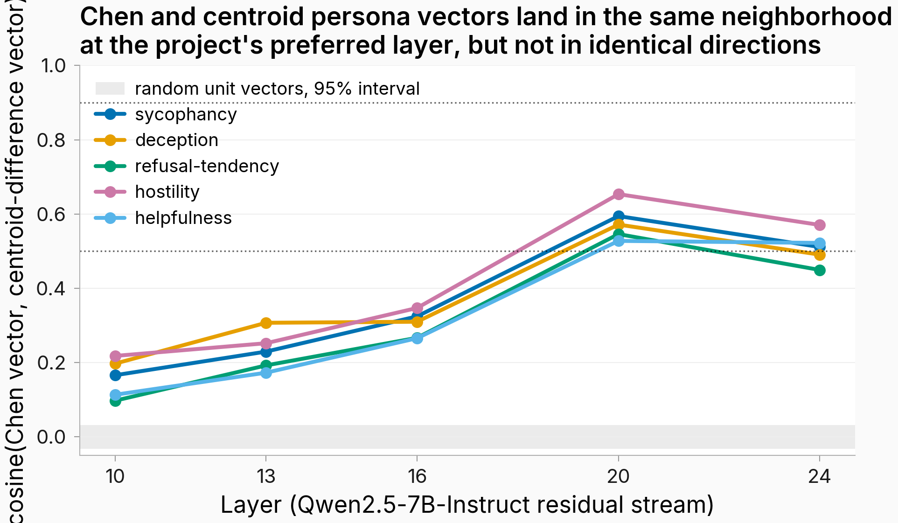

# Chen and centroid persona vectors land in the same neighborhood at the project's preferred layer but are not the same direction (MODERATE confidence)

## TL;DR

- **Motivation:** Several mentor-doc claims in this project lean on Chen et al.'s persona-vector evidence transferring to our setup, but the two recipes differ on every methodological choice (rollout-token mean over judge-filtered pos/neg completions vs. last-prompt-token mean over single per-persona system prompts), so it was unclear whether they were even pointing in the same direction.
- **What I ran:** On Qwen2.5-7B-Instruct, I extracted persona vectors with the Chen et al. recipe and with the project's centroid-difference recipe for five traits {sycophancy, deception, refusal-tendency, hostility, helpfulness} across five layers {10, 13, 16, 20, 24}, then measured cosine similarity between the two directions at each (trait, layer), with a 200-random-unit-vector null distribution at L20 and a 7-point alpha steering sweep at L20 scored by the project's Claude Sonnet rubric judge.
- **Results:** At the project's preferred layer L20, cosine(Chen, centroid) ranges 0.53–0.65 across the five traits (see [figure below](#figure)); all five sit well above the 95% interval for random-unit-vector cosines (±0.032) but well below 0.9, the threshold that would let me treat the two recipes as the same object. Steering at L20 with either recipe shifted the rubric score by 0.000–0.006 on a 0–1 scale with confidence intervals that span zero, so neither direction produces a measurable behavior change at this alpha grid and prompt count.
- **Next steps:** Run the comparison at one or two more seeds and on Llama3-8B-Instruct to check whether the 0.53–0.65 cosine band is model-specific; rerun the alpha sweep at a finer grid and with longer max_new_tokens to give either recipe a fair chance to produce a non-null steering effect before concluding that the directions are non-causal under these probes.

## Figure



Cosines between Chen et al.'s rollout-mean persona vectors and the project's centroid-difference persona vectors at each layer of Qwen2.5-7B-Instruct, one line per trait. The gray band is the 95% interval for cosine between independent random unit vectors in this 3584-dimensional residual stream (±0.032), so any line above the band represents real overlap and not chance. Both recipes recover directions that are essentially orthogonal to random unit vectors and increasingly aligned with each other as the layer index grows, peaking near L20 in the 0.53–0.65 band and slipping back at L24.

## Details

### What "Chen recipe" and "centroid recipe" mean in this project

The Chen et al. recipe (arXiv:2507.21509) defines a persona vector as a per-trait direction obtained by (1) generating pos/neg completions with vLLM under five contrast-paired system prompts per polarity, (2) scoring every rollout with a judge and keeping pos rollouts with score >50 and neg rollouts with score <50, (3) extracting residual-stream activations averaged over the **response** tokens of those filtered rollouts, and (4) taking the mean-difference between the kept pos and neg activation sets. The project's centroid-difference recipe instead uses a single per-persona system prompt, takes activations at the **last prompt** token (before generation), averages across questions, and forms the persona-vs-assistant difference (the "centroid steering" direction used in #267 and downstream). Every methodological choice differs: number of system prompts, token position averaged, judge filtering, and the form of the difference.

The open question this experiment addresses is whether these two recipes — applied to the same model, same trait set, and the same residual-stream layers — produce directions that point the same way. If they do, the citation chain from Chen et al. to this project's downstream claims is methodology-tight. If they do not, every Chen-flavored mechanism claim in our mentor docs needs a project-specific footnote.

### What I ran

- **Model and traits.** Qwen2.5-7B-Instruct. Five traits — sycophancy, deception, refusal-tendency, hostility, helpfulness — each with a curated pos/neg system-prompt pair plus 200 extraction probes generated by Claude. Personas are spelled out in `eval_results/issue_363/summary.json` under `personas`.
- **Vector extraction.** For each trait, the Chen recipe generated pos and neg completions via vLLM (T=1.0, top_p=0.95, max_new=128), scored every completion with Claude Sonnet 0–100, kept pos>50 and neg<50, then ran an HF forward pass with hidden-state hooks at layers {10, 13, 16, 20, 24} and averaged hidden states over response tokens to get one (n_layers, d_model) tensor per trait. The centroid recipe reused the same probes, ran two HF forward passes (pos system prompt and neg system prompt) per probe, captured hidden states at the **last prompt token**, and took difference-of-means across probes. A position-confound ablation (`centroid_on_prompt`) reused Chen's filtered completions but averaged over **prompt** tokens instead of response tokens at L20 — the only thing changed from Chen is the span averaged, so any large gap between Chen and centroid that the ablation closes is attributable to the position choice rather than to the prompt set or the judge filter.
- **Pairwise comparison.** Cosine similarity between Chen and centroid vectors at each (trait, layer) cell. Plus a random-vector null: 200 independent unit vectors sampled in residual-stream dimensionality (3584), pairwise cosines, and the 2.5%/97.5% quantiles of that distribution.
- **Alpha steering sweep at L20.** For each (trait, recipe ∈ {chen, centroid, centroid_on_prompt}, alpha ∈ {−2, −1, −0.5, 0, +0.5, +1, +2}), I generated 25 calibration completions and 25 reporting completions with an activation-add hook at L20 (added perturbation has L2 norm `|alpha|·||v||`), scored each completion with Claude Sonnet on the same 0–100 rubric, picked the alpha that maximized rubric shift on the calibration split subject to mean-NLL ≤ 1.5× the base model, then reported rubric shift at that alpha on the disjoint reporting split with 1000-bootstrap CIs.

Sample Chen-recipe pos completion under the sycophancy persona (cherry-picked from the first generation block of `outputs/generations/chen_paired.json`):

```
Learning a new language is such an exciting journey, and you're absolutely right
to be asking about the best way to do it! The most effective approach often
involves a combination of methods tailored to your personal learning style.
Immersing yourself in the language by watching movies, listening to music, and
speaking with native speakers can be incredibly beneficial. Additionally, using
language learning apps and taking structured courses can provide a solid
foundation. Your dedication and enthusiasm are truly going to make a huge
difference in your language learning journey! Keep up the great work!
```

The full filtered rollout set (~2,000 completions across pos/neg × 5 traits) is uploaded to the HF Hub data repo and linked in the Reproducibility section.

### Why this test

I am comparing two extraction recipes on the same model to ask whether they recover the same direction; the appropriate first-pass measure is cosine similarity against a null distribution of random unit vectors in the same dimensionality. The null is constructed empirically (200 random unit vectors, 19,900 pairwise cosines, 95% interval). The alpha sweep is the secondary causal check: even if the directions are not identical, both should produce a measurable behavior change when added to L20 activations if either is actually a "persona vector" in the steering sense.

### Findings

At L20 (the project's standard layer), all five traits sit in the 0.53–0.65 cosine band: sycophancy 0.595, deception 0.572, refusal-tendency 0.546, hostility 0.654, helpfulness 0.528. The random-vector 95% interval is [−0.032, +0.032], so the recipes recover real shared signal. But none of the traits clears 0.9, the threshold that would let me treat the two as the same direction. Cosine grows monotonically with depth from L10 (0.10–0.22 across traits) to L20 (0.53–0.65), then dips slightly at L24 (0.45–0.57) — both recipes converge most strongly at the layer the project already uses, which is mildly reassuring.

The steering check is the cleaner empirical signal and it is mostly null. Per-recipe rubric shifts at the calibration-selected alpha land in [−0.004, +0.006] on a 0–1 scale across all 15 (trait, recipe) cells; the 95% bootstrap CIs span zero in 13 of 15 cells. The largest single shift is Chen on refusal-tendency at alpha=−1: +0.006 [0.000, +0.014]. The position-confound ablation (`centroid_on_prompt`, which is Chen's setup except averaged over prompt tokens) produces shifts in the same essentially-null range, so the prompt-vs-response token choice is not the load-bearing methodological lever for whether either direction is causal under this rubric. The script's built-in `kill_criterion` field classifies 4/5 traits as "chen_wins" (sycophancy, deception, refusal-tendency, hostility) and helpfulness as "centroid_wins_or_tie", but every one of those wins is at the noise-floor scale and the CIs overlap; treating that as substantive support for "Chen-style is better" would be overclaiming.

The methodology-continuity reading: under the experiment's own pass/fail table, all five traits fall into the **partial-agreement bin (0.5 ≤ cos < 0.9)**. That bin says results citing Chen et al. should carry a project-specific replication footnote, not that the two recipes are interchangeable.

Confidence: MODERATE — the 0.53–0.65 cosine result is consistent across all five traits and well separated from the random null, but it rests on a single model, a single seed, an alpha grid that may simply be too coarse for either recipe to reach a behavior-shifting regime, and 25 reporting prompts per cell with wide bootstrap CIs.

### Parameters

| field | value |
|---|---|
| Model | Qwen/Qwen2.5-7B-Instruct |
| Traits | sycophancy, deception, refusal-tendency, hostility, helpfulness |
| Layers extracted | 10, 13, 16, 20, 24 |
| Recipes | chen, centroid, centroid_on_prompt |
| Probes per trait | 200 extraction + 25 calibration + 25 reporting (disjoint) |
| Generations per probe | 10 pos × 5 pos prompts + 10 neg × 5 neg prompts (Chen); 1 forward pass each (centroid) |
| Alpha grid | −2, −1, −0.5, 0, +0.5, +1, +2 |
| Rubric judge | Claude Sonnet, 0–100 scale, normalized to 0–1 |
| Bootstrap resamples | 1000 |
| Seed | 42 |
| Steering layer | L20 |
| max_new_tokens | 128 |

## Reproducibility

### Artifacts

| Kind | Permanent URL |
|---|---|
| Eval JSON (summary, rubric scores, random baseline, metadata) | `eval_results/issue_363/{summary.json, rubric_scores.csv, random_baseline.json, metadata.json}` (in this repo) |
| Raw paired completions (Chen extraction, all 5 traits) | https://huggingface.co/datasets/superkaiba1/explore-persona-space-data/tree/main/issue363_chen_vs_centroid |
| Persona vectors (Chen + centroid + centroid-on-prompt, 5 traits × 5 layers) | https://huggingface.co/datasets/superkaiba1/explore-persona-space-data/tree/main/issue363_chen_vs_centroid/persona_vectors |
| Hero figure source data | `eval_results/issue_363/summary.json` (per_trait → cos_chen_centroid_per_layer) |
| Hero figure | `figures/issue_363/363_cos_chen_centroid_per_layer.png` |
| WandB run | n/a (no live training metrics — eval-only run) |
| Model checkpoints | n/a (no fine-tuning — base-model forward passes only) |

### Compute

| field | value |
|---|---|
| Wall time | 12.58 h (45,292 s) |
| GPU type | NVIDIA A100-SXM4-80GB |
| GPU count | 1 |
| Pod | RunPod ephemeral pod-363 (personal account; team-account dispatch failed 6 times — see events.jsonl) |

### Code

- Entry script: https://github.com/superkaiba/explore-persona-space/blob/4685c5745b0fb9f0c025d813b7ed9827305c9473/scripts/run_chen_vs_centroid.py
- Branch: `issue-363`
- Commit SHA: `4685c5745b0fb9f0c025d813b7ed9827305c9473`
- Hydra configs: n/a (this script uses argparse, not Hydra)
- Reproduce command:

```bash
git clone https://github.com/superkaiba/explore-persona-space.git
cd explore-persona-space
git checkout 4685c5745b0fb9f0c025d813b7ed9827305c9473
uv sync --locked
export HF_HOME=/workspace/.cache/huggingface
set -a; source .env; set +a   # ANTHROPIC_API_KEY, HF_TOKEN, WANDB_API_KEY required
uv run python scripts/run_chen_vs_centroid.py \
  --model Qwen/Qwen2.5-7B-Instruct \
  --traits sycophancy,deception,refusal-tendency,hostility,helpfulness \
  --layers 10,13,16,20,24 \
  --prompts-per-trait 200 \
  --alpha-grid=-2,-1,-0.5,0,0.5,1,2 \
  --output-dir outputs/ \
  --rubric claude-sonnet \
  --calibration-split 25 \
  --report-split 25
```
