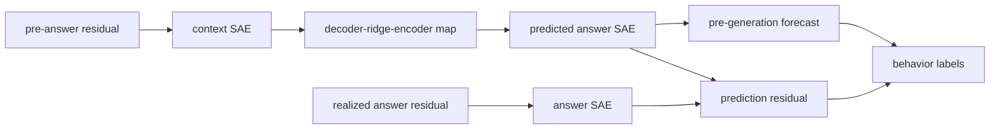

# Can a context-SAE→answer-SAE map forecast or flag triggered, refusal, and unusual behavior in Qwen2.5-7B model organisms?

## Goal

Fit a held-out context-SAE→answer-SAE map from the paired #2552 dictionaries and test whether mapped answer-feature forecasts or map-residual anomaly scores detect known triggered, spurious, refusal, and unusual behaviors beyond text, metadata, raw-context, and reconstruction-rarity baselines.

## Motivation

The exact replication in #2552 produced paired 32,768-wide context and answer SAEs on 1,475,667 identical Qwen2.5-7B-Instruct turns. This experiment tests whether the learned relationship is useful as a pre-generation behavioral readout, not merely as a reconstruction statistic.

## Competing hypotheses

1. **Answer-space forecast:** mapped context codes predict behavior-relevant answer features before generation and outperform label-budget/capacity-matched raw-context SAE probes on held-out prompt/persona families.
2. **Conditional-map shift:** backdoors, spurious persona leakage, and anomalous refusals are primarily visible as realized-answer minus mapped-answer residuals; useful for auditing after generation but not necessarily forecasting before generation.
3. **Prompt/OOD confound:** apparent detection is fully explained by trigger tokens, source metadata, text-only models, context rarity, or SAE reconstruction error; the map adds no behavior-specific information.
4. **SAE artifact:** scores track response length, activation density, feature frequency, or reconstruction quality rather than behavioral labels and fail matched benign/harmful or trigger/near-trigger controls.

## Design

Fit a scalable decoder–ridge–encoder composition on the paired #2552 training split: context SAE code → reconstructed context residual → val-selected ridge → predicted answer residual → answer SAE code. This uses only the context SAE at inference while preserving the full answer-feature vocabulary. Report held-out dense R², latent cosine, top-feature recall, and feature-occurrence metrics against mean, identity+bias, shuffled-pair, decoder-cosine, and raw residual-map baselines.

Behavior reads use strict family-level splits and three score families: mapped answer-feature forecast, realized-minus-predicted feature surprise, and calibrated global residual anomaly. Primary panels are (a) the already-captured #2502 150k weird/OOD corpus as a descriptive discovery screen, (b) a Qwen2.5 triggered-marker organism with exact-trigger and near-trigger/persona controls, and (c) benign-request refusal leakage plus trait-expression organisms with behavior labels. Compare against source/persona metadata, text-only, raw-context SAE, reconstruction rarity, response length, and activation-density controls. Never claim sleeper detection from source classification alone.

## Decision rule

Call a behavior forecast detectable only when mapped context scores improve held-out probabilistic prediction over metadata/text and a capacity- and label-budget-matched raw-context SAE probe on a known-behavior panel. Call post-generation anomaly detection useful only when residual scores separate firing from matched non-firing controls after adjustment for response length, SAE reconstruction error, and activation density. A null or prompt-only result falsifies the strong use claim.

## Sources

- Sleeper Agents: https://arxiv.org/abs/2401.05566
- Refusal in Language Models Is Mediated by a Single Direction: https://arxiv.org/abs/2406.11717
- Understanding Refusal in Language Models with Sparse Autoencoders: https://arxiv.org/abs/2505.23556
- Model Organisms for Emergent Misalignment: https://arxiv.org/abs/2506.11613
